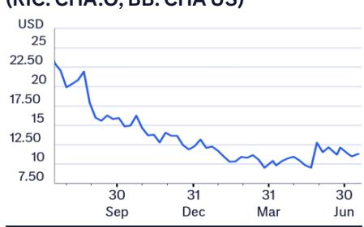
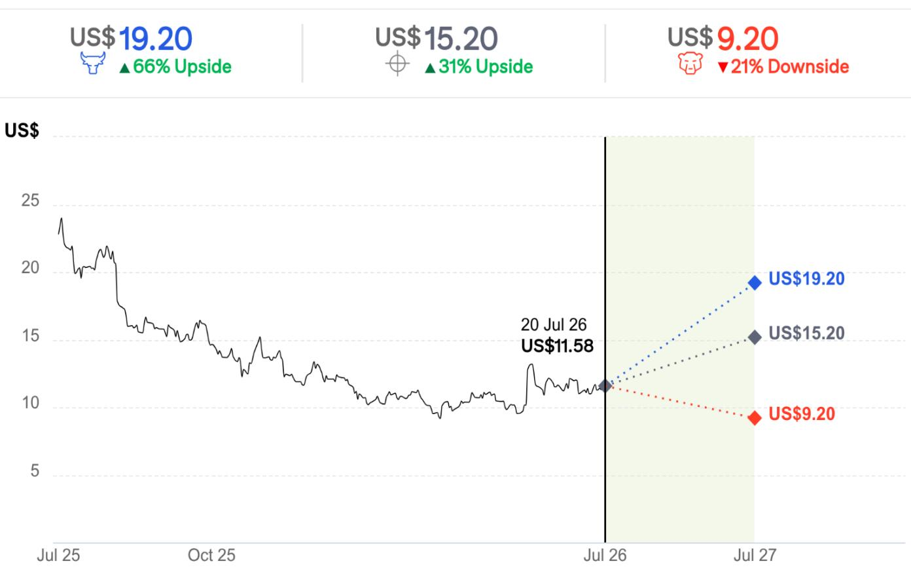

21 Jul 2026 06:33:15 ET | 13 pages

# Chagee Holdings (CHA.O)

## 2Q26E 业绩前瞻；下调目标价与预测

## 核心观点

我们预计，2026年第二季度，Chagee 集团同店 GMV 同比下降约 15%，与 2026年第一季度（同比下降 16.0%）大致持平。我们预计其 2026年第二季度非 GAAP 净利润环比基本持平（2026年第一季度为 5.07 亿元人民币），同比下降约 20%。我们预计，由于 2025年下半年基数较低（因其当时较少参与外卖平台的补贴竞争），其同店 GMV 的同比降幅将在 2026年下半年逐步收窄。鉴于 2026年计划放缓开店速度，管理层在业绩电话会上表示，公司已于 2025年第四季度“优化了组织架构”。我们认为，这包括总部层面的行政人员精简，并可能在 2026年下半年带来更显著的费用节省。我们将 2026/2027 年非 GAAP 净利润预测下调 25%/30%，并将基于 DCF 的目标价从 24.6 美元下调至 15.2 美元；同时引入 2028 年预测。我们预计，若公司运营在 2026年下半年环比改善，市场对其复苏的信心将有所增强。

**2Q26E 业绩前瞻** — 我们预计，2026年第二季度，Chagee 在中国市场的单店月均 GMV 约为 35 万元人民币以上（2026年第一季度为 35.6 万元，2025年第二季度为 40.4 万元），集团销售额同比基本持平。自 2026 年起，其中国加盟商已转为基于 GMV 的收入分成模式，Chagee 收取更高的费率，但降低了对加盟商的销售加价。从财务角度看，这对公司（与加盟商交易中的）毛利率及集团收入影响有限，尽管毛利额在技术层面有所调整。我们预计 2026年第二季度非 GAAP 营业利润率约为 17%，环比基本持平（2026年第一季度为 17.1%），同比下降（2025年第二季度为 19.8%）。剔除约 4000 万元人民币的股权激励费用后，我们预计 2026年第二季度非 GAAP 净利润约为 5 亿元人民币（2026年第一季度为 5.07 亿元）。与多数其他上市现制茶饮公司（因在 2025年下半年显著受益于外卖平台的价格竞争，将在 2026年下半年面临较高基数）不同，Chagee 因参与有限，在 2026年下半年将拥有较低的比较基数。我们认为，其约 400 家中国加盟店向直营模式的转换已在 2025 年底基本完成。我们预计，其同店 GMV 的同比降幅将在 2026年第三季度收窄，并于 2026年第四季度转正。

**目标价与预测下调** — 我们将 2026/2027 年非 GAAP 净利润预测下调 25%/30%，原因是 2026/2027 年销售额预测下调 18%/27%（基于上半年同店销售复苏慢于预期，以及 2026 年中国市场净开店计划调整至约 300 家）以及运营去杠杆。我们预计 2026 年销售额同比持平，非 GAAP 净利润同比下降 5%。我们的 DCF 目标价（基于 17.0% 的加权平均资本成本和 2% 的终值增长率）从 24.6 美元下调至 15.2 美元。

## 盈利摘要

<table><tr><td>截至12月31日</td><td>净利润 (百万元人民币)</td><td>摊薄每股收益 (人民币)</td><td>每股收益增长率 (%)</td><td>市盈率 (倍)</td><td>市净率 (倍)</td><td>净资产回报表现 (%)</td><td>股息率 (%)</td></tr><tr><td>2024A</td><td>2,517</td><td>14.904</td><td>210.2</td><td>5.3</td><td>3.7</td><td>103.1</td><td>不适用</td></tr><tr><td>2025A</td><td>1,895</td><td>11.503</td><td>-22.8</td><td>6.8</td><td>2.0</td><td>34.7</td><td>8.2</td></tr><tr><td>2026E</td><td>1,808</td><td>9.383</td><td>-18.4</td><td>8.4</td><td>1.9</td><td>23.9</td><td>8.3</td></tr><tr><td>2027E</td><td>1,940</td><td>10.069</td><td>7.3</td><td>7.8</td><td>1.8</td><td>23.9</td><td>8.3</td></tr><tr><td>2028E</td><td>2,012</td><td>10.442</td><td>3.7</td><td>7.5</td><td>1.7</td><td>23.1</td><td>8.3</td></tr></table>

来源：数据中央

## 买入 / 高风险

价格 (2026年7月20日 16:00) 11.58 美元

目标价 15.20 美元 ↓

此前为 24.60 美元

预期股价回报率 31.3%

预期股息率 8.3%

预期总回报率 39.6%

市值 22.09 亿美元

## 价格表现

## (RIC: CHA.O, BB: CHA US)

Xiaopo Wei, CFA $^{AC}$ +852-2501-2472
xiaopo.wei@citi.com

Vincent Young
+852-2501-2738
vincent.young@citi.com

<table><tr><td>利润表 (百万元人民币)</td><td>2024</td><td>2025</td><td>2026E</td><td>2027E</td><td>2028E</td></tr><tr><td>营业收入</td><td>12,406</td><td>12,907</td><td>12,969</td><td>13,631</td><td>14,435</td></tr><tr><td>营业成本</td><td>-6,257</td><td>-6,001</td><td>-5,967</td><td>-6,228</td><td>-6,543</td></tr><tr><td>毛利润</td><td>6,149</td><td>6,906</td><td>7,002</td><td>7,404</td><td>7,892</td></tr><tr><td>毛利率 (%)</td><td>49.6</td><td>53.5</td><td>54.0</td><td>54.3</td><td>54.7</td></tr><tr><td>EBITDA (调整后)</td><td>2,948</td><td>1,494</td><td>2,333</td><td>2,418</td><td>2,525</td></tr><tr><td>EBITDA 利润率 (调整后) (%)</td><td>23.8</td><td>11.6</td><td>18.0</td><td>17.7</td><td>17.5</td></tr><tr><td>折旧</td><td>-61</td><td>-146</td><td>-139</td><td>-133</td><td>-141</td></tr><tr><td>摊销</td><td>0</td><td>0</td><td>-90</td><td>0</td><td>0</td></tr><tr><td>EBIT (调整后)</td><td>2,887</td><td>1,347</td><td>2,104</td><td>2,285</td><td>2,384</td></tr><tr><td>EBIT 利润率 (调整后) (%)</td><td>23.3</td><td>10.4</td><td>16.2</td><td>16.8</td><td>16.5</td></tr><tr><td>净利息收入</td><td>37</td><td>147</td><td>196</td><td>206</td><td>220</td></tr><tr><td>联营公司</td><td>0</td><td>0</td><td>0</td><td>0</td><td>0</td></tr><tr><td>非经营/特殊/其他调整</td><td>118</td><td>123</td><td>0</td><td>0</td><td>0</td></tr><tr><td>税前利润</td><td>3,042</td><td>1,618</td><td>2,300</td><td>2,491</td><td>2,603</td></tr><tr><td>所得税</td><td>-528</td><td>-432</td><td>-480</td><td>-511</td><td>-534</td></tr><tr><td>非常项目/少数股东权益/优先股股息</td><td>2</td><td>-15</td><td>-52</td><td>-80</td><td>-97</td></tr><tr><td>报告净利润</td><td>2,516</td><td>1,171</td><td>1,768</td><td>1,900</td><td>1,972</td></tr><tr><td>净利润率 (%)</td><td>20.3</td><td>9.1</td><td>13.6</td><td>13.9</td><td>13.7</td></tr><tr><td>核心净利润</td><td>2,517</td><td>1,895</td><td>1,808</td><td>1,940</td><td>2,012</td></tr></table>

价格: 11.58 美元; 目标价: 15.20 美元; 市值: 22.09 亿美元; 建议: 买入/高风险

<table><tr><td>估值比率</td><td>2024</td><td>2025</td><td>2026E</td><td>2027E</td><td>2028E</td></tr><tr><td>市盈率 (倍)</td><td>5.3</td><td>6.8</td><td>8.4</td><td>7.8</td><td>7.5</td></tr><tr><td>市净率 (倍)</td><td>3.7</td><td>2.0</td><td>1.9</td><td>1.8</td><td>1.7</td></tr><tr><td>企业价值/EBITDA (倍)</td><td>3.8</td><td>5.7</td><td>3.0</td><td>2.8</td><td>2.5</td></tr><tr><td>自由现金流回报表现 (%)</td><td>19.7</td><td>9.4</td><td>9.6</td><td>11.4</td><td>12.0</td></tr><tr><td>股息率 (%)</td><td>不适用</td><td>8.2</td><td>8.3</td><td>8.3</td><td>8.3</td></tr><tr><td>派息率 (%)</td><td>0</td><td>56</td><td>69</td><td>65</td><td>62</td></tr><tr><td>净资产回报表现 (%)</td><td>103.1</td><td>21.4</td><td>23.3</td><td>23.4</td><td>22.6</td></tr></table>

<table><tr><td>现金流量表 (百万元人民币)</td><td>2024</td><td>2025</td><td>2026E</td><td>2027E</td><td>2028E</td></tr><tr><td>EBITDA</td><td>2,948</td><td>1,494</td><td>2,333</td><td>2,418</td><td>2,525</td></tr><tr><td>营运资本变动</td><td>382</td><td>-293</td><td>-578</td><td>-149</td><td>-192</td></tr><tr><td>其他</td><td>-492</td><td>428</td><td>-193</td><td>-434</td><td>-411</td></tr><tr><td>经营活动现金流</td><td>2,838</td><td>1,629</td><td>1,562</td><td>1,834</td><td>1,921</td></tr><tr><td>资本支出</td><td>-226</td><td>-417</td><td>-110</td><td>-110</td><td>-110</td></tr><tr><td>净收购/处置</td><td>-16</td><td>-35</td><td>0</td><td>0</td><td>0</td></tr><tr><td>其他</td><td>12</td><td>-373</td><td>259</td><td>0</td><td>0</td></tr><tr><td>投资活动现金流</td><td>-229</td><td>-825</td><td>149</td><td>-110</td><td>-110</td></tr><tr><td>已支付股息</td><td>-1</td><td>0</td><td>0</td><td>0</td><td>0</td></tr><tr><td>融资活动现金流</td><td>-174</td><td>2,047</td><td>-1,240</td><td>-1,240</td><td>-1,240</td></tr><tr><td>现金净变动</td><td>2,446</td><td>2,850</td><td>471</td><td>485</td><td>571</td></tr><tr><td>股东自由现金流</td><td>2,612</td><td>1,212</td><td>1,452</td><td>1,724</td><td>1,811</td></tr></table>

<table><tr><td>每股数据</td><td>2024</td><td>2025</td><td>2026E</td><td>2027E</td><td>2028E</td></tr><tr><td>报告每股收益 (人民币)</td><td>14.900</td><td>7.110</td><td>9.175</td><td>9.862</td><td>10.234</td></tr><tr><td>核心每股收益 (人民币)</td><td>14.904</td><td>11.503</td><td>9.383</td><td>10.069</td><td>10.442</td></tr><tr><td>每股股息 (人民币)</td><td>0</td><td>6.464</td><td>6.500</td><td>6.500</td><td>6.500</td></tr><tr><td>每股经营现金流 (人民币)</td><td>16.804</td><td>9.889</td><td>8.104</td><td>9.520</td><td>9.970</td></tr><tr><td>每股自由现金流 (人民币)</td><td>15.469</td><td>7.357</td><td>7.533</td><td>8.949</td><td>9.399</td></tr><tr><td>每股净资产 (人民币)</td><td>21.246</td><td>38.486</td><td>40.982</td><td>44.024</td><td>47.352</td></tr><tr><td>加权平均普通股数 (百万)</td><td>169</td><td>162</td><td>191</td><td>191</td><td>191</td></tr><tr><td>加权平均摊薄股数 (百万)</td><td>169</td><td>165</td><td>193</td><td>193</td><td>193</td></tr></table>

<table><tr><td>增长率</td><td>2024</td><td>2025</td><td>2026E</td><td>2027E</td><td>2028E</td></tr><tr><td>营业收入 (%)</td><td>167.4</td><td>4.0</td><td>0.5</td><td>5.1</td><td>5.9</td></tr><tr><td>EBIT (调整后) (%)</td><td>168.7</td><td>-53.3</td><td>56.2</td><td>8.6</td><td>4.3</td></tr><tr><td>核心净利润 (%)</td><td>210.2</td><td>-24.7</td><td>-4.6</td><td>7.3</td><td>3.7</td></tr><tr><td>核心每股收益 (%)</td><td>210.2</td><td>-22.8</td><td>-18.4</td><td>7.3</td><td>3.7</td></tr></table>

<table><tr><td>资产负债表 (百万元人民币)</td><td>2024</td><td>2025</td><td>2026E</td><td>2027E</td><td>2028E</td></tr><tr><td>现金及现金等价物</td><td>4,869</td><td>7,993</td><td>8,114</td><td>8,599</td><td>9,170</td></tr><tr><td>应收账款</td><td>122</td><td>146</td><td>78</td><td>81</td><td>85</td></tr><tr><td>存货</td><td>132</td><td>228</td><td>187</td><td>228</td><td>273</td></tr><tr><td>固定资产及其他有形资产净额</td><td>1,044</td><td>2,262</td><td>2,337</td><td>2,520</td><td>2,646</td></tr><tr><td>商誉及无形资产</td><td>20</td><td>110</td><td>20</td><td>20</td><td>20</td></tr><tr><td>金融及其他资产</td><td>409</td><td>724</td><td>312</td><td>322</td><td>333</td></tr><tr><td>总资产</td><td>6,596</td><td>11,463</td><td>11,048</td><td>11,770</td><td>12,528</td></tr><tr><td>应付账款</td><td>597</td><td>630</td><td>483</td><td>504</td><td>530</td></tr><tr><td>短期借款</td><td>0</td><td>0</td><td>0</td><td>0</td><td>0</td></tr><tr><td>长期借款</td><td>0</td><td>0</td><td>0</td><td>0</td><td>0</td></tr><tr><td>准备及其他负债</td><td>2,311</td><td>3,256</td><td>2,460</td><td>2,500</td><td>2,500</td></tr><tr><td>总负债</td><td>2,908</td><td>3,886</td><td>2,943</td><td>3,004</td><td>3,030</td></tr><tr><td>股东权益</td><td>3,588</td><td>7,342</td><td>7,818</td><td>8,398</td><td>9,033</td></tr><tr><td>少数股东权益</td><td>101</td><td>235</td><td>287</td><td>368</td><td>465</td></tr><tr><td>总权益</td><td>3,688</td><td>7,577</td><td>8,105</td><td>8,766</td><td>9,498</td></tr><tr><td>净债务 (调整后)</td><td>-4,869</td><td>-7,993</td><td>-8,114</td><td>-8,599</td><td>-9,170</td></tr><tr><td>净债务权益比 (调整后) (%)</td><td>-132.0</td><td>-105.5</td><td>-100.1</td><td>-98.1</td><td>-96.5</td></tr></table>

有关此表中项目的定义，请点击此处。

## 预测修订

图 1. 预测修订

<table><tr><td>新预测</td><td>GMV (百万元人民币)</td><td>变动 (%)</td><td>营业收入 (百万元人民币)</td><td>变动 (%)</td><td>非GAAP净利润 (百万元人民币)</td><td>变动 (%)</td></tr><tr><td>2026E</td><td>31,222</td><td>-14.6%</td><td>12,969</td><td>-18.0%</td><td>1,808</td><td>-24.5%</td></tr><tr><td>2027E</td><td>32,501</td><td>-19.7%</td><td>13,631</td><td>-26.8%</td><td>1,940</td><td>-30.3%</td></tr><tr><td>2028E</td><td>34,031</td><td>新</td><td>14,435</td><td>新</td><td>2,012</td><td>新</td></tr><tr><td>此前预测</td><td></td><td></td><td></td><td></td><td></td><td></td></tr><tr><td>2026E</td><td>36,551</td><td></td><td>15,807</td><td></td><td>2,396</td><td></td></tr><tr><td>2027E</td><td>40,463</td><td></td><td>18,609</td><td></td><td>2,782</td><td></td></tr></table>

© 2026 Citi Inc. 未经 Citi 书面许可不得转载。
来源：Citi

我们将 2026/2027 年非 GAAP 净利润预测下调 25%/30%，原因是 2026/2027 年销售额预测下调 18%/27%（基于上半年同店销售复苏慢于预期，以及 2026 年中国市场净开店计划调整至约 300 家）以及运营去杠杆。我们预计 2026 年销售额同比持平，非 GAAP 净利润同比下降 5%。

目标价修订
图 2. Chagee - DCF 估值

<table><tr><td></td><td>FY26</td><td>FY27</td><td>FY28</td><td>FY29</td><td>FY30</td><td>FY31</td><td>FY32</td><td>FY33</td><td>FY34</td><td>FY35</td><td>终值</td></tr><tr><td>EBITDA</td><td>2,333</td><td>2,418</td><td>2,525</td><td>2,652</td><td>2,774</td><td>3,005</td><td>3,187</td><td>3,282</td><td>3,428</td><td>3,577</td><td></td></tr><tr><td>加：营运资本变动</td><td>(578)</td><td>(149)</td><td>(192)</td><td>(196)</td><td>(199)</td><td>(203)</td><td>(210)</td><td>(210)</td><td>(205)</td><td>(197)</td><td></td></tr><tr><td>减：资本支出</td><td>(110)</td><td>(110)</td><td>(110)</td><td>(111)</td><td>(112)</td><td>(113)</td><td>(114)</td><td>(115)</td><td>(116)</td><td>(117)</td><td></td></tr><tr><td>减：已付现金税</td><td>(480)</td><td>(511)</td><td>(534)</td><td>(562)</td><td>(591)</td><td>(642)</td><td>(684)</td><td>(708)</td><td>(743)</td><td>(778)</td><td></td></tr><tr><td>自由经营现金流</td><td>1,165</td><td>1,648</td><td>1,689</td><td>1,784</td><td>1,872</td><td>2,046</td><td>2,179</td><td>2,249</td><td>2,364</td><td>2,485</td><td>16,898</td></tr><tr><td>自由经营现金流现值</td><td>1,165</td><td>1,409</td><td>1,234</td><td>1,114</td><td>999</td><td>933</td><td>849</td><td>749</td><td>673</td><td>605</td><td>4,113</td></tr><tr><td></td><td></td><td></td><td></td><td></td><td></td><td></td><td></td><td></td><td></td><td></td><td></td></tr><tr><td>加权平均资本成本</td><td>17.0%</td><td></td><td></td><td></td><td></td><td></td><td></td><td></td><td></td><td></td><td></td></tr><tr><td>无风险利率</td><td>4.5%</td><td></td><td></td><td></td><td></td><td></td><td></td><td></td><td></td><td></td><td></td></tr><tr><td>调整后贝塔</td><td>1.25</td><td></td><td></td><td></td><td></td><td></td><td></td><td></td><td></td><td></td><td></td></tr><tr><td>市场风险溢价</td><td>10.0%</td><td></td><td></td><td></td><td></td><td></td><td></td><td></td><td></td><td></td><td></td></tr><tr><td>股权成本</td><td>17.0%</td><td></td><td></td><td></td><td></td><td></td><td></td><td></td><td></td><td></td><td></td></tr><tr><td>税后债务成本</td><td>6.5%</td><td></td><td></td><td></td><td></td><td></td><td></td><td></td><td></td><td></td><td></td></tr><tr><td>目标股权比例</td><td>100%</td><td></td><td></td><td></td><td></td><td></td><td></td><td></td><td></td><td></td><td></td></tr><tr><td>目标债务比例</td><td>0%</td><td></td><td></td><td></td><td></td><td></td><td></td><td></td><td></td><td></td><td></td></tr><tr><td>假设长期增长率</td><td>2.0%</td><td></td><td></td><td></td><td></td><td></td><td></td><td></td><td></td><td></td><td></td></tr><tr><td>企业价值</td><td>12,678</td><td></td><td></td><td></td><td></td><td></td><td></td><td></td><td></td><td></td><td></td></tr><tr><td>加：现金</td><td>8,114</td><td></td><td></td><td></td><td></td><td></td><td></td><td></td><td></td><td></td><td></td></tr><tr><td>减：债务</td><td>-</td><td></td><td></td><td></td><td></td><td></td><td></td><td></td><td></td><td></td><td></td></tr><tr><td>减：少数股东权益</td><td>(287)</td><td></td><td></td><td></td><td></td><td></td><td></td><td></td><td></td><td></td><td></td></tr><tr><td>股权价值 (百万元人民币)</td><td>20,793</td><td></td><td></td><td></td><td></td><td></td><td></td><td></td><td></td><td></td><td></td></tr><tr><td>远期美元/人民币汇率</td><td>7.10</td><td></td><td></td><td></td><td></td><td></td><td></td><td></td><td></td><td></td><td></td></tr><tr><td>股权价值 (百万美元)</td><td>2,929</td><td></td><td></td><td></td><td></td><td></td><td></td><td></td><td></td><td></td><td></td></tr><tr><td>加权平均股数 (百万)</td><td>193</td><td></td><td></td><td></td><td></td><td></td><td></td><td></td><td></td><td></td><td></td></tr><tr><td>截至2026年底的每股股权价值 (美元)</td><td>15.20</td><td></td><td></td><td></td><td></td><td></td><td></td><td></td><td></td><td></td><td></td></tr><tr><td>隐含市盈率 (倍)</td><td>12</td><td></td><td></td><td></td><td></td><td></td><td></td><td></td><td></td><td></td><td></td></tr></table>

© 2026 Citi Inc. 未经 Citi 书面许可不得转载。
来源：Citi 预测

我们预测 Chagee 截至 2035 年的自由现金流，并将其折现至 2026 年底。我们在加权平均资本成本计算中使用 1.25 的贝塔值。假设加权平均资本成本为 17.0%（此前为 17.2%，因无风险利率调整），终值增长率为 2%，我们得出基于 DCF 的目标价为 15.2 美元（此前为 24.6 美元）。目标价下调反映了我们对 2026/2027 年净利润预期的下调，以及对自由现金流增长更为审慎的预期。我们的目标价对应 2026 年预期市盈率 12 倍，与港股其他现制茶饮公司的平均交易倍数持平。

## 牛市/熊市：Chagee Holdings (CHA.O)

  
价差 86 个百分点
当前价格及预期回报（上行/下行）截至 2026 年 7 月 20 日

## 牛市假设

• 2026 年销售额同比增长 5%

• 2026 年 EBIT 利润率为 17.2%

## 基准假设

• 2026 年销售额同比持平

• 2026 年 EBIT 利润率为 16.2%

## 熊市假设

• 2026 年销售额同比下降 6%

• 2026 年 EBIT 利润率为 15.2%

## Chagee Holdings

## 公司描述

根据 2024 年数据，Chagee 是中国最大、增长最快、最受欢迎的优质现制茶饮品牌（即每杯平均售价 17.0 元人民币/2.5 美元以上，按 iResearch 定义）。截至 2025 年第一季度末，公司拥有 6,681 家门店，其中 6,512 家位于中国，169 家位于海外市场。

## 投资策略

我们对 Chagee 的评级为买入/高风险。在分析中国现制茶饮行业时，我们发现其与中国运动服饰行业长达十年的整合过程有有意义的相似之处，后者同样以加盟模式为主。在此背景下，我们倾向于看好价值细分领域规模最大的领导者（该领域充满渗透率和价格竞争）以及高端细分领域根基最深的参与者（由消费者的复购和忠诚度驱动）。我们认为，作为高端细分领域的领导者，Chagee 凭借其稳健的长期产品策略（简单的核心菜单）、管理的加盟模式（技术驱动的“五项在线”）、强大的品牌资产（通过社交媒体营销）以及高运营效率（通过自动化和标准化），与多数价值型参与者形成了良好区隔。

## 估值

鉴于公司所处的发展阶段（盈利可能更多集中在未来期间）、周期性的同店销售增速、可持续的长期增长前景、支撑可持续增长的强大运营效率记录，以及港股/中国同业估值指标面临的某些挑战，我们采用现金流折现（DCF）方法对 Chagee 进行估值。我们预测 Chagee 截至
