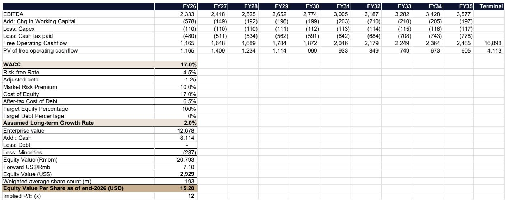
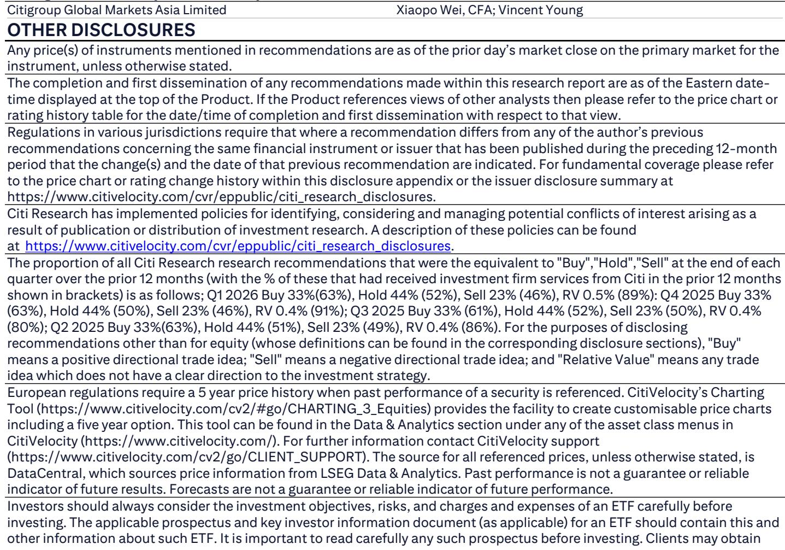
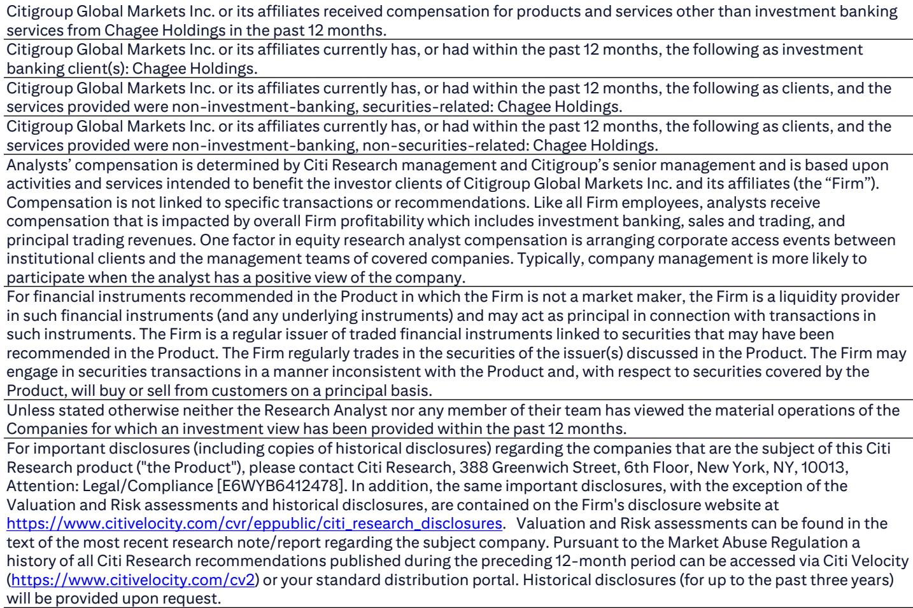

# Citi：霸王茶姬2026年第二季度业绩观察

霸王茶姬即将发布2026年第二季度业绩。Citi在最新报告中指出，其集团同店GMV在二季度同比下滑约15%，与一季度16%的降幅基本持平。报告的核心判断是：由于公司在2025年下半年主动减少参与外卖平台补贴活动，今年下半年将面对一个较低的同比基数，同店GMV的同比降幅有望逐季收窄，并在四季度转为正增长。这一节奏与多数已上市现制茶饮公司形成明显反差——后者因在2025年下半年从补贴活动中获益较大，今年下半年反而面临高基数不确定性。

Citi同时将2026年和2027年的非GAAP净利润预测分别下调25%和30%。下调的主要依据是：上半年同店销售恢复慢于预期，2026年中国市场净开店计划已仍在调整至约300家，以及运营去杠杆效应。

## 1. 二季度同店GMV降幅与一季度基本持平

Citi预计霸王茶姬二季度中国市场的单店月均GMV约为35万元人民币以上，低于去年同期的40.4万元，也略低于一季度的35.6万元。集团整体销售额预计同比基本持平。非GAAP营业利润率预计约为17%，与一季度17.1%相当，但低于去年同期的19.8%。扣除约4000万元的股权激励费用后，非GAAP净利润预计约为5亿元人民币，与一季度的5.07亿元基本持平。

> **KC观察：** 二季度利润环比持平、同比下滑约20%的预期，说明公司尚未走出同店下滑周期。但利润相对额并未加速出现变化，这与门店模型本身的固定成本结构有关——只要单店GMV不继续大幅下探，利润底部可能正在形成。

## 2. 下半年同店表现有望出现变化

报告认为，霸王茶姬在下半年的同店GMV同比降幅将逐步收窄，三季度降幅缩小，四季度转为正增长。这一判断的基础是2025年下半年的低基数：当时公司选择不参与外卖平台的补贴竞争，导致同期同店GMV基数较低。而多数同行在2025年下半年受益于补贴活动，今年下半年反而面临高基数。

此外，公司已在2025年第四季度完成组织优化，包括总部行政人员裁减，预计运营费用节省将在今年下半年更明显地体现。约400家中国加盟店转为直营的转换工作也在2025年底基本完成。

## 3. 收入分成模式调整对财务影响有限

2026年起，霸王茶姬中国区加盟商切换至基于GMV的收入分成模式。新模式下，公司收取更高的费率，但降低了对加盟商的原材料加价。Citi分析认为，这一调整对与加盟商交易的毛利率以及集团整体收入的影响有限，尽管部分利润表科目在技术层面发生了结构变化。这一判断意味着，读者无需过度关注收入确认方式变化带来的短期财务波动。

## 公司情况更新

Citi将2026年和2027年的非GAAP净利润预测分别下调25%和30%，主要由于销售额预测下调18%和27%，以及运营去杠杆。2026年全年销售额预计同比持平，非GAAP净利润预计同比下降5%。DCF估值采用17.0%的加权平均资本成本和2%的终值增长率，与相关市场其他现制茶饮公司的平均交易倍数相当。

报告同时引入了2028年财务预测，显示公司预计在2027年和2028年恢复中个位数的净利润增长，但增速明显低于2024年之前的水平。

For informational purposes only. Portions may be generated,translated,summarized,or edited with AI assistance based on source materials and may contain omissions or errors. Please verify independently. This is not investment,legal,tax,accounting,or other professional advice.

For informational purposes only. Portions may be generated,translated,summarized,or edited with AI assistance based on source materials and may contain omissions or errors. Please verify independently. This is not investment,legal,tax,accounting,or other professional advice.

