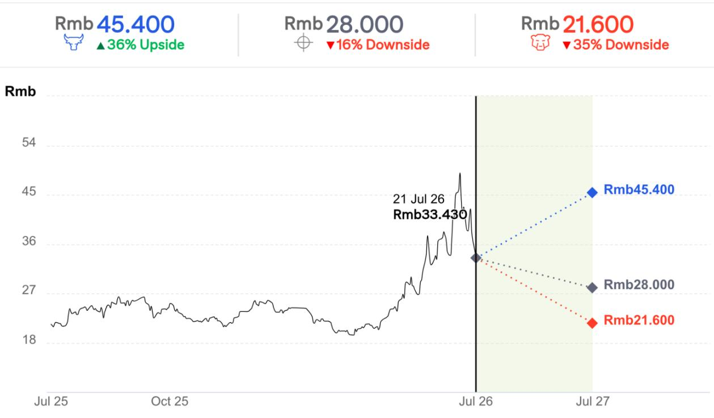
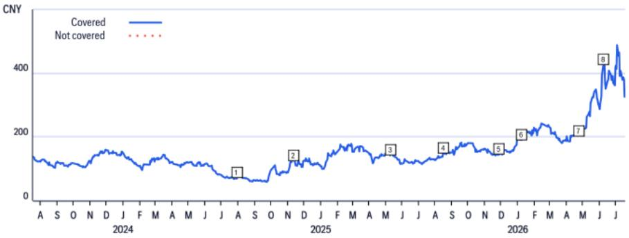
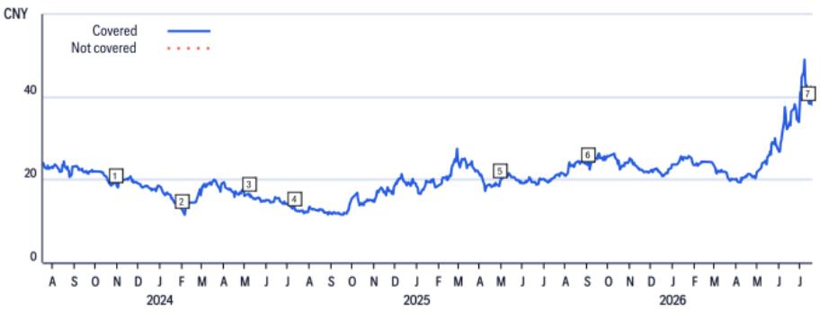
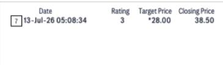
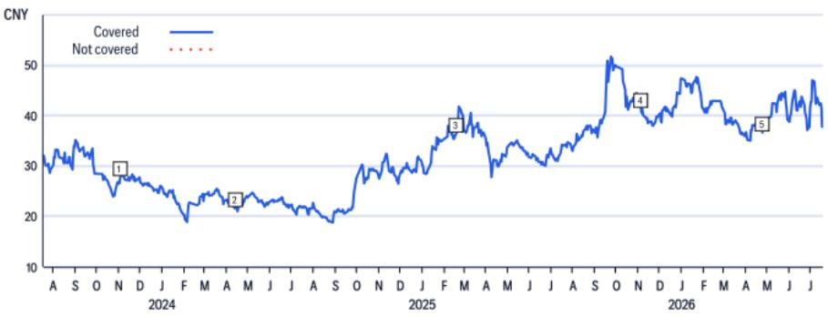
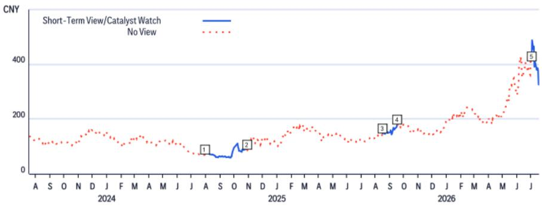
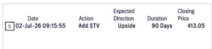
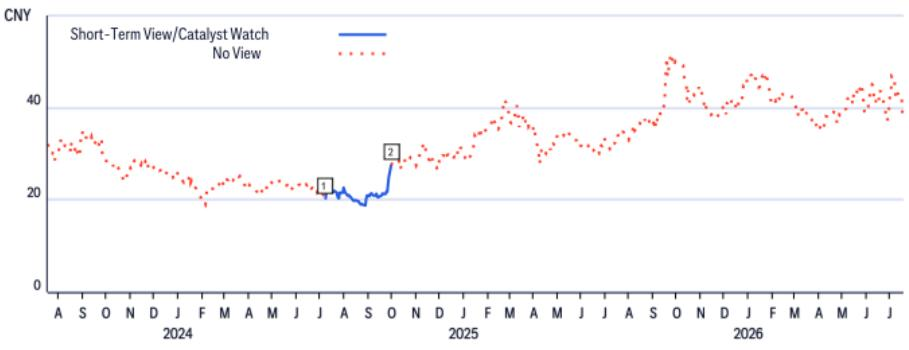
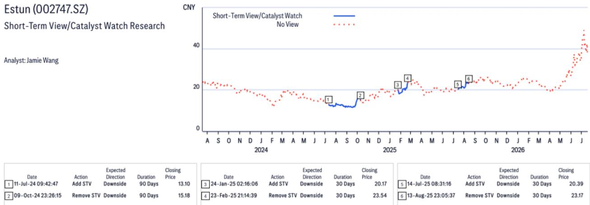

21 Jul 2026 11:22:41 ET | 13 pages

# 埃斯顿 (002747.SZ)

## Citi会议要点 - 成本削减推动毛利率扩张，库卡或构成潜在影响

## Citi观点

我们于今日（7月21日）邀请了公司董事会秘书肖婷婷女士，就埃斯顿在2026年上半年初步业绩公布后的业务前景进行了交流。主要要点如下：1）埃斯顿的工业机器人毛利率在2026年第二季度提升至33%-34%，主要驱动力来自成本削减（例如，零部件本地化、设计降本等），而非客户多元化；2）鉴于2026年上半年业绩良好，肖女士预计此前对2026年的指引——收入60亿元人民币、毛利率31%、净利润率5%、工业机器人出货量4.5万台——可以实现；3）工业机器人领域可能面临的潜在影响来自库卡（未上市），该公司正通过关键零部件本地化积极优化其成本结构。尽管埃斯顿基本面有所改善，但我们认为，随着中国工业机器人领域竞争可能因更多零部件本地化而加剧，我们更看好减速器制造商绿的谐波（688017.SS；谐波减速器）和双环传动（002472.SZ；RV减速器），而非埃斯顿（002747.SZ）。更多关键要点请见下文。

**毛利率提升** - 肖女士表示，成本削减是毛利率扩张的关键原因。此外，埃斯顿降低了对大客户比亚迪（1211.HK）和宁德时代（300750.SZ / 3750.HK）的依赖，来自这两家客户的收入从2025年上半年的约8亿元人民币降至2026年上半年的约4亿元人民币。这两家公司也从埃斯顿采购更多高负载工业机器人（例如，200公斤-250公斤甚至1吨的工业机器人）。肖女士认为，2026年31.0%的综合毛利率目标是可以实现的，因为成本进一步削减仍有空间。埃斯顿也在推进CLOOS关键零部件（如减速器）的本地化，并将焊接设备的生产转移至波兰，以降低其海外生产成本。

**工业机器人出货量** - 肖女士预计，埃斯顿2026年上半年的工业机器人出货量可能在1.9万至2万台之间，使其成为中国最大的工业机器人制造商。她认为，2026年全年4.5万台的出货量目标应可实现，其中约4.2万至4.3万台在国内销售，2000至3000台在海外销售。

**潜在影响** - 在四大工业机器人制造商中，库卡被认为是埃斯顿的潜在影响者。库卡在被美的（000333.SZ / 0300.HK）收购后，正积极推动其零部件供应的本地化，以使其产品更具价格竞争力。我们的行业调研显示，绿的谐波（688017.SS）和双环传动（002472.SZ）已进入库卡的供应链，而来福谐波（3952.HK）刚刚通过库卡的认证。

<table><tr><td colspan="2">卖出</td></tr><tr><td>价格（7月21日26年15:00）</td><td>33.430元</td></tr><tr><td>目标价</td><td>28.000元</td></tr><tr><td>预期报价回报</td><td>-16.2%</td></tr><tr><td>预期股息率</td><td>0.0%</td></tr><tr><td>预期总回报</td><td>-16.2%</td></tr><tr><td>总市值</td><td>29,118百万元人民币 4,302百万美元</td></tr></table>

Jamie Wang $^{AC}$ +852-2501-2772
jamie.ck.wang@citi.com

Eric Lau
+852-2501-2726
eric.h.lau@citi.com

请参见附录A-1了解分析师认证、重要披露及研究分析师关联信息

## 牛市/熊市：埃斯顿

  
价差 71个百分点
当前价格及预期回报（上行/下行）截至2026年7月21日

## 牛市假设

\- 因埃斯顿及CLOOS出货量好于预期，估值上调至20.0倍市净率

## 基准假设

\- 基于2026年预期市净率12.3倍估值

## 熊市假设

\- 埃斯顿及CLOOS出货量不及预期

## 埃斯顿

## 估值

由于埃斯顿盈利波动，我们采用市净率作为估值方法。我们的目标价28.0元基于2026年预期市净率12.3倍，设定在历史均值上方2.0个标准差，以反映埃斯顿基本面的改善。

## 风险

可能导致埃斯顿报价高于我们目标价的主要上行风险包括：1）工业机器人出货量或市场份额增长强于预期；2）因原材料成本降低或价格竞争缓解，毛利率好于预期；3）有利的汇率变动。

## 绿的谐波

(688017.SS; 326.66元; 1; 26年7月21日; 15:00)

## 估值

我们对绿的谐波的目标价为496元，基于2027年预期市盈率322倍，设定在+1.5倍标准差，以反映其在人形机器人和工业机器人领域更强的可见性。

## 风险

可能导致报价偏离我们目标价的主要基本面下行风险包括：1）自动化市场增长放缓；2）因行业整合，来自外资或本土品牌的竞争加剧；3）原材料成本上升侵蚀毛利率；4）来自人形机器人及其他新兴应用的贡献降低。

## 双环传动

(002472.SZ; 37.67元; 1; 26年7月21日; 15:00)

## 估值

我们对双环传动的目标价为45.0元/股，基于2026年预期每股收益的26倍市盈率，与其过去五年平均市盈率持平。

## 风险

我们对双环传动的量化评级为高风险，但我们认为这并不合理，因为新能源汽车齿轮和RV减速器的前景已有所改善。可能阻碍报价达到我们目标价的下行风险包括：1）新能源汽车齿轮出货量低于预期；2）因折旧费用增加导致毛利率走弱；3）RV减速器本地化进程慢于预期。

如果您有视觉障碍并希望与Citi代表就本文档中图形的细节进行沟通，请致电美国 1-888-500-5008（TTY: 711），或从美国境外拨打 +1-210-677-3788。

## 附录 A-1

## 分析师认证

主要负责本研究报告准备和内容的研究分析师，要么在作者栏中以“AC”标识，要么以粗体列出，并附有归属于该分析师的内容。如果作者栏中指定了多位AC分析师，则每位分析师仅就整个研究报告进行认证，但以下情况除外：(a) 归属于另一位以粗体列出的AC认证分析师的内容，以及(b) 仅针对特定发行人的观点，这些观点归属于在下文该发行人的价格图表或评级历史表中标识的另一位AC认证分析师。这些分析师中的每一位均就其负责的报告部分认证：(1) 其中表达的观点准确反映了他们个人对所涉及的每个发行人和证券的看法，并且是以独立的方式准备的，包括对Citi全球市场公司及其关联方；(2) 研究分析师的薪酬中没有任何部分直接或间接地与本研究分析师在本报告中表达的具体建议或观点相关。

## 重要披露

绿的谐波 (688017.SS)
评级与目标价历史
基础研究

分析师：Jamie Wang

<table><tr><td></td><td>日期</td><td>评级</td><td>目标价</td><td>收盘价</td></tr><tr><td>1</td><td>24年7月30日 08:24:54</td><td>3</td><td>*50.00</td><td>71.15</td></tr><tr><td>2</td><td>24年11月12日 22:28:37</td><td>3</td><td>*90.00</td><td>125.50</td></tr><tr><td>3</td><td>25年5月9日 15:47:47</td><td>3</td><td>*105.00</td><td>141.99</td></tr></table>

\*表示变更

<table><tr><td></td><td>日期</td><td>评级</td><td>目标价</td><td>收盘价</td></tr><tr><td>4</td><td>25年8月17日 19:06:13</td><td>*1</td><td>*175.00</td><td>148.31</td></tr><tr><td>5</td><td>25年11月26日 22:47:23</td><td>1</td><td>*187.00</td><td>145.31</td></tr><tr><td>6</td><td>26年1月7日 13:19:54</td><td>1</td><td>*233.00</td><td>190.88</td></tr></table>

<table><tr><td></td><td>日期</td><td>评级</td><td>目标价</td><td>收盘价</td></tr><tr><td>7</td><td>26年4月23日 12:27:07</td><td>1</td><td>*238.00</td><td>203.77</td></tr><tr><td>8</td><td>26年6月8日 03:41:43</td><td>1</td><td>*496.00</td><td>428.25</td></tr></table>

以上评级/目标价变更反映美国东部时间

## 埃斯顿 (002747.SZ)

评级与目标价历史
基础研究

分析师：Jamie Wang

<table><tr><td></td><td>日期</td><td>评级</td><td>目标价</td><td>收盘价</td></tr><tr><td>1</td><td>23年10月31日 15:07:48</td><td>1</td><td>*29.00</td><td>18.80</td></tr><tr><td>2</td><td>24年2月2日 02:20:39</td><td>1</td><td>*16.00</td><td>12.63</td></tr><tr><td>3</td><td>24年5月7日 03:17:15</td><td>*3</td><td>*14.00</td><td>16.59</td></tr></table>

\*表示变更

<table><tr><td></td><td>日期</td><td>评级</td><td>目标价</td><td>收盘价</td></tr><tr><td>4</td><td>24年7月11日 13:42:47</td><td>3</td><td>*10.60</td><td>13.10</td></tr><tr><td>5</td><td>25年5月4日 18:27:04</td><td>3</td><td>*13.60</td><td>20.00</td></tr><tr><td>6</td><td>25年9月1日 19:52:14</td><td>3</td><td>*13.80</td><td>23.63</td></tr></table>

  
以上评级/目标价变更反映美国东部时间

<table><tr><td></td><td>日期</td><td>评级</td><td>目标价</td><td>收盘价</td></tr><tr><td>3</td><td>25年2月17日 10:44:22</td><td>1</td><td>*42.00</td><td>36.38</td></tr><tr><td>4</td><td>25年11月4日 01:57:49</td><td>1</td><td>*50.00</td><td>41.42</td></tr></table>

绿的谐波 (688017.SS)  
双环传动 (002472.SZ)

双环传动 (002472.SZ)  

<table><tr><td></td><td>日期</td><td>评级</td><td>目标价</td><td>收盘价</td></tr><tr><td>1</td><td>23年11月5日 18:29:09</td><td>1</td><td>*33.00</td><td>27.73</td></tr><tr><td>2</td><td>24年4月12日 12:27:27</td><td>1</td><td>*28.00</td><td>21.60</td></tr></table>

\*表示变更

以上评级/目标价变更反映美国东部时间  

<table><tr><td colspan="2">日期</td><td>操作</td><td>预期方向</td><td>持续时间</td><td>收盘价</td></tr><tr><td>1</td><td>24年7月30日 04:24:54</td><td>添加STV</td><td>下行</td><td>90天</td><td>71.15</td></tr><tr><td>2</td><td>24年10月28日 23:28:10</td><td>移除STV</td><td>下行</td><td>90天</td><td>89.31</td></tr></table>

CW - 催化剂观察，STV - 短期观点

  
以上评级/目标价变更反映美国东部时间

<table><tr><td rowspan="2" colspan="2">日期</td><td rowspan="3">操作</td><td rowspan="3">预期方向</td><td rowspan="3">持续时间90天</td><td rowspan="3">收盘价</td><td colspan="2">日期</td><td>操作</td><td>预期方向</td><td rowspan="2">持续时间90天</td><td rowspan="2">收盘价</td></tr><tr><td>1</td><td>24年7月8日 08:20:28</td><td>添加STV</td><td>上行</td></tr><tr><td>2</td><td>24年10月6日 23:26:16</td><td>2</td><td></td><td></td><td></td><td></td><td></td></tr></table>

CW - 催化剂观察，STV - 短期观点  
以上评级/目标价变更反映美国东部时间

<table><tr><td colspan="2">日期</td><td rowspan="2">预期方向下行</td><td colspan="2">收盘价</td><td colspan="2">日期</td><td>预期方向下行</td><td rowspan="2" colspan="2">收盘价</td><td colspan="2">日期</td><td>预期方向下行</td><td colspan="2">收盘价</td></tr><tr><td>1</td><td>24年7月11日 09:42:47</td><td>添加STV</td><td>90天</td><td>13.10</td><td>3</td><td>25年1月24日 02:16:06</td><td>添加STV</td><td>30天</td><td>20.17</td><td>5</td><td>25年7月14日 08:31:16</td></tr><tr><td>2</td><td>24年10月9日 23:26:15</td><td>移除STV</td><td>下行</td><td>90天</td><td>15.18</td><td>4</td><td>25年2月23日 21:14:39</td><td>移除STV</td><td>下行</td><td>30天</td><td>23.54</td><td>6</td><td>25年8月13日 23:05:37</td><td>移除STV</td></tr></table>

CW - 催化剂观察，STV - 短期观点  
以上评级/目标价变更反映美国东部时间

Citi全球市场公司或其关联方在过去12个月内因向埃斯顿提供投资银行服务以外的产品和服务而获得报酬。

Citi全球市场公司或其关联方目前拥有，或在过去12个月内拥有以下客户，且所提供的服务为非投资银行、非证券相关服务：埃斯顿。

分析师的薪酬由Citi管理层和Citi高级管理层决定，并基于旨在惠及Citi全球市场公司及其关联方（“公司”）读者客户的活动和服务。薪酬不与特定交易或建议挂钩。与所有公司员工一样，分析师的薪酬受到公司整体盈利能力的影响，其中包括投资银行、销售与交易以及本金交易收入。股权研究分析师薪酬的一个因素是安排机构客户与所覆盖公司管理团队之间的企业接触活动。通常，当分析师对公司持积极看法时，公司管理层更有可能参与。

对于产品中推荐的非做市商金融工具，公司是该等金融工具（及任何基础工具）的流动性提供者，并可能在与该等工具相关的交易中担任本金角色。公司是定期发行的交易金融工具的发行人，这些工具可能与产品中推荐的证券挂钩。公司定期交易产品中讨论的发行人的证券。公司可能以与产品不一致的方式进行证券交易，并且对于产品所涵盖的证券，将按本金基础向客户买入或卖出。

除非另有说明，研究分析师或其团队的任何成员在过去12个月内均未实地考察过已提供投资观点的公司的重大运营情况。

有关本Citi产品（“产品”）所涉及公司的重要披露（包括历史披露副本），请联系Citi，地址：388 Greenwich Street, 6th Floor, New York, NY, 10013，收件人：法律/合规部 [E6WYB6412478]。此外，除估值与风险评估及历史披露外，相同的重要披露内容包含在公司披露网站上，网址为 https://www.citivelocity.com/cvr/eppublic/citi\_research\_disclosures。估值与风险评估可在关于标的公司的最新研究笔记/报告正文中找到。根据市场滥用法规，Citi在过去12个月内发布的所有建议的历史记录可通过CitiVelocity（https://www.citivelocity.com/cv2）或您的标准分发门户访问。历史披露（最多过去三年）将根据要求提供。

<table><tr><td colspan="7">Citi股权评级分布</td></tr><tr><td></td><td colspan="3">12个月评级</td><td colspan="3">催化剂观察</td></tr><tr><td>数据截至2026年7月1日</td><td>买入</td><td>持有</td><td>卖出</td><td>买入</td><td>持有</td><td>卖出</td></tr><tr><td>Citi全球基础覆盖范围（中性=持有）</td><td>61%</td><td>32%</td><td>7%</td><td>36%</td><td>48%</td><td>16%</td></tr><tr><td>各评级类别中属于投资银行客户的公司的百分比</td><td>38%</td><td>42%</td><td>27%</td><td>42%</td><td>37%</td><td>36%</td></tr></table>

## Citi基础研究投资评级指南：

Citi股票推荐包括投资评级和可选的风险评级以突出高风险股票。风险评级同时考虑价格波动性和基本面标准。股票将没有风险评级或被分配高风险评级。

投资评级：Citi投资评级为买入、中性及卖出。我们的评级是分析师对预期总回报（“ETR”）和风险的预期函数。ETR是未来12个月内预测价格升值（或贬值）加上股息回报表现的总和。目标价基于12个月的时间范围。投资评级定义如下：买入（1）ETR为15%或以上，或对于高风险股票为25%或以上；卖出（3）为负ETR。任何未被指定为买入或卖出的覆盖股票均为中性（2）。对于评级为中性（2）的股票，如果分析师认为缺乏足够的估值驱动因素和/或投资催化剂来得出正面或负面的投资观点，他们可以在获得Citi管理层批准后选择不设定目标价，从而不推导出ETR。Citi可能因监管和/或内部政策原因暂停其评级和目标价，并指定“评级暂停”状态。Citi也可能因影响公司和/或公司证券交易的其他特殊情况（例如，缺乏对分析师论点至关重要的信息、交易暂停）而暂停其评级和目标价，并指定“审核中”状态。在这两种情况下，评级和目标价将在评级历史价格图表中分别显示为“—”和“-”。在2022年4月11日之前，Citi将这两种情况均指定为“审核中”状态，而在2020年11月11日之前，仅在特殊情况下如此处理。在实际可行的情况下，分析师将发布重新建立评级和投资论点的说明。投资评级由覆盖启动时、投资和/或风险评级变更时或目标价变更时（受有限管理层酌情权限制）上述范围决定。有时，由于市场价格变动和/或其他短期波动或交易模式，预期总回报可能落在此类范围之外。此类临时偏差将被允许，但将接受研究管理层的审查。您买卖证券的决定应基于您个人的投资目标，并且仅在评估了股票的预期表现和风险后做出。

## 催化剂观察/短期观点（“STV”）评级披露：

催化剂观察和STV上行/下行判断：Citi还可能包含催化剂观察或STV上行或下行判断，以表明分析师预计在30天或90天的指定期限内，股价将因一个或多个影响公司或市场的特定近期催化剂或事件而相对上涨（下跌）。当分析师对股价将受到影响有较高信心时，将发布催化剂观察；当信心水平为中等时，将发布STV。催化剂观察或STV上行/下行判断将在指定的30/90天期限结束时自动失效。如果股价表现（按市场收盘价计算）相对于判断方向超过15%，催化剂观察也将自动移除（除非分析师推翻）。分析师也可以在指定期限结束前通过发布的研究说明移除催化剂观察或STV判断。催化剂观察/STV上行或下行判断可能不同于且不影响股票的长期相对回报预期的基础股权评级。就FINRA评级分布披露规则而言，催化剂观察/STV上行判断对应于买入建议，催化剂观察/STV下行判断对应于卖出建议。任何未被指定为催化剂观察上行、催化剂观察下行、STV上行或STV下行判断的股票被视为催化剂观察/STV无观点。就FINRA评级分布披露规则而言，我们在催化剂观察/STV上行/下行评级系统的评级分布表中将催化剂观察/STV无观点对应于持有。然而，我们重申，我们不认为无观点是一种建议。对于所有催化剂观察/STV上行/下行判断，存在催化剂和相关的股价变动可能不会按预期实现的风险。

## 研究分析师关联信息/非美国研究分析师披露

本报告作者的雇佣法律实体列示如下（其监管机构进一步列示于下文）。编写本报告的非美国研究分析师（即除被标识为由Citi全球市场公司雇佣的分析师之外的所有列示分析师）未在FINRA注册/取得研究分析师资格。此类研究分析师可能不是成员组织的关联人士（但受雇于成员组织的关联方），因此可能不受FINRA规则2241关于与标的公司沟通、公开露面以及交易研究分析师账户持有证券的限制。

CitiVelocity（https://www.citivelocity.com/）。如需更多信息，请联系CitiVelocity支持

(https://www.citivelocity.com/cv2/go/CLIENT\_SUPPORT)。除非另有说明，所有参考价格的来源为DataCentral，其从LSEG数据与分析公司获取价格信息。过往表现并非未来结果的保证或可靠指标。预测并非未来表现的保证或可靠指标。

读者在投资前应始终仔细考虑ETF的投资目标、风险以及费用和开支。适用的ETF招股说明书和关键读者信息文件（如适用）应包含有关该ETF的此等信息和其他信息。在投资前仔细阅读任何此类招股说明书非常重要。客户可以从适用的分销商或授权参与者、ETF上市的交易所和/或适用的ETF发行人的适用网站获取ETF的招股说明书和关键读者信息文件。研究价值及任何应计收益可能下跌或上涨。任何过往表现、预测或预报均不预示未来或可能的表现。本文包含的有关ETF的任何信息仅供说明之用，不应被视为出售或招揽购买任何ETF单位的要约，无论是明示还是暗示。所表达的意见是作者的意见，不一定反映ETF发行人、其任何代理人或其关联方的观点。

Citi全球市场印度私人有限公司和/或其关联方可能不时实际或实益拥有标的发行人债务证券1%或以上的权益。

请注意，根据经修订的第13959号行政命令（“该命令”），美国人士被禁止投资于美国政府确定为该命令标的的任何公司的证券。本研究不旨在以任何可能导致违反该命令的方式被使用或依赖。鼓励读者依靠自己的法律顾问就遵守该命令以及由美国财政部外国资产控制办公室管理和执行的其他经济制裁计划提供建议。

本通讯面向符合以色列《投资咨询、投资营销和投资组合管理法》（1995年）（“咨询法”）中定义的“合格客户”的人士。在以色列境内，本通讯不面向零售客户，Citi不会向零售客户或非合格客户提供此类产品或交易。演讲者未获得以色列证券管理局（“ISA”）的投资顾问或投资营销许可，本通讯不构成投资或营销建议。本文所含信息可能涉及ISA未监管的事项。本通讯涉及的任何证券不得向任何以色列人士发售或出售，除非根据《以色列证券法》（1968年）的证券发售豁免及其下的公开发售规则。

Citi广泛并同时通过公司专有的电子分发平台（例如，CitiVelocity和各种全球财富平台）向公司的机构和零售客户分发其研究内容。为方便起见，某些（但非全部）研究内容可能通过第三方聚合器分发。客户可能会在酌情基础上，且仅在此类研究内容已广泛分发后，通过电子邮件收到已发布的研究报告。某些研究仅向机构读者提供，以满足监管要求。Citi分析师向客户提供的服务水平和类型可能因多种因素而异，例如客户对与分析师沟通频率和方式的个人偏好、客户的风险状况和投资重点及视角（例如，全市场、特定行业、长期、短期等）、与公司的整体客户关系的规模和范围以及法律和监管限制。

根据Comissão de Valores Mobiliários Resolução 20和ASIC Regulatory Guide 264，Citi需要披露Citi关联公司或业务是否与标的公司有商业关系。考虑到Citi在100多个国家/地区运营多项业务，Citi很可能与标的公司有商业关系。

公司推荐、要约或出售的证券：(i) 不受联邦存款保险公司保险；(ii) 不是任何受保存款机构（包括Citi）的存款或其他义务；以及 (iii) 受投资风险影响，包括可能损失本金投资金额。产品仅供信息参考，不构成购买或出售证券的要约或招揽。任何购买产品中提及的证券的决定都必须考虑该证券的现有公开信息或任何注册招股说明书。尽管信息来自并基于公司认为可靠的来源，但我们不保证其准确性，并且信息可能不完整和经过浓缩。但请注意，公司已采取一切合理措施确定产品重要披露部分中披露的准确性和完整性。公司的研究部门已获得本产品中提及的标的公司的协助，包括但不限于与标的公司管理层的讨论。公司政策禁止研究分析师向标的公司发送研究草稿。但是，应假定产品的作者已与标的公司进行讨论，以确保在发布前事实的准确性。有关ESG（环境、社会、治理）因素的陈述和观点通常基于标的公司发布的公开声明或其他公开新闻，作者可能未独立核实。ESG因素是读者在做出投资决策时可能选择考虑的一个因素。所有意见、预测和估计均构成作者截至产品日期的判断，并且这些以及产品中包含的任何其他信息如有更改，恕不另行通知。金融工具的价格和可用性也可能随时更改，恕不另行通知。尽管公司内部其他部门向本产品中讨论的公司提供建议，但在此类角色中获得的信息不用于产品的准备。尽管Citi未设定预定的发布频率，但如果产品是基础股权或信用研究报告，Citi旨在提供对所覆盖发行人的研究覆盖，包括响应影响发行人的新闻。对于非基础研究报告，Citi可能不会定期更新报告中的观点、建议和事实。尽管Citi维持对发行人的覆盖、提出建议或讨论发行人，但Citi可能因法律或政策原因定期被限制引用某些发行人。如果已发布交易思路的组成部分受到限制，则该交易思路将从产品中包含的任何开放交易思路列表中移除。限制解除后，如果分析师继续支持该交易思路，则将其重新列入开放交易思路列表，否则将正式关闭。Citi可能向不同类别的客户提供不同的研究产品和服务（例如，基于长期或短期投资期限），这可能导致不同的结论或建议，可能影响证券价格，与替代研究产品中的建议相反，前提是每种产品与其各自评级系统一致。

投资非美国证券，包括美国存托凭证，可能涉及某些风险。非美国发行人的证券可能未在美国证券交易委员会注册，也不受其报告要求的约束。关于外国证券的信息可能有限。外国公司通常不受与美国公司相当的统一审计和报告标准、惯例和要求的约束。某些外国公司的证券可能流动性较低，其价格比同类美国公司的证券波动性更大。此外，汇率变动可能对美国读者投资外国股票的价值及其相应的股息支付产生不利影响。美国存托凭证读者的净股息是估计值，使用预扣税率惯例，被认为是准确的，但鼓励读者咨询其税务顾问以获取准确的股息计算。从公司收到产品的读者可能在某些州或其他司法管辖区被禁止购买产品中提及的证券。请咨询您的财务顾问以获取更多详细信息。Citi全球市场公司对在美国的产品负责。美国读者根据产品中包含的信息发出的任何订单只能通过Citi全球市场公司下达。

对产品生产负责的Citi法律实体是第一位列名作者所雇佣的法律实体。

该产品在澳大利亚由Citi全球市场澳大利亚有限公司提供。（ABN 64 003 114 832 和 AFSL 编号 240992），ASX集团的参与者，受澳大利亚证券和投资委员会监管。Citi中心，2 Park Street, Sydney, NSW 2000。Citi全球市场澳大利亚有限公司不是《1959年银行法》下的授权存款机构，也不受澳大利亚审慎监管局监管。
该产品在巴西由Citi全球市场巴西 - CCTVM SA提供，该公司受CVM - Comissão de Valores Mobiliários（“CVM”）、BACEN - 巴西中央银行、APIMEC - Associação dos Analistas e Profissionais de Investimento do Mercado de Capitais和ANBIMA – Associação Brasileira das Entidades dos Mercados Financeiro e de Capitais监管。Av. Paulista, 1111 - 14º andar(parte) - CEP: 01311920 - São Paulo - SP。

本产品在智利通过Banchile Corredores de Bolsa S.A.提供，该公司是Citi公司的间接子公司，受Comisión Para El Mercado Financiero监管。Enrique Foster Sur, 20, piso 6, Las Condes, Santiago, Chile。

哥伦比亚共和国读者披露：本通讯或信息不构成第2555号法令（2010年）第2.40.1.1.2条或修改、替代或补充该条款的法规意义上的专业研究交流。编制和分发本文所述的研究报告和一般通讯不需要成为哥伦比亚金融监管局监管的实体。

该产品在德国由Citi全球市场欧洲股份公司（“CGME”）提供，该公司受欧洲中央银行和德国联邦金融监管局（Bundesanstalt für Finanzdienstleistungsaufsicht BaFin）监管。Börsenplatz 9, 60313 Frankfurt am Main, Germany。

除非另有说明，如果编写本报告的分析师位于香港且报告涉及“证券”（定义见香港法例第571章《证券及期货条例》），则该报告由Citi全球市场亚洲有限公司在香港发布。Citi全球市场亚洲有限公司受香港证券及期货事务监察委员会监管。如果报告由非香港分析师编写，请注意，该分析师（以及雇佣或认可该分析师的法律实体）未在香港获得许可/注册，并且他们不声称如此。请参阅“研究分析师关联信息/非美国研究分析师披露”部分，了解分析师雇佣实体的详细信息。

该产品在印度由Citi全球市场印度私人有限公司（CGM）提供，该公司作为研究分析师（SEBI注册号 INH000000438）受印度证券交易委员会（SEBI）监管。CGM还积极参与印度的商人银行业务（SEBI注册号 INM000010718）和股票经纪业务（SEBI注册号 INZ000263033），并已就此向SEBI注册。SEBI授予的注册、在孟买证券交易所（BSE）的注册以及国家证券市场研究所（NISM）的认证均不以任何方式保证中介机构的业绩或向读者提供任何回报保证。CGM的注册办事处位于 1202, 12th Floor, First International Financial Centre (FIFC), G Block, Bandra Kurla Complex, Bandra East, Mumbai – 400098，注册电话：+91 22 61759999。Citi维持健全的政策、程序、控制和培训，以确保持续遵守所有适用的规则和法规。本文包含的所有建议均由合格的研究分析师做出。CGM的公司识别号是 U99999MH2000PTC126657，其合规官 [Vishal Bohra] 的联系方式为：电话：+91-022-61759994，传真：+91-022-61759851，电子邮件：cgmcompliance@citi.com。关于研究分析师的读者章程、合规审计报告和投诉信息可在以下网址找到

https://www.citivelocity.com/cvr/eppublic/citi\_research\_disclosures。申诉官 [Niraj Mody] 的联系方式为：电话：+91-22-42775002，电子邮件：EMEA.CR.Complaints@citi.com。证券市场投资存在市场风险。投资前请仔细阅读所有相关文件。SEBI规定的客户条款和条件可在以下网址找到

https://www.citivelocity.com/rendition/authfilelinksvcs/eppublic/V1/file?paramData=ZmlsZU5hbWU9L1MzL0dETVMvcHViRGlzY2xvc3VyZUhObWxzL2dkbV9kaXNfc2ViaV9UZXJtc29mVXNILmhObWw

该产品在印度尼西亚通过PTCiti证券印度尼西亚提供。Citibank Tower 10/F, Pacific Century Place, SCBD lot 10, Jl. Jend Sudirman Kav 52-53, Jakarta 12190, Indonesia。本产品及其任何副本不得在印度尼西亚分发，
