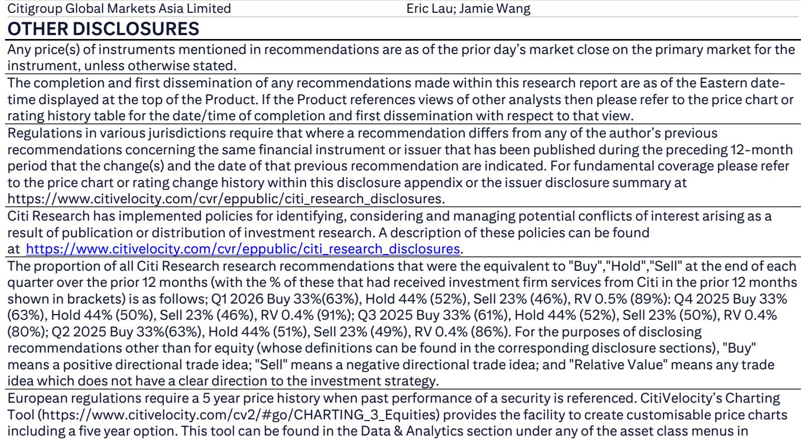
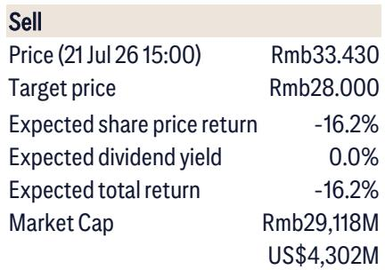

# China's Largest Robot Maker Is Winning on Cost, But the Real Battle Has Just Begun

Estun Automation posted a 33-34% gross profit margin on its industrial robots in the second quarter of 2026, up sharply from prior levels and driven almost entirely by cost reduction rather than pricing power or customer mix improvement. The company shipped an estimated 19,000 to 20,000 industrial robots in the first half of the year, making it the largest domestic manufacturer by volume in China. Yet the same force that lifted its margins—aggressive localization of key components—is now being deployed by its most dangerous competitor, KUKA, which has been acquired by Midea and is rapidly restructuring its own supply chain. The strategic question for observers is not whether Estun can hit its 2026 guidance of RMB 6.0 billion in revenue, 31% gross margin, and 45,000 robot shipments. The question is whether the structural advantage Estun has built through cost engineering can survive the intensifying price competition that component localization will unleash across the entire Chinese industrial robot industry.

The tension at the heart of this story is that Estun's margin improvement and its competitive vulnerability are two sides of the same coin. The company reduced its reliance on its two largest customers, BYD and CATL, from approximately RMB 800 million in combined revenue in the first half of 2025 to roughly RMB 400 million in the same period of 2026. This diversification is strategically sound, but it was not the primary driver of margin expansion. The real engine was internal cost reduction: component localization, design-led cost engineering, and the relocation of CLOOS welding machine manufacturing to Poland. These are repeatable, structural improvements. However, the same localization playbook is now available to KUKA, which has begun sourcing harmonic reducers from Leader Drive, RV reducers from Shuanghuan Drive, and has certified Laifual for additional components. When a competitor can access the same domestic supply base at similar prices, the cost advantage that widened Estun's margins becomes a floor for industry pricing, not a durable moat.

## Estun's Gross Margin Improvement Is a Supply-Side Achievement, Not a Sign of Pricing Power

The 33-34% gross margin Estun reported for its industrial robot business in the second quarter of 2026 represents a meaningful improvement, but the composition of that gain matters more than the absolute level. The company's board secretary explicitly attributed the expansion to cost reduction rather than customer diversification or product mix shift. This distinction is critical. A margin gain driven by pricing power or premium product sales would signal that Estun's robots command a higher value in the market, which would be difficult for competitors to replicate quickly. A margin gain driven by cost reduction, however, is inherently replicable—especially when the cost reduction comes from sourcing domestic components that are equally available to rivals.

The scale of the customer concentration reduction is notable. Estun halved its revenue exposure to BYD and CATL between the first half of 2025 and the first half of 2026, from roughly RMB 800 million to RMB 400 million. These two customers are also purchasing more high-payload robots, including units in the 200-kilogram to 250-kilogram range and even one-ton industrial robots. This shift toward higher-value products should, in theory, support margins. Yet management's own explanation indicates that cost reduction, not this mix shift, was the dominant factor. That suggests the mix benefit was either offset by pricing pressure from these large customers or was simply too small relative to the cost savings to move the aggregate number.

The implication for observers is straightforward: Estun's margin trajectory is now tied to the pace of further cost reduction, not to its ability to command higher prices. The company's management believes there is still room for additional savings, including further localization of CLOOS's key components such as reducers and the ongoing relocation of welding machine production to Poland. These are concrete, executable initiatives. But they are also finite. Once the low-hanging fruit of component substitution and manufacturing relocation is harvested, margin expansion will slow unless Estun can begin to exert pricing power—which seems unlikely in a market where its largest competitor is pursuing the same localization strategy.

## KUKA's Localization Strategy Transforms It from a Premium Player into a Direct Price Competitor

KUKA has historically occupied a different segment of the Chinese industrial robot market than Estun. As a German-origin brand with a premium positioning, KUKA competed on quality, precision, and brand reputation, not on price. Its cost structure reflected this: European-sourced components, higher labor costs, and a supply chain optimized for performance rather than cost minimization. That profile is changing rapidly under Midea's ownership. The company has been aggressively localizing its component supply, and the market is already seeing the results in its supply chain.

According to industry checks, Leader Drive and Shuanghuan Drive have entered KUKA's supply chain for harmonic and RV reducers respectively. Laifual has passed KUKA's certification and is likely to begin supplying components as well. These are the same domestic reducer manufacturers that supply Estun and other Chinese robot makers. By accessing the same domestic supply base, KUKA can dramatically reduce its bill of materials without sacrificing the brand equity and application expertise that differentiate it from purely domestic competitors. The result is a competitor that can offer a premium brand at a cost structure approaching that of domestic players.

The threat to Estun is not that KUKA will immediately undercut its prices. The threat is that KUKA's cost optimization will compress the pricing ceiling for the entire mid-to-high-end segment of the Chinese industrial robot market. Estun's current margin advantage is partly a function of having a lower cost base than foreign brands. As those foreign brands localize, the cost gap narrows. Estun must then either compete on price, which would compress its margins, or compete on application expertise and service, which requires investments that may not yield immediate returns. The company's guidance of a 31% blended gross margin for 2026 is achievable, but the trajectory beyond that year depends on whether the market structure shifts toward price competition or value-based differentiation.

## The Reducer Suppliers Are Better Positioned than the Robot Makers in This Competitive Shift

The structural logic of the current market phase favors component suppliers over system integrators. When the four largest industrial robot makers in China—including Estun and KUKA—all pursue cost reduction through domestic component sourcing, the suppliers of those components gain pricing power and volume growth without bearing the risk of end-market price wars. Leader Drive and Shuanghuan Drive are the clearest beneficiaries of this dynamic.

Leader Drive, which supplies harmonic reducers, and Shuanghuan Drive, which supplies RV reducers, are already in the supply chains of multiple robot makers. As KUKA accelerates its localization, these suppliers gain an additional high-volume customer without losing their existing relationships with Estun. The certification process for reducers is lengthy and technically demanding; once a supplier is certified, switching costs are high. This creates a structural advantage for suppliers that have already passed qualification. Laifual, which has just received KUKA's certification, is at an earlier stage but follows the same logic.

The asymmetry in business models is important. A reducer supplier sells a standardized or semi-standardized component to multiple customers. Its revenue is a function of total industry volume, not market share among robot makers. A robot maker, by contrast, must win orders in a market where its competitors are simultaneously improving their cost structures. The reducer supplier benefits from industry growth and localization without being exposed to the margin compression that comes from price competition among assemblers. This is why the research report's preference for reducer makers over robot makers is not merely a stock-picking call but a reflection of a deeper structural reality: in a commoditizing supply chain, the component bottleneck earns the scarcity premium.

## A Decision Framework for Assessing Industrial Robot Exposure

For those evaluating exposure to the Chinese industrial robot value chain, the key distinction is between companies that benefit from industry volume growth and those that depend on maintaining a cost or pricing advantage over competitors. The following framework translates the competitive dynamics into actionable criteria.

First, assess whether the company's margin is driven by structural cost advantages or by temporary supply chain dislocations. Estun's recent margin improvement was driven by component localization and design-led cost reduction. These are structural improvements, but they are also available to competitors. A company whose margin advantage comes from proprietary technology, brand premium, or application-specific know-how is better insulated than one whose advantage comes from sourcing domestic components that any rival can access.

Second, evaluate the company's customer diversification and bargaining power. Estun reduced its reliance on BYD and CATL, which is positive, but its remaining customer base may still include large buyers with significant negotiating leverage. Companies that serve many small and medium-sized customers, or that distribute through channels where the end customer is fragmented, have more pricing power than those that depend on a few large accounts.

Third, analyze the company's position in the supply chain. Component suppliers that are certified by multiple robot makers benefit from volume growth and switching costs. Robot assemblers face the risk that their cost advantages will be competed away as rivals adopt the same supply base. The most attractive positions in the current cycle are suppliers of components that are technically difficult to manufacture, have long certification cycles, and are used across multiple robot platforms.

Fourth, consider the impact of foreign competitor localization. KUKA is the most imminent development, but other foreign brands may follow. The more foreign robot makers localize their component sourcing in China, the more the domestic supply base becomes a shared resource rather than a source of competitive differentiation. Companies that can differentiate through software, application engineering, or after-sales service will fare better than those that compete primarily on hardware cost.

## The Margin Ceiling Is Set by the Supply Chain, Not by the Robot Maker

Estun's guidance for 2026 implies confidence that its cost reduction initiatives will continue to outpace any pricing pressure from competitors. The company expects to ship 42,000 to 43,000 robots in China and 2,000 to 3,000 overseas, for a total of 45,000 units. At a 31% gross margin and 5% net profit margin, this would generate approximately RMB 300 million in net profit on RMB 6.0 billion in revenue. These targets are achievable based on the trajectory of the first half of 2026.

The more difficult question is what happens in 2027 and beyond. KUKA's localization is not a one-time event; it is a multi-year process that will progressively lower its cost base. As KUKA becomes more price competitive, it will either take market share from domestic players or force them to lower prices to defend share. Either outcome pressures margins for robot assemblers. The reducer suppliers, by contrast, benefit from the increased volume regardless of which robot maker wins the order.

The industrial robot industry in China is entering a phase where the structural winners are not the brands with the highest market share but the component suppliers with the most deeply embedded positions in the supply chain. Estun has executed well on cost reduction and diversification, but the competitive dynamics that lifted its margins are now being replicated by its most formidable competitor. The next phase of the cycle will test whether Estun can convert its cost advantage into a more durable form of differentiation—or whether it will be caught in the margin compression that inevitably follows when every player in an industry gains access to the same low-cost supply base.

*For informational purposes only. Portions may be generated, translated, summarized, or edited with AI assistance based on source materials and may contain omissions or errors. Please verify independently. This is not professional advice.*

For informational purposes only. Portions may be generated, translated, summarized, or edited with AI assistance based on source materials and may contain omissions or errors. Please verify independently. This is not professional advice.

