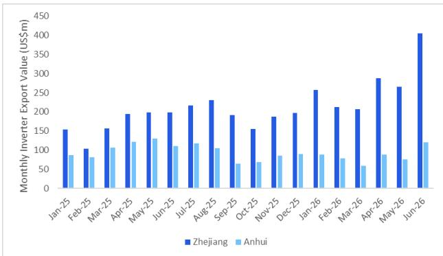
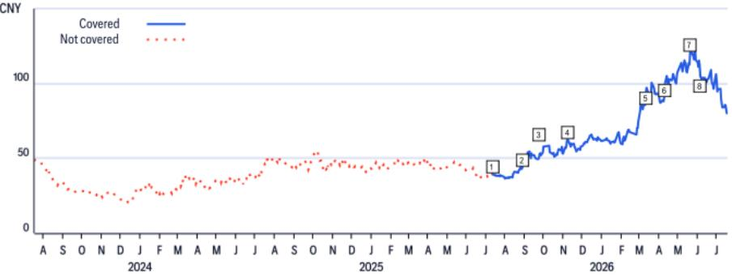
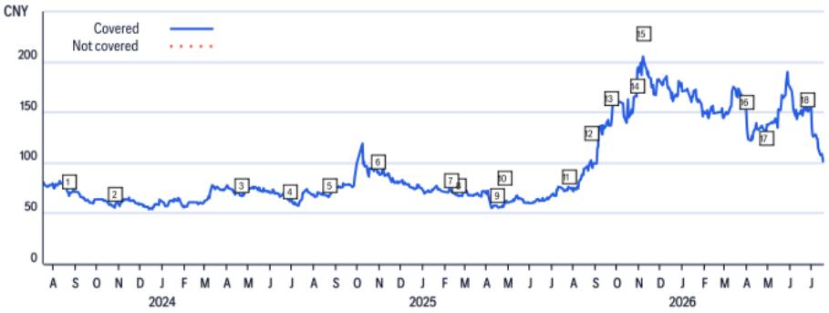
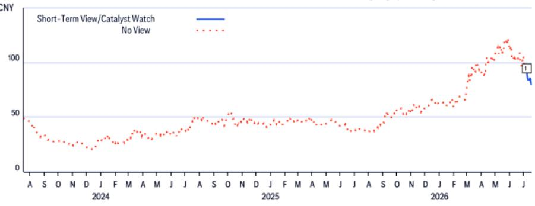

21 Jul 2026 11:58:02 ET | 12 pages

# 可再生能源行业观察

## 6月逆变器出口需求持续增长；阳光电源与德业提升股东回报

## 核心观点

6月，中国逆变器产品出口增长进一步加速，出口金额同比增长34.1%，环比增长30.3%，达到12.3亿美元（5月同比增长13.7%），主要受全球强劲需求推动，尤其是澳大利亚和非洲市场。德业所在的浙江省6月逆变器出口同比增长103.6%，而阳光电源总部所在的安徽省同比增长8.8%。与此同时，6月中国太阳能组件出口金额同比增长11.9%，环比增长20.2%，达到21.5亿美元，主要由于平均单价上升；出口量方面，我们估算同比下降24.2%，但环比增长16.7%，至16.4GW，主要受南美和欧洲需求调整影响。在中国太阳能及储能领域，我们关注阳光电源和德业，两者受益于全球储能需求的增长。近期，阳光电源董事长提议回购5亿至10亿元人民币，德业控股股东提议中期分红每股1.6元，以提升股东回报。

6月中国逆变器出口金额同比增长34.1%——2026年上半年，中国逆变器出口金额同比增长30.0%，达到55.35亿美元，其中6月同比增长34.1%，环比增长30.3%，至12.3亿美元。分区域看，6月增量需求主要来自大洋洲（同比增长210.3%，至1.07亿美元），受澳大利亚户用储能项目补贴政策推动；非洲（同比增长77.0%，至1.02亿美元），得益于尼日利亚等新兴市场需求增长；以及亚洲（同比增长31.8%，至4.88亿美元），来自巴基斯坦、印度和泰国的需求增加。6月对欧洲的逆变器出口同比增长28.3%，至4.37亿美元，占出口总额的35.5%（同比下降1.6个百分点）。按主要发货地看，阳光电源总部所在的安徽省6月逆变器出口同比增长8.8%，至1.2亿美元；德业总部所在的浙江省同比增长103.6%，至4.05亿美元。

6月中国太阳能组件出口金额同比增长14.4%——2026年上半年，中国太阳能组件出口同比增长14.4%，至131.97亿美元，其中6月同比增长11.9%，环比增长20.2%，至21.5亿美元。出口量方面，我们估算6月中国太阳能组件出口量同比下降24.2%，但环比增长16.7%，至16.4GW，受组件价格上涨及人民币兑美元升值影响。分区域看，6月需求下降主要来自南美（同比下降31.0%，至1.3GW），其次是欧洲（同比下降26.2%，至6.9GW）和亚洲（同比下降21.9%，至6.2GW），部分被大洋洲的增量（同比增长19.2%，至0.9GW）所抵消。2026年上半年，中国太阳能组件出口总量同比增长0.2%，至127.2GW。

中国太阳能行业

Pierre Lau, CFA $^{AC}$

+852-2501-2716

pierre.lau@citi.com

Air Ma

+852-2501-7450

air.ma@citi.com

详见附录A-1，包含分析师认证、重要披露及研究分析师关联信息

7月组件产量预计回升——根据SMM数据，2026年上半年中国组件产量同比下降26.0%，至209.6GW，其中6月同比下降18.4%，但环比增长3.8%，至37.8GW。行业机构估计，7月组件产量可能环比增长11.2%，但同比下降10.8%，至42.0GW。2026年前5个月，中国太阳能装机量同比下降69.9%，至59.6GW，主要受去年同期抢装高基数影响。

图1. 中国月度太阳能组件出口  
  
© 2026 Citi Inc. 未经Citi书面许可不得转载。
来源：中国海关，Citi

图2. 中国月度太阳能组件产量  
  
© 2026 Citi Inc. 未经Citi书面许可不得转载。
来源：SMM，Citi

图3. 中国月度太阳能逆变器出口  
  
© 2026 Citi Inc. 未经Citi书面许可不得转载。
来源：中国海关，Citi

图4. 安徽与浙江月度太阳能逆变器出口  
  
© 2026 Citi Inc. 未经Citi书面许可不得转载。
来源：中国海关，Citi

## 宁波德业科技

(605117.SS; 81.27元; 1; 21 Jul 26; 15:00)

## 估值

我们对德业的目标价为142.857元/股，基于DCF模型。我们认为这是合适的估值方法，因为新兴市场储能需求当前渗透率较低，有望实现持续增长。模型纳入了截至2035年的现金流预测，并假设终端增长率为3.0%。我们采用8.4%的加权平均资本成本，基于无风险利率1.6%、市场风险溢价8.9%和股权贝塔0.9倍。目标价对应2027年预期市盈率26.8倍和市净率10.0倍。

## 风险

可能导致德业股价低于目标价的主要下行风险包括：(i) 新兴市场户用及工商业储能需求低于预期；(ii) 逆变器同行间价格竞争加剧；(iii) 海外市场对中国逆变器产品的贸易关税高于预期。

## 阳光电源

(300274.SZ; 104.08元; 1; 21 Jul 26; 15:00)

## 估值

我们对阳光电源的目标价为185.0元/股，基于DCF估值。我们认为该方法合适，因为它能反映公司的长期潜在回报。模型纳入了截至2035年的盈利预测，终端增长率为4%。阳光电源的加权平均资本成本为10.2%，假设条件包括：1) 无风险利率5.2%；2) 市场风险溢价6.8%；3) 股权贝塔1.1倍；4) 债务成本3.9%；5) 目标债务资本比率30%；6) 公司税率25.0%。基于DCF目标价，阳光电源对应2027年预期市盈率20.2倍和市净率5.3倍。

## 风险

可能导致阳光电源股价未能达到目标价的主要下行风险包括：(i) 太阳能装机进度慢于预期，可能影响阳光电源光伏逆变器及EPC业务增长；(ii) 中国及海外市场储能系统需求低于预期；(iii) 海外贸易摩擦加剧，可能减少阳光电源产品出口。

如果您有视觉障碍并希望就本文件中的图表细节与Citi代表沟通，请致电美国1-888-500-5008（TTY：711），或从美国境外拨打+1-210-677-3788。

## 附录A-1

## 分析师认证

主要负责本研究报告准备和内容的研究分析师要么在作者栏中以“AC”标识，要么以粗体列在与该分析师相关的内容旁。如果作者栏中指定了多位AC分析师，每位分析师仅对其负责的部分进行认证，但不包括(a) 以粗体列出的另一位AC认证分析师的内容，以及(b) 仅针对特定发行人的观点，这些观点归因于下方价格图表或评级历史表中为该发行人标识的另一位AC认证分析师。每位分析师就其负责的报告部分认证：(1) 其中表达的观点准确反映了他们对每个提及的发行人和证券的个人观点，并且是独立准备的，包括对Citi Global Markets Inc.及其关联方的观点；(2) 研究分析师的薪酬的任何部分从未、现在或将来直接或间接与本研究报告中该研究分析师表达的具体建议或观点相关。

## 重要披露

<table><tr><td></td><td>日期</td><td>评级</td><td>目标价</td><td>收盘价</td></tr><tr><td>1</td><td>11-Jul-25 15:08:17</td><td>*1</td><td>*48.57</td><td>39.34</td></tr><tr><td>2</td><td>28-Aug-25 12:58:00</td><td>1</td><td>*50.71</td><td>44.42</td></tr><tr><td>3</td><td>22-Sep-25 03:45:06</td><td>1</td><td>*55.86</td><td>49.53</td></tr></table>

\*表示变更

<table><tr><td></td><td>日期</td><td>评级</td><td>目标价</td><td>收盘价</td></tr><tr><td>4</td><td>09-Nov-25 18:20:39</td><td>1</td><td>*72.86</td><td>62.72</td></tr><tr><td>5</td><td>10-Mar-26 05:39:48</td><td>1</td><td>*103.57</td><td>85.64</td></tr><tr><td>6</td><td>09-Apr-26 13:43:44</td><td>1</td><td>*117.86</td><td>90.65</td></tr></table>

<table><tr><td></td><td>日期</td><td>评级</td><td>目标价</td><td>收盘价</td></tr><tr><td>7</td><td>20-May-26 02:58:11</td><td>1</td><td>*142.86</td><td>121.21</td></tr><tr><td>8</td><td>05-Jun-26 02:40:31</td><td>1</td><td>*142.86</td><td>104.91</td></tr></table>

以上评级/目标价变更时间为美国东部时间

## 阳光电源 (300274.SZ)

评级与目标价历史
基础研究

分析师：Pierre Lau, CFA

<table><tr><td></td><td>日期</td><td>评级</td><td>目标价</td><td>收盘价</td></tr><tr><td>1</td><td>24-Aug-23 14:05:57</td><td>1</td><td>*104.29</td><td>70.93</td></tr><tr><td>2</td><td>27-Oct-23 14:13:49</td><td>1</td><td>*85.71</td><td>59.19</td></tr><tr><td>3</td><td>22-Apr-24 12:53:27</td><td>1</td><td>*87.86</td><td>67.14</td></tr><tr><td>4</td><td>30-Jun-24 14:26:02</td><td>1</td><td>*76.00</td><td>62.03</td></tr><tr><td>5</td><td>25-Aug-24 11:11:18</td><td>1</td><td>*78.00</td><td>68.12</td></tr><tr><td>6</td><td>31-Oct-24 12:55:52</td><td>1</td><td>*105.00</td><td>90.62</td></tr></table>

\*表示变更

<table><tr><td></td><td>日期</td><td>评级</td><td>目标价</td><td>收盘价</td></tr><tr><td>7</td><td>10-Feb-25 09:07:21</td><td>1</td><td>*85.00</td><td>72.13</td></tr><tr><td>8</td><td>23-Feb-25 08:42:35</td><td>*3</td><td>*63.00</td><td>67.47</td></tr><tr><td>9</td><td>15-Apr-25 08:13:28</td><td>3</td><td>*48.00</td><td>57.29</td></tr><tr><td>10</td><td>27-Apr-25 20:08:42</td><td>3</td><td>*53.00</td><td>58.82</td></tr><tr><td>11</td><td>27-Jul-25 17:35:10</td><td>*1</td><td>*90.00</td><td>75.78</td></tr><tr><td>12</td><td>25-Aug-25 13:35:38</td><td>1</td><td>*120.00</td><td>102.60</td></tr></table>

<table><tr><td></td><td>日期</td><td>评级</td><td>目标价</td><td>收盘价</td></tr><tr><td>13</td><td>22-Sep-25 03:45:06</td><td>1</td><td>*160.00</td><td>137.23</td></tr><tr><td>14</td><td>28-Oct-25 12:58:24</td><td>1</td><td>*200.00</td><td>165.88</td></tr><tr><td>15</td><td>09-Nov-25 16:02:51</td><td>1</td><td>*240.00</td><td>201.00</td></tr><tr><td>16</td><td>31-Mar-26 13:36:12</td><td>1</td><td>*200.10</td><td>150.76</td></tr><tr><td>17</td><td>27-Apr-26 12:08:02</td><td>1</td><td>*168.00</td><td>131.39</td></tr><tr><td>18</td><td>25-Jun-26 10:15:49</td><td>1</td><td>*185.00</td><td>152.66</td></tr></table>

以上评级/目标价变更时间为美国东部时间

阳光电源 (300274.SZ)
短期观点/催化剂观察研究  
宁波德业科技 (605117.SS)
短期观点/催化剂观察研究  

<table><tr><td rowspan="2"></td><td rowspan="2">日期</td><td rowspan="2">操作</td><td colspan="2">预期方向</td><td rowspan="2">收盘价</td></tr><tr><td>方向</td><td>持续时间</td></tr><tr><td>1</td><td>08-Jul-26 00:32:26</td><td>添加CW</td><td>上行</td><td>30天</td><td>89.57</td></tr></table>

CW - 催化剂观察, STV - 短期观点  
以上评级/目标价变更时间为美国东部时间

<table><tr><td></td><td>日期</td><td>操作</td><td>预期方向</td><td>持续时间</td><td>收盘价</td></tr><tr><td>1</td><td>15-Apr-24 01:38:47</td><td>添加CW</td><td>下行</td><td>30天</td><td>71.24</td></tr><tr><td>2</td><td>15-May-24 13:01:03</td><td>移除CW</td><td>下行</td><td>30天</td><td>75.11</td></tr><tr><td>3</td><td>01-Jul-24 00:27:42</td><td>添加CW</td><td>下行</td><td>90天</td><td>63.15</td></tr><tr><td>4</td><td>27-Sep-24 14:27:48</td><td>移除CW</td><td>下行</td><td>90天</td><td>85.20</td></tr></table>

CW - 催化剂观察, STV - 短期观点

<table><tr><td></td><td>日期</td><td>操作</td><td>预期方向</td><td>持续时间</td><td>收盘价</td></tr><tr><td>5</td><td>10-Feb-25 04:07:21</td><td>添加CW</td><td>下行</td><td>90天</td><td>72.13</td></tr><tr><td>6</td><td>11-May-25 23:13:57</td><td>移除CW</td><td>下行</td><td>90天</td><td>62.52</td></tr><tr><td>7</td><td>27-Jul-25 13:35:10</td><td>添加STV</td><td>上行</td><td>90天</td><td>75.78</td></tr><tr><td>8</td><td>24-Oct-25 14:21:43</td><td>移除STV</td><td>上行</td><td>90天</td><td>165.00</td></tr></table>

<table><tr><td rowspan="2" colspan="2">日期</td><td rowspan="2">操作</td><td rowspan="2">预期方向</td><td rowspan="2">持续时间</td><td rowspan="2">收盘价</td></tr><tr><td></td></tr><tr><td>9</td><td>27-Jan-26 22:15:05</td><td>添加CW</td><td>下行</td><td>90天</td><td>158.19</td></tr><tr><td>10</td><td>28-Apr-26 23:16:25</td><td>移除CW</td><td>下行</td><td>90天</td><td>129.89</td></tr><tr><td>11</td><td>25-Jun-26 06:15:49</td><td>添加CW</td><td>上行</td><td>30天</td><td>152.66</td></tr></table>

以上评级/目标价变更时间为美国东部时间

Citi Global Markets Inc.或其关联方在过去12个月内因非投资银行服务从阳光电源获得报酬。

Citi Global Markets Inc.或其关联方目前或过去12个月内拥有以下客户，并提供非投资银行、证券相关服务：阳光电源。

Citi Global Markets Inc.或其关联方目前或过去12个月内拥有以下客户，并提供非投资银行、非证券相关服务：阳光电源。

分析师薪酬由Citi管理层和高级管理层决定，基于旨在惠及Citi Global Markets Inc.及其关联方（“公司”）读者客户的活动和服务。薪酬不与特定交易或建议挂钩。与所有公司员工一样，分析师的薪酬受公司整体盈利能力影响，包括投资银行、销售和交易以及自营交易收入。股权研究分析师薪酬的一个因素是安排机构客户与所覆盖公司管理团队之间的企业访问活动。通常，当分析师对公司持积极看法时，公司管理层更有可能参与。

对于公司不是做市商的金融工具，公司是该金融工具（及任何基础工具）的流动性提供者，并可能作为主体参与此类工具的交易。公司是定期发行的交易金融工具的发行人，这些工具可能与产品中推荐的证券挂钩。公司定期交易产品中讨论的发行人证券。公司可能以与产品不一致的方式进行证券交易，并会就产品所覆盖的证券以主体身份从客户处买入或卖出。

除非另有说明，研究分析师或其团队成员在过去12个月内均未参观过已提供投资观点的公司的实质性运营情况。

有关本Citi产品（“产品”）所涉及公司的重要披露（包括历史披露副本），请联系Citi, 388 Greenwich Street, 6th Floor, New York, NY, 10013, 收件人：Legal/Compliance [E6WYB6412478]。此外，除估值和风险评估以及历史披露外，相同的重要披露包含在公司披露网站 https://www.citivelocity.com/cvr/eppublic/citi\_research\_disclosures 上。估值和风险评估可在关于标的公司的最新研究报告/报告文本中找到。根据市场滥用法规，Citi在过去12个月内发布的所有建议的历史记录可通过Citi Velocity (https://www.citivelocity.com/cv2) 或您的标准分发门户访问。历史披露（最多过去三年）将根据要求提供。

Citi股权评级分布

<table><tr><td rowspan="2">数据截至2026年7月1日</td><td colspan="3">12个月评级</td><td colspan="3">催化剂观察</td></tr><tr><td>买入</td><td>持有</td><td>卖出</td><td>买入</td><td>持有</td><td>卖出</td></tr><tr><td>Citi全球基础覆盖（中性=持有）</td><td>61%</td><td>32%</td><td>7%</td><td>36%</td><td>48%</td><td>16%</td></tr><tr><td>各评级类别中为投资银行客户的公司的百分比</td><td>38%</td><td>42%</td><td>27%</td><td>42%</td><td>37%</td><td>36%</td></tr></table>

Citi基础研究投资评级指南：

Citi股票建议包括投资评级和可选的风险评级以突出高风险股票。风险评级同时考虑价格波动性和基本标准。股票要么没有风险评级，要么被分配高风险评级。

投资评级：Citi投资评级为买入、中性、卖出。我们的评级基于分析师对预期总回报（“ETR”）和风险的预期。ETR是未来12个月内股票预测价格升值（或贬值）加上股息回报表现的总和。目标价基于12个月的时间范围。投资评级定义：买入（1）ETR为15%或以上，或高风险股票为25%或以上；卖出（3）为负ETR。任何未分配买入或卖出的覆盖股票均为中性（2）。对于评级为中性的股票（2），如果分析师认为缺乏足够的估值驱动因素和/或投资催化剂来得出正面或负面投资观点，他们可在Citi管理层批准下选择不分配目标价，从而不推导ETR。Citi可能因监管和/或内部政策原因暂停其评级和目标价，并分配“评级暂停”状态。Citi也可能因其他特殊情况（例如缺乏对分析师论点至关重要的信息、公司证券交易暂停）影响公司和/或公司证券交易而暂停其评级和目标价，并分配“审核中”状态。在这两种情况下，评级和目标价将在评级历史价格图表中分别显示为“—”和“-”。在2022年4月11日之前，Citi将这两种情况均分配为“审核中”状态，而在2020年11月11日之前仅在特殊情况下使用。分析师将尽快发布重新建立评级和投资论点的报告。投资评级由上述范围在首次覆盖、投资和/或风险评级变更或目标价变更时确定（受有限管理层酌情权限制）。有时，由于市场价格波动和/或其他短期波动或交易模式，预期总回报可能超出这些范围。此类临时偏差将被允许，但将接受研究管理层的审查。您买卖证券的决定应基于您个人的投资目标，并应在评估股票的预期表现和风险后做出。

## 催化剂观察/短期观点（“STV”）评级披露：

催化剂观察和STV上行/下行提示：Citi还可能包括催化剂观察或STV上行或下行提示，以表明分析师预期股价在指定30天或90天期间内因一个或多个特定近期催化剂或影响公司或市场的事件而相对上涨（下跌）。当分析师对股价影响发生的信心较高时，将发布催化剂观察；信心中等时则为STV。催化剂观察或STV上行/下行提示将在指定的30/90天期限结束时自动到期。如果股价表现（按市场收盘价计算）超过提示方向的15%，催化剂观察也将自动移除（除非分析师推翻）。分析师也可能在指定期限结束前通过发布的研究报告移除催化剂观察或STV提示。催化剂观察/STV上行或下行提示可能与股票的基础股权评级不同，且不影响后者，后者反映更长期的总相对回报预期。就FINRA评级分布披露规则而言，催化剂观察/STV上行提示对应买入建议，催化剂观察/STV下行提示对应卖出建议。任何未分配催化剂观察上行、催化剂观察下行、STV上行或STV下行提示的股票被视为催化剂观察/STV无观点。就FINRA评级分布披露规则而言，我们在催化剂观察/STV上行/下行评级系统的评级分布表中将催化剂观察/STV无观点对应为持有。但我们重申，我们不认为无观点是一种建议。对于所有催化剂观察/STV上行/下行提示，存在催化剂和相关的股价变动可能不会按预期实现的风险。

## 研究分析师关联信息/非美国研究分析师披露

本报告作者的雇佣法律实体如下所列（其监管机构进一步列于下文）。编制本报告的非美国研究分析师（即除被标识为Citi Global Markets Inc.员工之外的所有列出的研究分析师）未在FINRA注册/合格为研究分析师。此类研究分析师可能不是成员组织的关联人士（但受雇于成员组织的关联方），因此可能不受FINRA规则2241关于与标的公司沟通、公开露面以及研究分析师账户持有证券交易的限制。

Pierre Lau, CFA; Air Ma

## 其他披露

建议中提及的工具的任何价格均为前一交易日主要市场该工具的收盘价，除非另有说明。

本研究报告中所作任何建议的完成和首次分发时间为产品顶部显示的美国东部日期时间。如果产品引用其他分析师的观点，请参阅价格图表或评级历史表，以了解该观点的完成和首次分发的日期/时间。

各司法管辖区的法规要求，如果建议与作者在过去12个月内发布的关于同一金融工具或发行人的任何先前建议不同，则应指明变更和该先前建议的日期。对于基础覆盖，请参阅本披露附录中的价格图表或评级变更历史，或发行人披露摘要 https://www.citivelocity.com/cvr/eppublic/citi\_research\_disclosures。

Citi已实施用于识别、考虑和管理因发布或分发投资研究而产生的潜在利益冲突的政策。这些政策的描述可在 https://www.citivelocity.com/cvr/eppublic/citi\_research\_disclosures 找到。

过去12个月每个季度末所有Citi研究建议中相当于“买入”、“持有”、“卖出”的比例（括号内为过去12个月内获得Citi投资公司服务的比例）如下：2026年第一季度买入33%（63%），持有44%（52%），卖出23%（46%），相对价值0.5%（89%）；2025年第四季度买入33%（63%），持有44%（50%），卖出23%（46%），相对价值0.4%（91%）；2025年第三季度买入33%（61%），持有44%（52%），卖出23%（50%），相对价值0.4%（80%）；2025年第二季度买入33%（63%），持有44%（51%），卖出23%（49%），相对价值0.4%（86%）。为披露除股权以外的建议（其定义可在相应披露部分找到），“买入”指正向方向性交易想法；“卖出”指负向方向性交易想法；“相对价值”指任何没有明确方向的投资策略的交易想法。

欧洲法规要求在引用证券过往表现时提供5年价格历史。CitiVelocity的图表工具 (https://www.citivelocity.com/cv2/#go/CHARTING\_3\_Equities) 提供创建可定制价格图表的功能，包括五年选项。该工具可在CitiVelocity (https://www.citivelocity.com/) 任何资产类别菜单下的数据与分析部分找到。如需更多信息，请联系CitiVelocity支持 (https://www.citivelocity.com/cv2/go/CLIENT\_SUPPORT)。除非另有说明，所有引用价格来源为DataCentral，其从LSEG Data & Analytics获取价格信息。过往表现并非未来结果的保证或可靠指标。预测并非未来表现的保证或可靠指标。

读者在投资前应始终仔细考虑ETF的投资目标、风险以及费用和支出。ETF的适用招股说明书和关键读者信息文件（如适用）应包含该ETF的此等信息和其他信息。在投资前仔细阅读任何此类招股说明书非常重要。客户可从适用的分销商或授权参与者、ETF上市的交易所和/或适用ETF发行人的适用网站获取ETF的招股说明书和关键读者信息文件。研究价值及任何应计收入可能下跌或上涨。任何过往表现、预测或预报均不预示未来或可能的表现。本文包含的任何ETF信息仅供说明之用，不应被视为出售或招揽购买任何ETF单位的要约，无论是明示还是暗示。所表达的观点是作者的观点，不一定反映ETF发行人、其任何代理人或其关联方的观点。

Citi Global Markets India Private Limited和/或其关联方可能不时实际或实益拥有标的发行人债务证券的1%或以上。

请注意，根据经修订的第13959号行政命令（“命令”），美国人被禁止投资于美国政府确定为命令标的的任何公司的证券。本研究无意以任何可能导致违反命令的方式使用或依赖。鼓励读者依靠自己的法律顾问就遵守命令以及美国财政部外国资产控制办公室管理和执行的其他经济制裁计划提供建议。

本通讯面向符合以色列《研究交流、投资营销和投资组合管理法》（1995年）（“咨询法”）中定义的“合格客户”的人士。在以色列境内，本通讯不面向零售客户，Citi不会向零售客户或非合格客户提供此类产品或交易。演示者未获得以色列证券管理局（“ISA”）的投资顾问或投资营销许可，本通讯不构成投资或营销建议。本文包含的信息可能涉及ISA未监管的事项。本通讯涉及的任何证券不得向任何以色列人士发售或出售，除非根据《以色列证券法》（1968年）的证券发售豁免及其下的公开发售规则。

Citi广泛并同时通过公司专有的电子分发平台（例如Citi Velocity和各种全球财富平台）向公司的机构和零售客户分发其研究内容。为方便起见，某些（但非全部）研究内容可能通过第三方聚合商分发。客户可能通过电子邮件酌情接收已发布的研究报告，且仅在此类研究内容已广泛分发之后。某些研究仅提供给机构读者以满足监管要求。Citi分析师向客户提供的服务水平和类型可能因多种因素而异，例如客户对与分析师沟通频率和方式的个人偏好、客户的风险状况和投资重点及视角（例如市场范围、行业特定、长期、短期等）、与公司的整体客户关系的规模和范围以及法律和监管限制。

根据Comissão de Valores Mobiliários Resolução 20和ASIC Regulatory Guide 264，Citi需要披露Citi关联公司或业务是否与标的公司有商业关系。考虑到Citi在全球100多个国家运营多种业务，Citi很可能与标的公司有商业关系。

公司推荐、要约或出售的证券：(i) 不受联邦存款保险公司保险；(ii) 不是任何受保存款机构（包括Citibank）的存款或其他义务；(iii) 受投资风险影响，包括可能损失本金投资金额。产品仅供参考，不构成购买或出售证券的要约或招揽。购买产品中提及的证券的任何决定必须考虑该证券的现有公开信息或任何注册招股说明书。尽管信息来自并基于公司认为可靠的来源，但我们不保证其准确性，且信息可能不完整和浓缩。但请注意，公司已采取一切合理措施确定产品重要披露部分中披露的准确性和完整性。公司的研究部门已获得本产品中提及的标的公司的协助，包括但不限于与标的公司管理层的讨论。公司政策禁止研究分析师向标的公司发送研究草稿。但应假定产品作者已与标的公司进行讨论，以确保发布前事实的准确性。关于ESG（环境、社会、治理）因素的陈述和观点通常基于标的公司发布的公开声明或其他公开新闻，作者可能未独立核实。ESG因素是读者在做出投资决策时可能考虑的一个因素。所有意见、预测和估计构成作者截至产品日期的判断，这些以及产品中包含的任何其他信息如有变更，恕不另行通知。金融工具的价格和可用性也可能随时变更，恕不另行通知。尽管公司内部其他部门为产品中讨论的公司提供建议，但在此类角色中获得的信息不用于产品的准备。尽管Citi未设定预定的发布频率，但如果产品是基础股权或信用研究报告，Citi旨在提供对覆盖发行人的研究覆盖，包括响应影响发行人的新闻。对于非基础研究报告，Citi可能不会定期更新报告中包含的观点、建议和事实。尽管Citi维持覆盖、提出建议或讨论发行人，但Citi可能因法律或政策原因定期被限制引用某些发行人。如果已发布交易想法的组成部分受到限制，该交易想法将从产品中包含的任何开放交易想法列表中移除。限制解除后，如果分析师继续支持该交易想法，它将重新列入开放交易想法列表，否则将正式关闭。Citi可能向不同类别的客户提供不同的研究产品和服务（例如，基于长期或短期投资期限），这可能导致不同的结论或建议，可能影响证券价格，与替代研究产品中的建议相反，前提是每个产品与其各自的评级系统一致。

投资非美国证券，包括ADR，可能涉及某些风险。非美国发行人的证券可能未在美国证券交易委员会注册，也不受其报告要求的约束。外国证券的信息可能有限。外国公司通常不受与美国公司相当的统一审计和报告标准、实践和要求的约束。某些外国公司的证券可能流动性较低，其价格波动性可能比可比的美国公司更大。此外，汇率变动可能对美国读者对外国股票的研究价值及其相应股息支付产生不利影响。ADR读者的净股息是估算的，使用预扣税率惯例，被认为是准确的，但鼓励读者咨询其税务顾问以获取准确的股息计算。从公司收到产品的读者可能在某些州或其他司法管辖区被禁止从公司购买产品中提及的证券。请咨询您的财务顾问以获取更多详细信息。Citi Global Markets Inc.对美国的产品负责。美国读者根据产品中包含的信息下的任何订单只能通过Citi Global Markets Inc.下达。

对产品生产负责的Citi法律实体是第一署名作者受雇的法律实体。

产品在澳大利亚由Citi Global Markets Australia Pty Limited提供。（ABN 64 003 114 832 和 AFSL No. 240992），ASX集团参与者，受澳大利亚证券与投资委员会监管。Citi Centre, 2 Park Street, Sydney, NSW 2000。Citi Global Markets Australia Pty Limited不是《1959年银行法》下的授权存款机构，也不受澳大利亚审慎监管局监管。
产品在巴西由Citi Global Markets Brasil - CCTVM SA提供，受CVM - Comissão de Valores Mobiliários（“CVM”）、BACEN - 巴西中央银行、APIMEC - Associação dos Analistas e Profissionais de Investimento do Mercado de Capitais和ANBIMA – Associação Brasileira das Entidades dos Mercados Financeiro e de Capitais监管。Av. Paulista, 1111 - 14º andar(parte) - CEP: 01311920 - São Paulo - SP。

本产品在智利通过Banchile Corredores de Bolsa S.A.提供，该公司是Citi Inc.的间接子公司，受Comisión Para El Mercado Financiero监管。Enrique Foster Sur, 20, piso 6, Las Condes, Santiago, Chile。
哥伦比亚共和国读者披露：本通讯或信息不构成2010年第2555号法令第2.40.1.1.
