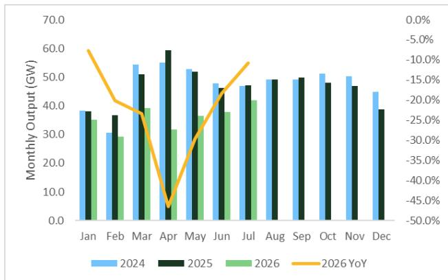
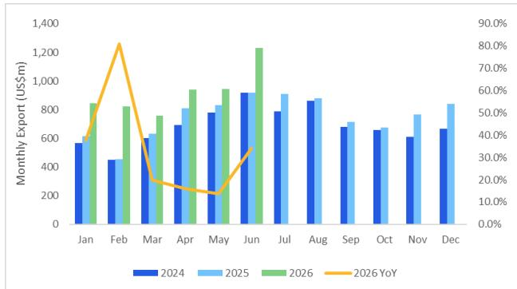
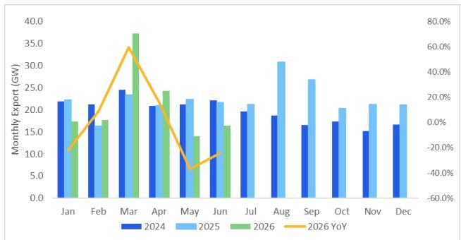

# Citi：能源行业数据与主题变化观察

中国逆变器出口在6月录得34.1%的同比增长，增速较5月的13.7%明显提升。Citi最新研报指出，这一增长主要由澳大利亚和非洲等区域的需求拉动。与此同时，两家头部企业阳光电源和德业股份在同日宣布了提升股东回报的措施，包括股份回购和中期分红提议。

出口数据的结构性变化值得关注。6月逆变器出口总额达到12.3亿美元，环比增长30.3%。增量需求主要来自大洋洲，同比增长210.3%至1.07亿美元，澳大利亚住宅储能补贴政策是主要推动力。非洲市场同比增长77.0%至1.02亿美元，尼日利亚等新兴市场的需求正在释放。亚洲市场同比增长31.8%至4.88亿美元，巴基斯坦、印度和泰国贡献了主要增量。

欧洲市场虽然相对值仍高，但占比在下降。6月对欧洲逆变器出口为4.37亿美元，同比增长28.3%，但占中国总出口的比例同比下降1.6个百分点至35.5%。这一变化暗示全球逆变器需求的地理分布正在分散化，新兴市场正在成为新的增长引擎。

## 1. 浙江与安徽出口增速分化明显

从发货地来看，两家头部企业的所在地表现差异显著。德业股份所在的浙江省，6月逆变器出口同比增长103.6%至4.05亿美元。阳光电源所在的安徽省，同期出口同比增长8.8%至1.2亿美元。

这一差距部分反映了产品结构和目标市场的不同。德业股份在户用和工商业储能领域布局更深，而新兴市场对这类产品的需求正在快速释放。阳光电源的产品更多集中于大型地面电站和系统级解决方案，其增速相对温和。

> **KC评论：** 浙江出口增速远超安徽，不能简单理解为德业比阳光电源增长更快。两家公司的产品组合、客户结构和区域侧重不同，出口数据只能反映发货地的整体表现，而非单一公司的全部业务。

## 2. 组件出口量调整，但价格回升支撑金额

与逆变器出口的强劲增长不同，中国太阳能组件出口呈现量减价升的格局。6月组件出口金额同比增长11.9%至21.5亿美元，但出口量同比下降24.2%至16.4吉瓦。Citi估算，组件均价上升和人民币兑美元升值是金额增长的主要原因。

区域需求分化明显。南美洲组件出口量同比下降31.0%至1.3吉瓦，欧洲下降26.2%至6.9吉瓦，亚洲下降21.9%至6.2吉瓦。只有大洋洲实现同比增长19.2%至0.9吉瓦。上半年组件出口总量同比仅增长0.2%至127.2吉瓦，基本持平。

组件产量的调整也在进行中。根据上海有色网数据，上半年中国组件产量同比下降26.0%至209.6吉瓦，其中6月产量同比下降18.4%但环比增长3.8%至37.8吉瓦。行业机构预计7月产量可能环比增长11.2%至42.0吉瓦，但同比仍下降10.8%。

## 3. 股东回报信号与储能需求前景

报告发布当日，阳光电源董事长提议股份回购5亿至10亿元人民币，德业股份控股股东提议中期分红每股1.6元。这两项动作在同一时间窗口出现，被Citi视为两家公司改善股东回报的信号。

Citi在研报中明确表示，在中国太阳能和储能领域，更看好阳光电源和德业股份，主要逻辑是全球储能需求的持续增长。两家公司的估值框架均基于现金流折现模型，德业股份对应26.8倍。

报告同时列出了主要不确定性因素，包括新兴市场储能需求不及预期、逆变器行业价格竞争加剧，以及海外贸易壁垒上升。这些不确定性在当前的全球贸易环境下值得持续跟踪。

对于关注中国可再生能源出口的读者，Citi的这份报告提供了一个清晰的观察框架：逆变器出口的增速和区域分布变化，组件出口的量价关系，以及头部企业在股东回报方面的动作，三者共同构成了当前行业的基本面图景。

For informational purposes only. Portions may be generated,translated,summarized,or edited with AI assistance based on source materials and may contain omissions or errors. Please verify independently. This is not investment,legal,tax,accounting,or other professional advice.

For informational purposes only. Portions may be generated,translated,summarized,or edited with AI assistance based on source materials and may contain omissions or errors. Please verify independently. This is not investment,legal,tax,accounting,or other professional advice.

