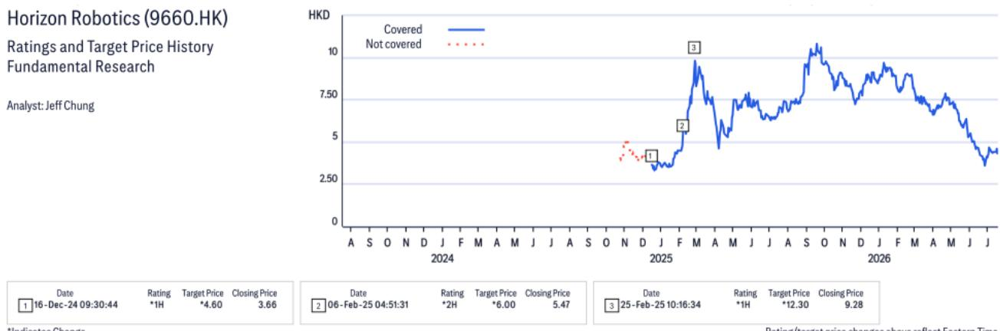
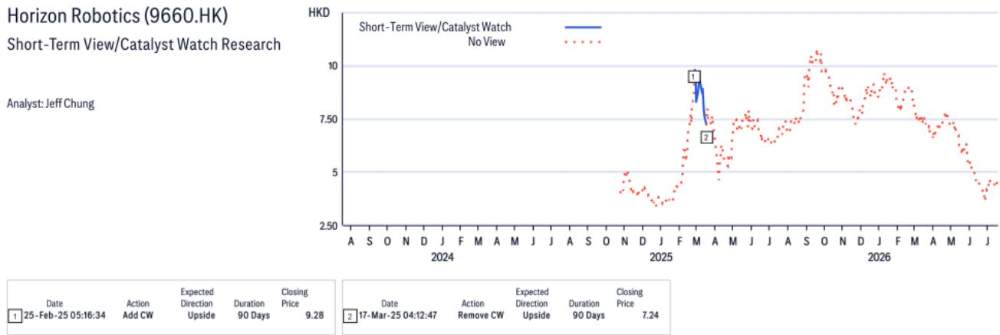
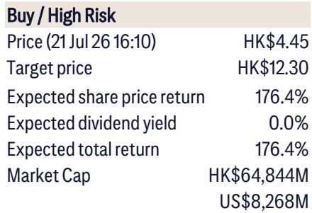

# 地平线机器人：从ADAS到自动驾驶平台的估值逻辑

地平线机器人近期发布了2026年上半年业绩预告，净利润转为正值35-40亿元人民币，主要得益于与大众汽车合资公司CARIAD发行的可转换贷款的公允价值变动。然而，在会计噪音之下，运营层面的进展才是值得关注的核心。运营收入同比增长25-35%，达到19.3-20.8亿元人民币，毛利率达到指引上限65-66%。公司上半年调整后净亏损仍约为15亿元人民币，但趋势清晰：地平线在中国高级驾驶辅助系统市场的份额正在增长，其综合平均售价在提升，随着7纳米芯片生产稳定，成本结构也在改善。目前83亿美元的市值与Mobileye的75亿美元几乎持平，但Mobileye并无自动驾驶业务。地平线当前估值与终端价值之间存在差距，而三个催化剂可能在12至18个月内弥合这一差距。

这并非一个关于单次盈利超预期的故事，而是一个由自动驾驶知识产权变现、比亚迪供应链渗透加深以及有利于地平线平台经济的竞争对手生态转变所驱动的结构性重估故事。每个催化剂都针对一个特定的读者担忧，这些担忧曾将股价锁定在仅反映ADAS业务的估值上。每个催化剂都有明确的机制、可量化的收入路径和时间表。三者共同构成了一个决策框架，将地平线与ADAS商品化陷阱区分开来。

## 催化剂一：L3/L4合作交易可能解锁数十亿知识产权收入，毛利率达95%

地平线最被低估的资产是其芯片与基础AI模型栈，可授权给追求L3和L4级别自动驾驶的全球汽车制造商。研究报告预计，地平线将在未来数月内宣布与全球主要汽车制造商的合作计划。这些并非探索性的研发合作，而是结构化的授权安排，可产生知识产权收入，毛利率接近95%。报告预计未来三年此类知识产权收入可达数十亿元人民币。

这对估值的意义在于：知识产权授权是半导体和AI价值链中毛利率最高的收入流。它无需增量硬件成本、制造资本支出或物流基础设施。每笔交易都是固定成本向可变收入的转化，几乎全部直接贡献利润。对于一家仍处于调整后净亏损状态的公司而言，即使达成一两笔此类交易，也可能显著改变盈利轨迹。报告的终端价值模型假设2030年净利润率为30.6%，但知识产权收入可能更早加速这一利润率扩张。

战略逻辑清晰。中国以外的全球汽车制造商面临两难：他们需要L3/L4能力来竞争，但缺乏像地平线这样的中国公司多年来建立的内部芯片与模型集成能力。地平线的优势不仅在于芯片，更在于包含底层AI模型、软件工具链和验证数据的全栈解决方案。对于全球OEM而言，授权这一方案比内部构建更快、成本更低。报告对近期交易公告的预期基于一个事实：地平线已通过CARIAD与大众汽车成立合资公司，为这种授权模式提供了实践验证。

对读者的启示：如果地平线宣布与一家非中国的全球汽车制造商达成L3/L4授权协议，市场将被迫将自动驾驶业务与ADAS业务分开估值。目前，股价的定价仿佛该业务价值为零。一笔交易就能为自动驾驶板块建立收入倍数，而95%的毛利率将使该倍数相对于软件同行极具吸引力。

## 催化剂二：比亚迪份额扩张是2026年下半年较强劲的收入驱动力

过去一年，读者对地平线在比亚迪内部份额的担忧是股价的主要拖累因素。市场担心，作为垂直整合巨头，比亚迪会转向内部自研方案或在多家芯片供应商间分散采购，从而压缩地平线在每辆车中的价值占比。报告以具体、可量化的证据直接回应了这一担忧。

2026年上半年，地平线在比亚迪“天神之眼B”方案中的份额有所提升，报告预计下半年这一份额将进一步上升。更重要的是，地平线有望进入比亚迪“天神之眼C”方案，其份额可能达到90-100%。这并非边际上的增量份额增长，而是单车价值量的阶跃式提升。如果地平线以接近100%的份额拿下“天神之眼C”，仅来自比亚迪的收入就可能较当前水平弹性较高甚至三倍。

机制很简单。“天神之眼C”是比亚迪面向大众市场的ADAS层级，部署在最高销量的车型平台上。赢得该项目意味着地平线的芯片和软件将嵌入每年数百万辆汽车中，且由于全场景NOA能力，其单车平均售价高于上一代方案。报告显示2026年上半年毛利率提升至65-66%，部分归因于这种产品组合的转变——随着比亚迪升级其产品线，高ASP产品正在取代低ASP产品。

下半年的加速增长还得到比亚迪自身发布周期的支撑。报告指出，2026年下半年将有6-7款大众车型发布，而比亚迪的季节性需求通常在8月后恢复。地平线的收入增长预计将从2026年上半年的34%同比增速加速至全年50%，这意味着下半年将出现显著增长。这一增长并非推测，而是基于具体的车型发布和份额数据，报告将其视为可观察而非假设的事实。

对读者的启示：比亚迪份额担忧一直是地平线估值上最大的压制因素。如果2026年下半年数据证实了报告预期的份额扩张，股价应重新定价以反映更高的单车收入。当前股价与报告目标价之间的差距，正是市场对不确定性所给予的折价。每一个确认份额增长的数据点都将缩小这一折价。

## 催化剂三：英伟达在中国ADAS市场的平台份额流失为地平线创造结构性机遇

第三个催化剂是竞争性的，而非公司特定因素。英伟达在中国ADAS市场的硬件份额正在下降，这种下降对软件生态系统产生了二阶效应。许多基于英伟达硬件构建的平台软件厂商，随着英伟达份额收缩而逐渐失去相关性。地平线提供自己的集成芯片与软件栈，有望同时获得硬件接口和此前由英伟达依赖型供应商占据的软件平台收入。

这并非传统意义上的零和游戏，而是ADAS解决方案架构的结构性转变。当英伟达硬件占据主导时，软件厂商针对其CUDA生态系统进行优化。随着地平线硬件份额增长，软件厂商将越来越多地针对地平线平台进行优化。网络效应有利于地平线：更多硬件采用吸引更多软件开发，使平台更有价值，进而推动更多硬件采用。

报告未以收入形式量化这一催化剂，但其战略重要性显而易见。地平线的竞争地位不仅在于赢得单个OEM合同，更在于成为中国ADAS生态系统的默认平台。如果英伟达份额持续下降，地平线平台将成为软件厂商和OEM的自然迁移路径。这是一个多年期的顺风，会随时间推移而增强。

对读者的启示：这一催化剂不如L3/L4授权交易或比亚迪份额扩张那样立竿见影，但持续时间最长。只关注未来两个季度的读者可能错过这一结构性转变。报告的终端价值模型假设到2030年在中国L2+ ADAS市场占有45%份额，这意味着地平线将捕获中国乘用车领域L2+渗透率达到100%过程中的大部分增长。这一假设只有在竞争动态长期有利于地平线时才可信。英伟达份额流失正是这些动态正在转变的最有力证据。

## 读者的决策框架：触发重估的三个条件

上述三个催化剂并非独立事件，而是相互强化。成功的L3/L4授权交易验证了地平线的技术栈，使其ADAS平台对像比亚迪这样的OEM更具吸引力。比亚迪份额扩张带来了吸引软件开发者的规模效应，进而强化了平台对抗英伟达的能力。竞争格局向远离英伟达的方向转变，为全球OEM授权地平线方案而非自行构建创造了更多紧迫性。

读者可通过一个简单的决策框架来操作这一论点。该框架设定了三个条件，如果全部满足，将触发重估，可能在12个月内实现。

第一，地平线宣布至少一项与现有大众汽车关系之外的全球主要汽车制造商的L3/L4授权协议。此类交易第一年的收入无需重大，信号价值才是关键：它证明了自动驾驶业务具有独立的变现潜力，并为该板块建立了估值锚点。

第二，地平线报告2026年下半年收入增长确认全年50%目标，且毛利率维持在65%以上。这将验证比亚迪份额扩张是真实的，且下半年加速并非一次性事件，而是可持续的趋势。

第三，中国ADAS芯片出货量的第三方数据显示，地平线市场份额连续两个季度增长，而英伟达份额下降。这是最滞后的指标，但也是最结构性的。如果实现，重估可能是永久性的，而非事件驱动。

报告的估值方法——以11%的加权平均资本成本折现的2030年30倍市盈率——并非精确预测，而是一个框架，迫使读者将地平线视为一个终端价值故事，而非近期盈利故事。当前83亿美元的市值意味着市场将地平线视为一家上行空间有限的ADAS芯片公司。而三个催化剂表明，它是一家自动驾驶平台公司，只是碰巧被定价为组件供应商。这两种认知之间的差距，正是研究机会所在。

*仅供参考。部分内容可能基于源材料通过AI辅助生成、翻译、总结或编辑，可能存在遗漏或错误。请独立核实。本文不构成专业建议。*

仅供参考。部分内容可能基于源材料通过AI辅助生成、翻译、总结或编辑，可能存在遗漏或错误。请独立核实。本文不构成专业建议。

