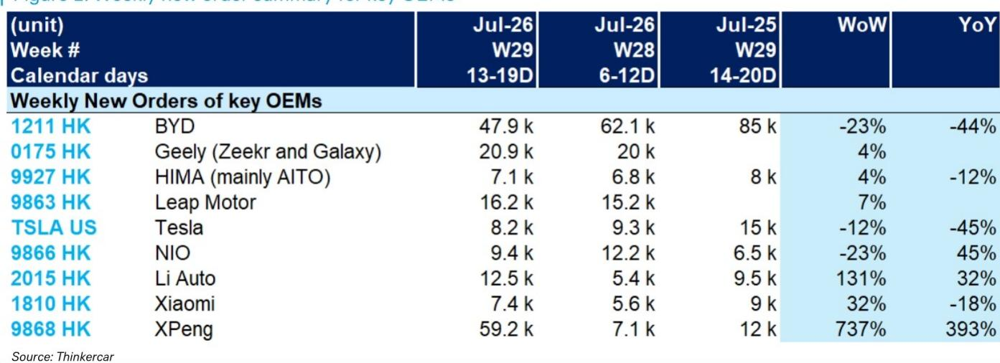
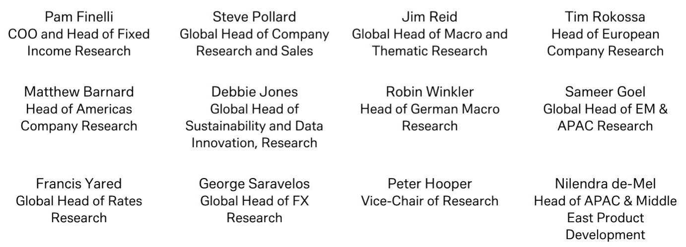
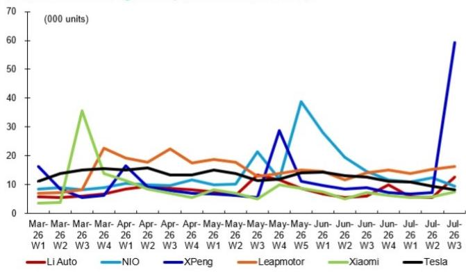

# 2026年7月第三周中国新能源车市周度订单观察：产品周期分化加速

2026年7月第三周，中国新能源汽车市场出现了一个值得关注的结构性变化。某新势力品牌录得59,200辆周度新订单，环比增长737%，显著领先于监测范围内的其他竞争者。这并非渐进式增长或季节性波动，而是一次结构性转折。同一周，行业销量领先的比亚迪录得47,900辆订单，环比下降23%，同比下滑44%。特斯拉的8,200辆订单则环比下降12%，同比收缩45%。这种分化并非随机现象，它反映了需求驱动因素、产品周期动态和消费者认知的根本性重组，值得每一位汽车行业战略规划者、供应商和市场研究者深入思考。

数据显示，市场已不再同步运行。过去数月，市场叙事聚焦于价格竞争、利润空间压缩以及传统领先者的耐力。如今，这一叙事已不足以解释现状。正在发生的是两类公司之间的分化：一类成功重塑了产品叙事，另一类则困于自身过往成功的惯性之中。本周的数据不仅展示了谁在增长、谁在调整，更揭示了背后的原因，而这些原因对整个价值链的资金配置、产品规划和竞争定位具有直接影响。

这一转变的时机值得关注。7月通常是中国汽车市场的过渡月份，紧随其后的是下半年的新车发布潮。但本周订单波动的幅度表明，消费者正在以超越常规季节性模式的方式做出选择。这意味着，传统领先者调整应对的时间窗口比多数管理团队预期的更为紧迫。若将本周视为异常值，则可能错判结构性变化为随机噪音。

## 某新势力订单激增是产品周期事件，而非市场整体回暖信号

7月第三周数据中最关键的事实是，某新势力品牌订单从7,100辆跃升至59,200辆。这并非整个新能源车市场的需求复苏故事，而是一次公司层面的产品周期转折。393%的同比增长确认了这并非基数效应。该品牌推出了一款车型或一系列功能，在短时间内显著扩大了其可触达的消费者基础。环比增长约8倍的订单量，意味着一次产品发布、一次重要的价格调整或一项技术展示，以前所未有的速度将潜在兴趣转化为实际订单。

对于竞争者而言，这一战略启示虽令人不安却无法回避。该品牌已证明，中国新能源车市场的消费者忠诚度相对有限，订单流可能因一个具有吸引力的产品方案而几乎在一夜之间重新分配。737%的周环比增长意味着该品牌吸收了原本可能流向其他品牌的订单。比亚迪和特斯拉的同时下滑表明，该品牌的增长至少部分是以它们的份额为代价。这不是水涨船高，而是一场零和博弈，争夺的是在周度总需求并未同步扩张的市场中的订单转化。

对战略规划而言，产品周期的时间节点已成为季度表现中最具影响力的变量。在竞争窗口期内推出热门车型的公司，能够以超越传统预测模型的速度获取市场份额。反之，处于产品周期空窗期的公司，则面临仅靠降价无法填补的需求真空。该品牌的激增应促使每家整车企业重新评估其发布日程、功能优先级，以及在竞争对手达到峰值时自身陷入产品周期低谷的风险。

## 比亚迪与特斯拉同步下滑：规模优势不再能抵御需求波动

比亚迪周度订单同比下滑44%，是数据集中最易被低估的信号。比亚迪是中国销量最大的新能源车制造商，产品线覆盖从经济型到高端多个价位。其订单簿历来被视为大众市场新能源车领域健康状况的参考指标。同比下滑44%，叠加环比下滑23%，表明其现有产品线对曾推动其指数级增长的消费者群体的吸引力正在减弱。该公司并非面临危机，而是处于规模无法掩盖的需求增速放缓阶段。

特斯拉同比下滑45%，从高端市场端印证了相同模式。特斯拉在中国的品牌价值依然显著，但其订单流在相对数量上正在缩减。在竞争对手激增的一周内环比下降12%，表明特斯拉正在流失高意向买家。该公司对Model 3和Model Y的依赖，相对于中国竞争对手快速的产品更新周期，正逐渐成为短板。数据暗示，特斯拉在中国的订单簿现在对竞争性产品发布的敏感度，已超过对其自身价格调整的敏感度。

对行业观察者而言，战略教训是：在一个以产品快速迭代为特征的市场中，规模优势可能带来虚假的安全感。比亚迪和特斯拉都拥有小规模竞争者所缺乏的制造规模、供应链深度和品牌认知度。然而，这些优势并未阻止它们在一周内合计损失约4万辆订单（与去年同期相比）。其机制很简单：当竞争对手推出一款更符合当前消费者偏好的车型——无论是在智能驾驶功能、电池续航、内饰设计还是价格方面——订单转移会立即且不成比例地发生。传统领先者不能依赖惯性来度过产品周期空窗期。它们必须加速更新周期，否则就要接受订单簿将被更灵活的竞争者定期冲击的现实。

## 理想与蔚来：国内高端市场的分化轨迹

在国内高端新能源车品牌中，7月第三周的数据揭示了显著的表现分化。理想汽车录得12,500辆周度订单，环比增长131%，同比增长32%。蔚来汽车录得9,400辆订单，环比下降23%，但同比增长45%。这两条轨迹共同表明，高端市场并非铁板一块。理想的增长表明，其增程式电动策略继续吸引注重续航信心的家庭用户。131%的周环比增长暗示了特定催化剂——可能是一个新车型版本或一个促销窗口——释放了被压抑的需求。

蔚来45%的同比增长表现尚可，但在理想激增的一周内环比下降23%，表明蔚来在国内高端阵营中的相对份额正在流失。蔚来的商业模式强调换电、订阅服务和品牌社区，提供了不同的价值主张。但周度订单数据显示，这一主张并未转化为加速增长的需求动力。蔚来面临的挑战并非生存问题，而是战略选择问题。公司需要决定是加倍投入其差异化模式，还是调整产品定位以获取更多目前流向理想和某新势力品牌的订单。

对研究者和分析人士而言，启示在于：国内高端新能源车领域正进入一个整合阶段，相对订单动能将决定哪些公司能够达到实现可持续运营所需的规模。理想的轨迹表明它已找到可复制的模式。蔚来的轨迹则表明其模式虽可行，但可能无法产生同样的增长速度。这种分化之所以重要，是因为市场将越来越多地奖励那些展现持续订单加速能力的公司，而非仅依赖品牌叙事的公司。

## 应对周度订单波动格局的分析框架

7月第三周的周度订单数据为评估新能源车公司提供了一个视角，但其价值在于它所能支撑的分析框架，而非数据本身。研究者和企业战略规划者需要一种结构化的方法来解读这些高频信号，同时避免对单一数据点反应过度。以下分析框架将关键变量组织成一个可重复的分析流程。

第一个变量是订单来源。一家公司的周度订单总量可分解为基础需求、发布驱动需求和促销驱动需求。基础需求代表无论短期事件如何都会购买的消费者订单。发布驱动需求是与新车型或重大功能更新相关的峰值。促销驱动需求是折扣或激励措施带来的暂时性增长。某新势力品牌737%的增长几乎可以肯定是发布驱动。比亚迪的下滑则可能是基础需求侵蚀与缺乏补偿性发布的结合。该框架要求分析者估算每个组成部分的比例，并预测发布驱动峰值在衰减回基础水平之前将持续多久。

第二个变量是竞争性替代。当一家公司订单激增时，框架必须识别哪些竞争者失去了相应的需求。在7月第三周，替代似乎从比亚迪和特斯拉流向某新势力品牌，并在较小程度上流向理想汽车。战略问题是，被替代的需求是永久性流失，还是会在替代者产品周期成熟后回归。答案取决于新客户群体的粘性。如果某新势力品牌的新买家建立了品牌忠诚度，那么替代是永久性的。如果他们是一次性转换者，订单流可能会回流。

第三个变量是增长率的可持续性。737%的周环比增长在数学上不可持续。框架必须预测衰减曲线。一个合理的假设是，该品牌的订单将在接下来几周内正常化至显著高于发布前基础水平但低于峰值的水平。关键指标是峰值后的基础水平。如果该品牌稳定在每周20,000至25,000辆订单，那将代表一次结构性跃升。如果稳定在10,000辆，那么峰值只是一次性事件。该框架迫使分析者定义结构性改善与暂时性改善的阈值。

第四个变量是竞争者的反应滞后时间。比亚迪和特斯拉并非被动观察者。两者都有资源加速自身产品周期、调整定价或引入新功能以应对某新势力品牌的成功。框架必须纳入一个竞争反应函数。关键问题是传统领先者能多快缩小差距。如果比亚迪能在三个月内推出竞争车型，该品牌的优势窗口就很窄。如果差距是六到九个月，该品牌就有时间建立忠诚的客户群。该框架不提供答案，但它以明确不确定性的方式构建了问题。

## 周度订单数据已成为新能源车市场份额动态最可靠的先行指标

从月度交付报告转向周度订单监测，代表了市场情报时效性的根本性提升。月度交付数据是回顾性的且经过平滑处理。它们掩盖了一个月内发生的波动，并将信号延迟四到五周。周度订单数据捕捉了对产品发布、价格变化和竞争动作的即时反应。7月第三周的数据展示了这种颗粒度的价值。一份月度报告会显示某新势力品牌的激增，但会将其与前几周的数据混合，从而稀释其幅度并掩盖竞争性替代。

战略启示是，依赖月度数据的公司和研究者正面临显著的信息劣势。在一个订单流可能在一周内变动737%的市场中，四周的滞后不仅仅是报告延迟。它是一个竞争盲点。那些建立内部能力来追踪和响应周度订单动态的公司，将在资源配置、生产规划和营销支出方面获得实质性优势。而那些继续按月度周期管理的公司，将始终落后于市场的转折点。

这并非建议用周度数据取代基本面分析。它应作为补充。周度订单信号的价值最高时，是在一个考虑产品周期、竞争动态和基础需求趋势的框架内进行解读。7月第三周的数据并非独立结论。它是一个更大拼图中的一块。但这一块如果被忽视，可能导致具有多季度后果的战略失误。

*仅供参考。部分内容可能基于源材料通过AI辅助生成、翻译、总结或编辑，可能存在遗漏或错误。请独立核实。本文不构成任何专业建议。*

仅供参考。部分内容可能基于源材料通过AI辅助生成、翻译、总结或编辑，可能存在遗漏或错误。请独立核实。本文不构成任何专业建议。

