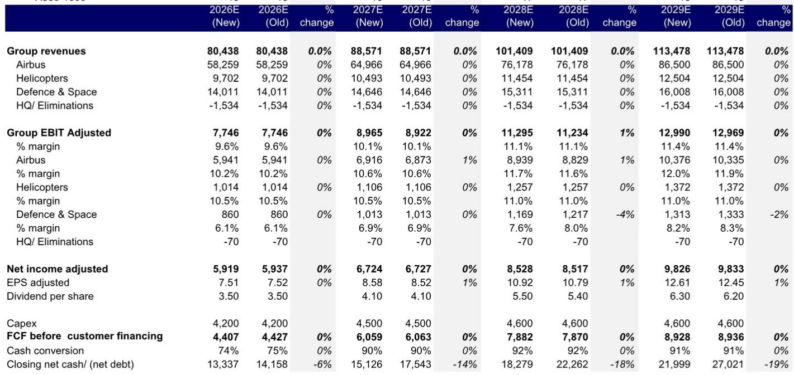
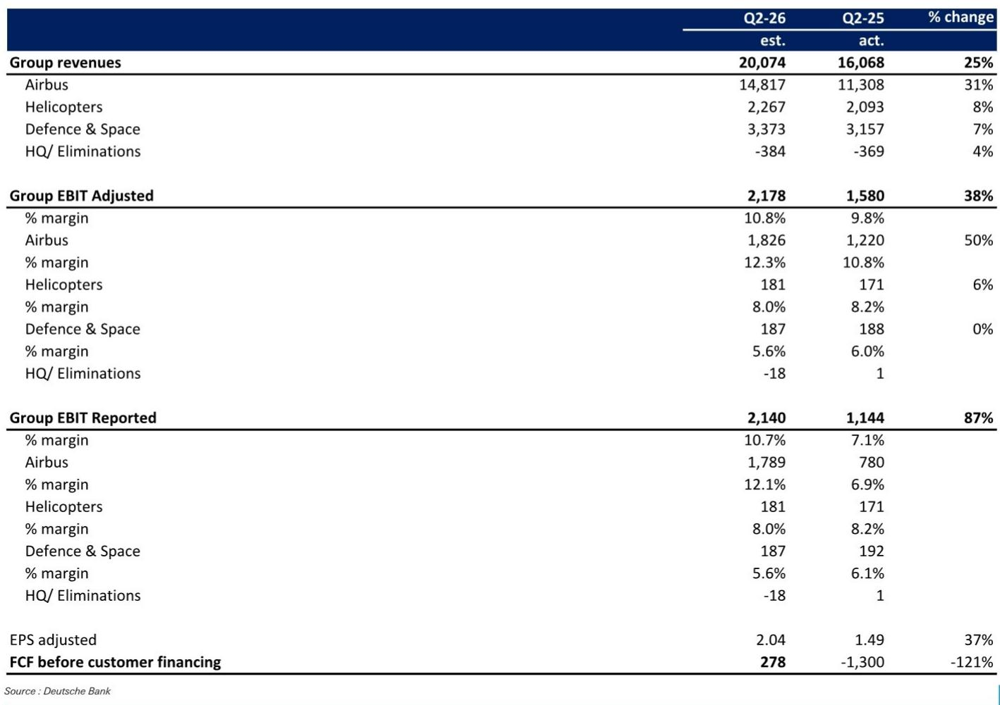
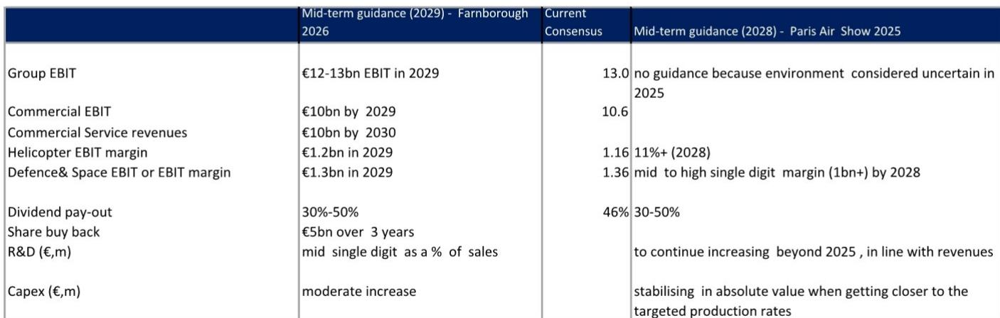

# DB：空客2029年中期指引及50亿欧元回购计划

空客在2026年7月业务更新中披露了2029年中期指引，集团调整后EBIT目标为120-130亿欧元，与市场预期基本吻合。真正超出预期的信号来自一项为期三年的50亿欧元公司回购计划，叠加此前公布的30%-50%股息支付率，公司计划将约60%的自由现金流返还给股东。这份DB研报同时指出，空客的商业增长不会在2029年止步，宽体机和售后服务将成为下一阶段的核心驱动力。

## 1. 中期指引符合预期，回购计划成为正向信号

空客确认了2026年指引，并首次披露2029年中期目标：集团调整后EBIT为120-130亿欧元，彭博一致预期为130亿欧元。公司重申了五年期内约1倍的现金转换目标。更值得关注的是，空客宣布了市场期待已久的三年50亿欧元公司回购计划，叠加2025年披露的30%-50%股息支付率，这一股东回报政策被研报视为积极信号。

> **KC评论：** 回购计划的时间跨度（三年）和规模（50亿欧元）本身比中期EBIT数字更值得关注。它意味着管理层对自由现金流生成能力有足够信心，否则不会在资本密集型行业中做出如此长期的承诺。

## 2. 宽体机与售后服务构成2029年后增长主线

空客的增长故事并未在2029年画上句号。宽体机产能提升将持续推进，公司预计在2026年做出进一步增加A350生产率的决定。当前目标为2028年月产12架，但研报认为可能达到14-16架。瓶颈目前主要集中在客舱供应链环节。产品组合优化也在议程上：空客正在研究A220和A350的加长型，前提是获得推力更大的发动机。售后服务同样被定位为增长引擎，公司目标是通过有机增长和并购，在2025年至2030年间将服务销售额弹性较高至100亿欧元。A350的盈利甜点期预计在2030年代到来，届时售后服务利润率也将达到两位数。

## 3. 防务与航天及直升机业务延续增长轨迹

防务与航天部门延续了2025年6月设定的方向，2029年指引将2028年目标进一步延伸。航天业务表现超出预期，星座和军用航天项目带来显著牵引力。防务业务增长由产能提升驱动，MRTT产量将弹性较高，欧洲战斗机目标年产量达到28-30架。直升机业务持续增长，军用复合年增长率接近6%，民用为4%，创新覆盖全部13个产品组合。

## 4. 第二季度交付量驱动运营杠杆，外汇对冲构成影响

空客第二季度业绩将于7月29日盘后发布。研报预计商用飞机部门第二季度交付量同比增加67架，这将成为运营杠杆的主要驱动力。部分抵消因素包括外汇对冲（因对冲汇率升值4美分，第二季度产生1.5亿欧元逆风）、研发支出增加以及Spirit整合成本。直升机业务预计销量同比持平，防务与航天部门则继续向中高个位数EBIT利润率目标迈进。自由现金流预计为正，尽管库存因下半年交付集中而有所增加。

，主要反映回购计划对股本数量的影响。估值基于三种方法的平均值：2028年EV/EBIT分部加总估值290欧元、DCF估值197欧元、以及基于2028年预期自由现金流的4%回报表现法估值208欧元。

For informational purposes only. Portions may be generated,translated,summarized,or edited with AI assistance based on source materials and may contain omissions or errors. Please verify independently. This is not investment,legal,tax,accounting,or other professional advice.

