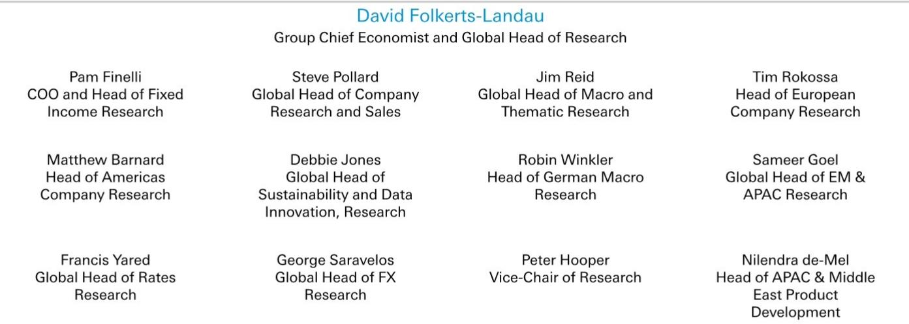
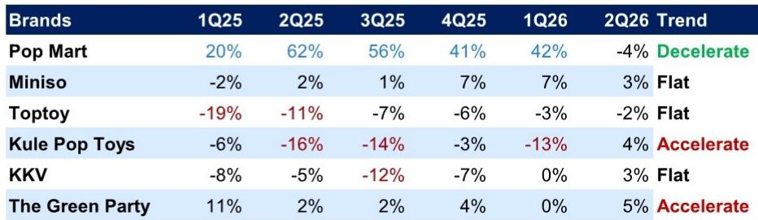
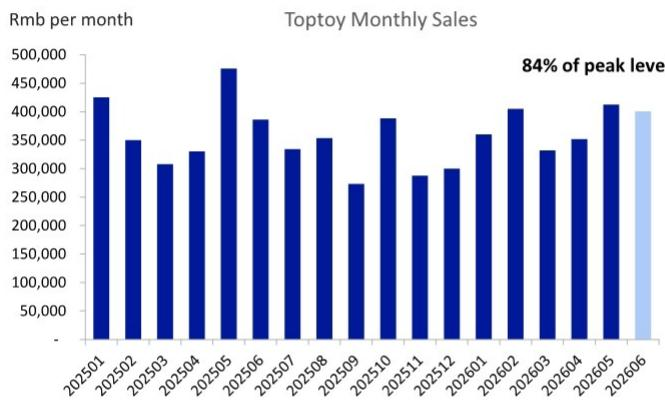

# DB：中国IP零售商6月线下销售分化

中国IP零售的线下动能在2026年6月出现清晰分化。DB基于第三方数据的月度跟踪显示，泡泡玛特同店销售同比下滑16%，较5月的-6%进一步变化，而名创优品、TOP TOY等多数同行仍保持正增长。这份报告的核心判断是：IP零售赛道并未整体转弱，但泡泡玛特正经历2025年高基数与稀缺性消退的双重不确定性，其2季度同店销售同比已转为-4%，与1季度的+42%形成鲜明对比。

报告覆盖的七家主要IP零售商中，泡泡玛特是相对少见在6月录得两位数负增长的品牌。卡游以+46%的同比增速领跑，名创优品、TOP TOY、酷乐潮玩、KKV、The Green Party均录得2%至4%的正增长。这种分化意味着，消费者对IP产品的兴趣并未消退，但泡泡玛特此前依赖的“稀缺性驱动流量”模式正在发生变化。

## 1. 泡泡玛特6月同店销售同比下滑16%，Labubu 4.0未能扭转趋势

泡泡玛特的线下门店月均销售额降至120万元，仅为1月峰值的83%。尽管公司推出了Labubu 4.0和多个新IP系列，但报告认为这些新品未能有效对冲需求节奏变化。社交媒体监测显示，THE MONSTERS x FIFA系列和Labubu 4.0 Hair Salon系列的二级市场定价偏软，线上线下库存充足，稀缺性溢价已基本消失。Dimoo World x Pixar系列反馈积极，但受众仍局限在特定客群。THE MONSTERS、Twinkle Twinkle和Crybaby仍是泡泡玛特排名前三的IP。

> **KC评论：** 泡泡玛特2季度同店销售从+42%降至-4%，这个拐点比单月数据更值得关注。报告隐含的意思是，2025年IP热潮带来的需求前置效应正在释放，而新IP的拉新能力尚未证明能弥补存量用户的购买频次下降。

## 2. 名创优品中国区同店销售6月同比增长3%，大店策略支撑韧性

名创优品中国区6月同店销售同比增长3%，与5月的+4%基本持平，2季度累计增长3%。月均门店销售额达到37.5万元，相当于2025年峰值的93%。报告认为，名创优品的大店策略和IP执行能力是其表现相对稳健的关键。管理层指引1H26收入增长20%至22%，其中中国区增长21%至22%，海外增长高十几个百分点；全年净增门店450至500家，调整后经营利润增长约10%。

TOP TOY在6月同店销售同比转正至+4%，较5月的-13%明显改善，但2季度整体仍下滑2%，月均销售额仅为5月峰值的84%。报告指出，TOP TOY仍面临流量稀释和同类IP产品竞争的不确定性。

## 3. 卡游6月同店销售同比反弹46%，基数效应与新品周期叠加

卡游6月同店销售同比大增46%，是样本中增速最快的品牌。但报告数据同时显示，卡游在2025年大部分时间处于深度负增长，2025年4月曾低至-79%。这一反弹更多反映的是低基数效应和自身产品周期，而非行业性回暖。从季度趋势看，卡游1Q26同店销售同比持平，2Q26则因6月单月拉动而转正，持续性仍需观察。

## 4. 观察框架：用同店销售与峰值比例判断IP零售商所处周期

这份报告提供了一个可复用的观察框架：除了关注同店销售的同比增速，还应结合“月均销售额占历史峰值的比例”来判断品牌所处的需求周期阶段。泡泡玛特6月为83%，名创优品为93%，TOP TOY为84%。峰值比例越高，说明该品牌的需求基础越稳固；比例持续走低，则意味着即使有新品发布，也难以回到此前的流量高点。此外，二级市场定价和库存充裕度是判断IP稀缺性是否仍在的先行指标——当新品在二手平台溢价消失、线上线下均能轻松买到时，稀缺性驱动的流量红利基本结束。

For informational purposes only. Portions may be generated,translated,summarized,or edited with AI assistance based on source materials and may contain omissions or errors. Please verify independently. This is not investment,legal,tax,accounting,or other professional advice.

For informational purposes only. Portions may be generated,translated,summarized,or edited with AI assistance based on source materials and may contain omissions or errors. Please verify independently. This is not investment,legal,tax,accounting,or other professional advice.

