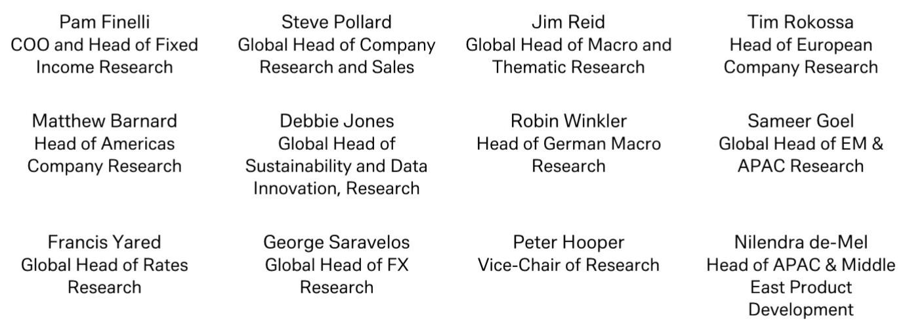

# 年轻一代拥抱风险与AI——行业需为新型客户做好准备

家庭财务领域正出现一个有趣的矛盾现象。发达经济体的消费者情绪整体偏谨慎，通胀疲劳、住房可负担性危机和地缘不确定性影响着公众心态。然而，一家全球性机构的调研数据揭示了一个显著的反向趋势：55岁以下的读者——尤其是美国和英国居民——明确表达了在未来一、三、五年内提升自身风险承受意愿的强烈倾向。年龄越轻，这种意愿越强。

这并非边缘性变化，而是一代人对其可接受风险敞口的重新定义。与之相伴的另一个显著特征是：他们愿意将组合管理决策交给人工智能。同一项调研显示，年轻读者并非被动接受AI建议，而是主动希望AI代为执行交易。年龄、风险偏好与AI信任度之间的关联如此紧密，以至于这暗示着新一代财富持有者看待市场的方式正在发生结构性而非周期性的转变。

这对资产管理人、财富顾问和产品设计者影响深远。一个希望获得更高波动性、更短风险评估周期和算法执行的客户群体，将需要与当前主流产品截然不同的产品、沟通方式和受托框架。行业应将此转变视为一个信号：未来核心客户群的基本偏好正在一个根本不同的环境中形成。

## 数据显示年龄、风险偏好与AI信任度之间存在清晰关联，无法仅用生命周期效应解释

传统生命周期理论认为，年轻人因未来数十年的收入能力而能够承担更多风险。这固然正确，但无法解释调研中观察到的风险寻求行为的强度与加速趋势。在美国和英国，55岁以下的受访者表示他们希望提升当前的风险水平，而不仅仅是接受它。这种对更多风险的明确渴望，并非对长期时间跨度的被动承认，而是对更高波动性、更大回撤和更高上行潜力的主动偏好。

这一模式的独特之处在于它与AI采纳的紧密耦合。那些希望承担更多风险的个体，同时也对将组合决策委托给算法表现出最高的接受度。这并非巧合。行为金融研究早已表明，委托决策能减轻波动带来的情绪痛苦。当人类顾问做出决策时，客户仍会感受到损失；而当算法做出相同决策时，心理距离创造了一个缓冲。年轻一代在音乐、电影和购物中成长于对推荐引擎的信任，如今他们将这种信任延伸至市场。其机制并非对风险回报权衡的理性计算，而是对算法中介的习得性舒适感，这种舒适感降低了不确定性的主观成本。

因此，数据指向一种复合效应：一个在结构上倾向于更高风险的群体，同时也在采用一种让风险感觉不那么有风险的工具。这种组合有可能将组合配置推至远超传统年龄基准模型建议的水平。对于顾问和产品设计者而言，这意味着基于历史规范校准的标准风险问卷，可能系统性地低估了年轻客户真实的风险偏好，因为这些客户正在纳入一种前几代人未曾拥有的应对机制——AI委托。

## 抱负通胀与社交投资正在重塑风险判断的参照系

这一转变背后较强大的驱动力之一是报告所称的“抱负通胀”。年轻读者并非将自己的组合与教科书式的60%股票/40%债券基准进行比较。他们将自己的回报与在社交媒体、加密货币叙事以及网红晒出的巨额收益截图中看到的财富创造进行比较。参照群体已经改变。当你的邻居、你喜欢的TikTok博主或Reddit论坛展示着某只网红股或杠杆加密货币交易100%的年回报时，一个多元化组合带来的10%年化收益感觉像是失败。

这不仅仅是嫉妒。这是财务成功定义与传播方式的结构性转变。社交投资平台将组合表现游戏化，使盈亏公开、可分享并受社会比较影响。一笔成功交易的情绪回报被收藏、评论和社区认可放大。保守组合的心理成本不再仅仅是机会成本，而是社交上的隐形。

报告的行为分析表明，这种环境正在创造自身的风险偏好。读者并非天生具有固定的波动容忍度。这种容忍度是由他们听到的故事、观察到的结果以及同辈群体的规范塑造的。当年轻读者社交信息流中的主导叙事是关于不对称上行时，“好”回报的锚点就会上移。结果是，年轻读者要求更多风险，并非因为他们理性计算了更高波动性将在其一生中得到回报，而是因为不这样做感觉就像退出了一个人人似乎都在赢的游戏。

对于金融机构而言，这造成了一个困境。用均值回归和多元化的警告来对抗抱负通胀是必要的，但如果客户的参照群体不是标普500指数而是一位加密原生的网红，那么这种警告可能无效。更富有成效的回应可能是设计出承认对不对称上行渴望的产品，同时嵌入客户难以轻易绕过的风险控制。具有下行缓冲的结构化产品、目标结果ETF以及奖励持续行为而非投机性胜利的游戏化储蓄工具，可能比传统的平衡型基金更符合这种心理。

## 家庭风险意愿上升恰逢系统性风险增加，形成危险的不对称

数据中最令人担忧的张力或许是时间上的。年轻读者希望在家庭层面增加风险敞口，而恰恰此时，多个领域的专家都在警告全球系统性风险——地缘分裂、气候转型不确定性、主权债务可持续性以及技术颠覆——正在加剧。报告明确指出了这一冲突。这不仅仅是乐观的散户读者与谨慎的专业人士之间的分歧。这是个体愿意承担的风险与系统正在产生的风险之间的结构性错配。

这种不对称之所以重要，是因为散户读者并未对冲系统性冲击。一位在波动环境中增加风险的专业组合经理会同时调整对冲策略、分散投资于不相关资产并维持流动性缓冲。相比之下，典型的年轻读者是通过集中投资于高贝塔股票、加密货币或杠杆产品来增加风险，而没有相应的对冲。当系统性冲击发生时，损失可能是集中且严重的。

报告关于AI信任的数据增加了另一层担忧。如果系统性事件引发市场急剧下跌，基于历史数据训练的AI驱动组合经理可能不具备识别制度转变的上下文意识。在2008年后牛市中表现良好的算法策略，可能在流动性危机或地缘破裂中灾难性地失败。正是让年轻读者对更高风险感到舒适的工具，也可能在风险真正显现时成为最薄弱的环节。

这不是反对AI或反对年轻读者承担风险的论点。这是主张在一个读者感知风险与实际风险环境背道而驰的世界里，对风险管理有更复杂的理解。行业需要开发压力测试框架，以考虑AI管理的散户组合的具体脆弱性，并以与信任算法胜过信任机构的一代人产生共鸣的方式传达这些脆弱性。

## 应对风险与AI偏好代际转变的决策框架

报告中识别的模式可以转化为一个结构化的决策框架，供金融专业人士使用。该框架建立在三个维度上：风险对齐、AI准备度和抱负管理。

第一个维度是风险对齐。传统的风险画像假设客户陈述的风险容忍度是稳定的，顾问的角色是将其与适当的资产配置相匹配。新的现实是，陈述的风险容忍度是动态的、受社会影响的，并受客户对委托工具的信任度调节。因此，顾问必须从静态匹配模型转向动态校准模型。这意味着在客户社交参照群体、近期市场经历以及对AI工具不断演变的信任度的背景下，定期重新评估风险偏好。这也意味着不仅要针对历史波动性，还要针对客户社交信息流最可能放大的特定尾部风险，对客户的组合进行压力测试。

第二个维度是AI准备度。调研数据清楚地表明，年轻客户希望AI管理他们的资金，但行业尚未准备好安全地提供这一点。大多数机器人顾问使用静态的组合构建规则，这些规则不会适应不断变化的风险偏好或系统性条件。一个真正准备好AI的产品将结合用于模式识别的机器学习与用于制度转变检测的人工监督。它还应包括行为护栏，防止客户在狂热或恐慌时期覆盖算法。该框架应将AI视为需要治理、监控和定期重新校准的工具，而非顾问的替代品。

第三个维度是抱负管理。报告的行为分析表明，抱负通胀是真实存在的，忽视它会导致客户不满和组合漂移。因此，该框架应包括关于参照群体的明确对话。顾问应询问客户：你在将自己的财务结果与谁比较？这些比较现实吗？要实现类似的回报需要什么，失败的概率是多少？目标不是抑制抱负，而是将其建立在对结果分布的现实评估之上。这对于受社交媒体叙事影响的客户尤其重要，这些叙事突出赢家，却忽略了数量多得多的输家。

## 社会层面AI怀疑论与个人财务领域AI信任的同时上升，形成脆弱平衡

报告中还有一个值得仔细关注的最终张力。拥抱AI进行组合管理的同一代人，正生活在一个公众对AI的怀疑日益增长的时期。监管审查正在加强。关于偏见、隐私、就业替代和存在风险的担忧主导着政策辩论。然而，在个人财务这一狭窄领域，对AI的信任似乎在上升。

这种分歧是脆弱的。一个AI管理组合的高调失败——算法羊群效应放大的闪崩、流行机器人顾问的数据泄露，或针对AI驱动交易平台的监管行动——可能会粉碎当前支撑风险寻求行为的信任。行业必须认识到，当前的平衡取决于AI在一个缺陷不可避免的领域完美运行。没有算法能预测每一次制度转变，也没有数据集是完整的。

这意味着金融行业不仅要在技术上投资，还要在围绕技术的信任基础设施上投资。这包括透明地披露AI模型如何工作、使用什么数据以及它们的局限性是什么。这意味着建立能够在极端条件下覆盖算法的人工监督。这也意味着教育客户了解统计概率与确定性之间的区别。希望AI管理其风险的一代人，也必须理解AI本身就是一个风险因素。

报告的数据描绘了一代乐观、技术娴熟且愿意冒险的群体。这不是一个需要解决的问题。这是一个需要管理的机会。但这种管理需要行业尚未展现出的复杂程度。成功的公司将是那些将青年、风险与AI的交汇点视为金融服务新时代的设计约束，而非营销人口统计数据的公司。

*仅供参考。部分内容可能基于源材料通过AI辅助生成、翻译、总结或编辑，可能存在遗漏或错误。请独立核实。本文不构成任何专业建议。*

仅供参考。部分内容可能基于源材料通过AI辅助生成、翻译、总结或编辑，可能存在遗漏或错误。请独立核实。本文不构成任何专业建议。

