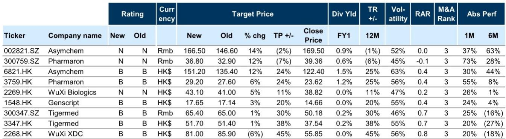
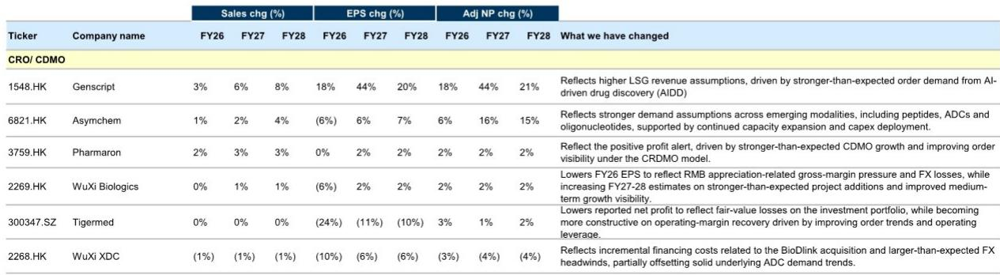
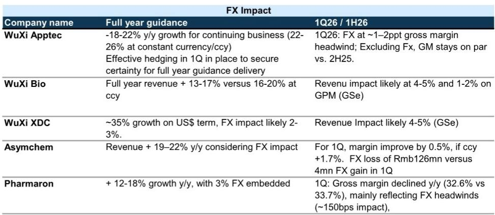

# 研究主题与行业变化观察

过去一个月，中国CDMO板块上涨27.9%，领跑医疗保健板块的11.8%反弹，也跑赢MSCI中国指数的7.6%。相关研究在最新报告中认为，这一表现并非单纯板块轮动——二季度基本面数据提供了支撑：GLP-1和ADC等关键治疗领域的订单需求保持韧性，国内临床试验活动活跃推动NHP价格持续上涨，全球并购活跃以及AI驱动药物发现（AIDD）的采用率上升，都在创造增量需求催化。更重要的是，尽管地缘政治话题持续存在，但该机构观察到，截至目前，客户需求或项目执行并未受到实质性影响。

CDMO的表现正在从1H26的alpha驱动故事，逐步转向更广泛的beta驱动复苏。不过，盈利持续性更强、GLP-1敞口更大的公司仍领跑：药明康德H股一个月/年内涨幅达22%/59%，凯莱英H股为29%/70%。市场也开始奖励那些实现盈利上修和订单趋势改善的公司——康龙化成H股在公布超预期的订单增长（整体订单同比+30%，CDMO同比+50%）后，一个月内反弹约54%。

相关研究认为，近期估值修复的可持续性，将取决于持续的盈利交付，包括订单摄入的韧性、商业化项目转化，以及市场对2026年预期的潜在上修。该机构上调了覆盖范围内部分公司2026-2028年调整后净利润预测5%/10%/6%。

> **观察评论：** 报告的核心逻辑是，CDMO板块的估值修复已经从少数公司的alpha故事，转向更广泛的beta复苏。但能否持续，关键看二季度财报能否兑现订单增长和盈利上修——尤其是药明康德8月3日率先发布的财报，可能成为板块情绪的风向标。

## 1. 二季度订单增长预期集中在20%-30%区间

相关研究汇总的数据显示，市场对二季度CDMO新订单和积压订单增长的预期集中在20%-30%区间。具体来看，药明康德一季度剔除汇率影响后新订单同比增长25%，积压订单同比增长24%（剔除汇率影响为29%）；康龙化成二季度整体订单同比增长30%，其中CDMO订单增长50%；泰格医药一季度新订单同比增长20%，二季度维持高双位数增长。

订单增长的驱动力来自多个方向：GLP-1相关项目持续放量，ADC和寡核苷酸平台需求扩大，以及国内生物科技公司和跨国药企客户的临床活动恢复。报告特别指出，中国海关数据显示，二季度多肽出口同比增长137%，达到33亿元人民币，这为药明康德TIDES业务增长提供了可交叉验证的外部数据。

## 2. 人民币升值构成约1-5个百分点的收入仍在调整

二季度美元兑人民币平均汇率同比下降约5.9%，较一季度的4.8%进一步扩大。这对以美元计价收入、人民币记账的中国CDMO企业构成明确的汇率仍在调整。

各公司已在其全年指引中纳入这一因素：药明康德全年收入指引为18%-22%增长（剔除汇率影响为22%-26%），汇率影响约4个百分点；药明生物指引13%-17%增长（剔除汇率影响为16%-20%），影响约3个百分点；康龙化成指引12%-18%增长，其中约3%为汇率影响；凯莱英指引19%-22%增长，包含2-3%的汇率影响。

相关研究估算，二季度汇率对收入的影响可能在4%-5%区间，对毛利率的影响约为1-2个百分点。不过，报告认为市场已基本消化这一预期，且头部公司通过外汇对冲（如药明康德一季度已进行有效对冲）部分缓解了影响。

> **观察评论：** 汇率影响是已知变量，市场已将其计入定价。真正值得关注的是，在剔除汇率影响后，各公司的实际经营增长是否达到或超过指引区间——这才是盈利上修能否兑现的基础。

## 3. 药明康德二季度财报最值得关注：指引上修与GLP-1积压转化

相关研究将药明康德列为二季度财报季最值得关注的公司（8月3日率先发布）。报告认为，二季度业绩有望进一步强化盈利可见性，支撑来自：持续的订单执行、GLP-1需求在多肽和小分子项目上的体现，以及GLP-1以外的多元化增长。晚期和商业化项目占比提升，应继续支撑利润率韧性。

报告特别指出，药明康德存在指引上修的可能性。当前全年收入指引为18%-22%增长（剔除汇率影响22%-26%），如果二季度订单和积压转化数据超预期，管理层可能上调这一区间。这将是支撑报价继续跑赢的关键催化剂。

读者关注的核心问题包括：GLP-1/TIDES积压订单的转化进度、多肽出口数据与公司TIDES收入的可交叉验证关系、GLP-1以外的增长多元化（如ADC、寡核苷酸等），以及利润率趋势。

## 4. 康龙化成与凯莱英：订单加速后的盈利上修空间

康龙化成是近期板块中表现最突出的公司之一。在公布二季度CDMO订单同比增长50%后，报价一个月内反弹约54%。相关研究认为，更强的订单趋势能否转化为盈利上修和可能的指引调整，是当前市场辩论的焦点。公司与礼来的合作增强了其在国内GLP-1供应链中的战略定位，长期期权价值超出直接收入贡献。

凯莱英方面，市场辩论已转向多肽订单可见性和公司激进的TIDES产能扩张利用率。报告认为，公司在多肽、ADC和寡核苷酸领域的敞口持续扩大，传统小分子需求也出现企稳迹象，这为盈利增长和利润率扩张提供了额外支撑。产能利用率爬坡和利润率进展是二季度财报的关键观察点。

## 5. 估值修复的可持续性取决于盈利交付节奏

相关研究在报告中提出了一个可复用的观察框架：CDMO板块的报价回报主要由盈利上修驱动，而估值倍数越来越多地与未来2-3年盈利增长的可持续性挂钩。这意味着，短期订单数据固然重要，但市场真正定价的是这些订单能否转化为可预测的、持续的收入和利润增长。

具体到二季度财报季，读者应关注几个核心变量：药明康德的指引是否上修、康龙化成的CDMO订单增长能否转化为盈利上修、凯莱英的产能利用率爬坡进度、以及泰格医药的订单恢复能否持续转化为收入增长。这些变量将决定板块估值修复是短期脉冲还是中期趋势。

For informational purposes only. Portions may be generated,translated,summarized,or edited with AI assistance based on source materials and may contain omissions or errors. Please verify independently. This is not investment,legal,tax,accounting,or other professional advice.

For informational purposes only. Portions may be generated,translated,summarized,or edited with AI assistance based on source materials and may contain omissions or errors. Please verify independently. This is not investment,legal,tax,accounting,or other professional advice.

