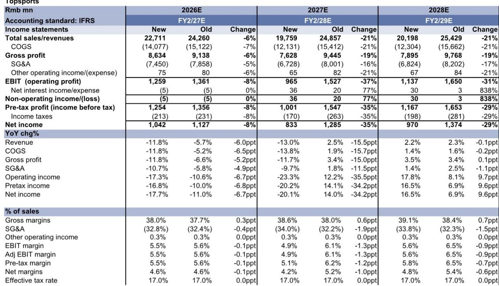
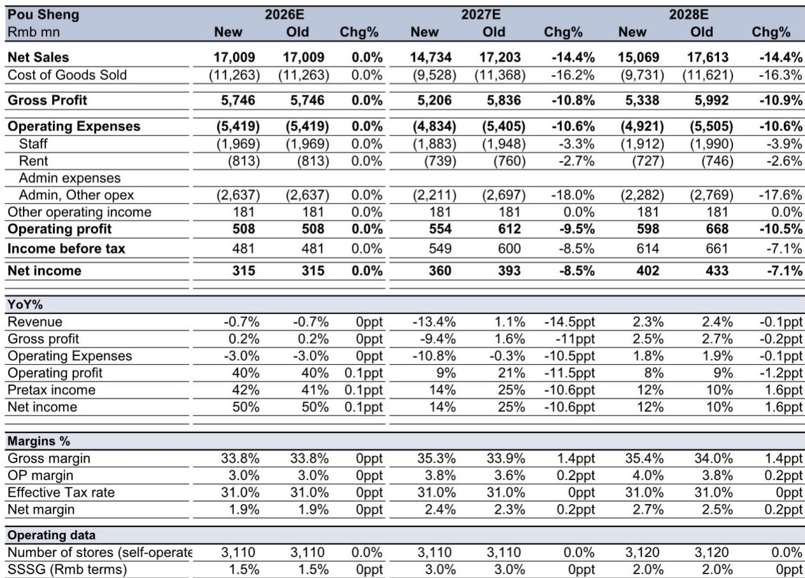
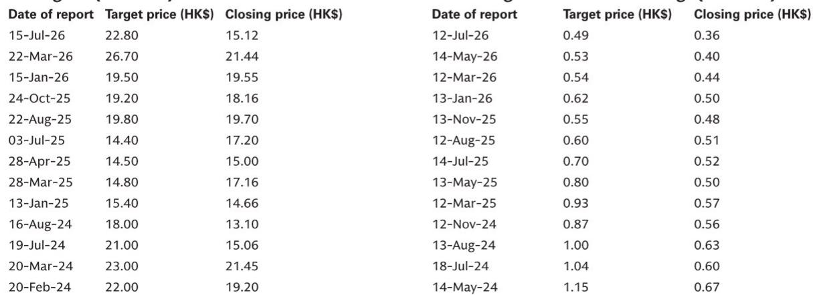

# Nike中国线上渠道调整：经销商利润影响分化，竞争品牌迎来窗口期

6月25日，滔搏和宝胜确认，Nike将于2027年1月1日起终止其在中国大陆的线上平台销售业务。受影响的业务约占滔搏FY2/2026集团收入的22%，以及宝胜FY2025集团收入的15%。收入敞口的规模和官方确认超出市场预期，消息公布当日滔搏股价下跌约24%，自6月中旬消息首次传出以来累计下跌44%。然而，两家经销商的利润影响存在显著差异，这一战略调整对中国运动服饰行业的影响远不止于收入缺口本身。

官方公告明确了Nike在6月30日FY4Q26财报电话会议上曾暗示但未确认的渠道策略——管理层重申了提升中国线上线下市场、改善全价销售率的计划。对于观察者而言，关键的分析任务不是衡量收入损失（这一计算相对直接），而是根据两家经销商各自线上业务的利润率结构，评估利润影响如何不同，以及Nike的渠道改革对安踏和李宁等竞争品牌是带来机会还是风险。

## 线上业务利润影响取决于各经销商的数字渠道是增厚还是稀释利润率

滔搏和宝胜披露了各自Nike线上业务截然不同的利润率情况。滔搏管理层表示，其线上利润率高于集团整体水平，这意味着终止合作将移除一个利润贡献比例较高的收入来源。相比之下，宝胜指出，其线上销售因推动数字销量需要大量折扣，反而稀释了利润率。这一差异决定了为何两家公司的盈利修正方向与收入敞口相反。

对于滔搏，22%的收入损失在FY2/28E预计将转化为35%的净利润下降，修正后的净利润从12.85亿元人民币降至8.33亿元人民币。毛利率在FY2/28E实际上提升了0.6个百分点，因为低利润率的线上业务被移除，但营业利润率从6.1%收缩至4.9%，因为损失的收入贡献了高于平均水平的利润，而固定成本无法被完全替代。SG&A比率上升1.9个百分点，因为固定成本分摊到了更小的收入基础上。滔搏面临典型的经营去杠杆问题：收入损失集中在高利润渠道，因此利润下降幅度大于收入下降幅度。

对于宝胜，情况则相对温和。FY2025年15%的收入敞口在FY27-28E转化为14%的收入下降，但同期净利润仅下降8-9%。毛利率提升1.4个百分点，因为稀释利润的线上渠道被移除，营业利润率实际上从3.6%改善至3.8%，折扣减少和可变费用降低带来的成本节约部分抵消了收入损失。宝胜的净利润影响约为收入影响的一半，而滔搏的净利润影响约为收入影响的1.6倍。这种差异并非规模问题，而是渠道经济性问题：宝胜的线上业务在侵蚀利润，因此其移除反而改善了盈利能力，即使收入在收缩。

这一区别对估值有直接影响。滔搏的市盈率从FY2/27E的10倍下调至FY2/28E的8倍，以反映盈利不确定性增加，但利润影响可控，剩余业务在结构上更具盈利能力。市场的初步反应——股价从消息公布前水平下跌44%——已经消化了大部分盈利下调，修正后约13%的隐含股息回报表现提供了底部支撑。对于宝胜，估值不高，加上失去稀释利润的渠道带来的利润率改善，支持了积极观点，尽管收入损失在标题上较为显著。

## 两家经销商需加速品牌组合多元化，滔搏的战略紧迫性更高

Nike线上业务终止并未结束经销商与该品牌的关系；两家公司将继续与Nike在线下销售方面合作。但线上渠道的损失移除了一项结构性增长动力，迫使战略转向新兴品牌。随着中国消费者偏好日益分化，滔搏和宝胜一直在积极扩展品牌组合，Nike事件将加速这一多元化进程。

对于滔搏，战略挑战更为严峻，因为损失的线上收入利润率较高，对利润贡献比例更大。公司不仅需要替代收入，还需要替代来自一个比线下运营更盈利的渠道的利润贡献。这要求要么扩大能够在线数字渠道产生类似利润率的替代品牌关系，要么在线下业务中寻找成本效率以弥补损失的盈利能力。盈利修正表明，滔搏管理层预期一个多年的过渡期：FY2/28E收入预计为198亿元人民币，较此前预测下降21%，即使在FY2/29E也未恢复到终止前的水平，收入仍比旧预测低21%。

宝胜面临的战略紧迫性较低，因为移除稀释利润的渠道改善了盈利质量，即使总收入下降。公司可以专注于优化线下运营，并有选择性地增加新的品牌合作，而无需急于替代损失的利润贡献。盈利修正显示，FY27E净利润为3.6亿元人民币，仅比旧预测下降8.5%，净利率实际上从2.3%改善至2.4%。宝胜的战略任务是以盈利方式增长剩余业务，而非匆忙寻找替代收入。

对中国经销商模式的更广泛启示是，依赖单一品牌——即使是像Nike这样拥有约16%市场份额的主导品牌——当品牌决定重组渠道策略时，会带来结构性脆弱性。那些建立了多元化品牌组合并保持严格成本结构的经销商，将更有效地吸收此类冲击。而那些依赖单一品牌高利润数字销售的经销商，则面临更根本的商业模式挑战。

## Nike渠道改革为安踏和李宁创造窗口期，但库存风险可能抵消收益

Nike决定终止中国线上分销业务，是其提升市场地位、改善全价销售率的更广泛战略的一部分。这意味着Nike将转向直接面向消费者的线上运营，或与不同类型的数字平台合作，以更好地控制定价和品牌呈现。对于安踏和李宁等中国运动服饰竞争品牌而言，这产生了两种相反的力量。

积极方面，Nike的渠道改革可能会扰乱其在中国近期的销售势头。从经销商管理的线上渠道过渡到Nike实施的新模式，将涉及库存调整、平台谈判以及产品供应的潜在缺口。在这一过渡期，原本通过滔搏或宝胜线上商店购买Nike产品的消费者可能会转向竞争品牌。安踏和李宁作为最大的中国运动服饰品牌，最有能力捕捉这一需求。报告维持对安踏和李宁的积极观点，反映了这一机会。

然而，风险在于Nike在渠道过渡期间的库存管理可能导致更具促销性的环境。如果Nike需要清理来自终止合作的经销商渠道的库存，或者过渡造成库存失衡需要通过折扣来解决，整个运动服饰市场可能面临利润率压力。报告明确指出了这一下行风险：“我们需要密切关注Nike对这些线上渠道潜在库存管理的策略，这可能导致更具促销性的环境，进而可能对所有品牌的利润率构成下行风险。”

对安踏和李宁的净影响取决于市场份额增长与利润率压缩之间的平衡。如果Nike的过渡有序，库存管理不涉及激进折扣，则市场份额机会占主导。如果过渡引发价格战，利润率侵蚀可能抵消销量增长。报告维持积极观点表明，在当前估值下，机会大于风险，但这是一个有条件判断，需要监测Nike的实际执行情况。

对于评估中国运动服饰品牌的观察者而言，关键跟踪变量不仅是Nike的线上策略，还包括过渡期更广泛市场的库存和折扣行为。干净的过渡有利于安踏和李宁；混乱的过渡则损害整个行业。

## 评估中国运动服饰分销与品牌生态的决策框架

Nike线上业务终止在运动服饰价值链上产生了一系列差异化的影响。以下框架将关键变量组织为结构化评估：

**对于经销商股票（滔搏和宝胜）：** 主要变量是损失线上业务的利润率情况。如果线上渠道增厚利润（如滔搏），利润影响相对于收入损失被放大，股票估值倍数应收缩以反映更高的不确定性。如果线上渠道稀释利润（如宝胜），利润影响较小，剩余业务变得更盈利，支持估值稳定。次要变量是品牌组合多元化的速度。能够迅速用其他品牌的数字销售替代Nike线上收入的经销商将更快恢复；无法做到的则面临持续的盈利拖累。

**对于品牌股票（安踏和李宁）：** 主要变量是对Nike渠道中断的竞争反应。如果Nike在过渡期失去份额，安踏和李宁获得销量，但面临Nike库存清理压低行业定价的风险。净效果取决于销量增长是否超过利润率压缩。次要变量是各品牌自身的渠道策略。拥有强大直接面向消费者能力和多元化分销的品牌，更能在不牺牲定价纪律的情况下捕捉被转移的需求。

**对于12个月展望的观察者：** 报告的评级提供了明确信号。宝胜是积极观点，因为利润影响可控且估值不高。滔搏是积极观点，因为股价下跌已反映大部分坏消息，股息回报表现提供底部支撑，但盈利前景仍不确定。安踏和李宁基于Nike中断带来的机会被看好，但需监测促销强度。

四只股票的共同点是，Nike的渠道改革并非一次性事件，而是全球品牌如何对待中国市场结构性变化的信号。品牌对数字渠道更大控制权的趋势将持续，无法展示多元化收入来源和高品质盈利的经销商将面临持续的估值折价。能够利用这一中断同时保持定价纪律的品牌将变得更强大。

*仅供参考。部分内容可能基于源材料通过AI辅助生成、翻译、总结或编辑，可能存在遗漏或错误。请独立核实。本文不构成专业建议。*

仅供参考。部分内容可能基于源材料通过AI辅助生成、翻译、总结或编辑，可能存在遗漏或错误。请独立核实。本文不构成专业建议。

