HUAMING (002270.SZ)

# 基于估值吸引力上调评级，全球电网升级驱动海外稳健增长

我们基于估值因素将华明评级从中性上调，因我们维持不变的12个月目标价23.9元对应约33%的上行空间，风险回报比具有吸引力。在市场对AI资本开支可见度及高贝塔AI基础设施公司估值存在担忧的背景下，我们认为华明提供了一种更具防御性的方式，以参与为期多年的全球电网升级周期——无论是否受益于AI，其支撑因素包括基础设施老化、可再生能源并网以及海外市场份额提升。凭借国内市场的领先地位、不断提升的出口占比以及结构性更高的海外利润率，我们预计华明将实现稳健的复合盈利增长，2026E-30E年净利润复合年增长率约为17%。

自2026年初以来，公司报价已有所调整，期间峰值至谷底的调整幅度较思源电气、英利等可比公司更大，因其此前跟随美国电力短缺主题交易，尽管基本面受益程度较低（有载分接开关不存在供应短缺）。在报价调整后，我们认为估值相对具有吸引力，当前12个月远期估值倍数约为18.1倍，略低于2015年以来20.3倍的历史均值，在2026E-30E年每股盈利复合年增长率17%不变的背景下，估值存在重估空间。

尽管预期有所修正且对美国电力短缺的直接敞口有限，但我们认为华明除美国外的海外增长依然稳健。西门子能源/日立能源预测，2024-35E年全球电网投资将以约7%的复合年增长率增长，驱动因素不仅包括数据中心建设，还包括基础设施老化和可再生能源并网。在此背景下，我们预计华明的全球市场份额将从2026E年的约13%提升至2030E年的约16%，驱动力包括产品质量相当、交付周期更短，以及在仍由竞争对手MR主导的市场中具有显著的价格优势。因此，我们预计有载分接开关业务中的出口占比将从2026E年的约41%上升至2030E年的约59%。

我们预测2026E-30E年收入复合年增长率约为14%，利润率扩张得益于海外业务占比提升（海外业务毛利率较国内业务高5-10个百分点）。这将推动综合毛利率从2026E年的约56%提升至2030E年的约57.5%，同期净利润复合年增长率约为17%。

周立
+86(21)2401-8648 |
zhou.li@goldmansachs.cn
GS（中国）证券有限责任公司

杜洁
+852-2978-1783 |
jacqueline.du@gs.com
GS（亚洲）有限责任公司

陈浩
+86(21)2401-8812 |
hao.z.chen@goldmansachs.cn
GS（中国）证券有限责任公司

全球电网容量（西门子能源预测）

图1：华明当前12个月远期估值倍数约为18.1倍，略低于2015年以来20.3倍的历史均值
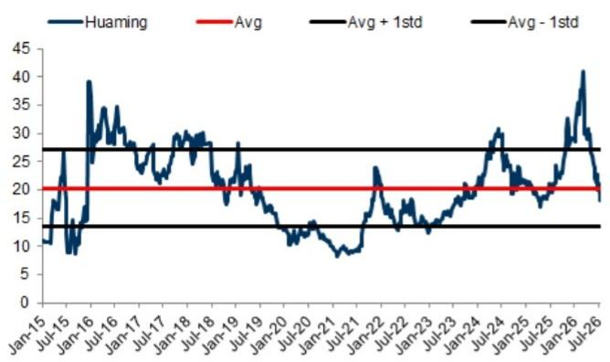
来源：公司数据，GS全球研究

图2：华明报价自峰值调整约52%，调整幅度大于可比公司思源电气和英利
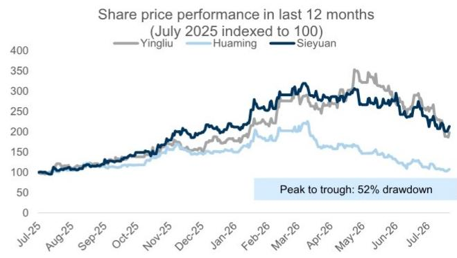
来源：Wind，GS全球研究整理

图3：受基础设施老化和发电结构变化驱动，全球电网投资将持续增长至2035年及以后
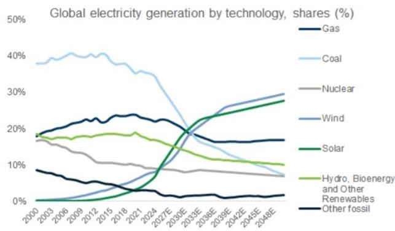

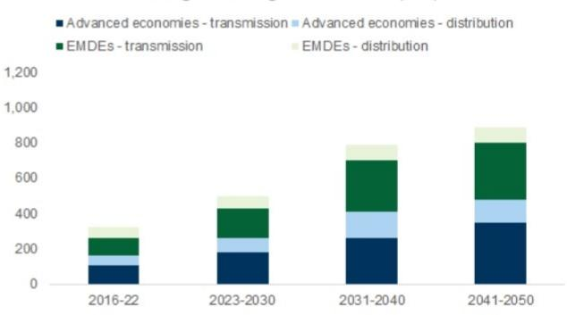

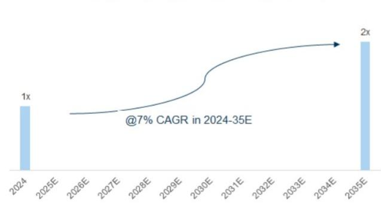
来源：IEA，西门子能源，日立能源

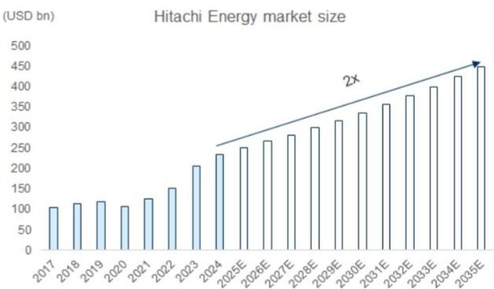

图4：我们预计华明海外有载分接开关收入（含直接和间接出口）占比将从2026E年的约41%提升至2030E年的约59%，而国内市场增速与行业水平相当
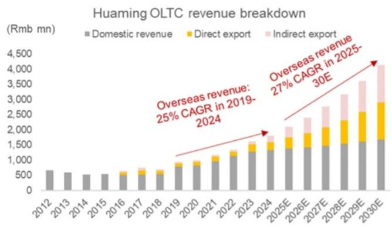
来源：公司数据，GS全球研究

图5：……截至2026E年，其在中国国内市场的份额按数量/价值计分别约为90%/35%
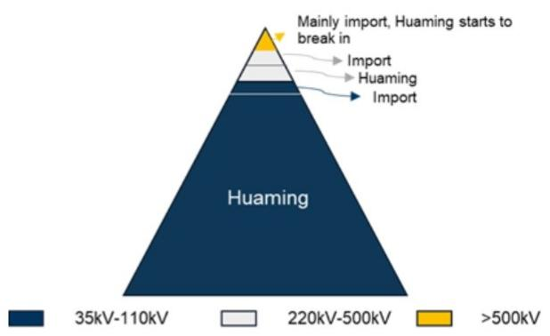
来源：公司数据

图6：我们预计在双头垄断市场中，全球市场份额将从2026E年的约13%提升至2030E年的约16%，与德国私营公司MR竞争
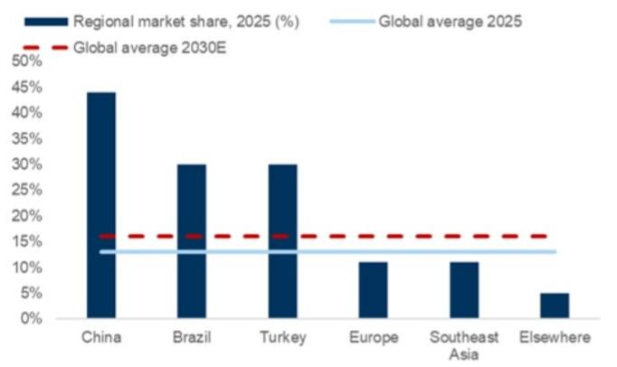
来源：公司数据，GS全球研究

图7：……驱动力包括产品质量相当、交付周期更短以及有竞争力的定价
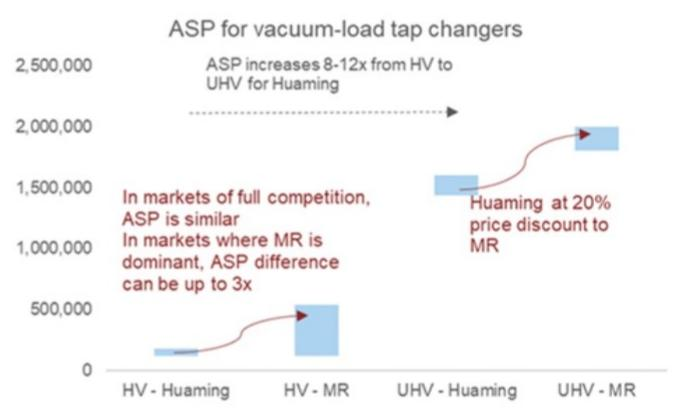
来源：GS全球研究

估值：我们采用2028E年估值框架（不变），与我们对AI基础设施公司的研究方法一致。对于华明，我们给予22倍2028E年目标估值倍数，大致与国内工业科技板块长期每股盈利增长对目标价隐含2028E年估值倍数的行业回归线，以及全球设备可比公司长期每股盈利增长对目标价隐含2026E年估值倍数的行业回归线一致。我们认为，鉴于其优异的盈利质量、国内领先地位和强劲的现金转化能力，华明应享有估值溢价（相对于2028-30E年约17%的每股盈利复合年增长率）。其ROE和CROCI均处于我们覆盖范围的第一四分位。该公司还处于全球双头垄断市场，具有持久的进入壁垒，因为有载分接开关是关键任务组件，具有认证周期长、转换成本高和客户粘性强的特点。我们认为市场可能日益青睐估值合理的稳健增长公司。我们继续预计公司将维持约70%的股息支付率，对应当前股息率约3%。

图8：我们22倍2028E年目标估值倍数与长期每股盈利增长对2028E年目标价隐含估值倍数的行业回归线一致
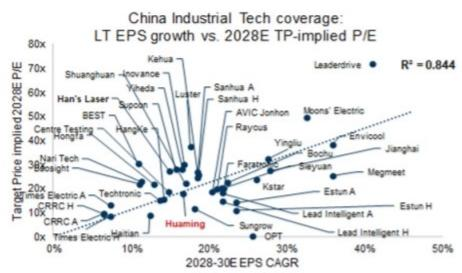
来源：公司数据，GS全球研究

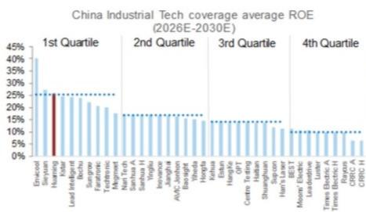

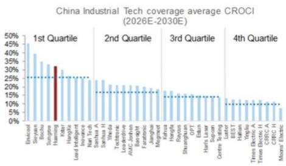
图9：我们22倍2028E年目标估值倍数与全球电网设备可比公司长期每股盈利增长对2026E年目标价隐含估值倍数的回归线一致，而华明相对于全球可比公司享有领先的EBITDA利润率水平和可比的ROE水平
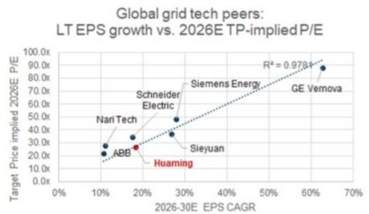
来源：公司数据，GS全球研究

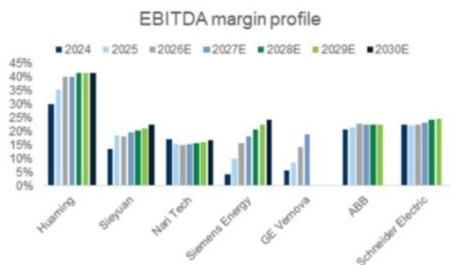

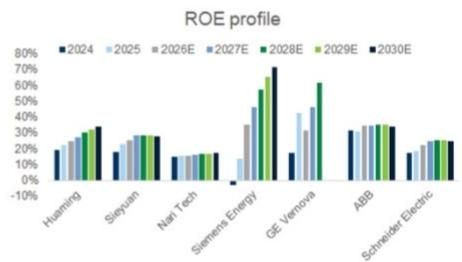

图10：华明财务摘要

<table><tr><td>利润表（百万元人民币）</td><td>2024</td><td>2025</td><td>2026E</td><td>2027E</td><td>2028E</td><td>2029E</td><td>2030E</td></tr><tr><td>总收入</td><td>2,322</td><td>2,427</td><td>2,615</td><td>3,001</td><td>3,419</td><td>3,881</td><td>4,426</td></tr><tr><td>营业成本</td><td>(1,189)</td><td>(1,104)</td><td>(1,151)</td><td>(1,311)</td><td>(1,479)</td><td>(1,666)</td><td>(1,883)</td></tr><tr><td>销售、一般及管理费用</td><td>(354)</td><td>(421)</td><td>(442)</td><td>(504)</td><td>(562)</td><td>(634)</td><td>(684)</td></tr><tr><td>研发费用</td><td>(81)</td><td>(88)</td><td>(92)</td><td>(105)</td><td>(120)</td><td>(136)</td><td>(155)</td></tr><tr><td>其他营业利润/（费用）</td><td>(31)</td><td>(32)</td><td>(35)</td><td>(36)</td><td>(41)</td><td>(47)</td><td>(53)</td></tr><tr><td>EBITDA</td><td>740</td><td>857</td><td>1,017</td><td>1,172</td><td>1,349</td><td>1,535</td><td>1,794</td></tr><tr><td>折旧与摊销</td><td>(72)</td><td>(76)</td><td>(121)</td><td>(127)</td><td>(132)</td><td>(137)</td><td>(142)</td></tr><tr><td>EBIT</td><td>668</td><td>781</td><td>896</td><td>1,046</td><td>1,217</td><td>1,398</td><td>1,652</td></tr><tr><td>利息收入</td><td>35</td><td>31</td><td>34</td><td>35</td><td>41</td><td>49</td><td>57</td></tr><tr><td>利息支出</td><td>(17)</td><td>(13)</td><td>(19)</td><td>(19)</td><td>(19)</td><td>(19)</td><td>(19)</td></tr><tr><td>未合并子公司收益/（亏损）</td><td>17</td><td>2</td><td>-</td><td>-</td><td>-</td><td>-</td><td>-</td></tr><tr><td>其他</td><td>24</td><td>48</td><td>7</td><td>8</td><td>9</td><td>10</td><td>12</td></tr><tr><td>税前利润</td><td>727</td><td>848</td><td>918</td><td>1,070</td><td>1,249</td><td>1,438</td><td>1,702</td></tr><tr><td>所得税</td><td>(107)</td><td>(129)</td><td>(124)</td><td>(145)</td><td>(169)</td><td>(195)</td><td>(232)</td></tr><tr><td>少数股东损益</td><td>(5)</td><td>(10)</td><td>(11)</td><td>(12)</td><td>(15)</td><td>(17)</td><td>(20)</td></tr><tr><td>优先股前净利润</td><td>614</td><td>710</td><td>784</td><td>912</td><td>1,065</td><td>1,226</td><td>1,450</td></tr><tr><td>优先股股息</td><td>-</td><td>-</td><td>-</td><td>-</td><td>-</td><td>-</td><td>-</td></tr><tr><td>净利润（扣除异常项目前）</td><td>614</td><td>710</td><td>784</td><td>912</td><td>1,065</td><td>1,226</td><td>1,450</td></tr><tr><td>税后异常项目</td><td>-</td><td>-</td><td>-</td><td>-</td><td>-</td><td>-</td><td>-</td></tr><tr><td>净利润</td><td>614</td><td>710</td><td>784</td><td>912</td><td>1,065</td><td>1,226</td><td>1,450</td></tr><tr><td>每股盈利（基本，扣除异常项目前）（元）</td><td>0.69</td><td>0.79</td><td>0.87</td><td>1.02</td><td>1.19</td><td>1.37</td><td>1.62</td></tr><tr><td>每股盈利（基本，扣除异常项目后）（元）</td><td>0.69</td><td>0.79</td><td>0.87</td><td>1.02</td><td>1.19</td><td>1.37</td><td>1.62</td></tr><tr><td>每股盈利（摊薄，扣除异常项目后）（元）</td><td>0.69</td><td>0.79</td><td>0.87</td><td>1.02</td><td>1.19</td><td>1.37</td><td>1.62</td></tr><tr><td>每股股息（元）</td><td>0.55</td><td>0.61</td><td>0.61</td><td>0.71</td><td>0.83</td><td>0.96</td><td>1.13</td></tr><tr><td>股息支付率（%）</td><td>79.66</td><td>77.01</td><td>70.00</td><td>70.00</td><td>70.00</td><td>70.00</td><td>70.00</td></tr></table>

<table><tr><td>资产负债表（百万元人民币）</td><td>2024</td><td>2025</td><td>2026E</td><td>2027E</td><td>2028E</td><td>2029E</td><td>2030E</td></tr><tr><td>现金及现金等价物</td><td>1,104</td><td>1,166</td><td>1,181</td><td>1,395</td><td>1,656</td><td>1,953</td><td>2,330</td></tr><tr><td>应收账款</td><td>730</td><td>679</td><td>860</td><td>987</td><td>1,124</td><td>1,276</td><td>1,455</td></tr><tr><td>存货</td><td>384</td><td>387</td><td>419</td><td>495</td><td>579</td><td>675</td><td>789</td></tr><tr><td>其他流动资产</td><td>798</td><td>1,042</td><td>1,147</td><td>1,261</td><td>1,388</td><td>1,526</td><td>1,679</td></tr><tr><td>流动资产合计</td><td>3,015</td><td>3,274</td><td>3,607</td><td>4,138</td><td>4,746</td><td>5,430</td><td>6,253</td></tr><tr><td>固定资产净额</td><td>919</td><td>1,149</td><td>1,121</td><td>1,088</td><td>1,050</td><td>1,008</td><td>960</td></tr><tr><td>无形资产净额</td><td>253</td><td>253</td><td>245</td><td>236</td><td>226</td><td>217</td><td>207</td></tr><tr><td>总投资</td><td>31</td><td>25</td><td>25</td><td>25</td><td>25</td><td>25</td><td>25</td></tr><tr><td>其他长期资产</td><td>239</td><td>508</td><td>508</td><td>508</td><td>508</td><td>508</td><td>508</td></tr><tr><td>资产总计</td><td>4,458</td><td>5,208</td><td>5,505</td><td>5,994</td><td>6,556</td><td>7,187</td><td>7,953</td></tr><tr><td colspan="8"></td></tr><tr><td>应付账款</td><td>518</td><td>613</td><td>639</td><td>727</td><td>821</td><td>925</td><td>1,045</td></tr><tr><td>短期借款</td><td>281</td><td>326</td><td>326</td><td>326</td><td>326</td><td>326</td><td>326</td></tr><tr><td>其他流动负债</td><td>193</td><td>142</td><td>144</td><td>234</td><td>341</td><td>453</td><td>611</td></tr><tr><td>流动负债合计</td><td>992</td><td>1,081</td><td>1,109</td><td>1,288</td><td>1,488</td><td>1,704</td><td>1,982</td></tr><tr><td>长期债务</td><td>220</td><td>393</td><td>393</td><td>393</td><td>393</td><td>393</td><td>393</td></tr><tr><td>其他长期负债</td><td>53</td><td>226</td><td>249</td><td>273</td><td>301</td><td>331</td><td>364</td></tr><tr><td>长期负债合计</td><td>284</td><td>955</td><td>978</td><td>1,002</td><td>1,030</td><td>1,060</td><td>1,093</td></tr><tr><td>负债合计</td><td>1,276</td><td>2,036</td><td>2,087</td><td>2,290</td><td>2,517</td><td>2,764</td><td>3,075</td></tr><tr><td colspan="8"></td></tr><tr><td>优先股</td><td>-</td><td>-</td><td>-</td><td>-</td><td>-</td><td>-</td><td>-</td></tr><tr><td>普通股权益合计</td><td>3,166</td><td>3,142</td><td>3,377</td><td>3,651</td><td>3,970</td><td>4,338</td><td>4,773</td></tr><tr><td>少数股东权益</td><td>16</td><td>30</td><td>41</td><td>53</td><td>68</td><td>85</td><td>105</td></tr><tr><td>负债及权益总计</td><td>4,458</td><td>5,208</td><td>5,505</td><td>5,994</td><td>6,556</td><td>7,187</td><td>7,953</td></tr><tr><td>每股账面价值</td><td>3.56</td><td>3.51</td><td>3.77</td><td>4.07</td><td>4.43</td><td>4.84</td><td>5.33</td></tr></table>

<table><tr><td>现金流量表（百万元人民币）</td><td>2024</td><td>2025</td><td>2026E</td><td>2027E</td><td>2028E</td><td>2029E</td><td>2030E</td></tr><tr><td>优先股前净利润</td><td>614</td><td>710</td><td>784</td><td>912</td><td>1,065</td><td>1,226</td><td>1,450</td></tr><tr><td>加回折旧与摊销</td><td>72</td><td>76</td><td>121</td><td>127</td><td>132</td><td>137</td><td>142</td></tr><tr><td>加回少数股东权益</td><td>5</td><td>10</td><td>11</td><td>12</td><td>15</td><td>17</td><td>20</td></tr><tr><td>营运资本净变动</td><td>159</td><td>(294)</td><td>(187)</td><td>(115)</td><td>(128)</td><td>(144)</td><td>(173)</td></tr><tr><td>其他经营活动现金流</td><td>38</td><td>102</td><td>(82)</td><td>(90)</td><td>(99)</td><td>(109)</td><td>(120)</td></tr><tr><td>经营活动现金流</td><td>889</td><td>604</td><td>647</td><td>847</td><td>985</td><td>1,127</td><td>1,320</td></tr><tr><td>资本支出</td><td>(114)</td><td>(112)</td><td>(118)</td><td>(124)</td><td>(130)</td><td>(136)</td><td>(143)</td></tr><tr><td>收购</td><td>-</td><td>-</td><td>-</td><td>-</td><td>-</td><td>-</td><td>-</td></tr><tr><td>处置</td><td>57</td><td>151</td><td>-</td><td>-</td><td>-</td><td>-</td><td>-</td></tr><tr><td>其他</td><td>-</td><td>12</td><td>(5)</td><td>(5)</td><td>(5)</td><td>(5)</td><td>(5)</td></tr><tr><td>投资活动现金流</td><td>(57)</td><td>51</td><td>(85)</td><td>(85)</td><td>(85)</td><td>(85)</td><td>(85)</td></tr><tr><td>已付股息（普通股及优先股）</td><td>(744)</td><td>(616)</td><td>(547)</td><td>(549)</td><td>(639)</td><td>(745)</td><td>(858)</td></tr><tr><td>债务增加/（减少）</td><td>149</td><td>193</td><td>-</td><td>-</td><td>-</td><td>-</td><td>-</td></tr><tr><td>普通股发行/（回购）</td><td>-</td><td>-</td><td>-</td><td>-</td><td>-</td><td>-</td><td>-</td></tr><tr><td>其他融资现金流</td><td>(125)</td><td>(169)</td><td>-</td><td>-</td><td>-</td><td>-</td><td>-</td></tr><tr><td>融资活动现金流</td><td>(720)</td><td>(593)</td><td>(547)</td><td>(549)</td><td>(639)</td><td>(745)</td><td>(858)</td></tr><tr><td>现金净流量</td><td>112</td><td>62</td><td>15</td><td>214</td><td>261</td><td>297</td><td>377</td></tr></table>

来源：公司数据，GS全球研究

<table><tr><td>比率</td><td>2024</td><td>2025</td><td>2026E</td><td>2027E</td><td>2028E</td><td>2029E</td><td>2030E</td></tr><tr><td>ROE（%）</td><td>18.9</td><td>22.5</td><td>24.0</td><td>26.0</td><td>27.9</td><td>29.5</td><td>31.8</td></tr><tr><td>ROA（%）</td><td>13.7</td><td>14.7</td><td>14.6</td><td>15.9</td><td>17.0</td><td>17.8</td><td>19.2</td></tr><tr><td>现金转换天数</td><td>67.0</td><td>46.3</td><td>36.7</td><td>49.3</td><td>54.2</td><td>59.0</td><td>63.6</td></tr><tr><td>存货周转天数</td><td>115.0</td><td>127.3</td><td>127.8</td><td>127.3</td><td>132.6</td><td>137.4</td><td>141.9</td></tr><tr><td>应收账款周转天数</td><td>109.2</td><td>105.9</td><td>107.4</td><td>112.3</td><td>112.7</td><td>112.9</td><td>112.6</td></tr><tr><td>应付账款周转天数</td><td>157.1</td><td>187.0</td><td>198.5</td><td>190.3</td><td>191.1</td><td>191.2</td><td>191.0</td></tr><tr><td>净债务/权益（%）</td><td>(18.9)</td><td>(14.1)</td><td>(13.5)</td><td>(18.2)</td><td>(23.2)</td><td>(27.9)</td><td>(33.0)</td></tr><tr><td>利息覆盖倍数 - EBIT（倍）</td><td>38.7</td><td>58.1</td><td>47.9</td><td>56.0</td><td>65.2</td><td>74.8</td><td>88.4</td></tr></table>

<table><tr><td>增长与利润率（%）</td><td>2024</td><td>2025E</td><td>2026E</td><td>2027E</td><td>2028E</td><td>2029E</td><td>2030E</td></tr><tr><td>销售增长</td><td>18.4</td><td>4.5</td><td>7.8</td><td>14.8</td><td>13.9</td><td>13.5</td><td>14.1</td></tr><tr><td>EBITDA增长</td><td>16.3</td><td>15.8</td><td>18.8</td><td>15.2</td><td>15.1</td><td>13.7</td><td>16.9</td></tr><tr><td>EBIT增长</td><td>17.9</td><td>16.9</td><td>14.7</td><td>16.7</td><td>16.4</td><td>14.8</td><td>18.2</td></tr><tr><td>净利润增长</td><td>13.3</td><td>15.5</td><td>10.4</td><td>16.4</td><td>16.7</td><td>15.1</td><td>18.3</td></tr><tr><td>每股盈利增长</td><td>13.1</td><td>14.8</td><td>10.4</td><td>16.4</td><td>16.7</td><td>15.1</td><td>18.3</td></tr><tr><td>毛利率</td><td>48.8</td><td>54.5</td><td>56.0</td><td>56.3</td><td>56.8</td><td>57.1</td><td>57.5</td></tr><tr><td>EBITDA利润率</td><td>31.9</td><td>35.3</td><td>38.9</td><td>39.1</td><td>39.5</td><td>39.5</td><td>40.5</td></tr><tr><td>EBIT利润率</td><td>28.7</td><td>32.2</td><td>34.3</td><td>34.8</td><td>35.6</td><td>36.0</td><td>37.3</td></tr><tr><td>净利润率</td><td>26.5</td><td>29.2</td><td>30.0</td><td>30.4</td><td>31.1</td><td>31.6</td><td>32.8</td></tr></table>

估值方法：我们的12个月目标价23.9元基于22倍2028E年估值倍数，并以9.5%的权益成本折现至2027E年。

## 主要下行风险：

海外市场份额增长慢于预期：若客户认证时间延长、产品采用速度放缓，或来自现有全球供应商的竞争强于预期，海外扩张可能不及预期。

利润率表现弱于预期：由于更大的定价压力、不利的产品或地区组合，或与海外扩张相关的成本上升，利润率可能低于我们的预测。

国内收入增长弱于预期：若电网投资放缓、非电网需求持续疲弱，或华明已较高的市场份额限制其超越行业增速的能力，国内收入可能不及预期。

<table><tr><td>002270.SZ</td><td>12个月目标价：23.9元</td><td colspan="2">报价：17.93元</td><td colspan="2">上行空间：33.3%</td></tr><tr><td rowspan="2">评级：正面</td><td>GS预测</td><td></td><td></td><td></td><td></td></tr><tr><td></td><td>12/25</td><td>12/26E</td><td>12/27E</td><td>12/28E</td></tr><tr><td>市值：159亿元 / 24亿美元</td><td>收入（百万元人民币）新</td><td>2,426.8</td><td>2,615.0</td><td>3,001.4</td><td>3,419.1</td></tr><tr><td>企业价值：155亿元 / 23亿美元</td><td>收入（百万元人民币）旧</td><td>2,426.8</td><td>2,615.0</td><td>3,001.4</td><td>3,419.1</td></tr><tr><td>3个月日均交易量：4.784亿元 / 7,040万美元</td><td>EBITDA（百万元人民币）</td><td>856.6</td><td>1,017.3</td><td>1,172.3</td><td>1,349.3</td></tr><tr><td>中国</td><td>每股盈利（元）新</td><td>0.79</td><td>0.87</td><td>1.02</td><td>1.19</td></tr><tr><td rowspan="2">中国工业科技与机械</td><td>每股盈利（元）旧</td><td>0.79</td><td>0.87</td><td>1.02</td><td>1.19</td></tr><tr><td>市盈率（倍）</td><td>23.7</td><td>20.5</td><td>17.6</td><td>15.1</td></tr><tr><td>并购排名：3</td><td>市净率（倍）</td><td>5.4</td><td>4.8</td><td>4.4</td><td>4.0</td></tr><tr><td rowspan="4">租赁包含在净债务及企业价值中：是</td><td>股息率（%）</td><td>3.2</td><td>3.4</td><td>4.0</td><td>4.6</td></tr><tr><td>CROCI（%）</td><td>27.4</td><td>22.7</td><td>24.2</td><td>26.4</td></tr><tr><td></td><td>3/26</td><td>6/26E</td><td>9/26E</td><td>12/26E</td></tr><tr><td>每股盈利（元）</td><td>0.72</td><td>0.84</td><td>0.96</td><td>0.93</td></tr></table>

来源：公司数据，GS预测，FactSet。报价截至2026年7月21日收盘。

## 研究观点、估值方法与风险

研究观点：华明是中国有载分接开关的领先供应商，按
