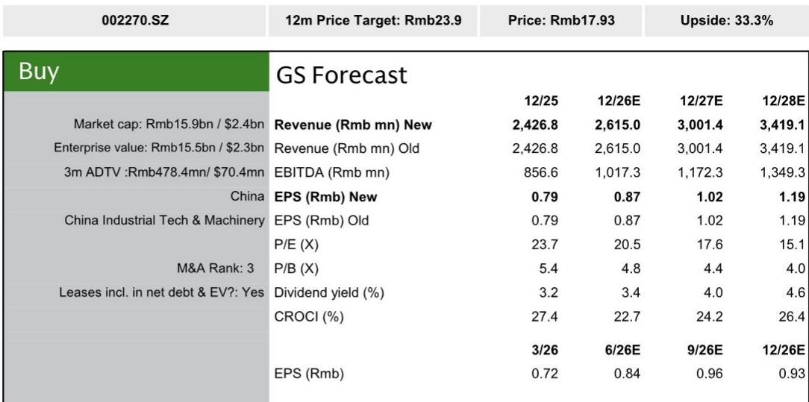
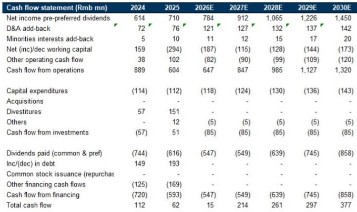

# 华明：全球电网升级周期中的防御型成长机会

华明（002270.SZ）自2026年初以来，报价从高点回落约36%，期间最大回撤约52%，幅度超过同行思源和英利。这一调整源于市场对AI相关基础设施投入的重新评估，导致高贝塔类标的普遍承压。但此次调整掩盖了一个关键区别：华明的核心成长动力并非来自AI驱动的数据中心需求，而是源于持续数十年的全球电网升级周期——老旧基础设施替换、可再生能源并网以及海外市场份额提升。这些因素预计将推动公司2026年至2030年净利润复合年增长率约17%。以未来12个月预期市盈率约18.1倍计算，略低于2015年以来20.3倍的历史均值，该标的当前呈现防御型成长特征。市场此前将其错误定价为AI相关标的，而公司的真正竞争优势在于其他领域。

此次调整并未改变公司盈利轨迹。华明的有载分接开关是电力变压器中的关键组件，并非需求波动剧烈的普通商品。公司在中国市场占据约90%的销量份额和35%的金额份额，形成了稳定的收入基础。其成长故事的核心是在这一优势基础上进行国际化拓展，而非追逐下一个AI驱动的电力短缺主题。由于有载分接开关不存在供应短缺问题——与其他电网组件不同——华明与美国电力短缺叙事的关联度始终有限。市场的错误在于将报价定价为这种关联度具有实质性影响。此次调整纠正了这一错误，并将预期重置到更可持续的基础上。

根据西门子能源和日立能源的预测，2024年至2035年全球电网投资预计将以约7%的复合年增长率增长。驱动因素具有结构性和非周期性特征：需要替换的老化基础设施、可变可再生能源的并网以及终端用电部门的电气化。数据中心建设是其中一个贡献因素，但远非主导力量。对华明而言，成长机会因其在全球双头垄断格局中与MR公司的竞争地位而放大。公司产品质量与MR相当，交货周期更短，定价更具竞争力。这些优势预计将推动华明全球市场份额从2026年的约13%提升至2030年的约16%，同期有载分接开关业务中出口占比将从41%上升至59%。

财务数据支撑这一判断。预计2026年至2030年收入复合年增长率约14%，由销量增长和市场份额扩张驱动。更重要的是，海外业务（毛利率比国内业务高5至10个百分点）占比提升，将推动综合毛利率从2026年的约56%提升至2030年的约57.5%。这一毛利率扩张，结合经营杠杆效应，将转化为同期净利润复合年增长率约17%。盈利质量得到强劲现金转化能力的支撑：净资产回报表现预计从2026年的约24%上升至2030年的约31.8%，公司维持约70%的派息率，当前股息率约3%。这些指标使华明在覆盖标的中，净资产回报表现和现金回报率均处于第一梯队。

## 报价52%的最大回撤是对AI相关度的错误定价，而非基本面恶化

华明调整幅度相对于同行的差异，是此次调整具有无差别特征的首要线索。思源和英利与美国电力基础设施和数据中心需求的关联度更高，调整幅度反而较小。华明因关联性而被拖累，尽管其有载分接开关业务不存在供应短缺问题，且来自AI相关需求的收入微乎其微。市场对AI基础设施投入可见性的担忧——源于对大型科技公司支出可能放缓的忧虑——本不应适用于一家成长动力锚定于电网现代化、可再生能源并网以及从现有主导者手中夺取市场份额的公司。自2026年初以来约36%的跌幅，已将远期市盈率拉低至18.1倍，低于20.3倍的历史均值，而每股收益增长预期（复合年增长率17%）并未改变。报价与盈利轨迹之间的这种背离，正是重新定价机会的定义。

## 华明的海外成长由全球电网投资结构性驱动，不依赖AI数据中心需求

全球电网投资前景强劲且持续数十年。发达市场的老化基础设施需要替换：欧洲和北美的大部分输配电网络建于1960年代和1970年代，已接近运营寿命终点。可再生能源并网增加了另一层需求，因为风能和太阳能发电场需要电网连接和平衡基础设施。这些驱动因素与AI数据中心建设的节奏无关。华明的出口增长直接取决于其在双头垄断市场中从MR手中夺取份额的能力。公司的优势——同等质量、更短交货周期和价格竞争力——具有结构性和可持续性。它们不取决于AI相关投入明年增长20%还是10%。到2030年出口占比从41%提升至59%的预测，是基于这些竞争动态的保守估计，而非基于任何关于AI驱动需求加速的假设。

## 盈利复合增长逻辑因海外业务占比提升带来的毛利率扩张和经营杠杆而强化

收入复合年增长率14%已属稳健，但盈利增长17%更为突出，原因在于毛利率扩张。海外毛利率比国内高5至10个百分点。随着出口占比上升，综合毛利率从2026年的约56%提升至2030年的约57.5%。这看似温和改善，但以华明的规模，每提升50个基点毛利率，对净利润增长的贡献都相当可观。经营杠杆进一步放大效果：销售、管理及研发费用增速低于收入，折旧基本固定。结果是息税折旧摊销前利润率从2026年的约38.9%提升至2030年的约40.5%，净利润率从约30%扩张至约32.8%。盈利复合增长模型依然完整，甚至可能被关注收入增速而非盈利扩张质量的市场所低估。

## 决策框架：华明提供估值折价的防御型复合增长机会，而非高贝塔AI交易

对于在AI相关估值已变得二元化和情绪驱动的市场中寻找机会的机构读者而言，华明提供了一个独特的替代选择。决策框架如下：第一，评估成长驱动因素——电网投资具有结构性而非周期性特征，华明的市场份额增长基于持久的竞争优势。第二，评估盈利质量——净资产回报表现超过24%且持续上升，现金转化能力强，派息率约70%，净负债权益比持续为负（从2026年的约-13.5%降至2030年的约-33%），表明是自我融资的增长模式。第三，比较估值与基本面——以18.1倍远期市盈率对应17%的每股收益复合年增长率，市盈率与盈利增长比率约1.1倍，低于具有类似盈利质量的复合增长型标的的行业均值。第四，考虑下行保护——报价已回调约36%，国内业务提供稳定基础，约3%的股息率构成底部支撑。风险在于海外市场份额增长可能慢于预期，但当前估值已包含保守假设。将华明视为具有估值折价的复合增长型标的、而非AI贝塔交易的读者，会发现风险回报比具有不对称优势。

*仅供参考。部分内容可能基于源材料通过AI辅助生成、翻译、总结或编辑，可能存在遗漏或错误。请独立核实。本文不构成任何专业建议。*

仅供参考。部分内容可能基于源材料通过AI辅助生成、翻译、总结或编辑，可能存在遗漏或错误。请独立核实。本文不构成任何专业建议。

