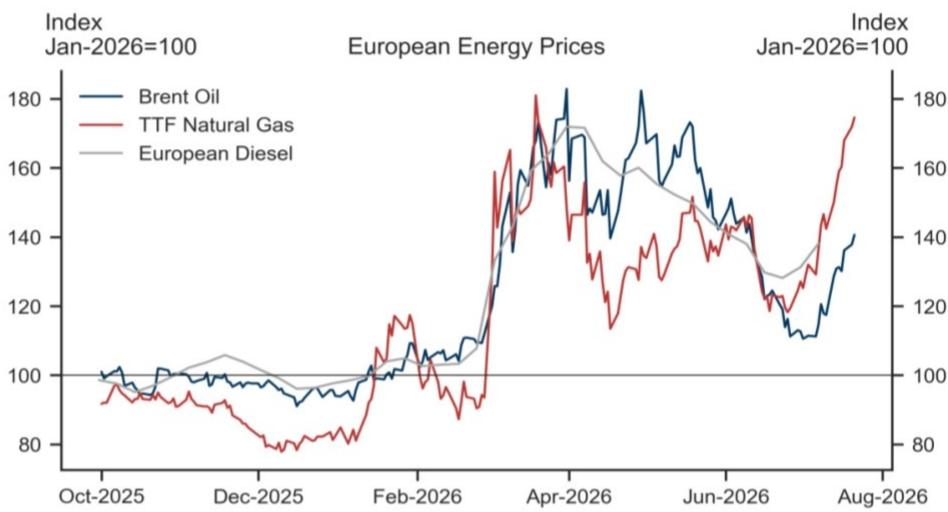
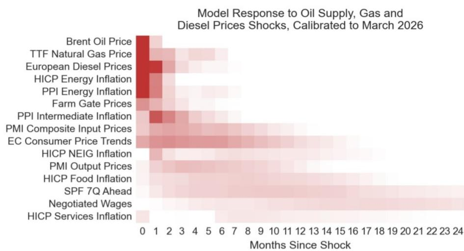
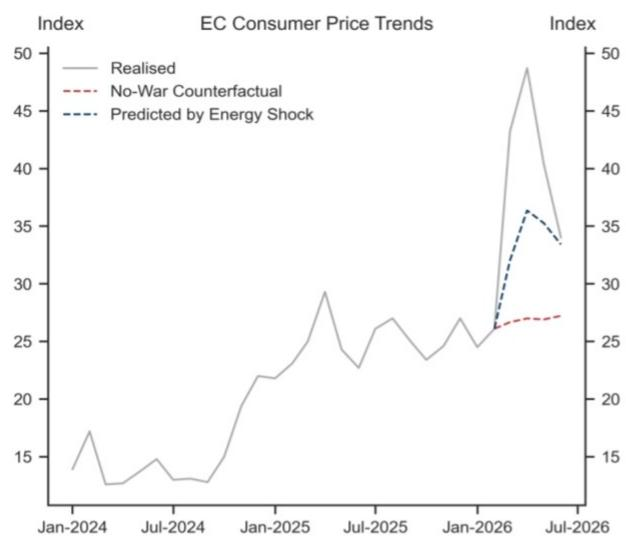
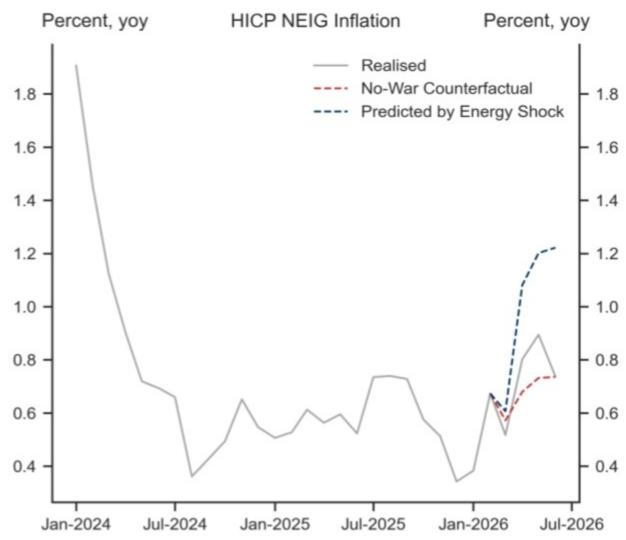
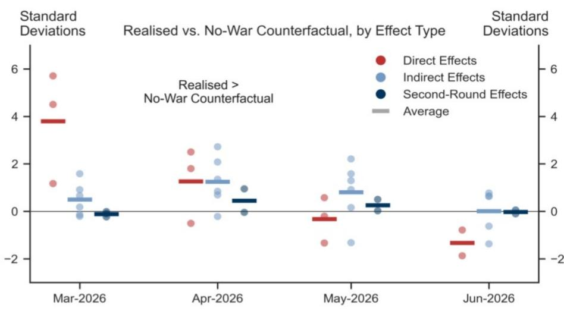
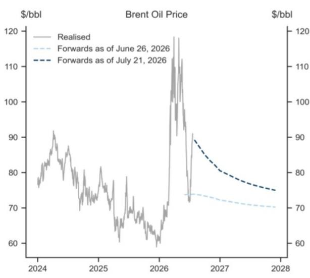
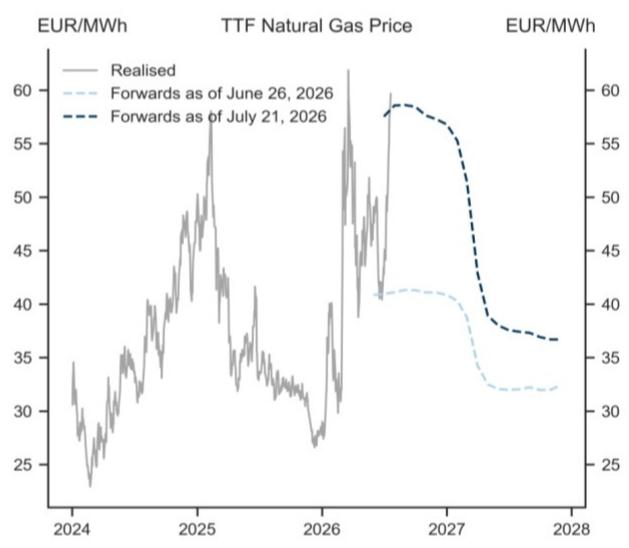

# 欧洲宏观研究观察

# 欧元区——能源价格上涨影响近期价格数据进展

欧元区价格走势的前景受到多重因素影响。一方面，近期欧洲及全球的价格数据有所走弱，相关调查指标也开始降温。另一方面，中东地区局势变化及俄罗斯炼厂供应问题导致原油、成品油和天然气价格出现明显上涨。

Alexandre Stott
+33(1)4212-1108 |
alexandre.stott@gs.com
GS Bank Europe SE - Paris Branch

我们通过一个新的统计模型（贝叶斯向量自回归模型）来研究能源价格变动在价格传导链条上的影响。该模型同时考虑了19个变量，包括生产者价格指数、短期价格预期、消费者价格指数以及工资增长等。这一方法与包括欧洲央行在内的多家央行所使用的分析框架类似。

- 我们的模型确认，能源价格变动通常会对消费者和生产者能源价格产生即时和直接的影响。这些影响随后会逐步体现在成本指标、短期价格预期指标以及间接受到影响的消费者价格中，并可能最终对工资增长和长期价格预期产生第二轮影响。

我们的研究结果显示，直接效应在3月份非常显著，部分间接效应在4月份有所显现但在6月份消退，而整个过程中没有出现令人信服的第二轮效应迹象。

我们的估算表明，在价格数据相对温和且能源远期价格处于6月下旬低点时，价格水平原本可能低于欧洲央行工作人员预测的基准——整体价格低约0.4个百分点，核心价格低约0.2个百分点。然而，随后能源价格的上涨使我们的模型对价格峰值的预测重新回到了与工作人员基准一致的水平。因此，我们的分析表明，能源价格的再次上涨在很大程度上抵消了近期价格调查和价格数据所显示的进展。

因此，我们继续预计管理委员会将在9月会议上进行第二次加息。虽然我们的基准情形是欧洲央行此后维持利率不变，但如果能源价格持续高企导致价格前景发生变化，风险则倾向于进一步收紧。

## 欧元区——能源价格上涨影响近期价格数据进展

欧元区价格走势的前景受到多重因素影响。一方面，近期欧洲及全球的价格数据有所走弱，相关调查指标——如采购经理人指数和欧盟委员会的调查——开始降温。另一方面，中东地区局势变化及俄罗斯炼厂供应问题导致原油、成品油和天然气价格再次出现明显上涨（图表1）。

图表1：欧洲面临新的能源价格压力  
  
来源：GS全球投资研究，Haver Analytics

准确追踪价格传导链条中的压力是一项艰巨的任务。我们研究此类大型复杂数据集的首选方法是使用贝叶斯向量自回归（BVAR）模型。自回归结构允许变量之间存在丰富的动态关系，而贝叶斯估计方法则提高了结果的稳定性。

我们同时对图表2中列出的19个变量进行建模。这些变量要么与能源价格变动相关，要么是受直接、间接或第二轮效应影响的价格指标，要么作为宏观经济控制变量。大多数价格变量以季节性调整后的环比数据表示，观测期截至5月或6月。我们包含每个变量的六期滞后项，样本起始于2003年。

图表2：我们使用贝叶斯向量自回归模型同时对19个变量进行建模

<table><tr><td>变量</td><td>单位</td><td>季节性调整</td><td>最新观测</td><td>类别</td></tr><tr><td>全球石油产量</td><td>百分比，环比</td><td>否</td><td>7月</td><td>冲击</td></tr><tr><td>布伦特原油价格</td><td>百分比，环比</td><td>否</td><td>7月</td><td>冲击</td></tr><tr><td>TTF天然气价格</td><td>百分比，环比</td><td>否</td><td>7月</td><td>冲击</td></tr><tr><td>欧洲柴油价格</td><td>百分比，环比</td><td>否</td><td>7月</td><td>冲击</td></tr><tr><td>HICP能源</td><td>百分比，环比</td><td>是</td><td>6月</td><td>直接</td></tr><tr><td>PPI能源</td><td>百分比，环比</td><td>是</td><td>5月</td><td>直接</td></tr><tr><td>农场交货价格</td><td>百分比，环比</td><td>否</td><td>6月</td><td>间接</td></tr><tr><td>PPI中间品</td><td>百分比，环比</td><td>是</td><td>5月</td><td>间接</td></tr><tr><td>PMI综合投入价格</td><td>水平值</td><td>否</td><td>6月</td><td>间接</td></tr><tr><td>12个月消费者价格预期</td><td>水平值</td><td>否</td><td>6月</td><td>间接</td></tr><tr><td>HICP非能源工业品</td><td>百分比，环比</td><td>是</td><td>6月</td><td>间接</td></tr><tr><td>PMI综合产出价格</td><td>水平值</td><td>否</td><td>6月</td><td>间接</td></tr><tr><td>HICP食品</td><td>百分比，环比</td><td>否</td><td>6月</td><td>间接</td></tr><tr><td>7年平均价格预测</td><td>百分比，同比</td><td>否</td><td>Q2</td><td>第二轮</td></tr><tr><td>协议工资</td><td>百分比，同比</td><td>否</td><td>3月</td><td>第二轮</td></tr><tr><td>HICP服务</td><td>百分比，环比</td><td>是</td><td>6月</td><td>第二轮</td></tr><tr><td>PMI综合产出</td><td>指数</td><td>否</td><td>6月</td><td>控制</td></tr><tr><td>失业率缺口</td><td>百分点</td><td>否</td><td>5月</td><td>控制</td></tr><tr><td>全球供应链压力指数</td><td>指数</td><td>否</td><td>6月</td><td>控制</td></tr></table>

来源：GS全球投资研究

我们可以通过热力图（类似于欧洲央行首席经济学家莱恩在近期演讲中展示的图表）来直观展示我们的模型，该图显示了历史上价格指标对石油供应、天然气价格和柴油价格变动的平均响应强度和延迟时间（图表3）。变量从上到下按从最上游到最下游的顺序排列；自变动发生以来的时间从左到右增加；颜色渐变表示响应的强度。

我们的估算确认，能源价格变动对消费者和生产者能源价格具有即时和直接的影响。这些影响随后逐步体现在成本指标、短期价格预期指标以及间接受到影响的消费者价格中，并可能最终对工资增长和长期价格预期产生第二轮效应。

图表3：我们可以通过热力图直观展示模型  

热力图显示了2026年3月识别的石油供应冲击、天然气价格冲击和柴油价格冲击下价格指标的标准化响应。我们使用石油产量和石油价格的符号限制来识别石油供应冲击，对天然气价格和柴油价格冲击使用零符号限制。响应达到或超过一个标准差的以最深红色显示，零和负响应以白色显示。

## 来源：GS全球投资研究

接下来，我们使用模型来探究，如果没有中东局势变化（通过模型在3月之前的预测获得），以及如果价格变量按照其历史行为对石油产量以及石油、天然气和柴油价格的实际变化做出响应，价格变量将如何演变。

我们发现，一些价格调查指标（如欧盟委员会衡量的短期价格预期）最初的反应比往常更强烈，但自6月以来已回归到与模型预测一致的水平（图表4，左图）。相比之下，我们的模型表明，非能源工业品（或核心商品）价格变动的响应迄今为止比过去更为温和，且看起来已不再与无局势变化的反事实情形有显著差异（图表4，右图）。

图表4：核心商品价格对能源价格上涨的响应比往常更为温和

  
无局势变化的反事实情形是使用截至2026年2月的实际数据进行的模型无条件预测。能源冲击预测路径是模型基于2026年3月至6月期间石油产量、石油价格、天然气价格和柴油价格的实际数据进行的条件预测。  
来源：GS全球投资研究，Haver Analytics

实际数据与模型无局势变化反事实情形之间的差异，可以解释为直接效应、间接效应或第二轮效应的强度衡量，具体取决于所考虑的变量。我们对每个变量的这一差异进行标准化处理，并将数值以点的形式绘制在3月至6月之间，虚线表示按效应类型划分的平均值（图表5）。

我们的结果显示，直接效应在3月份非常显著，部分间接效应在4月份有所显现但在6月份消退，而整个过程中没有出现令人信服的第二轮效应迹象。

当然，模型本身会表明，在这个阶段检测到第二轮效应的迹象还为时过早。但以工资增长为例，欧洲央行SAFE调查中中小企业报告的一年期工资增长预期下降，与迄今为止没有出现第二轮效应的情况是一致的。

图表5：我们的模型发现迄今为止没有令人信服的第二轮效应迹象  
  
来源：GS全球投资研究

最后，我们使用模型来量化能源价格上涨对价格前景的影响。为此，我们首先以能源远期价格处于6月下旬低点（图表6中的浅蓝色虚线）为条件进行模型预测，然后以能源远期价格处于当前水平（深蓝色）重复这一练习。

图表6：我们以能源远期价格处于6月下旬低点和当前水平为条件进行模型预测  

  
来源：GS全球投资研究汇编数据，Haver Analytics

整体和核心价格的结果如图表7所示，并附有6月欧洲央行工作人员预测作为比较。最初，在价格数据相对温和且能源远期价格处于低点时，价格水平原本可能低于欧洲央行工作人员预测的基准——整体价格低约0.4个百分点，核心价格低约0.2个百分点。然而，随后能源价格的上涨使我们的模型对价格峰值的预测重新回到了与工作人员基准一致的水平。

## 图表7：能源价格上涨使我们的模型预测重新与欧洲央行工作人员预测一致

  
条件预测使用2026年7月和8月至2027年底的石油和天然气价格远期，而石油产量和柴油价格则按模型演变。  
来源：GS全球投资研究，Haver Analytics，欧洲央行

因此，我们的分析表明，能源价格的再次上涨在很大程度上抵消了近期价格调查和价格数据所显示的进展。因此，我们继续预计管理委员会将在9月会议上进行第二次加息。虽然我们的基准情形是欧洲央行此后维持利率不变，但如果能源价格持续高企导致价格前景发生变化，风险则倾向于进一步收紧。

## Alexandre Stott

## 欧洲宏观研究团队

Sven Jari Stehn  
+44(20)7774-8061  
jari.stehn@gs.com  
GS International

## James Moberly

+44(20)7774-9444

james.r.moberly@gs.com

GS International

## Giovanni Pierdomenico

+44(20)7051-6807

giovanni.pierdomenico@gs.com

GS International

Filippo Taddei  
+44(20)7774-5458  
filippo.taddei@gs.com  
GS International

Niklas Garnadt
+49(69)7532-1537
niklas.garnadt@gs.com
GS Bank Europe SE

Alexandre Stott  
+33(1)4212-1108  
alexandre.stott@gs.com  
GS Bank Europe SE - Paris Branch

Katya Vashkinskaya +44(20)7774-4833  
katya.vashkinskaya@gs.com  
GS International

## 披露附录

## Reg AC

本人Alexandre Stott特此证明，本报告中表达的所有观点均准确反映本人的个人观点，且未受公司业务或客户关系考虑的影响。

除非另有说明，本报告封面所列人员均为GS全球投资研究部门分析师。

撰稿人：Alexandre Stott GS Bank Europe SE - Paris Branch。

除非另有说明，本报告撰稿人披露中列出的个人均为GS全球投资研究部门分析师。

## 披露信息

## 监管披露

## 美国法律法规要求的披露

请参见上述针对本报告提及公司的具体监管披露，了解以下任何要求的披露：待定交易中的主承销商或联合主承销商；1%或以上的持股；特定服务的报酬；客户关系类型；前期公开发行的管理/联合管理；董事职位；对于股权证券，做市和/或专家角色。GS可能作为本报告讨论的发行人债务证券（或相关衍生品）的自营交易商进行交易或可能进行交易。

以下是额外要求的披露：持股和重大利益冲突：GS政策禁止其分析师、向分析师汇报的专业人员及其家庭成员持有分析师覆盖范围内任何公司的证券。分析师薪酬：分析师的薪酬部分基于GS的盈利能力，其中包括投资银行收入。分析师作为高管或董事：GS政策通常禁止其分析师、向分析师汇报的人员或其家庭成员在分析师覆盖范围内的任何公司担任高管、董事或顾问。非美国分析师：非美国分析师可能不是GS & Co. LLC的关联人员，因此可能不受FINRA规则2241或FINRA规则2242关于与主题公司沟通、公开露面以及交易分析师所覆盖证券的限制。

## 美国以外司法管辖区法律法规要求的额外披露

以下为指定司法管辖区要求的披露，除非已根据美国法律法规在上文作出。澳大利亚：GS Australia Pty Ltd及其关联公司不是澳大利亚《1959年银行法》（联邦）定义的授权存款机构，不在澳大利亚提供银行服务或开展银行业务。除非GS另有约定，本研究及其访问权限仅面向澳大利亚《公司法》定义的"批发客户"。在编制研究报告时，GS Australia全球投资研究部门的成员可能会参加作为其研究报告对象的公司和其他实体主办或组织的实地考察和其他会议。在某些情况下，如果GS Australia认为在实地考察或会议的具体情况下适当且合理，此类实地考察或会议的费用可能部分或全部由相关发行人承担。如果本文件内容包含任何金融产品建议，则仅为一般性建议，由GS在未考虑客户的目标、财务状况或需求的情况下编制。客户在根据任何此类建议采取行动前，应考虑该建议是否适合其自身的目标、财务状况和需求。某些GS Australia和New Zealand的利益披露声明以及GS澳大利亚卖方研究独立性政策声明的副本可在以下网址获取：https://www.goldmansachs.com/disclosures/australia-new-zealand/index.html。巴西：有关CVM第20号决议的披露信息可在https://www.gs.com/worldwide/brazil/area/gir/index.html获取。在适用情况下，根据CVM第20号决议第20条定义，对本研究报告内容负主要责任的巴西注册分析师为本报告开头指定的第一作者，除非文末另有说明。加拿大：此信息仅供您参考，在任何情况下均不应被解释为GS & Co. LLC为在加拿大购买证券而向加拿大证券购买者发布的广告、要约或招揽。GS & Co. LLC未在加拿大任何司法管辖区根据适用的加拿大证券法注册为交易商，通常不被允许交易加拿大证券，并可能被禁止在加拿大某些司法管辖区出售某些证券和产品。如果您希望在加拿大交易任何加拿大证券或其他产品，请联系GS Canada Inc.（GS集团公司的关联公司）或其他注册的加拿大交易商。香港：有关本研究中提及的覆盖公司证券的进一步信息，可向GS (Asia) L.L.C.索取。印度：有关本研究中提及的主题公司或公司的进一步信息，可从GS (India) Securities Private Limited获取，研究分析师 - SEBI注册号INH000001493，地址：10th Floor, Ascent-Worli, Sudam Kalu Ahire Marg, Worli, Mumbai-400 025, India，公司识别号U74140MH2006FTC160634，电话+91 22 6616 9000，传真+91 22 6616 9001。GS可能实益持有本研究报告提及的主题公司或公司1%或以上的证券（该术语定义见印度1956年《证券合同（监管）法》第2(h)条）。SEBI的注册和NISM的认证绝不保证中介机构的业绩，也不向读者提供任何回报保证。GS (India) Securities Private Limited的合规官和读者投诉联系详情、年度合规审计报告副本以及其他相关信息和披露可在以下链接找到：

https://www.goldmansachs.com/worldwide/india/research-analyst。日本：见下文。韩国：除非GS另有约定，本研究及其访问权限仅面向《金融服务和资本市场法》定义的"专业读者"。有关本研究中提及的主题公司或公司的进一步信息，可从GS (Asia) L.L.C.首尔分行获取。新西兰：GS New Zealand Limited及其关联公司不是新西兰《1989年新西兰储备银行法》定义的"注册银行"或"存款接受机构"。除非GS另有约定，本研究及其访问权限面向《2008年金融顾问法》定义的"批发客户"。某些GS Australia和New Zealand的利益披露声明副本可在以下网址获取：https://www.goldmansachs.com/disclosures/australia-new-zealand/index.html。俄罗斯：在俄罗斯联邦分发的研究报告不属于俄罗斯法律定义的广告，而是以产品推广为主要目的的信息和分析，不提供俄罗斯评估活动法律意义上的评估。研究报告不构成俄罗斯法律法规定义的个人化研究交流，不针对特定客户，且未分析客户的财务状况、投资概况或风险概况。GS不对客户或任何其他人基于本研究报告可能做出的任何投资决策承担责任。新加坡：GS (Singapore) Pte.（公司编号：198602165W）受新加坡金融管理局监管，接受对本研究的法律责任，如有任何与本研究报告相关的事宜，应联系该公司。台湾：此材料仅供参考，未经许可不得转载。读者应仔细考虑自身的投资风险。投资结果由个人读者自行负责。英国：在英国被归类为金融行为监管局规则定义的零售客户的个人，应结合先前GS关于本报告所涉覆盖公司的研究报告阅读本报告，并应参考GS International已发送给他们的风险警告。这些风险警告的副本以及本报告中使用的某些金融术语的词汇表，可向GS International索取。

欧盟和英国：有关欧盟委员会授权条例(EU) 2016/958第6(2)条（包括该授权条例在英国脱离欧盟和欧洲经济区后转化为英国国内法律和法规的部分）关于研究交流或建议投资策略的其他信息客观呈现的技术安排以及特定利益或利益冲突迹象披露的技术标准的披露信息，可在https://www.gs.com/disclosures/europeanpolicy.html获取，其中说明了与投资研究相关的利益冲突管理欧洲政策。

日本：GS Japan Co., Ltd.是在关东财务局注册的金融工具交易商，注册号Kinsho 69，是日本证券业协会、日本金融期货协会、第二类金融工具交易商协会和日本投资管理协会的会员。股票买卖需支付与客户预先确定的佣金加消费税。有关日本证券交易所、日本证券业协会或日本证券金融公司要求的任何适用披露，请参见公司特定披露。

## 全球产品；分销实体

GS全球投资研究为GS客户在全球范围内制作和分发研究产品。GS全球各地办事处的分析师对行业和公司以及宏观经济、货币、大宗商品和投资组合策略进行研究。本研究在澳大利亚由GS Australia Pty Ltd（ABN 21 006 797 897）分发；在巴西由GS do Brasil Corretora de Títulos e Valores Mobiliários S.A.分发；GS巴西公共沟通渠道：0800 727 5764和/或contatogoldmanbrasil@gs.com。工作日（节假日除外），上午9点至下午6点。在加拿大由GS & Co. LLC分发；在香港由GS (Asia) L.L.C.分发；在印度由GS (India) Securities Private Ltd.分发；在日本由GS Japan Co., Ltd.分发；在韩国由GS (Asia) L.L.C.首尔分行分发；在新西兰由GS New Zealand Limited分发；在俄罗斯由OOO GS分发；在新加坡由GS (Singapore) Pte.（公司编号：198602165W）分发；在美国由GS & Co. LLC分发。GS International已批准本研究在英国的分发。

GS International（"GSI"）由审慎监管局（"PRA"）授权，受金融行为监管局（"FCA"）和PRA监管，已批准本研究在英国的分发。

欧洲经济区：GS Bank Europe SE（"GSBE"）是一家在德国注册的信贷机构，在单一监管机制下受欧洲央行直接审慎监管，并在其他方面受德国联邦金融监管局（BaFin）和德意志联邦银行监管，在欧洲经济区内分发研究。

## 一般披露

本研究仅面向我们的客户。除与GS相关的披露外，本研究基于我们认为可靠的当前公开信息，但我们不保证其准确或完整，也不应依赖于此。本文所含信息、观点、估计和预测截至本文日期，如有变更，恕不另行通知。我们力求适时更新我们的研究，但各种法规可能阻止我们这样做。除某些定期发布的行业报告外，大部分报告根据分析师的判断不定期发布。

GS开展全球全方位服务、综合性的投资银行、投资管理和经纪业务。我们与全球投资研究覆盖的相当大比例的公司存在投资银行和其他业务关系。GS & Co. LLC是美国经纪交易商，是SIPC成员（https://www.sipc.org）。

我们的销售人员、交易员和其他专业人员可能会向我们的客户和自营交易部门提供口头或书面的市场评论或交易策略，这些评论或策略可能反映与本研究中表达的观点相反的意见。我们的资产管理部、自营交易部门和投资业务可能做出与本研究中表达的建议或观点不一致的投资决策。

除非法规或GS政策禁止，我们及我们的关联公司、高级职员、董事和员工可能不时持有本研究中提及的证券或衍生品（如有）的多头或空头头寸，作为自营交易商进行交易，并买卖这些证券或衍生品。

在GS组织的会议上第三方演讲者所持观点，包括来自GS其他部门的个人，不一定反映全球投资研究的观点，也不是GS的官方观点。

本文引用的任何第三方，包括任何销售人员、交易员和其他专业人员或其家庭成员，可能持有与本文指定分析师表达的观点不一致的所提及产品的头寸。

本研究侧重于跨市场、行业和板块的投资主题。它不试图区分我们描述的任何行业或板块内单个公司的前景或表现，也不提供对单个公司的分析。

本研究中与股权或信用证券或行业或板块内证券相关的任何交易建议，反映了所讨论的投资主题，并非对任何此类证券的单独建议。

本研究不构成在任何司法管辖区出售或购买任何证券的要约或要约邀请，如果此类要约或要约邀请在该司法管辖区属于非法行为。它不构成个人建议，也未考虑个别客户特定的投资目标、财务状况或需求。客户应考虑本研究中的任何建议或推荐是否适合其特定情况，并在适当时寻求专业建议，包括税务建议。本研究中提及的投资的价格和价值以及从中获得的收入可能会波动。过往表现并非未来表现的指引，未来回报不保证，且可能损失原始资本。汇率波动可能对某些投资的价值或价格或从中获得的收入产生不利影响。

某些交易，包括涉及期货、期权和其他衍生品的交易，具有重大风险，不适合所有读者。读者应查阅当前期权和期货披露文件，这些文件可从GS销售代表处或通过https://www.theocc.com/about/publications/character-risks.jsp和https://www.goldmansachs.com/disclosures/cftc_fcm_disclosures获取。在需要多次买卖期权的期权策略（如价差策略）中，交易成本可能很高。将应要求提供支持文件。

全球投资研究提供的不同服务水平：GS全球投资研究向您提供的服务水平和类型可能与向GS内部和其他外部客户提供的服务有所不同，具体取决于多种因素，包括您个人对接收沟通频率和方式的偏好、您的风险状况和投资重点及视角（如市场范围、板块特定、长期、短期）、您与GS整体客户关系的规模和范围，以及法律和监管限制。

例如，某些客户可能要求在特定证券的研究发布时收到通知，某些客户可能要求将分析师基本面分析中可在我们内部客户网站上获取的特定数据通过数据源或其他方式以电子方式传送给他们。分析师基本面研究观点的任何变更（例如，股权证券的评级、目标价格或盈利预测的重大变化），在通过电子方式在我们的内部客户网站上广泛发布研究报告或以其他方式向所有有权接收此类报告的客户传达之前，不会向任何客户传达。

所有研究报告通过电子方式在我们的内部客户网站上同时发布，并同时向所有客户提供。并非所有研究内容都会重新分发给我们的客户或提供给第三方聚合商，GS也不对第三方聚合商重新分发我们的研究负责。对于与一个或多个证券、市场或资产类别相关的研究、模型或其他数据（包括相关服务），如有需要，请联系您的GS代表或访问https://research.gs.com。

披露信息也可在https://www.gs.com/research/hedge.html或联系研究合规部获取，地址：200 West Street, New York, NY 10282。

## © 2026 GS.

您仅可为自己使用而存储、展示、分析、修改、重新格式化及打印通过本服务向您提供的信息。未经GS明确书面同意，您不得转售或逆向工程此信息以计算或开发任何用于披露和/或营销的指数，或创建任何其他衍生作品或商业产品、数据或服务。未经GS明确书面同意，您不得以任何格式向任何第三方发布、传输或以其他方式复制此信息的全部或部分内容。前述限制包括但不限于，使用、提取、下载或检索此信息的全部或部分内容，用于训练或微调机器学习或人工智能系统，或向任何此类系统提供或复制此信息的全部或部分内容作为提示或输入。
