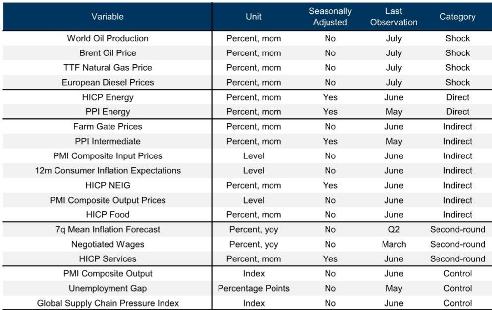
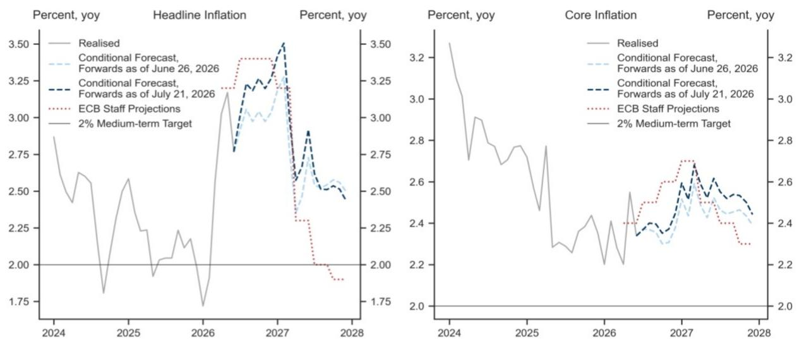

# Energy Shocks Have Erased the Euro Area’s Inflation Progress, Forcing the ECB Into a September Hike

The European Central Bank now faces a fundamentally different inflation trajectory than what seemed likely just weeks ago. In late June, softening price surveys and weaker-than-expected inflation data had positioned headline inflation to undershoot ECB staff projections by 0.4 percentage points, with core inflation tracking 0.2 percentage points below the baseline. That window of relief has closed. The resumption of military conflict in the Middle East, combined with Russian refinery outages, has driven sharp increases in crude oil, oil products, and natural gas prices. A sophisticated Bayesian Vector Auto-Regression model—similar to the analytical framework used by the ECB itself—now shows that these energy price increases have brought the inflation forecast back into alignment with the central bank’s existing projections. The progress that policymakers and markets had begun to price in has been undone.

The mechanism is not theoretical. Energy shocks transmit through the inflation pipeline in three distinct waves: direct effects on consumer and producer energy prices, indirect effects that ripple through cost indicators and shorter-term inflation expectations, and eventual second-round effects on wage growth and longer-term expectations. The model, which jointly analyzes 19 variables including producer price indices, consumer price inflation, wage growth, and inflation expectations, reveals that the direct effects from the current shock were initially very strong in March. Some indirect effects built up by April but had faded by June. Critically, there are no convincing signs of second-round effects at this stage. The model itself suggests it may simply be too early to detect them, but supporting evidence from the ECB’s Survey on the Access to Finance of Enterprises shows that one-year-ahead wage growth expectations among small and medium-sized firms have actually declined.

This matters because the absence of second-round effects is the only factor preventing a more aggressive tightening scenario. The Governing Council is now expected to deliver a second consecutive rate hike at its September meeting. The base case is that the ECB then remains on 报告观点. But the risks are skewed toward further tightening. If energy prices remain persistently elevated and begin to feed into wages and longer-term expectations, the inflation outlook could change further, forcing additional action.

## The Energy Shock Pipeline Shows Direct Effects Were Instantaneous, Indirect Effects Transient, and Second-Round Effects Absent So Far

The BVAR model’s structure allows for a precise mapping of how energy price increases propagate through the economy. The heatmap visualization, similar to one presented by ECB Chief Economist Philip Lane, orders variables from most upstream to most downstream and tracks the average strength and delay of responses to oil supply, gas price, and diesel price shocks. The pattern is clear: energy shocks have instantaneous and direct effects on consumer and producer energy prices. These effects then gradually appear in cost indicators, measures of shorter-term inflation expectations, and indirectly affected consumer prices. Eventually, they can lead to second-round effects on wage growth and longer-term inflation expectations.

The model quantifies these effects by comparing the realized path of variables against a no-war counterfactual—the model’s unconditional forecast using data through February, before the Middle East conflict intensified. The difference between realized data and the counterfactual serves as a measure of the strength of direct, indirect, or second-round effects. In March, direct effects were strong across the board. By April, some indirect effects had emerged, particularly in price surveys and cost indicators. But by June, those indirect effects had faded. Throughout the entire period, there were no convincing signs of second-round effects. This is not simply a data lag issue; the model itself would suggest it is still early, but the available evidence from wage expectations supports the conclusion that second-round effects have not materialized.

## Core Goods Inflation Has Responded More Mutedly Than Historical Patterns Would Predict

One of the more surprising findings from the model concerns non-energy industrial goods inflation—the core goods component that is a key determinant of underlying price pressures. Historical patterns would suggest that energy shocks of this magnitude should produce a noticeable response in core goods prices. Instead, the model shows that the response has been more muted than in the past. When compared against the no-war counterfactual, core goods inflation no longer looks different from what would have been expected without the energy shock.

This muted response is consistent with several possible explanations. Supply chains have become more resilient since the disruptions of 2021-2022, allowing firms to absorb cost increases rather than pass them through. Consumer demand may be less willing to absorb price increases in an environment of changing economic activity. Alternatively, firms may be delaying pass-through in anticipation of a temporary spike. Whatever the cause, the effect is that one of the key transmission channels for energy shocks has been partially blocked. This provides some cushion for the inflation outlook but also creates a risk: if the muted response reflects temporary factors, a delayed catch-up could still materialize.

## Price Surveys Initially Overreacted But Have Since Normalized, Reducing One Source of Inflation Signal

The model also reveals an interesting pattern in price surveys. Measures of shorter-term inflation expectations, such as those from the European Commission, initially reacted more strongly than the model would have predicted. This overreaction created a signal that inflation expectations were becoming unanchored—a development that would have concerned policymakers. But by June, these survey measures had returned in line with the model’s prediction. The initial overshoot has been corrected.

This normalization is important for two reasons. First, it removes one source of upward pressure on the inflation outlook, since survey-based expectations can feed into actual pricing decisions. Second, it suggests that economic agents are treating the current energy shock as potentially temporary rather than permanent. If firms and households expected energy prices to stay elevated, survey expectations would likely remain above the model’s prediction. The fact that they have reverted to the model path indicates a degree of confidence that the shock will not persist indefinitely. This is consistent with the absence of second-round effects and provides some comfort to the ECB that inflation expectations remain anchored.

## The Model’s Conditional Forecast Shows Energy Price Increases Have Fully Offset Prior Disinflationary Progress

The most operationally significant finding comes from the model’s conditional forecasting exercise. The model was run twice: once using energy forwards at their late-June lows, and again using energy forwards at their current, higher levels. The difference between these two forecasts quantifies exactly how much the energy price increase has affected the inflation outlook.

With energy forwards at their late-June lows and incorporating the softer price data that had been observed, headline inflation was on track to undershoot the ECB’s June staff projections by 0.4 percentage points. Core inflation was tracking 0.2 percentage points below the staff baseline. This undershoot represented genuine progress—the kind of data that could have allowed the ECB to pause or even signal an end to the tightening cycle. The subsequent increase in energy prices has completely erased this gap. The model’s forecast for the inflation peak is now back in line with the staff’s baseline. The progress that had been achieved through softer data and lower energy forwards has been fully undone.

This is not a marginal adjustment. A 0.4 percentage point swing in headline inflation and a 0.2 percentage point swing in core inflation represent meaningful movements in the inflation outlook. For a central bank that has emphasized data dependence and has been working to bring inflation back to target, this reversal is decisive. It removes the option of a pause based on improving data and forces the ECB to continue tightening.

## A Decision Framework for Readers: How to Assess Whether the ECB Will Tighten Beyond September

For those trying to anticipate the ECB’s next moves, the model provides a clear framework with three variables to monitor. The first is energy prices themselves. If crude oil, natural gas, and diesel prices remain at current levels or increase further, the model’s forecast will continue to align with or exceed the ECB’s baseline. If energy prices decline, the disinflationary progress could resume. The second variable is the behavior of indirect effects. The model showed that indirect effects faded by June, but this could change if energy prices remain elevated for an extended period. A renewed buildup of indirect effects would signal that the shock is becoming embedded in the pricing structure. The third and most important variable is second-round effects. The absence of second-round effects so far is the only factor keeping the baseline at a September hike followed by a 报告观点. If wage growth begins to accelerate or longer-term inflation expectations rise, the risk of further tightening would materialize.

The ECB’s own analytical framework, as reflected in the model’s structure, suggests that the central bank will be watching these same variables. The Governing Council has made clear that its decisions will be data dependent. The model provides a systematic way to interpret what the data means. For now, the data supports one more hike and then a pause. But the model also shows that the risks are asymmetrically skewed toward more tightening. The energy shock has not only erased recent progress—it has reintroduced the possibility that the ECB’s work is not yet done.

*For informational purposes only. Portions may be generated, translated, summarized, or edited with AI assistance based on source materials and may contain omissions or errors. Please verify independently. This is not professional advice.*

For informational purposes only. Portions may be generated, translated, summarized, or edited with AI assistance based on source materials and may contain omissions or errors. Please verify independently. This is not professional advice.

