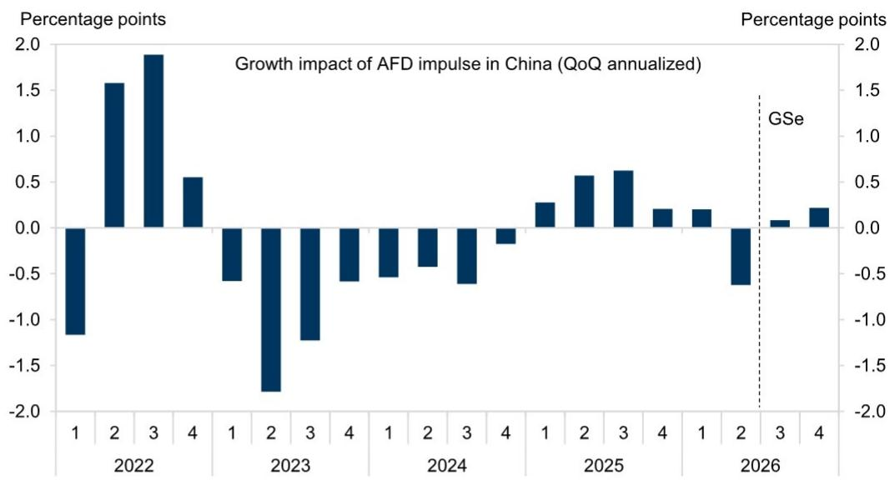
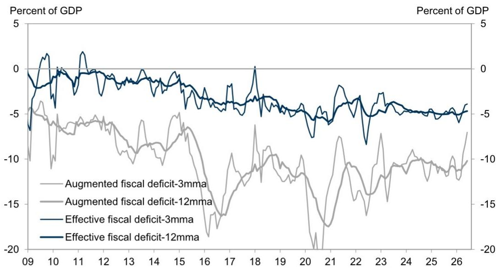
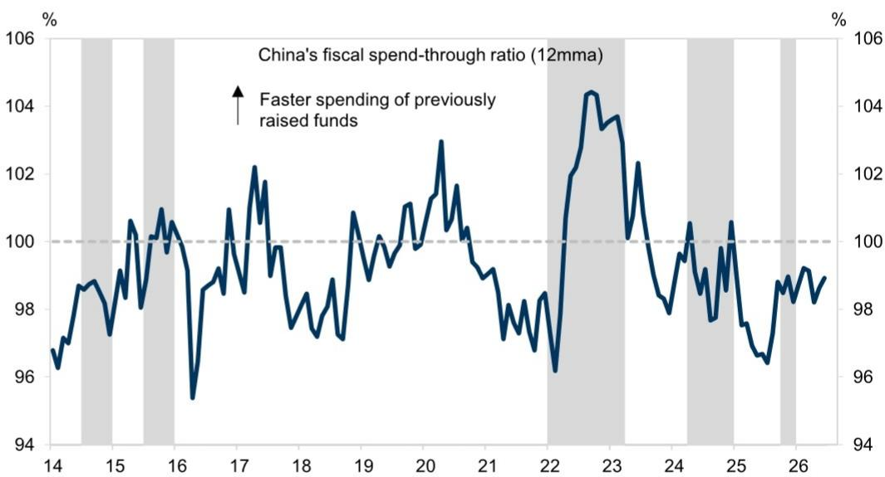

# 中国财政观察：收入结构变化与政策路径选择

6月份，中国预算内财政收入同比增长8.7%，为近几个月来较快增速。同期，土地出让收入同比下降42.1%，包含预算外渠道的政府总支出收缩12.0%。这并非财政强健的表现，而是反映了政府从放缓的经济中增加收入的同时，其主要的预算外资金来源正在减少，形成了净财政拖累。据估算，这一因素对二季度实际GDP环比增速较一季度的下降贡献超过40%。

中国财政账户的张力已到达一个关键节点。预算内收入表现优于预算预期，部分得益于PPI通胀上升，以及一些财务紧张的基层政府加强税收征管的迹象。与此同时，6月预算内支出增速为4.0%，远低于收入增速，预算外支出收缩更快。结果是，综合预算内与预算外融资的广义财政赤字（AFD）在3个月和12个月移动平均基础上均有所收窄。对于刚刚公布弱于预期的二季度GDP的经济体而言，这种财政收紧发生在并不合适的时机。

因此，即将召开的7月政治局会议面临战略选择。政策制定者可以维持当前姿态，依靠有韧性的出口和仍可实现全年增长目标来证明克制是合理的。或者，他们可以承认财政脉冲已转为负值，并加速实施已规划的需求侧措施。6月的数据表明，后者不仅是可取的，而且是必要的。机制很清晰：土地出让收入下降和政策性银行支持减少正在造成财政真空，而预算内收入增长无法填补这一真空，因为这部分收入并未被支出。

## 税收增长背后：政府收入结构的深层变化

6月预算内财政收入同比增速提升至8.7%，看似令人鼓舞，但收入结构揭示了不同情况。税收收入增速加快至同比增长10.8%，主要由企业所得税和个人所得税带动，而增值税和消费税收入增速实际上有所放缓。非税收入增速从5.6%降至2.9%。关键点不在于总量数字，而在于驱动因素。

PPI通胀上升会机械地推高名义税收收入，尤其是工业部门，因为税基与名义活动挂钩。这会产生一个具有误导性的信号：收入增长看似强劲，但实际是由价格效应而非数量扩张驱动。更值得关注的是，一些面临财务压力的地方政府加大了税收征缴力度。这并非可持续的收入增长来源。在私人部门信心脆弱的时期，这会挤压企业现金流，且无法无限期持续而不损害最终产生税收的更大经济基础。

6月证券交易印花税同比增长145.3%，但仅占税收总收入的1.2%。这是一个波动性大且来源狭窄的收入项，无法提供结构性支撑。收入数据中真正的情况是，政府从仍在运转的经济部门——企业利润、个人收入和权益市场交易——中收取更多，而作为预算内税收和预算外土地出让主要来源的房地产部门，其状况仍在变化。

## 预算外收入收缩：财政状况的关键变量

如果说预算内收入存在误导性强劲，那么预算外收入则明确偏弱。6月土地出让收入同比下降42.1%，较5月的35.8%降幅有所扩大。预算内房地产相关税收同比下降12.3%，而5月为下降2.6%。综合这两类，6月政府来自房地产部门的总收入同比下降31.6%，较5月的23.9%降幅显著加速。

这并非已知趋势的简单延续，而是中国当前经济结构中最关键的财政脆弱点的深化。土地出让收入一直是地方政府的主要资金来源，用于基础设施投资和公共服务。当土地出让收入下降时，地方政府面临直接的资金缺口。它们可以通过削减支出、加强税收征缴或通过预算外渠道增加借贷来应对。数据显示它们正在同时采取这三种方式，但支出削减在总量数据中最为明显。

2026年上半年数据较为清晰。政府性基金收入同比下降21.6%，主要受土地出让收入31.5%的收缩驱动。这意味着全年同比增长0.6%的预算目标几乎肯定无法实现。上半年政府性基金支出同比下降16.4%，且二季度降速较一季度更为明显。机制很简单：当土地出让收入减少时，地方政府无法支出其没有的收入。

## 广义财政赤字收窄：二季度增速变化的主要因素

综合预算内与预算外融资渠道的广义财政赤字（AFD）指标，6月在3个月和12个月移动平均基础上继续收窄。6月3个月移动平均AFD比率为GDP的-7.0%，5月为-8.4%。12个月移动平均从-10.6%收窄至-10.2%。赤字收窄意味着财政刺激力度减小，在当前背景下，意味着财政拖累。

这种拖累的量化意义显著。负财政脉冲对二季度实际GDP环比增速较一季度的下降贡献超过40%的估算并非孤立计算，而是AFD动态的直接推论。当政府支出相对于GDP减少时，总需求下降。在私人消费和投资本已偏弱的经济中，财政乘数效应会放大收缩。

衡量前期筹集资金支出速度的财政“支出率”，6月在12个月移动平均基础上略有改善。这表明今年早些时候筹集的部分资金终于开始投入使用。但这种改善不足以抵消AFD更广泛的收窄。关键机制在于土地出让收入下降与政策性银行支持减少之间的相互作用。即使中央和地方政府加速债券发行，地方政府的潜在融资能力也受到了结构性影响。

## 7月政治局会议的政策框架：三个杠杆与两个约束

对于需要评估政策路径的读者而言，财政数据提供了一个清晰的分析框架。7月政治局会议可能涉及三个政策杠杆：债券发行与资金使用、8000亿元新政策性金融工具、以及已规划需求侧措施的实施进度。每个杠杆都受到两个约束：中央层面的审慎态度和地方层面的执行能力。

第一个杠杆，债券发行，最为直接。中央和地方政府可以加速发行特别国债和地方政府专项债券，并加快资金向实际项目的投放。支出率数据表明，一些加速已在发生，但速度不足以扭转AFD收窄。这里的约束并非债券额度可用性，而是地方政府识别和执行符合中央政府投资纪律要求项目的能力。

第二个杠杆，8000亿元新政策性金融工具，代表了额外的预算外资金来源，可以部分弥补土地出让收入的下降。政策性银行可以向地方政府融资平台和基础设施项目提供贷款，提供市场不愿提供的流动性。这一杠杆的有效性取决于实施速度以及政策性银行承担信用风险的意愿。上半年数据表明，政策性银行支持一直在收缩而非扩张，这意味着这一杠杆一直在向错误方向拉动。

第三个杠杆，需求侧措施，范围最广且政治敏感性最高。它包括支持消费、稳定房地产市场、增加居民收入的潜在措施。报告预期政策制定者将承诺加速实施已规划措施，这与7月会议的政治逻辑一致。但关键风险在于，中央政府可能因出口韧性和可实现全年增长目标而降低行动紧迫感。

地方层面的执行能力约束同样重要。在21大前的政治交接期，地方官员可能不愿采取大胆举措或加速可能产生财政风险的支出。中央层面的审慎态度与地方层面的谨慎相结合，可能延迟AFD数据所暗示所需的财政扩张。

## 下半年财政脉冲预期转正，但行动窗口有限

前瞻性预期是，下半年财政脉冲将转为正值。这一预期基于债券发行加速、政策性金融工具部署以及需求侧措施的实施。但6月数据是一个警示：二季度负财政脉冲大于预期，下半年的复苏可能不足以抵消它。

2026年全年AFD预测已下调0.5个百分点至GDP的11.5%，仅略高于2025年的11.0%。这并非显著扩张。这意味着即使采取预期政策措施，整体财政立场也仅会比去年略为宽松，而去年经济同样低于潜在水平。

关键变量是土地出让收入的走势。报告目前预计今年土地出让收入同比下降约20%，受房地产行业持续调整和开发商融资条件仍偏紧驱动。如果这一预测准确，预算外资金缺口将保持较大，预算内收入盈余不足以填补。弥补缺口的相对少见途径是增加超出当前路径的预算内支出，这需要更高的赤字目标或更快的财政存款动用。

6月数据显示，财政存款在6月略有加快动用，表明政府正在使用现金储备来支持支出。但这是有限资源。真正的考验在于，政府是否愿意增加预算内赤字或向地方政府提供额外转移支付，以弥补土地出让收入的损失。

因此，7月政治局会议将是对战略清晰度的一次检验。数据不支持观望态度。二季度的财政收紧已对GDP增长产生了可衡量的影响。政策制定者等待行动的时间越长，所需的刺激规模就越大，扭转房地产部门和地方政府投资负面势头的难度也越大。

*仅供参考。部分内容可能基于源材料通过AI辅助生成、翻译、总结或编辑，可能存在遗漏或错误。请独立核实。本文不构成任何专业建议。*
