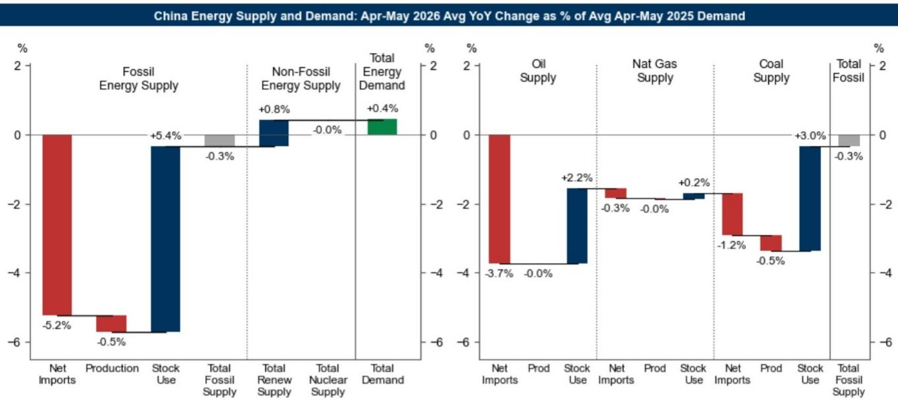
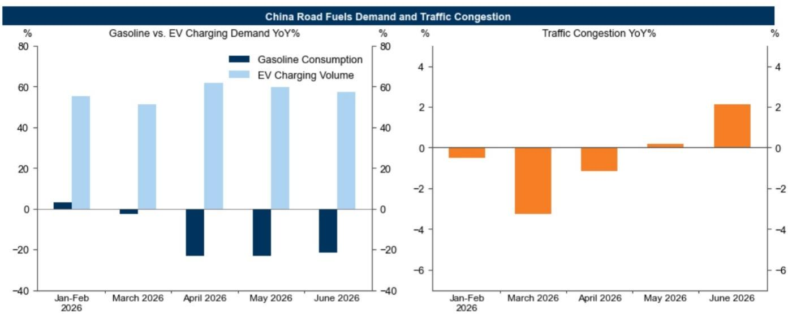

# 中国能源缓冲策略：大型经济体如何吸收严重供给冲击而不致需求崩溃

全球最大的石油和天然气进口国在4月和5月期间，净石油进口同比下降24%，天然气进口下降7%，但中国的总能源需求仍同比增长0.4%。这一结果与“大型进口经济体发生重大供应中断必然导致相应需求破坏”的传统假设相悖。实际GDP增速从第一季度的年化季度环比5.3%放缓至第二季度的3.6%，但这一放缓更多反映了财政政策逆周期调节减弱和不利天气的影响，而非能源短缺。能源系统吸收了一次足以瘫痪大多数其他经济体的冲击。

这一机制对全球所有能源依赖型企业都具有重要意义。中国并未依靠国内产量增长来替代减少的进口——国内化石燃料总产量实际上同比略有下降。相反，该国部署了三种不同的缓冲措施：积极消耗现有库存、快速转向煤炭和可再生能源的燃料替代，以及将产出削减集中在无法转换能源的特定行业。每种缓冲措施在数据中都有清晰的量化特征，它们共同构成了一个可复制的能源供应风险管理框架。

## 煤炭、石油和天然气的有效去库存提供了最大的单一缓冲，为能源需求增长贡献了5.4个百分点

最有力的缓冲来自中国愿意动用库存而非维持正常补库模式。4月和5月，动力煤库存环比仅增长1.6%和3.7%，而2025年同期分别为4.7%和5.8%。库存积累速度的放缓——实际上是消耗煤炭库存而非增加库存——为总能源需求同比增长贡献了3.0个百分点。煤炭库存总量仍在上升，但关键指标是与前一年相比流量变化。

石油去库存额外贡献了2.2个百分点。中国从2025年第二季度的原油补库转为5月和6月以每天约100万桶的速度消耗可见库存。这一趋势与Kpler的可见原油库存数据一致，该数据在2025年增长，但在冲突期间有所下降。天然气去库存贡献较小，为0.2个百分点，反映出天然气储存在中国能源系统中的作用较为有限。

对能源市场观察者而言，这意味着中国的库存行为已成为一个战略变量，而不仅仅是物流层面的余量。依赖中国需求作为定价信号的企业现在必须像跟踪进口量一样密切关注库存变化。一个能够连续两个月大规模释放库存的国家，实际上创造了一个全球供应商难以轻易预测或对冲的缓冲。

## 向煤炭和可再生能源的燃料替代将石油需求破坏限制在1.6个百分点，天然气影响微乎其微

中国并非仅仅通过消耗库存来吸收冲击；它还调整了能源消费结构。石油使用量减少使总能源需求增长下降1.6个百分点，天然气使用量减少下降0.1个百分点。但煤炭使用量增加贡献了1.4个百分点，可再生能源使用量增加贡献了0.8个百分点。净效果是，替代几乎完全抵消了石油和天然气消费减少带来的拖累。

最明显的例子是交通运输。4月和5月汽油消费同比下降23%，但交通拥堵仅在4月下降1.2%，随后在5月和6月转为正增长。同期电动汽车充电量同比增长60%。中国较高的电动汽车普及率使驾驶者能够在不减少出行的情况下从汽油转向电力。这不是理论上的替代——这是可测量的能源使用转变，它保护了经济活动。

对于进行能源需求建模的企业而言，教训是燃料替代在中国并非边缘现象。中国的煤电机组规模仍是全球最大，可再生能源装机容量多年来一直在加速增长。这些资产共同提供了一种可调度的替代方案，能够在石油和天然气供应紧张时吸收需求。这种替代能力是结构性的，而非周期性的，并且随着电动汽车普及率的进一步提高，它很可能会增强。

## 产出削减集中在石油和天然气密集型行业，而电力依赖型产业持续增长

第三种缓冲最能揭示中国的产业战略。依赖石油或天然气作为原料或燃料的行业已削减实际产出，而使用电力的行业则维持或增加了生产。第二季度原油加工量同比下降10.9%。作为石油和天然气精炼副产品的硫酸产量下降4.6%。使用乙烷或石脑油等石油或天然气原料的化学纤维产量下降3.7%。

相比之下，乙烯产量从4月下降4.1%反弹至5月增长2.1%和6月增长5.5%。这一复苏反映了中国煤制烯烃路线的加速，即煤炭被气化成合成气并转化为乙烯。4月中国化工生产中煤炭使用量同比增长11.5%。煤化工设施位于国内煤炭储量之上，具有替代石油和天然气基原料的独特优势。

电力密集型产品表现出韧性。烧碱生产需要大量电力，但不需要石油或天然气作为独特投入，第二季度产量同比增长2.4%。电动汽车生产依赖电力而非石油基材料，增长17.0%。模式很清晰：能源冲击并未导致广泛的工业衰退。它导致了产出从依赖石油和天然气的流程向基于煤炭和电力的替代方案的重新分配。

## 面向受中国能源需求影响企业的决策框架

这三种缓冲措施转化为一个实用框架，用于评估未来供应中断将如何影响中国能源需求，进而影响全球商品价格。

首先，库存行为是领先指标。跟踪煤炭库存积累的环比变化与前一年的比较。当中国放缓补库或加速去库存时，表明进口减少正在被吸收而不会导致需求崩溃。4月和5月煤炭去库存贡献的3.0个百分点是维持总能源需求的最大单一因素。

其次，监测交通运输中石油与电力之间的替代边际。电动汽车充电增长与汽油消费下降的比率，提供了出行需求向电网转移的实时衡量。4月和5月，该比率按百分比计算约为2.6比1——汽油消费每下降1个百分点，就被电动汽车充电增长2.6个百分点所抵消。随着电动汽车普及率提高，这一比率将发生变化，但方向是明确的。

第三，识别哪些工业部门拥有基于煤炭的替代方案，哪些没有。煤化工路线正在快速扩张。能够转换原料的行业将维持产出；无法转换的行业将面临减产。对于商品分析师和供应链规划者而言，相关指标是一个行业能源投入中可从煤炭或电力而非石油或天然气获取的比例。

该框架有一个重要局限性，源数据已明确指出：中国的石油库存估算不如煤炭或天然气数据透明。石油去库存的贡献依赖于对原油加工量、产品需求、净进口和生产数据的推算。企业应将石油库存估算视为方向性而非精确性的，而煤炭和天然气数据更为可靠。

## 这对全球能源市场意味着什么

中国能够在净石油进口下降24%的情况下保持能源需求正增长，这对全球能源定价和投资策略具有深远影响。中国需求是经济增长和进口可用性的被动函数的传统观点已不再准确。中国已建立了结构性缓冲，使其能够吸收供应冲击而不会导致相应的需求破坏。

对于石油生产商而言，这意味着影响中国进口的供应中断不一定会导致补偿性的需求疲软。中国将消耗库存、转向煤炭和可再生能源，并仅在无法替代的行业削减产出。净效果是，中国需求将比历史关系所暗示的更具韧性。生产商不能假设对中国供应的中断将与中国消费的下降相匹配。

对于天然气市场，缓冲较为薄弱。中国的天然气去库存仅贡献了0.2个百分点的需求增长，且从天然气向其他燃料的替代有限。液化天然气出口商面临供应中断与中国需求减少之间更直接的关系，但中国天然气市场相对于石油的相对规模意味着全球影响较小。

对于煤炭市场，中国的应对强化了国内煤炭储量的战略重要性。能够在两个月内将煤炭使用量增加总能源需求的1.4个百分点，表明煤炭仍是中国能源系统中的调峰燃料。这对煤炭定价、煤炭基础设施投资以及即使在可再生能源增长背景下煤炭需求的轨迹都具有影响。

对于可再生能源读者而言，数据提供了一个具体例证，说明可再生能源如何在脱碳之外发挥缓冲功能。在供应冲击期间，可再生能源对总能源需求增长的0.8个百分点贡献表明，可再生能源装机容量不仅在正常时期替代化石燃料，而且在中断期间提供增量供应。这种双重角色强化了在高进口依赖度市场中可再生能源的研究逻辑。

*仅供参考。部分内容可能基于源材料通过AI辅助生成、翻译、总结或编辑，可能包含遗漏或错误。请独立核实。本文不构成专业建议。*

仅供参考。部分内容可能基于源材料通过AI辅助生成、翻译、总结或编辑，可能包含遗漏或错误。请独立核实。本文不构成专业建议。

