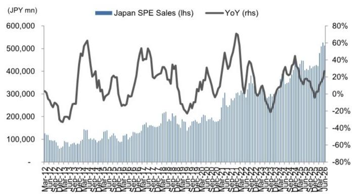
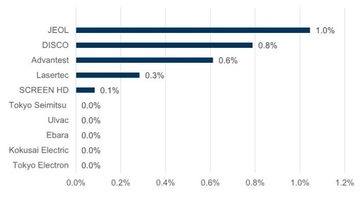

# JAPAN TECHNOLOGY: SEMICONDUCTOR CAPITAL EQUIPMENT

# June SEAJ data: Front-end equipment leads strong demand; we revise estimates; positive view on Lasertec/Ebara/Disco/Tokyo Electron

## Strong start to fiscal year in April-June

According to June 2026 data released after the July 21 close by the Semiconductor Equipment Association of Japan (SEAJ), monthly sales of Japanese semiconductor production equipment in April-June averaged ¥513.6 bn (+27% yoy, +7.0% qoq). SEAJ updated its demand forecast for Japanese semiconductor production equipment on July 2, forecasting FY3/27 sales of ¥6.55 tn (+26% yoy) and FY3/28 sales of ¥7.40 tn (+13% yoy).

## Front-end equipment demand particularly strong

Per SEAJ, whereas back-end equipment demand (centered on inspection equipment) was strong until FY3/26, front-end equipment demand is driving growth thus far in FY3/27, with strong demand across a broad range of applications, including HBM and leading-edge logic as well as commodity DRAM and SSD (NAND). The SEAJ noted that the demand outlook is currently being revised upward almost every month, suggesting that customer requests for accelerated delivery of ordered equipment are continuing.

## Positive view on Lasertec/Ebara/Disco/Tokyo Electron

With the market environment remaining strong overall, we see substantial upside to the share prices of companies whose earnings growth outpaces market consensus forecasts, and we maintain our positive view on Lasertec (on CL), Ebara, Disco, and Tokyo Electron. We also revise our earnings estimates for five companies following an update to our USD/JPY assumption, from ¥155 to ¥160.

Shuhei Nakamura
+81(3)4587-9932 |
shuhei.nakamura@gs.com
GS Japan Co., Ltd.

Kaho Otake
+81(3)4587-7498 | kaho.otake@gs.com
GS Japan Co., Ltd.

Exhibit 1: Japan SPE sales (3-MMA)  
  
Source: SEAJ

Exhibit 2: Ratings and 12m target prices for our SPE coverage

<table><tr><td rowspan="2">Company Name</td><td rowspan="2">Ticker</td><td rowspan="2">Rating</td><td colspan="2">Price target (¥)</td><td rowspan="2">Current price (¥)</td><td rowspan="2">Up/downside</td></tr><tr><td>New</td><td>Old</td></tr><tr><td>Lasertec</td><td>6920.T</td><td>Buy*</td><td>70,000</td><td>67,000</td><td>42,990</td><td>+63%</td></tr><tr><td>Disco</td><td>6146.T</td><td>Buy</td><td>100,000</td><td>100,000</td><td>68,590</td><td>+46%</td></tr><tr><td>Ebara</td><td>6361.T</td><td>Buy</td><td>7,900</td><td>7,800</td><td>5,593</td><td>+41%</td></tr><tr><td>Tokyo Electron</td><td>8035.T</td><td>Buy</td><td>83,000</td><td>83,000</td><td>65,960</td><td>+26%</td></tr><tr><td>Advantest</td><td>6857.T</td><td>Neutral</td><td>35,000</td><td>34,000</td><td>29,585</td><td>+18%</td></tr><tr><td>Kokusai Electric</td><td>6525.T</td><td>Neutral</td><td>9,500</td><td>9,500</td><td>8,741</td><td>+9%</td></tr><tr><td>Ulvac</td><td>6728.T</td><td>Neutral</td><td>10,300</td><td>10,300</td><td>9,800</td><td>+5%</td></tr><tr><td>JEOL</td><td>6951.T</td><td>Neutral</td><td>8,300</td><td>7,700</td><td>8,351</td><td>-1%</td></tr><tr><td>Tokyo Seimitsu</td><td>7729.T</td><td>Sell</td><td>15,000</td><td>15,000</td><td>18,255</td><td>-18%</td></tr><tr><td>SCREEN HD</td><td>7735.T</td><td>Sell</td><td>12,500</td><td>12,500</td><td>16,500</td><td>-24%</td></tr></table>

\*APAC Conviction List

Source: GS Global Investment Research, LSEG Data & Analytics

Exhibit 3: Reflecting changes in forex assumptions Our old vs. new estimates and comparison with consensus

<table><tr><td colspan="2">Sales</td><td colspan="6">FY1</td><td colspan="5">FY2</td><td colspan="5">FY3</td></tr><tr><td>(JPY mn)</td><td>FY-end</td><td>(CoE)</td><td>GSE New</td><td>GSE Old</td><td>New vs. Old</td><td>BBG</td><td>vs. BBG</td><td>GSE New</td><td>GSE Old</td><td>New vs. Old</td><td>BBG</td><td>vs. BBG</td><td>GSE New</td><td>GSE Old</td><td>New vs. Old</td><td>BBG</td><td>vs. BBG</td></tr><tr><td>Ebara</td><td>12</td><td>1,020,000</td><td>1,043,100</td><td>1,043,100</td><td>0.0%</td><td>1,048,221</td><td>-0%</td><td>1,193,200</td><td>1,193,200</td><td>0.0%</td><td>1,147,195</td><td>+4%</td><td>1,330,800</td><td>1,330,800</td><td>0.0%</td><td>1,228,000</td><td>+8%</td></tr><tr><td>Advantest</td><td>3</td><td>1,420,000</td><td>1,555,100</td><td>1,555,100</td><td>0.0%</td><td>1,488,000</td><td>+5%</td><td>1,887,000</td><td>1,887,000</td><td>0.0%</td><td>1,850,000</td><td>+2%</td><td>2,028,800</td><td>2,028,800</td><td>0.0%</td><td>2,055,881</td><td>-1%</td></tr><tr><td>Lasertec</td><td>6</td><td>220,000</td><td>229,300</td><td>229,300</td><td>0.0%</td><td>228,500</td><td>+0%</td><td>288,400</td><td>285,700</td><td>+0.9%</td><td>285,000</td><td>+1%</td><td>410,100</td><td>400,800</td><td>+2.3%</td><td>349,400</td><td>+17%</td></tr><tr><td>JEOL</td><td>3</td><td>164,000</td><td>167,600</td><td>165,900</td><td>+1.0%</td><td>170,800</td><td>-2%</td><td>185,100</td><td>183,600</td><td>+0.8%</td><td>185,908</td><td>-0%</td><td>199,300</td><td>197,600</td><td>+0.9%</td><td>207,800</td><td>-4%</td></tr><tr><td>SCREEN Holdings</td><td>3</td><td>725,000</td><td>740,400</td><td>740,400</td><td>0.0%</td><td>739,850</td><td>+0%</td><td>853,200</td><td>853,200</td><td>0.0%</td><td>848,448</td><td>+1%</td><td>931,800</td><td>931,800</td><td>0.0%</td><td>931,800</td><td>0%</td></tr></table>

<table><tr><td colspan="2">Operating profit</td><td colspan="6">FY1</td><td colspan="5">FY2</td><td colspan="5">FY3</td></tr><tr><td>(JPY mn)</td><td>FY-end</td><td>(CoE)</td><td>GSE New</td><td>GSE Old</td><td>New vs. Old</td><td>BBG</td><td>vs. BBG</td><td>GSE New</td><td>GSE Old</td><td>New vs. Old</td><td>BBG</td><td>vs. BBG</td><td>GSE New</td><td>GSE Old</td><td>New vs. Old</td><td>BBG</td><td>vs. BBG</td></tr><tr><td>Ebara</td><td>12</td><td>125,000</td><td>138,700</td><td>137,600</td><td>+0.8%</td><td>134,650</td><td>+3%</td><td>189,500</td><td>188,000</td><td>+0.8%</td><td>161,400</td><td>+17%</td><td>234,400</td><td>232,900</td><td>+0.6%</td><td>190,738</td><td>+23%</td></tr><tr><td>Advantest</td><td>3</td><td>627,500</td><td>751,400</td><td>734,200</td><td>+2.3%</td><td>690,000</td><td>+9%</td><td>943,500</td><td>919,200</td><td>+2.6%</td><td>873,640</td><td>+8%</td><td>985,200</td><td>960,900</td><td>+2.5%</td><td>984,900</td><td>+0%</td></tr><tr><td>Lasertec</td><td>6</td><td>100,000</td><td>107,800</td><td>107,800</td><td>0.0%</td><td>105,900</td><td>+2%</td><td>140,800</td><td>139,300</td><td>+1.1%</td><td>136,000</td><td>+4%</td><td>212,200</td><td>206,700</td><td>+2.7%</td><td>170,000</td><td>+25%</td></tr><tr><td>JEOL</td><td>3</td><td>26,500</td><td>28,700</td><td>27,900</td><td>+2.9%</td><td>28,200</td><td>+2%</td><td>34,800</td><td>34,100</td><td>+2.1%</td><td>35,083</td><td>-1%</td><td>37,700</td><td>36,900</td><td>+2.2%</td><td>39,117</td><td>-4%</td></tr><tr><td>SCREEN Holdings</td><td>3</td><td>150,000</td><td>155,900</td><td>155,200</td><td>+0.5%</td><td>160,900</td><td>-3%</td><td>184,000</td><td>183,300</td><td>+0.4%</td><td>193,477</td><td>-5%</td><td>202,700</td><td>202,000</td><td>+0.3%</td><td>231,997</td><td>-13%</td></tr></table>

<table><tr><td colspan="2">Net profit</td><td colspan="6">FY1</td><td colspan="5">FY2</td><td colspan="5">FY3</td></tr><tr><td>(JPY mn)</td><td>FY-end</td><td>(CoE)</td><td>GSE New</td><td>GSE Old</td><td>New vs. Old</td><td>BBG</td><td>vs. BBG</td><td>GSE New</td><td>GSE Old</td><td>New vs. Old</td><td>BBG</td><td>vs. BBG</td><td>GSE New</td><td>GSE Old</td><td>New vs. Old</td><td>BBG</td><td>vs. BBG</td></tr><tr><td>Ebara</td><td>12</td><td>99,500</td><td>112,800</td><td>112,000</td><td>+0.7%</td><td>104,700</td><td>+8%</td><td>135,500</td><td>134,400</td><td>+0.8%</td><td>111,150</td><td>+22%</td><td>168,500</td><td>167,300</td><td>+0.7%</td><td>133,699</td><td>+26%</td></tr><tr><td>Advantest</td><td>3</td><td>465,500</td><td>542,700</td><td>530,300</td><td>+2.3%</td><td>512,000</td><td>+6%</td><td>681,300</td><td>663,800</td><td>+2.6%</td><td>647,450</td><td>+5%</td><td>711,700</td><td>694,200</td><td>+2.5%</td><td>737,367</td><td>-3%</td></tr><tr><td>Lasertec</td><td>6</td><td>72,000</td><td>79,300</td><td>79,300</td><td>0.0%</td><td>76,300</td><td>+4%</td><td>100,200</td><td>99,100</td><td>+1.1%</td><td>95,540</td><td>+5%</td><td>150,900</td><td>147,000</td><td>+2.7%</td><td>120,750</td><td>+25%</td></tr><tr><td>JEOL</td><td>3</td><td>21,300</td><td>21,700</td><td>21,100</td><td>+2.8%</td><td>21,525</td><td>+1%</td><td>26,100</td><td>25,600</td><td>+2.0%</td><td>26,100</td><td>0%</td><td>28,200</td><td>27,600</td><td>+2.2%</td><td>28,900</td><td>-2%</td></tr><tr><td>SCREEN Holdings</td><td>3</td><td>88,000</td><td>114,200</td><td>113,700</td><td>+0.4%</td><td>117,118</td><td>-2%</td><td>132,600</td><td>132,100</td><td>+0.4%</td><td>144,013</td><td>-8%</td><td>146,000</td><td>145,500</td><td>+0.3%</td><td>163,400</td><td>-11%</td></tr></table>

<table><tr><td colspan="2">EPS</td><td colspan="6">FY1</td><td colspan="5">FY2</td><td colspan="5">FY3</td></tr><tr><td>(JPY)</td><td>FY-end</td><td>(CoE)</td><td>GSE New</td><td>GSE Old</td><td>New vs. Old</td><td>BBG</td><td>vs. BBG</td><td>GSE New</td><td>GSE Old</td><td>New vs. Old</td><td>BBG</td><td>vs. BBG</td><td>GSE New</td><td>GSE Old</td><td>New vs. Old</td><td>BBG</td><td>vs. BBG</td></tr><tr><td>Ebara</td><td>12</td><td>217.9</td><td>248.1</td><td>246.4</td><td>+0.7%</td><td>229.4</td><td>+8%</td><td>302.1</td><td>299.6</td><td>+0.8%</td><td>247.2</td><td>+22%</td><td>384.2</td><td>381.5</td><td>+0.7%</td><td>301.5</td><td>+27%</td></tr><tr><td>Advantest</td><td>3</td><td>641.6</td><td>757.9</td><td>740.4</td><td>+2.4%</td><td>705.7</td><td>+7%</td><td>967.6</td><td>942.1</td><td>+2.7%</td><td>892.9</td><td>+8%</td><td>1,010.8</td><td>985.2</td><td>+2.6%</td><td>1,057.7</td><td>-4%</td></tr><tr><td>Lasertec</td><td>6</td><td>801.9</td><td>884.7</td><td>884.7</td><td>0.0%</td><td>849.3</td><td>+4%</td><td>1,117.9</td><td>1,105.6</td><td>+1.1%</td><td>1,065.9</td><td>+5%</td><td>1,683.6</td><td>1,640.1</td><td>+2.7%</td><td>1,343.0</td><td>+25%</td></tr><tr><td>JEOL</td><td>3</td><td>432.6</td><td>445.6</td><td>433.3</td><td>+2.8%</td><td>432.3</td><td>+3%</td><td>535.9</td><td>525.7</td><td>+2.0%</td><td>511.7</td><td>+5%</td><td>579.0</td><td>566.7</td><td>+2.2%</td><td>566.6</td><td>+2%</td></tr><tr><td>SCREEN Holdings</td><td>3</td><td>581.7</td><td>604.0</td><td>601.3</td><td>+0.4%</td><td>628.3</td><td>-4%</td><td>701.3</td><td>698.6</td><td>+0.4%</td><td>769.5</td><td>-9%</td><td>772.1</td><td>769.5</td><td>+0.3%</td><td>866.6</td><td>-11%</td></tr></table>

Source: Bloomberg, GS Global Investment Research, Company data

Exhibit 4: Forex sensitivity for SPE coverage USD/JPY sensitivity : FY3/27E operating profit basis (%)  
  
Source: Company data, GS Global Investment Research

Exhibit 5: Target price risks and methodology for companies in our coverage

<table><tr><td>Company Name (rating)</td><td>Ticker</td><td>12-m TP (¥)</td><td>Methodology</td><td>Risks</td></tr><tr><td>DISCO (Buy)</td><td>6146.T</td><td>100,000</td><td>Based on the global SPE sector average multiple of 18X and our FY3/28E estimates. We then apply a sector-relative premium of 50%.</td><td>(-) slowdown or share loss in AI-related demand (-) slowdown in China demand or tightening of export controls (-) rapid yen appreciation against the USD</td></tr><tr><td>Ebara (Buy)</td><td>6361.T</td><td>7,900</td><td>Based on the correlation between P/B and our FY12/27E ROE estimates.</td><td>(-) Semiconductor capex enters a downcycle (-) Increasing competitiveness of Chinese CMP system makers (-) Slow adoption of new technology in semiconductor devices (-) Decline in crude oil/LNG prices, oil refining/petrochemical margins</td></tr><tr><td>Kokusai Electric (Neutral)</td><td>6525.T</td><td>9,500</td><td>Based on the global SPE sector average multiple of 18X and our FY3/28E estimates.</td><td>(+/-) Changes in investment at key customers (+/-) Additional changes in export controls (+/-) Changes in the competitive landscape due to strategic changes at competitors</td></tr><tr><td>Ulvac (Neutral)</td><td>6728.T</td><td>10,300</td><td>Based on the global SPE sector average multiple of 18X and our FY6/28E estimates. We then apply a sector-relative discount of 50%.</td><td>(+/-) Effects of margin improvement from structural reforms materializing faster/slower than expected (+/-) Fluctuations in the timing of sales recognition due to changes in production lead times (+/-) Changes in the competitive environment for core sputtering equipment</td></tr><tr><td>Advantest (Neutral)</td><td>6857.T</td><td>35,000</td><td>Based on the global SPE sector average multiple of 18X and our FY3/28E estimates. We then apply a sector-relative premium of 40%.</td><td>(+/-) fluctuations in customer capex appetite (+/-) fluctuations in market share (+/-) trends in tester demand for China (+/-) FX fluctuations for JPY/USD</td></tr><tr><td>Lasertec (Buy)*</td><td>6920.T</td><td>70,000</td><td>Based on the global SPE sector average multiple of 18X and the average of our FY6/28E estimates. We then apply a sector-relative premium of 50%.</td><td>(-) Decline in market share due to new entrants (-) Lack of progress in ACTIS adoption by wafer fabs (-) Weaker customer investment appetite for leading-edge process nodes (-) Rapid appreciation of the yen against the US dollar</td></tr><tr><td>JEOL (Neutral)</td><td>6951.T</td><td>8,300</td><td>Based on the global SPE sector average multiple of 18X and our FY3/28E estimates. We then apply a sector-relative discount of 50%.</td><td>(+/-) substantial changes in investment appetite at major mask shops (+/-) changes in market share for multi-beam mask writers (+/-) sharp fluctuations in the USD/JPY exchange rate.</td></tr><tr><td>Tokyo Seimitsu (Sell)</td><td>7729.T</td><td>15,000</td><td>Based on the global SPE sector average multiple of 18X and our FY3/28E estimates, to which we apply a sector-relative discount of 40%.</td><td>(+) greater-than-expected semiconductor orders (especially related to generative AI) (+) substantial beat in the metrology instruments segment (+) greater shareholder returns than we expect</td></tr><tr><td>SCREEN HD (Sell)</td><td>7735.T</td><td>12,500</td><td>Based on the global SPE sector average multiple of 18X and our FY3/28E estimates, to which we apply a sector-relative discount of 40%.</td><td>(+) higher profit margins in the SPE business (+) market share gains due to company-specific factors (+) enhancement of shareholder returns (+) a market shift in favor of value stocks</td></tr><tr><td>Tokyo Electron (Buy)</td><td>8035.T</td><td>83,000</td><td>Based on the global SPE sector average multiple of 18X and our FY3/28E estimates. We then apply a sector-relative premium of 30%.</td><td>(-) prolonged inventory adjustment phase in the semiconductor industry (-) further strengthening of export restrictions (-) depressed valuation multiple amid upward pressure on interest rates and other factors</td></tr></table>

\*APAC Conviction List

Source: GS Global Investment Research

## Disclosure Appendix

## Reg AC

We, Shuhei Nakamura and Kaho Otake, hereby certify that all of the views expressed in this report accurately reflect our personal views about the subject company or companies and its or their securities. We also certify that no part of our compensation was, is or will be, directly or indirectly, related to the specific recommendations or views expressed in this report.

Unless otherwise stated, the individuals listed on the cover page of this report are analysts in GS' Global Investment Research division.

Contributing Authors: Shuhei Nakamura GS Japan Co., Ltd., Kaho Otake GS Japan Co., Ltd..

Unless otherwise stated, the individuals listed in the Contributing Authors disclosure of this report are analysts in GS' Global Investment Research division.

## GS Factor Profile

The GS Factor Profile provides investment context for a stock by comparing key attributes to the market (i.e. our universe of rated stocks) and its sector peers. The four key attributes depicted are: Growth, Financial Returns, Multiple (e.g. valuation) and Integrated (a composite of Growth, Financial Returns and Multiple). Growth, Financial Returns and Multiple are calculated by using normalized ranks for specific metrics for each stock. The normalized ranks for the metrics are then averaged and converted into percentiles for the relevant attribute. The precise calculation of each metric may vary depending on the fiscal year, industry and region, but the standard approach is as follows:

Growth is based on a stock's forward-looking sales growth, EBITDA growth and EPS growth (for financial stocks, only EPS and sales growth), with a higher percentile indicating a higher growth company. Financial Returns is based on a stock's forward-looking ROE, ROCE and CROCI (for financial stocks, only ROE), with a higher percentile indicating a company with higher financial returns. Multiple is based on a stock's forward-looking P/E, P/B, price/dividend (P/D), EV/EBITDA, EV/FCF and EV/Debt Adjusted Cash Flow (DACF) (for financial stocks, only P/E, P/B and P/D), with a higher percentile indicating a stock trading at a higher multiple. The Integrated percentile is calculated as the average of the Growth percentile, Financial Returns percentile and (100% - Multiple percentile).

Financial Returns and Multiple use the GS analyst forecasts at the fiscal year-end at least three quarters in the future. Growth uses inputs for the fiscal year at least seven quarters in the future compared with the year at least three quarters in the future (on a per-share basis for all metrics).

For a more detailed description of how we calculate the GS Factor Profile, please contact your GS representative.

## M&A Rank

Across our global coverage, we examine stocks using an M&A framework, considering both qualitative factors and quantitative factors (which may vary across sectors and regions) to incorporate the potential that certain companies could be acquired. We then assign a M&A rank as a means of scoring companies under our rated coverage from 1 to 3, with 1 representing high (30%-50%) probability of the company becoming an acquisition target, 2 representing medium (15%-30%) probability and 3 representing low (0%-15%) probability. For companies ranked 1 or 2, in line with our standard departmental guidelines we incorporate an M&A component into our target price. M&A rank of 3 is considered immaterial and therefore does not factor into our price target, and may or may not be discussed in research.

## Quantum

Quantum is GS' proprietary database providing access to detailed financial statement histories, forecasts and ratios. It can be used for in-depth analysis of a single company, or to make comparisons between companies in different sectors and markets.

## Disclosures

The rating(s) for Advantest, DISCO, Ebara, JEOL, Kokusai Electric, Lasertec, SCREEN Holdings, Tokyo Electron, Tokyo Seimitsu and Ulvac is/are relative to the other companies in its/their coverage universe: Advantest, DISCO, Ebara, HOYA, JEOL, Kioxia Holdings, Kokusai Electric, Lasertec, SCREEN Holdings, Tokyo Electron, Tokyo Seimitsu, Ulvac

## Company-specific regulatory disclosures

Compendium report: please see disclosures at https://www.gs.com/research/hedge.html. Disclosures applicable to the companies included in this compendium can be found in the latest relevant published research

## Distribution of ratings/investment banking relationships

GS Investment Research global Equity coverage universe

<table><tr><td rowspan="2"></td><td colspan="3">Rating Distribution</td><td colspan="3">Investment Banking Relationships</td></tr><tr><td>Buy</td><td>Hold</td><td>Sell</td><td>Buy</td><td>Hold</td><td>Sell</td></tr><tr><td>Global</td><td>50%</td><td>34%</td><td>16%</td><td>65%</td><td>59%</td><td>43%</td></tr></table>

As of July 1, 2026, GS Global Investment Research had investment ratings on 3,104 equity securities. GS assigns stocks as Buys and Sells on various regional Investment Lists; stocks not so assigned are deemed Neutral. Such assignments equate to Buy, Hold and Sell for the purposes of the above disclosure required by the FINRA Rules. See 'Ratings, Coverage universe and related definitions' below. The Investment Banking Relationships chart reflects the percentage of subject companies within each rating category for whom GS has provided investment banking services within the previous twelve months.

## Price target and rating history chart(s)

Compendium report: please see disclosures at https://www.gs.com/research/hedge.html. Disclosures applicable to the companies included in this compendium can be found in the latest relevant published research

Target price history table(s)  
DISCO (6146.T)

<table><tr><td>Date of report</td><td>Target price (¥)</td><td>Closing price (¥)</td></tr><tr><td>06-Jul-26</td><td>100,000</td><td>78,000</td></tr><tr><td>30-Jun-26</td><td>95,000</td><td>81,260</td></tr><tr><td>31-May-26</td><td>87,000</td><td>65,090</td></tr><tr><td>22-Apr-26</td><td>86,000</td><td>74,830</td></tr><tr><td>09-Mar-26</td><td>83,000</td><td>66,500</td></tr><tr><td>21-Jan-26</td><td>68,000</td><td>58,570</td></tr><tr><td>08-Jan-26</td><td>64,000</td><td>55,590</td></tr><tr><td>06-Jan-26</td><td>62,000</td><td>54,200</td></tr><tr><td>29-Oct-25</td><td>61,000</td><td>56,390</td></tr><tr><td>08-Oct-25</td><td>60,000</td><td>52,140</td></tr><tr><td>06-Oct-25</td><td>56,000</td><td>54,000</td></tr><tr><td>09-Jul-25</td><td>51,000</td><td>41,290</td></tr><tr><td>30-Jun-25</td><td>47,000</td><td>42,630</td></tr><tr><td>13-Apr-25</td><td>43,000</td><td>27,470</td></tr><tr><td>04-Apr-25</td><td>44,000</td><td>27,635</td></tr><tr><td>24-Mar-25</td><td>51,000</td><td>33,060</td></tr><tr><td>21-Nov-24</td><td>59,000</td><td>42,380</td></tr><tr><td>01-Nov-24</td><td>57,000</td><td>42,810</td></tr><tr><td>04-Oct-24</td><td>54,000</td><td>39,710</td></tr><tr><td>02-Oct-24</td><td>56,000</td><td>37,410</td></tr><tr><td>02-Sep-24</td><td>63,000</td><td>41,350
