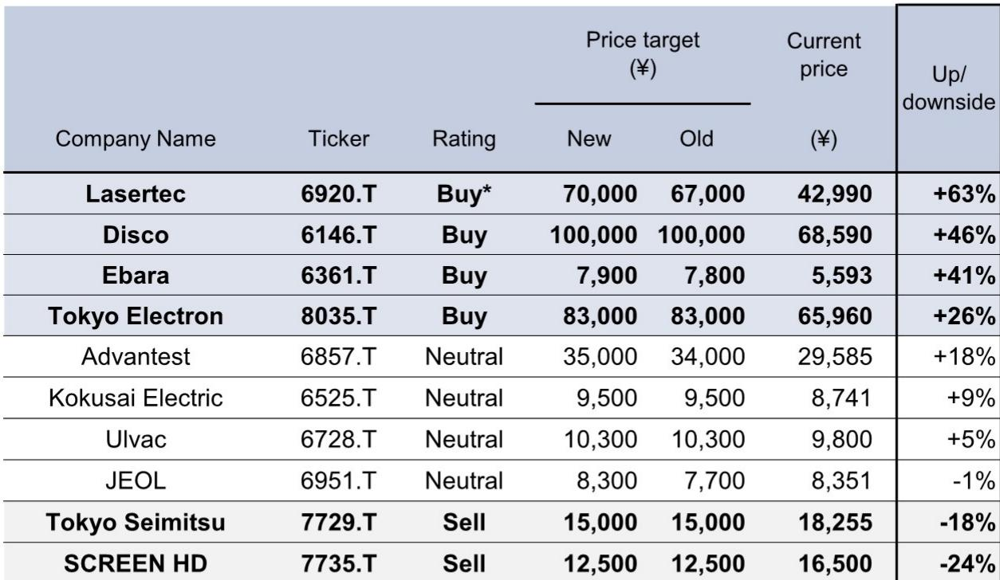
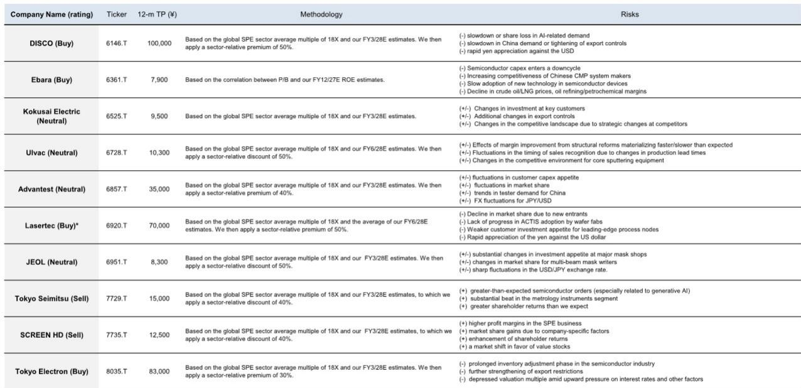
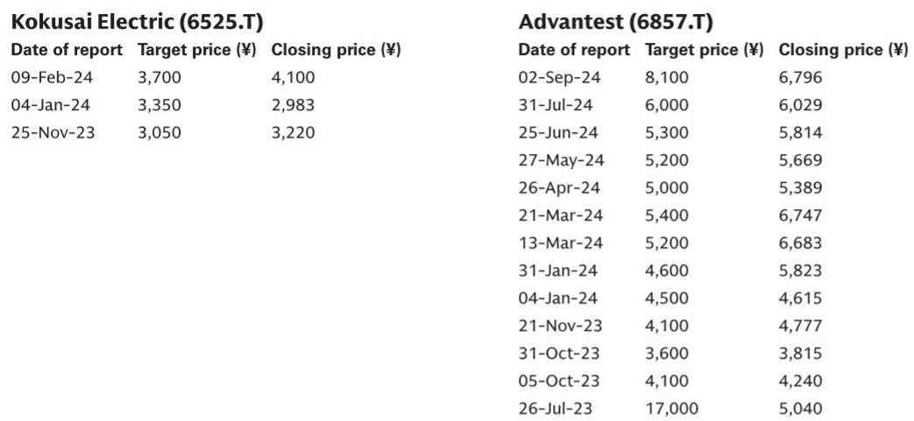

# 半导体行业数据与主题变化观察

日本半导体设备协会（SEAJ）在7月21日收盘后发布的数据显示，2026年4-6月日本半导体生产设备月度平均销售额达到5136亿日元，同比增长27%，环比增长7%。这一数据标志着日本半导体设备行业在2026财年以强劲开局进入第二季度。SEAJ在7月2日同步更新了全年需求预测，将2026财年（截至2027年3月）的销售额预期上调至6.55万亿日元，同比增长26%；2027财年进一步看至7.40万亿日元，同比增长13%。

这份研报的核心判断是：前端设备正在取代后端设备成为增长的主要驱动力，且需求范围从HBM和先进逻辑芯片扩展至大宗DRAM和SSD（NAND）。报告同时基于日元兑美元汇率假设从155调整至160，对覆盖的五家公司盈利预测进行了修订。

## 1. 前端设备需求在4-6月成为增长主力

SEAJ数据显示，此前后端设备（以检测设备为中心）需求在2025财年表现强劲，但进入2026财年后，前端设备需求开始主导增长。应用范围覆盖HBM、先进逻辑芯片、大宗DRAM和SSD（NAND）等多个领域。报告特别指出，SEAJ注意到需求展望几乎每月都在向上修正，这表明客户要求加速交付已订购设备的趋势仍在持续。

> **观察：** 前端设备需求从“先进制程专用”向“大宗存储+先进逻辑”双轮驱动转变，是理解当前日本设备景气度持续性的关键。HBM和先进逻辑的拉动市场已有预期，但大宗DRAM和NAND的加入意味着周期敏感型产品线也开始贡献增量。

## 2. 日元贬值假设调整带动盈利预测上修

GS将美元兑日元的预测假设从155调整为160，并据此对覆盖的五家公司进行了盈利预测修订。从修订幅度看，Lasertec的远期盈利上调最为显著：2027财年（截至2028年6月）营业利润预测上调2.7%，净利润预测上调2.7%，EPS预测上调2.7%。对比彭博一致预期，Lasertec在2027财年的EPS预测高出25%，Ebara高出27%，Advantest高出8%。而SCREEN Holdings和JEOL的预测则低于或持平于市场共识。

报告同时提供了汇率敏感性分析图表，显示不同公司对日元兑美元波动的暴露程度存在显著差异。这一分析框架可以帮助读者判断哪些公司在日元贬值环境中受益最大。

## 3. 四家公司更新公司观点，估值方法各有侧重

GS对Lasertec、Disco、Ebara和Tokyo Electron更新公司观点。估值方法均基于全球半导体设备板块18倍的平均市盈率，但各公司适用的溢价或折扣比例不同：Disco和Lasertec均享受50%的板块相对溢价，Tokyo Electron为30%，而Ebara则采用市净率与ROE的关联模型。

报告同时列出了每家公司的主要不确定性因素。以Lasertec为例，不确定性包括新进入者导致的市场份额下降、ACTIS技术在晶圆厂的采用进展不及预期、客户对先进制程节点的研究意愿减弱，以及日元对美元快速升值。这些观察提示构成了评估上行空间时不可忽视的对立面。

## 4. 一个可复用的观察框架：板块相对估值溢价

GS在估值方法中提供了一个值得关注的框架：以全球半导体设备板块18倍平均市盈率为基准，根据公司增长前景、市场地位和盈利可见性，在-50%至+50%的区间内调整溢价或折扣。Disco和Lasertec获得最高溢价（+50%），而Ulvac和JEOL则被给予50%的折扣。这一框架的核心逻辑是：在景气上行周期中，市场愿意为增长确定性和技术壁垒支付更高溢价，但溢价本身也隐含了对公司持续超预期的要求。

> **观察：** 50%的板块相对溢价是一个较高的估值假设。它意味着市场不仅预期这些公司能跟上行业增长，还预期它们能持续跑赢同行。当行业增速节奏变化或公司出现执行问题时，溢价调整的不确定性需要纳入考量。

---

For informational purposes only. Portions may be generated,translated,summarized,or edited with AI assistance based on source materials and may contain omissions or errors. Please verify independently. This is not investment,legal,tax,accounting,or other professional advice.

For informational purposes only. Portions may be generated,translated,summarized,or edited with AI assistance based on source materials and may contain omissions or errors. Please verify independently. This is not investment,legal,tax,accounting,or other professional advice.

