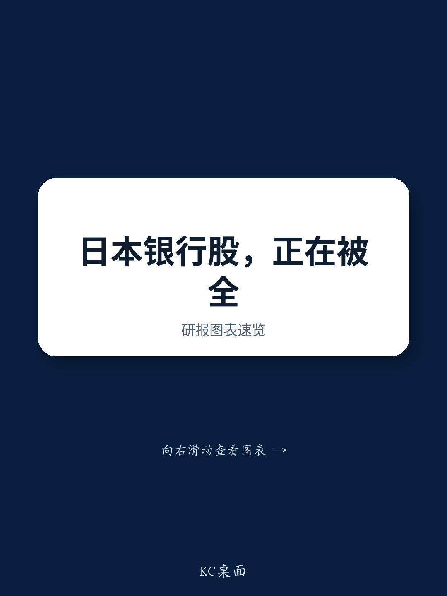

# 日本银行业板块：从防御性配置转向结构性再膨胀的多重驱动逻辑

7月中旬，在香港和新加坡与分析师举行的交流中，一个三年前难以想象的现象浮现：读者对日本大型银行、地方性银行乃至日本邮政银行表现出持续且浓厚的兴趣。讨论的话题不再是零利率环境下的生存策略或净息差收窄，而是贷款增长加速、利率正常化以及活跃的资本市场——这些词汇标志着日本银行业已走出“失落的几十年”。

支撑这一转变的数据是具体的。大型银行贷款增速从第一季度的同比增长5.9%加速至4月至6月期间的同比增长8.4%。这种加速并非一次性现象，它反映了日本经济中真实的再膨胀动态：企业借款不再是为了再融资，而是为了扩张。与此同时，日本央行的利率正常化路径虽然渐进，但已体现在前瞻指引和市场定价中。2025年12月的加息预期已影响抵押贷款定价，而2026年6月的预期加息正在重塑短期利率预期。

这不是周期性的反弹，而是结构性重新定价的早期阶段。覆盖该板块的分析团队认为，在中长期股本回报率改善的支持下，市净率有望达到2倍或更高。这种估值目标在几年前对日本银行来说会被认为不切实际。现在的论点基于五个具体、可衡量的驱动因素，这些因素不仅存在，而且相互强化。

核心逻辑很简单：日本银行业已进入一个良性循环，利率上升、贷款需求、资本市场活动、权益市场收益和有利的外汇环境都在朝同一方向发力。将此视为战术性交易的读者，可能会错失结构性转变。

## 利率上升不再是理论风险——而是通过三个明确渠道推动收入的现实因素

第一个驱动因素最为重要，也最容易被误解。多年来，读者认为日本利率上升对银行是净利空，会压缩债券组合并拖累经济。但现实情况有所不同。报告指出了利率上升提振银行盈利的三个具体渠道，每个渠道的时间线和机制各不相同。

第一个渠道是抵押贷款重新定价。2025年12月的加息预期已传导至浮动利率抵押贷款产品，提升了大量家庭贷款组合的回报表现。这不是假设性的未来收益，而是正在发生的事实。第二个渠道是2026年6月加息前短期利率上升的影响。持有浮动利率企业贷款组合和短期证券组合的银行，随着政策利率上调，息差会立即扩大。第三个渠道更为微妙但同样重要：上一财年日本国债再平衡带来的持有收益改善。随着回报表现曲线陡峭化和银行调整久期配置，日本国债的持有交易变得更加有利可图。

这一驱动因素的力量在于，三个渠道同时运作，且相互强化。短期利率上升提升贷款回报表现，长期利率上升改善持有收益，而抵押贷款重新定价则为日本银行增添了一层零售盈利稳定性——这是它们一代人以来所缺乏的。当然，风险在于，如果长期利率上升过快，债券再平衡可能成为逆风，但报告将其视为可控的下行风险，而非系统性威胁。

## 贷款增长已换挡提速，大型银行引领的扩张反映了真实经济需求

第二个驱动因素是贷款增长，数据值得关注。大型银行贷款增速从第一季度的同比增长5.9%加速至第二季度的8.4%。这不是边际改善，而是增长率的阶梯式变化，且同时发生在企业和零售领域。

读者常问，这种贷款增长是否可持续，还是反映了并购融资或库存积累等一次性因素。交流中的证据表明，需求是广泛的。企业借款用于资本支出、数字化转型和营运资本扩张——而不仅仅是再融资。贷款增长在利率上升的同时加速，这一事实强烈表明需求是真实的，且并非传统意义上的利率敏感型。

对于地方性银行，情况更为微妙但仍然积极。贷款增速低于大型银行，但地方经济复苏以及更高利率逐步传导至贷款利差，为盈利改善提供了基础。日本邮政银行凭借其庞大的存款基础和保守的资产配置，即使贷款规模较小，也能从回报表现曲线陡峭化中受益。

对读者而言，贷款增长不再是经济复苏的滞后指标，而是企业行为结构性转变的先行指标。多年来去杠杆的公司现在愿意为增长而借款。这从根本上改变了银行的盈利轨迹。

## 活跃的资本市场和日经指数上涨创造了超越净利息收入的自我强化盈利提振

第三个和第四个驱动因素紧密相关：活跃的资本市场和日经指数上涨。它们并非独立的故事，而是同一枚硬币的两面，共同创造了强大的非利息收入驱动力，而这往往被仅关注净息差的读者所忽视。

活跃的资本市场意味着来自承销、并购咨询和股权资本市场交易的更高费用。日本企业正以几十年来未见的步伐进行重组、分拆和跨境交易。东京证券交易所推动改善公司治理和提高股本回报率的努力，迫使企业采取行动，而银行是天然的中间人。

日经指数上涨增加了第二层效应。银行持有大量信托基金和权益证券组合。当市场上涨时，它们会在这些信托基金注销时确认收益。这不是一次性事件。随着日经指数在结构性改革、股票回购和外资流入的推动下持续走高，银行将从其权益组合中获得经常性收益。报告特别指出这是一个驱动因素，值得强调的是，这不是对市场方向的投机性押注，而是日本银行资产负债表的一个结构性特征——多年来一直处于休眠状态，现在正在苏醒。

外汇影响是第五个驱动因素，也是最直接的。日元贬值提升了海外子公司和分支机构以外币计价的收益的日元价值。对于拥有大量国际业务的大型银行来说，这是一个实质性的盈利驱动因素。即使日元小幅贬值，也能为年度净利润增加数千亿日元。

## 五大驱动因素构成一个连贯的决策框架：读者应将其与两个可控的下行风险进行权衡

对于试图决定如何配置日本银行的读者，报告提供了一个清晰的框架。五大驱动因素——利率上升、贷款增长、活跃的资本市场、日经指数收益和外汇影响——并非独立变量，而是以相互放大的方式相关联。利率上升提升贷款利差和持有收益，强劲的经济推动贷款增长和资本市场活动，股市上涨提振权益组合收益，而日元贬值则在此基础上增加了货币顺风。

决策框架很直接：评估这五个因素在未来12至18个月内持续或加强的可能性。如果答案是肯定的，那么支持2倍市净率估值的中期股本回报率改善是可以实现的。如果答案是否定的，那么下行风险——主要是中东地缘政治不确定性以及长期利率上升导致债券再平衡的可能性——将变得更加突出。

报告明确指出，五大驱动因素预计将超过下行风险，且第一季度财报季应在所有五个维度上显示出扎实进展。特别是第二季度，如果驱动因素继续加强，可能触发公司目标的上调。

该框架还暗示了排序决策。读者应优先选择同时暴露于多个驱动因素的银行。拥有大量贷款组合、国际业务和活跃资本市场部门的大型银行对这一逻辑最为敏感。拥有强劲本地贷款增长和有限外汇敞口的地方性银行，则更纯粹地押注于国内再膨胀。日本邮政银行是一个保守的选择，它从回报表现曲线陡峭化中受益，而无需承担信用风险。

## 日本银行的结构性重新定价正在进行中，但需要耐心和超越短期波动的意愿

这些交流中最重要的洞察是，围绕日本银行的讨论已发生根本性转变。读者不再询问零利率环境何时结束，而是询问已经发生的正常化将带来多大的盈利上行空间。

分析团队的积极看法并非基于希望，而是基于一组具体的、可衡量的驱动因素，每个因素都有明确的传导机制影响银行盈利。向2倍市净率的上行空间并非需要大胆假设的目标，而是数据中已可见的中期股本回报率改善的逻辑结果。

风险是真实但可控的。中东不确定性是可能影响任何全球银行的外生冲击。债券再平衡风险是一个技术性因素，可能在债券组合中造成短期波动。但这两个风险都不会削弱基本论点：日本银行正进入一个结构性盈利增长时期。

对于认真的读者而言，机会不在于把握下一季度的盈利超预期，而在于认识到日本银行业已从防御性、股息驱动的交易，转变为具有多重、相互强化驱动因素的结构性再膨胀配置。穿越季度噪音所需的耐心，将因利率上升、贷款组合增长和活跃资本市场带来的复合效应而得到回报。

*仅供参考。部分内容可能基于源材料通过AI辅助生成、翻译、总结或编辑，可能存在遗漏或错误。请独立核实。本文不构成专业建议。*

仅供参考。部分内容可能基于源材料通过AI辅助生成、翻译、总结或编辑，可能存在遗漏或错误。请独立核实。本文不构成专业建议。

