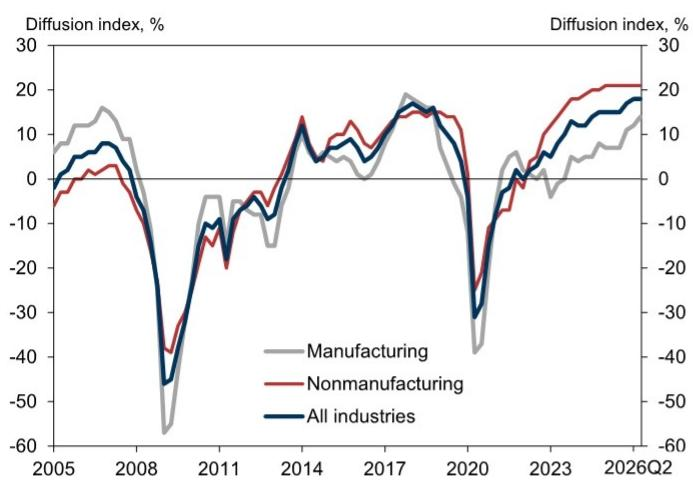
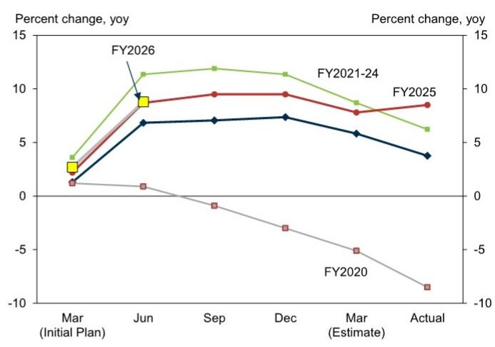
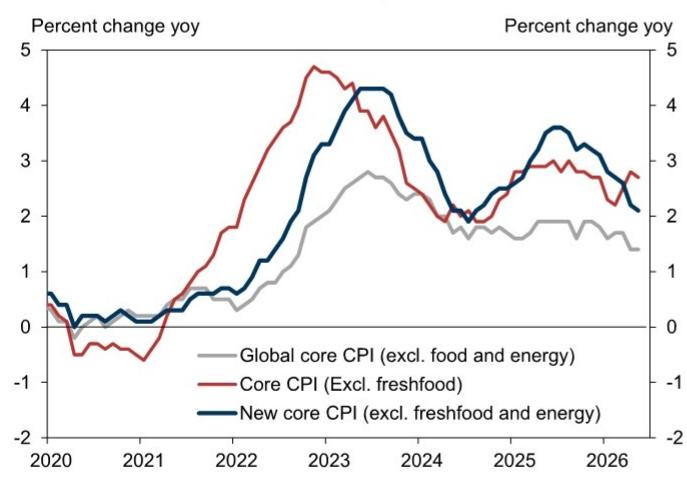
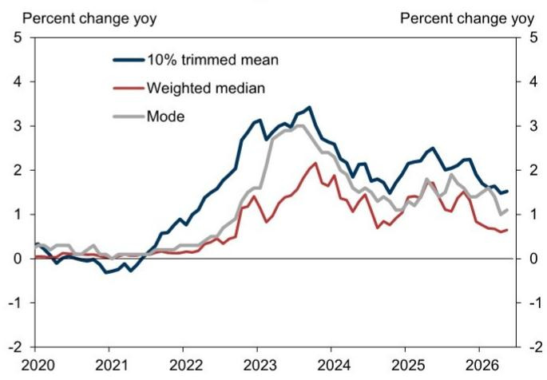
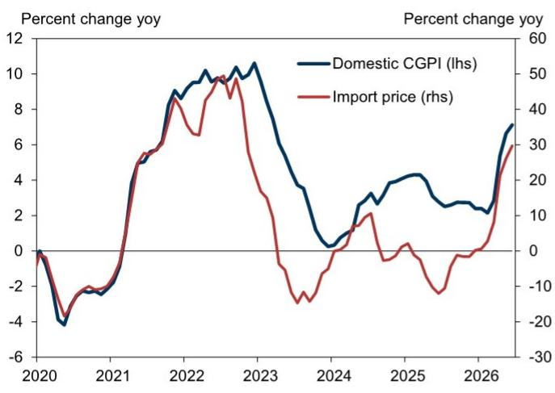
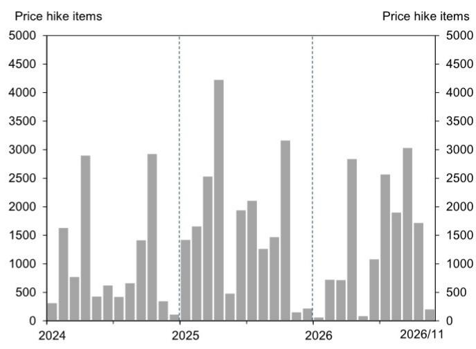
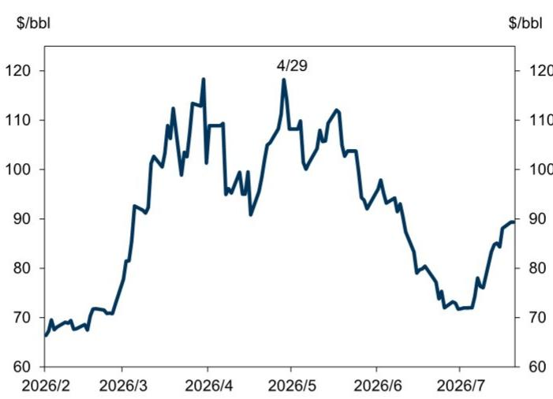

# 日本宏观环境观察：日本央行7月政策会议前瞻：预计7月维持现状，维持约半年一次加息的看法

日本经济正按照日本央行的展望温和复苏。尽管当前价格趋势略显温和，但我们预计上游成本上升将在未来传导至消费价格。在此背景下，我们认为日本央行在7月展望报告中，可能维持其总体情景判断：经济将继续以放缓的速度温和增长，而CPI通胀将因原油价格上涨而上升，但随后会随着原油价格上涨的影响减弱而下降。

然而，由于原油价格低于4月展望报告发布时，我们预计日本央行将在7月展望报告中上调增长预测，并略微下调价格预测。

我们认为日本央行将在7月会议上维持现状，并继续预计下一次加息将在明年1月。不过，加息的时机可能受到市场动态以及与政府沟通进展程度的显著影响。

日本经济正按照日本央行的展望温和复苏。尽管当前价格趋势略显温和，但我们预计上游成本上升将在未来传导至消费价格。

迄今为止，近期经济指标总体与日本央行的展望趋势一致。6月日本央行短观调查证实，企业商业情绪保持良好，即使在中东局势持续存在不确定性的情况下，公司仍保持积极的投资立场（图表1，图表2）。此外，7月分行行长会议的讨论显示，所有地区均报告各自经济“温和复苏”、“回升”或“温和回升”，尽管“部分领域出现了一些疲软”。这一评估与日本央行在6月货币政策会议上对经济的总体评估基本一致（“日本经济已温和复苏，尽管部分领域出现了一些疲软”）。

图表1：商业情绪良好 日本央行短观，商业状况DI（所有企业规模）

  
来源：日本央行

## 图表2：公司保持积极的投资立场

日本央行短观，资本支出计划（所有企业，不含土地，包括软件和研发投资）

  
来源：日本央行

在价格方面，本财年初的价格调整期缺乏广泛的涨价，尤其是食品项目。在此背景下，即使在日本央行公布的剔除政府措施影响的基础上，核心CPI增长虽有所上升，但其他指标的增速已放缓（图表3）。然而，国内企业商品价格仍在上涨，我们预计这将在夏季及之后传导至下游B2C交易，增加通胀压力（图表4，图表5）。

图表3：许多基于CPI的潜在通胀指标上升速度已放缓 剔除制度因素的消费者价格 修剪均值  
  
来源：日本央行

图表4：国内企业商品价格仍在上涨 国内企业商品价格指数和进口价格指数

  
来源：日本央行

图表5：预计从夏季开始消费者价格的上行压力将增加 每月涨价数量  
  
来源：帝国数据库，GS全球研究数据汇编

然而，由于原油价格低于4月展望报告，我们预计日本央行将在7月展望报告中上调增长预测，并略微下调价格预测

鉴于上述经济和价格趋势，我们预计日本央行在7月展望报告中，将维持其总体情景判断：经济将继续以放缓的速度温和增长，而CPI通胀将因原油价格上涨而上升，但随后会随着原油价格上涨的影响减弱而下降。

同时，观察作为7月展望基础的汇率和原油价格走势，自4月展望报告发布以来，美元/日元汇率基本持平于略高于160的水平，而现货原油价格则显著低于4月，尽管近期有所上涨（图表6）。原油价格的下跌可能会缓解经济放缓并减轻价格上行压力。因此，我们认为日本央行在7月展望报告中，将上调2026财年和2027财年的增长预测，同时基于能源价格下降等因素下调价格预测（图表7）。至于潜在通胀达到2%的时机，我们预计日本央行将维持其“在2026财年下半年至2027财年之间”的判断，前提是其对价格的总体展望保持不变。

图表6：原油价格低于4月展望报告 布伦特原油现货价格  
  
来源：Datastream，彭博

图表7：我们预计日本央行将在7月展望报告中上调经济增长预测并略微下调价格预测

<table><tr><td></td><td>2026财年</td><td>2027财年</td><td>2028财年</td></tr><tr><td colspan="4">新核心CPI（剔除生鲜食品和能源；%）</td></tr><tr><td>日本央行7月展望（GS预测）</td><td>+2.4</td><td>+2.5</td><td>+2.2</td></tr><tr><td>日本央行4月展望</td><td>+2.6</td><td>+2.6</td><td>+2.2</td></tr><tr><td>参考：GS经济展望</td><td>+2.1</td><td>+2.3</td><td>+1.8</td></tr><tr><td colspan="4">核心CPI（剔除生鲜食品；%）</td></tr><tr><td>日本央行7月展望（GS预测）</td><td>+2.6</td><td>+2.2</td><td>+2.0</td></tr><tr><td>日本央行4月展望</td><td>+2.8</td><td>+2.3</td><td>+2.0</td></tr><tr><td>参考：GS经济展望</td><td>+2.2</td><td>+2.3</td><td>+1.7</td></tr><tr><td>市场共识</td><td>+2.3</td><td>+2.3</td><td>+1.9</td></tr><tr><td colspan="4">实际GDP（%）</td></tr><tr><td>日本央行7月展望（GS预测）</td><td>+0.7</td><td>+0.8</td><td>+0.8</td></tr><tr><td>日本央行4月展望</td><td>+0.5</td><td>+0.7</td><td>+0.8</td></tr><tr><td>参考：GS经济展望</td><td>+0.6</td><td>+1.2</td><td>+1.1</td></tr><tr><td>市场共识</td><td>+0.7</td><td>+0.9</td><td>+0.9</td></tr></table>

来源：日本央行，JCER，GS全球研究

关于风险平衡，鉴于今年春季工资谈判再次实现了3%中段的基薪增长，且企业利润水平保持高位，日本经济似乎对高油价有足够的缓冲。因此，我们认为日本央行将判断经济前景的风险是平衡的，而价格前景的风险则偏向上行。此外，我们预计日本央行将重申其在6月会议上承认的风险；即，随着潜在通胀接近2%，存在“潜在CPI通胀向上偏离至超过2%价格稳定目标水平的风险”。

## 预测7月会议维持现状，仍预计下一次加息在明年1月

由于日本央行最近才在6月决定加息，目前正处于密切审视对经济、价格和金融状况影响的阶段，我们预计央行将在7月会议上维持政策不变。关于未来的政策立场，假设经济活动、价格的总体前景及其对此情景风险的看法没有重大变化，日本央行很可能在7月展望报告中维持6月货币政策会议声明中提出的指引，即“鉴于……金融状况一直宽松，央行将继续提高政策利率并调整货币宽松程度，以应对经济活动、价格以及金融状况的发展”。

关于未来的加息，我们仍然认为日本央行将以大约每半年一次的间隔进行渐进但稳定的加息。这一展望基于以下假设：日本央行并未落后于曲线，正如副行长内田真一在6月会议新闻发布会上所暗示的那样，且未来的增长步伐将是渐进的。因此，我们维持对大约半年一次加息的看法。

随着政策利率的持续上调，对经济、价格及其前景的评估，以及风险评估，在未来决定加息时将变得更加重要。因此，我们认为实际加息时机更有可能出现在发布展望报告的会议（1月、4月、7月和10月），届时日本央行内部对这些问题的分析已积累充分，评估也已成熟。因此，在6月加息之后，我们认为2027年1月加息的可能性很高，其次是2027年7月。

然而，下一次加息的时机存在相当大的不确定性。自取消负利率政策以来的四次加息中，前两次是在发布展望报告的会议上进行的，而最近两次加息则是在没有发布展望报告的会议上进行的。在最近两次加息（自高市内阁成立以来实施）之前，植田和男行长与高市早苗首相举行了会议，此前市场出现波动等因素，日本央行似乎在确认政府不会反对加息后才决定加息。特别是在高市内阁领导下，市场动态以及与政府沟通的进展程度，在决定加息时机方面也发挥着非常重要的作用。

另一方面，我们认为日本央行强调的关于潜在通胀超过2%风险的评估，也将是决定加息时机的重要因素。随着潜在通胀接近2%，即使是日元进一步小幅贬值等微小变化，也可能显著增加潜在通胀超过2%的风险。因此，我们判断下一次加息时机的概率分布偏向于更早加息，包括最早可能在今年10月。

## 日本经济研究团队

Akira Otani  
+81(3)4587-9960  
akira.otani@gs.com  
GS Japan Co., Ltd.

Tomohiro Ota  
+81(3)4587-9984  
tomohiro.ota@gs.com  
GS Japan Co., Ltd.

Yuriko Tanaka  
+81(3)4587-9964  
yuriko.tanaka@gs.com  
GS Japan Co., Ltd.

## 披露附录

## Reg AC

我，Akira Otani，特此证明本报告中表达的所有观点均准确反映了我个人的观点，且未受公司业务或客户关系考虑的影响。

除非另有说明，本报告封面页所列人员均为GS全球研究部分析师。

撰稿作者：Akira Otani GS Japan Co., Ltd.

除非另有说明，本报告撰稿作者披露中列出的个人均为GS全球研究部分析师。

## 披露信息

## 监管披露

## 美国法律法规要求的披露

请参阅上述针对特定公司的监管披露，以了解本报告中提及的公司所需的任何以下披露：待处理交易中的主承销商或联合主承销商；1%或以上的所有权；特定服务的报酬；客户关系类型；前期管理/联合管理的公开发行；董事职位；对于股权证券，做市和/或专家角色。GS可能作为本金交易本报告中讨论的发行人债务证券（或相关衍生品）。

以下是额外要求的披露：所有权和重大利益冲突：GS政策禁止其分析师、向分析师汇报的专业人员及其家庭成员持有分析师覆盖范围内的任何公司的证券。分析师薪酬：分析师的薪酬部分基于GS的盈利能力，其中包括投资银行收入。分析师作为高管或董事：GS政策通常禁止其分析师、向分析师汇报的人员或其家庭成员在分析师覆盖范围内的任何公司担任高管、董事或顾问。非美国分析师：非美国分析师可能不是GS & Co. LLC的关联人员，因此可能不受FINRA规则2241或FINRA规则2242关于与主题公司沟通、公开露面以及交易分析师所覆盖证券的限制。

## 美国以外司法管辖区法律法规要求的额外披露

以下披露是所指示司法管辖区要求的披露，除非已根据美国法律法规在上文作出。澳大利亚：GS Australia Pty Ltd及其关联公司不是澳大利亚的授权存款机构（该术语定义见1959年银行法（联邦）），并且在澳大利亚不提供银行服务或开展银行业务。除非GS另有约定，本研究及其任何访问权限仅面向澳大利亚公司法意义上的“批发客户”。在编制研究报告时，GS Australia全球研究部的成员可能会参加由研究报告主题公司和其他实体主办或组织的实地考察和其他会议。在某些情况下，如果GS Australia认为在实地考察或会议的具体情况下适当且合理，此类实地考察或会议的费用可能部分或全部由相关发行人承担。如果本文件内容包含任何金融产品建议，则仅为一般性建议，由GS在未考虑客户目标、财务状况或需求的情况下编制。客户在根据任何此类建议采取行动前，应考虑该建议是否适合其自身目标、财务状况和需求。某些GS Australia和New Zealand的利益披露以及GS澳大利亚卖方研究独立性政策声明的副本可在以下网址获取：https://www.goldmansachs.com/disclosures/australia-new-zealand/index.html。巴西：有关CVM第20号决议的披露信息可在https://www.gs.com/worldwide/brazil/area/gir/index.html获取。在适用的情况下，根据CVM第20号决议第20条定义，对本研究报告内容负主要责任的巴西注册分析师为本报告开头指定的第一作者，除非文本末尾另有说明。加拿大：此信息仅供您参考，在任何情况下均不应被解释为GS & Co. LLC为在加拿大购买证券而向加拿大证券购买者进行的广告、要约或招揽。GS & Co. LLC未在加拿大任何司法管辖区根据适用的加拿大证券法注册为交易商，通常不被允许交易加拿大证券，并且可能被禁止在加拿大某些司法管辖区出售某些证券和产品。如果您希望在加拿大交易任何加拿大证券或其他产品，请联系GS Canada Inc.（GS Group Inc.的关联公司）或其他注册的加拿大交易商。香港：可根据要求从GS (Asia) L.L.C.获取本研究中提及的所覆盖公司证券的进一步信息。印度：可从GS (India) Securities Private Limited获取本研究中提及的主题公司或公司的进一步信息，研究分析师 - SEBI注册号INH000001493，地址：10th Floor, Ascent-Worli, Sudam Kalu Ahire Marg, Worli, Mumbai-400 025, India，企业识别号U74140MH2006FTC160634，电话+91 22 6616 9000，传真+91 22 6616 9001。GS可能实益拥有本研究报告中提及的主题公司或公司1%或以上的证券（该术语定义见1956年印度证券合同（监管）法第2(h)条）。SEBI的注册和NISM的认证绝不保证中介机构的业绩或向读者提供任何回报保证。GS (India) Securities Private Limited的合规官和读者投诉联系详情、年度合规审计报告副本以及其他相关信息和披露可在以下链接找到：https://www.goldmansachs.com/worldwide/india/research-analyst。日本：见下文。韩国：除非GS另有约定，本研究及其任何访问权限仅面向金融服务和资本市场法意义上的“专业读者”。可从GS (Asia) L.L.C.首尔分行获取本研究中提及的主题公司或公司的进一步信息。新西兰：GS New Zealand Limited及其关联公司不是新西兰的“注册银行”或“存款接受者”（定义见1989年新西兰储备银行法）。除非GS另有约定，本研究及其任何访问权限面向金融顾问法2008年定义的“批发客户”。某些GS Australia和New Zealand的利益披露副本可在以下网址获取：https://www.goldmansachs.com/disclosures/australia-new-zealand/index.html。俄罗斯：在俄罗斯联邦分发的研究报告不是俄罗斯立法所定义的广告，而是不以产品推广为主要目的的信息和分析，并且不提供俄罗斯评估活动立法意义上的评估。研究报告不构成俄罗斯法律法规定义的个人化研究交流，不针对特定客户，并且是在未分析客户财务状况、投资概况或风险概况的情况下编制的。GS对客户或任何其他人可能基于本研究报告做出的任何投资决策不承担任何责任。新加坡：GS (Singapore) Pte.（公司编号：198602165W），受新加坡金融管理局监管，对本研究承担法律责任，如有任何与本研究报告相关的事宜，请联系该公司。台湾：此材料仅供参考，未经许可不得转载。读者应仔细考虑自身的投资风险。投资结果由个人读者自行负责。英国：在英国可能被归类为零售客户的个人（该术语定义见金融行为监管局规则）应结合GS先前关于本报告所覆盖公司的研究阅读本研究，并应参考GS International已发送给他们的风险警告。这些风险警告的副本以及本报告中使用的某些金融术语的词汇表，可向GS International索取。

欧盟和英国：关于欧盟委员会授权条例(EU) (2016/958)第6(2)条（包括该授权条例在英国脱离欧盟和欧洲经济区后转化为英国国内法律和法规的部分）的披露信息，涉及研究交流客观呈现的技术安排以及特定利益或利益冲突迹象披露的技术标准，可在https://www.gs.com/disclosures/europeanpolicy.html获取，该页面阐述了与投资研究相关的利益冲突管理欧洲政策。

日本：GS Japan Co., Ltd.是在关东财务局注册的金融工具交易商，注册号金商第69号，是日本证券业协会、日本金融期货协会、第二类金融工具业协会和日本投资顾问协会的会员。股票买卖需收取与客户预先确定的佣金加上消费税。有关日本证券交易所、日本证券业协会或日本证券金融公司要求的任何适用披露，请参阅特定公司披露。

## 全球产品；分发实体

GS全球研究部为GS客户在全球范围内制作和分发研究产品。位于全球各地GS办事处的分析师对行业和公司、以及宏观经济、货币、大宗商品和投资组合策略进行研究。本研究由以下机构分发：澳大利亚的GS Australia Pty Ltd (ABN 21 006 797 897)；巴西的GS do Brasil Corretora de Títulos e Valores Mobiliários S.A.；公共沟通渠道GS Brazil：0800 727 5764 和/或 contatogoldmanbrasil@gs.com。工作日（节假日除外），上午9点至下午6点。Canal de Comunicação com o Público GS Brasil：0800 727 5764 e/ou contatogoldmanbrasil@gs.com。Horário de funcionamento：segunda-feira à sexta-feira (exceto feriados), das 9h às 18h；加拿大的GS & Co. LLC；香港的GS (Asia) L.L.C.；印度的GS (India) Securities Private Ltd.；日本的GS Japan Co., Ltd.；韩国的GS (Asia) L.L.C.首尔分行；新西兰的GS New Zealand Limited；俄罗斯的OOO GS；新加坡的GS (Singapore) Pte.（公司编号：198602165W）；以及美国的GS & Co. LLC。GS International已批准本研究在英国的分发。

GS International (“GSI”)，由审慎监管局授权，受金融行为监管局和审慎监管局监管，已批准本研究在英国的分发。

欧洲经济区：GS Bank Europe SE (“GSBE”) 是一家在德国注册的信贷机构，在单一监管机制内，受欧洲中央银行直接审慎监管，并在其他方面受德国联邦金融监管局和德意志联邦银行监管，并在欧洲经济区内分发研究。

## 一般披露

本研究仅供我们的客户使用。除与GS相关的披露外，本研究基于我们认为可靠的当前公开信息，但我们不保证其准确或完整，也不应依赖于此。本文所含信息、意见、估计和预测均为截至本文日期，如有更改，恕不另行通知。我们力求在适当的时候更新我们的研究，但各种法规可能阻止我们这样做。除某些定期发布的行业报告外，大部分报告均根据分析师的判断不定期发布。

GS开展全球全方位、综合性的投资银行、投资管理和经纪业务。我们与全球研究部所覆盖的相当大比例的公司存在投资银行和其他业务关系。GS & Co. LLC，美国经纪交易商，是SIPC的成员（https://www.sipc.org）。

我们的销售人员、交易员和其他专业人士可能会向我们的客户和自营交易部门提供口头或书面的市场评论或交易策略，这些评论或策略可能反映与本研究中表达的观点相反的意见。我们的资产管理部、自营交易部门和投资业务可能做出与本研究中表达的建议或观点不一致的投资决策。

除非法规或GS政策另有禁止，我们及我们的关联公司、高管、董事和员工可能不时持有本研究提及的证券或衍生品的多头或空头头寸，作为本金进行交易，并买卖这些证券或衍生品。

在GS组织的会议上，第三方演讲者（包括来自GS其他部门的个人）所持观点不一定反映全球研究部的观点，也不是GS的官方观点。

本文引用的任何第三方，包括任何销售人员、交易员和其他专业人士或其家庭成员，可能持有本报告中提及产品的头寸，且这些头寸与本报告指定分析师表达的观点不一致。

本研究侧重于跨市场、行业和板块的投资主题。它不试图区分我们描述的任何行业或板块内单个公司的前景或表现，也不提供对它们的分析。

本研究中与股权或信用证券或行业或板块内证券相关的任何交易建议，反映了所讨论的投资主题，并非对任何此类证券的单独建议。

本研究不构成在任何司法管辖区出售或招揽购买任何证券的要约，如果此类要约或招揽在该司法管辖区属非法行为。它不构成个人推荐，也未考虑个别客户特定的投资目标、财务状况或需求。客户应考虑本研究中的任何建议或推荐是否适合其特定情况，并在适当情况下寻求专业建议，包括税务建议。本研究中提及的投资的价格和价值以及从中获得的收入可能会波动。过往表现并非未来表现的指引，未来回报不保证，且可能发生原始资本损失。汇率波动可能对某些投资的价值或价格或从中获得的收入产生不利影响。

某些交易，包括涉及期货、期权和其他衍生品的交易，会产生重大风险，并不适合所有读者。读者应查阅当前的期权和期货披露文件，这些文件可从GS销售代表处或以下网址获取：https://www.theocc.com/about/publications/character-risks.jsp 和 https://www.goldmansachs.com/disclosures/cftc_fcm_disclosures。在涉及多次买卖期权（如价差）的期权策略中，交易成本可能很高。将应要求提供支持性文件。

全球研究部提供的不同服务水平：GS全球研究部向您提供的服务水平和类型，可能与向GS内部及其他外部客户提供的服务有所不同，具体取决于多种因素，包括您个人对接收沟通频率和方式的偏好、您的风险状况和投资重点及视角（例如，市场范围、特定行业、长期、短期）、您与GS整体客户关系的规模和范围，以及法律和监管限制。

例如，某些客户可能要求在特定研究报告发布时收到通知，某些客户可能要求将分析师基本面分析所依据的特定数据（可从我们内部客户网站获取）通过数据馈送或其他方式以电子方式传送给他们。分析师基本面研究观点的任何变化（例如，对股权证券的评级、目标价格或盈利预测的重大变化），在通过电子方式向内部客户网站广泛发布研究报告或以其他必要方式向所有有权接收此类报告的客户传达之前，不会向任何客户传达。

所有研究报告均通过电子方式发布到我们的内部客户网站，同时向所有客户提供。并非所有研究内容都会重新分发给我们的客户或提供给第三方聚合商，GS也不对第三方聚合商重新分发我们的研究负责。对于与一种或多种证券、市场或资产类别相关的研究、模型或其他数据（包括相关服务），请咨询您的GS代表或访问 https://research.gs.com。

披露信息也可在 https://www.gs.com/research/hedge.html 获取，或联系研究合规部，地址：200 West Street, New York, NY 10282。

## © 2026 GS。

您仅可为自己使用而存储、展示、分析、修改、重新格式化及打印通过本服务向您提供的信息。未经GS明确书面同意，您不得转售或逆向工程此信息以计算或开发用于披露和/或营销的任何指数，或创建任何其他衍生作品或商业产品、数据或服务。未经GS明确书面同意，您不得以任何格式向任何第三方发布、传输或以其他方式复制此信息的全部或部分。前述限制包括但不限于，使用、提取、下载或检索此信息的全部或部分，以训练或微调机器学习或人工智能系统，或向任何此类系统提供或复制此信息的全部或部分作为提示或输入。
