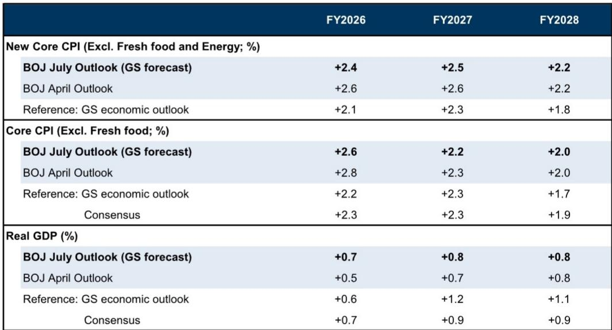

# GS：日本央行7月会议预计维持利率不变-下次调整或在2027年1月

日本宏观环境正在温和复苏，基本符合日本央行的评估。尽管当前价格趋势略显仍在调整，但GS预计上游成本上升将在未来传导至消费者价格。在此背景下，日本央行7月展望报告很可能维持其核心情景：宏观环境将以减速后的速度继续温和增长，CPI通胀将因原油价格上涨而上升，随后随着油价影响消退而回落。

这份报告的核心判断是：日本央行7月会议将维持政策不变，下一次利率调整更可能在2027年1月，而非市场此前预期的更早时间点。但报告同时指出，调整时机的概率分布已明显偏向前移，不排除10月调整的可能性。

## 1. 宏观环境基本面符合央行评估，企业研究意愿保持积极

6月日本央行短观调查确认，企业商业情绪依然良好，尽管中东局势存在不确定性，企业仍保持积极的研究立场。7月分行经理会议也显示，所有地区均报告宏观环境“温和复苏”或“回升”，尽管“部分地区出现了一些仍在调整”。这一评估与央行6月会议的整体判断基本一致。

GS认为，今年春季劳资谈判再次实现3%左右的基础工资涨幅，加上企业利润水平保持高位，日本宏观环境对高油价具有足够的缓冲能力。因此，央行很可能判断宏观环境前景不确定性平衡，而价格前景不确定性偏向上行。

## 2. 原油价格低于4月展望报告，央行可能上调增长预测并小幅下调通胀预测

与4月展望报告发布时相比，布伦特原油现货价格明显走低。尽管近期有所上涨，但整体水平仍低于4月。这一变化将缓解宏观环境节奏变化不确定性并减轻价格上涨不确定性。GS据此预计，日本央行将在7月展望报告中上调2026和2027财年宏观环境增长预测，同时基于能源价格下降等因素小幅下调通胀预测。

具体来看，GS预测日本央行对2026财年核心CPI（剔除新鲜食品和能源）的预测将从4月的+2.6%下调至+2.4%，2027财年从+2.6%下调至+2.5%。实际GDP预测方面，2026财年从+0.5%上调至+0.7%，2027财年从+0.7%上调至+0.8%。对于核心通胀达到2%的时点，GS预计央行将维持“2026财年下半年至2027财年之间”的判断。

> **KC评论：** 原油价格是理解日本央行通胀预测变动的关键变量。4月展望报告发布时油价处于相对高位，而7月报告面临的是油价回落后的新基准。这意味着央行通胀预测的下调更多反映外部输入因素变化，而非对国内需求或工资-通胀螺旋的重新评估。

## 3. 调整节奏：半年度一次仍是基准情景，但不确定性显著上升

自负利率政策解除以来的四次调整中，前两次发生在发布展望报告的会议（1月和4月），后两次则是在未发布展望报告的会议。GS指出，后两次调整前，央行行长与首相举行了会晤，央行在确认政府不会反对调整后做出了决定。特别是在当前政府下，市场动态和与政府沟通的进展在决定调整时机方面发挥着重要作用。

基于此，GS维持“大约半年度调整一次”的判断，认为下一次调整在2027年1月的可能性较高。但报告同时强调，随着政策利率持续上调，对宏观环境和价格的评估以及不确定性评估在未来的调整决策中将变得更加重要。由于央行在发布展望报告的会议（1月、4月、7月、10月）上积累了更充分的分析和评估，调整更可能发生在这些时点。

然而，GS也指出，央行强调的“核心通胀超过2%的不确定性”将是调整时机的重要决定因素。随着核心通胀接近2%，即使是日元进一步小幅贬值等微小变化，也可能显著增加核心通胀超过2%的不确定性。因此，报告判断下一次调整时机的概率分布已明显偏向前移，包括可能最早在10月调整。

## 4. 观察框架：关注三个变量判断调整节奏

对于市场参与者而言，判断日本央行调整节奏可以聚焦三个变量：一是原油价格走势，它直接影响央行的通胀预测和不确定性评估；二是日元汇率变化，小幅贬值可能改变央行对通胀超调不确定性的判断；三是央行与政府的沟通进展，特别是在当前政治环境下，这一因素的重要性显著上升。

这三个变量中任何一个出现超预期变化，都可能改变GS“半年度调整一次”的基准判断。报告特别指出，如果核心通胀超调不确定性成为现实，调整时点可能比市场当前预期更早到来。

---

For informational purposes only. Portions may be generated,translated,summarized,or edited with AI assistance based on source materials and may contain omissions or errors. Please verify independently. This is not investment,legal,tax,accounting,or other professional advice.

For informational purposes only. Portions may be generated,translated,summarized,or edited with AI assistance based on source materials and may contain omissions or errors. Please verify independently. This is not investment,legal,tax,accounting,or other professional advice.

