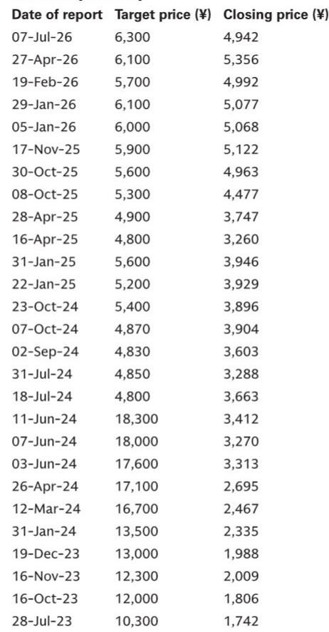
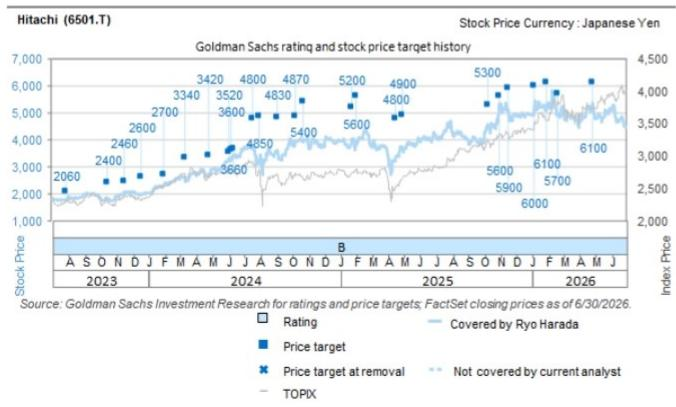
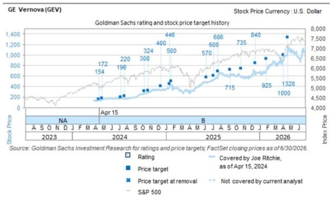

# 电网设备需求已非周期性波动：GE Vernova 业绩印证结构性转折，对日立能源具有直接参考意义

全球电网设备市场已跨越一个读者期待多年的验证节点。GE Vernova 电气化业务第二季度订单达63亿美元，同比增长93%，推动订单积压至446亿美元——较去年同期增长65%。这并非单季异常。该公司仅在本财年上半年就录得超过50亿美元的数据中心相关订单，已超过2025整个财年的总额。当季销售额达36亿美元，超出市场共识2亿美元，EBITDA为6.71亿美元，高于预期4100万美元。GE Vernova 据此将电气化部门全年销售指引从140-145亿美元上调至145-150亿美元。

对于关注日立的研究者而言，这些数字具有直接的横向参考价值。日立能源在变压器、开关设备、变电站和高压直流设备等相同产品类别中竞争，服务于包括公用事业、工业客户和超大规模数据中心运营商在内的相同终端市场。GE Vernova 订单增长的规模和构成，为日立能源即将公布的业绩可能呈现的趋势提供了前瞻指标。更重要的是，它们表明需求驱动因素正从替换周期和公用事业升级项目，转向由数据中心电气化、电网现代化和高压直流基础设施建设驱动的结构性更高增长轨道。

将电网设备视为稳定、与基础设施相关的传统业务框架已不再符合现实。仅数据中心领域，现在在六个月内产生的订单量就超过了上一财年的全年总额。固态变压器原型机正开始向超大规模客户发货。中压不间断电源系统正进入开发管线。这些进展都指向一个正被技术应用和产能限制重塑的市场，而不仅仅是受GDP增长或公用事业资本支出周期影响。

## 数据中心需求已成为主导订单驱动力，而非边际增量

GE Vernova 报告中最引人注目的数字是2026财年上半年录得的50亿美元数据中心相关订单。换个角度看，这一单一类别如今已超过该公司不久前整个电气化业务全年的订单量。仅第二季度就录得27亿美元，表明增速正在加快而非趋于平稳。GE Vernova 明确指出，这些订单包括固态变压器，这是一种针对数据中心架构更高效率电力转换的新型产品类别。

这不仅仅是数量上的故事。数据中心订单中的产品组合正转向更高价值、技术差异化的设备。GE Vernova 今年下半年向超大规模客户交付5MW室内固态变压器原型机，并已着手开发6MW室外版本，表明客户正在规划需要下一代电网接口设备的功率密度。中压UPS系统的开发，预计从2026年下半年至2027年开始获得订单，进一步证实数据中心市场正在拉动两年前尚未大规模存在的设备需求。

对于日立能源而言，这是最直接相关的信号。日立能源拥有自己的变压器和电力电子产品组合，并与GE Vernova竞争相同的超大规模和托管数据中心合同。GE Vernova 数据中心订单簿的规模表明，该领域电网设备的总体可寻址市场正以超出多数供应链当前服务能力的速度扩张。这意味着日立能源在即将公布的业绩中，其订单接收应反映出类似的动能，尤其是在两家公司均具有优势的变压器和变电站类别。

## 订单与销售比率揭示市场正超越当前产能

GE Vernova 第二季度订单约为销售额的1.7倍。对于工业设备业务而言，这是一个非常高的比率——通常订单出货比高于1.0被视为健康，高于1.2则为强劲。1.7的比率意味着需求远超交付能力，积压订单的增长速度快于收入确认速度。446亿美元的积压订单，同比增长65%，印证了这一动态。

这对日立能源的影响有两方面。首先，强劲的订单环境意味着日立能源可能正经历类似的需求压力，这应有助于提升收入可见性和定价能力。其次，行业范围内的产能限制意味着，拥有成熟全球生产网络且具备产能扩张能力的企业将获得不成比例的份额。GE Vernova 仅上半年在美国市场就获得8亿美元变压器订单，该公司将其归因于收购Prolec GE带来的优势，这说明了战略性产能扩张的价值。日立能源自身的制造布局及其履行交付承诺的能力，将成为此环境中的关键差异化因素。

18.4%的EBITDA利润率，同比提升390个基点，进一步印证了定价和产品组合的故事。仅靠销量增长无法解释如此幅度的利润率扩张。GE Vernova 将生产效率和价格改善列为额外驱动因素。在交货周期长、产能受限的市场中，供应商拥有多年来未曾享有的定价优势。日立能源应受益于同样的有利因素，其即将公布的业绩中的利润率趋势将是研究者关注的关键数据点。

## 固态变压器和高压直流设备代表下一增长层级，而非仅仅是上行期权

GE Vernova 业绩中提及固态变压器，其意义远超产品开发更新。固态变压器代表了在高密度环境（如数据中心和可再生能源并网点）中电力调节与分配的技术转变。GE Vernova 已向超大规模客户交付原型机并开发更大室外版本，表明该产品类别正从研发走向商业部署。

对于拥有自身电力电子和高压直流能力的日立能源而言，固态变压器的机会是直接可及的。高压直流设备已是日立能源的核心产品线，而高压直流技术与数据中心电力架构的融合是一个研究者应关注的新兴主题。随着超大规模客户建设更大规模、更高电力需求的园区，对高效长距离输电和高压电网互联的需求增加。日立能源现有的高压直流产品组合使其能够捕捉超越传统变压器和开关设备类别的需求。

中压UPS系统的开发，预计从2026年下半年开始获得订单，增加了另一个延伸可寻址市场的产品层级。这并非投机性的管线。GE Vernova 在明确的时间框架内瞄准特定订单，意味着客户沟通已相当深入。日立能源若有类似的产品开发努力，将代表尚未反映在共识预期中的额外收入来源。

## 评估日立能源前景的研究框架

GE Vernova 的业绩为评估日立能源的近期轨迹和长期定位提供了结构化方法。研究者应在日立发布业绩时关注四个具体指标。

首先，能源部门的订单增长率应直接与GE Vernova 93%的同比增长率进行比较。若幅度相当，将确认日立能源正捕捉相同的需求浪潮。若增长率较低，则需要解释原因——可能是产能限制、产品组合差异或地域覆盖缺口。

其次，应仔细审视数据中心订单的贡献。GE Vernova 披露上半年数据中心订单超过2025全年水平，设定了一个高标准。若日立能源显示出类似的加速，则验证了数据中心电气化是主要结构性驱动因素的论点。若数据中心订单占比较小，可能表明日立能源更侧重于公用事业和工业领域，这些领域虽在增长但速度较慢。

第三，利润率趋势比相对利润率水平更重要。GE Vernova 电气化业务EBITDA利润率同比提升390个基点，表明在此环境中定价和产品组合是强大的杠杆。日立能源的利润率变化将告诉研究者其是否拥有同等的定价能力和运营杠杆。

第四，应跟踪产品组合向固态变压器、高压直流设备和UPS系统的转变，作为收入质量的前瞻指标。高技术产品通常具有更好的利润率和更长的客户锁定周期。若日立能源在这些类别中取得进展，收入可见性将超越当前的变压器周期。

这一论点面临的风险不可忽视。投入成本（尤其是铜和电工钢）的急剧上升，即使收入增长也可能压缩利润率。大型输配电合同的延迟可能将收入确认推至后期。外汇波动，尤其是日元对美元升值，对日立的报告销售额和收益有直接的负面影响。全球宏观环境若削弱IT资本支出信心，可能减缓数据中心建设计划。这些都是实际考量，但它们被GE Vernova 业绩现已异常清晰地确认的基本需求驱动因素所抵消。

电网设备市场已进入一个由多重相互强化力量同时驱动的阶段：老旧基础设施替换、可再生能源整合以及数字基础设施的电气化。GE Vernova 第二季度业绩提供了迄今为止最有力的证据，表明这些力量不仅真实存在，而且在加速。对于日立能源而言，其参考意义直接且重大。问题已不再是需求环境是否强劲，而是日立能源是否拥有足够的产能、产品组合和运营执行力，以在一个增长快于行业供给能力的市场中获取其应得的份额。

*仅供参考。部分内容可能基于源材料通过AI辅助生成、翻译、摘要或编辑，可能存在遗漏或错误。请独立核实。本文不构成任何专业建议。*

仅供参考。部分内容可能基于源材料通过AI辅助生成、翻译、摘要或编辑，可能存在遗漏或错误。请独立核实。本文不构成任何专业建议。

