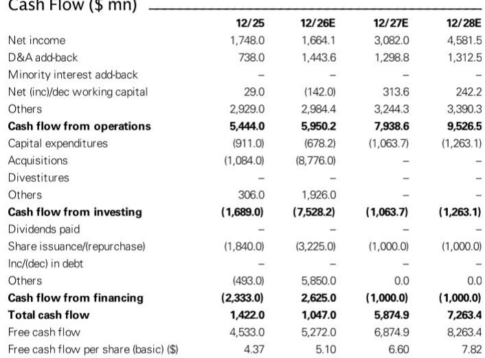
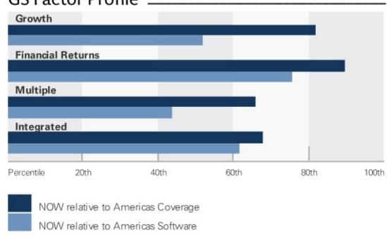
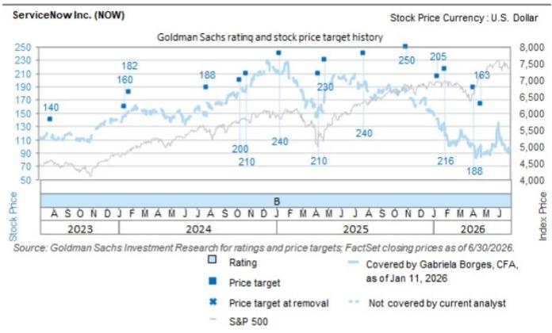

# ServiceNow 的 AI 年度合同价值已突破 10 亿美元——自主工作流能否延续这一趋势，将决定市场对其的重新评估

ServiceNow 第二季度订阅收入同比增长 23%，超出指引 175 个基点；当前剩余履约义务（cRPO）增长 21.5%，超出预期 200 个基点，且高于三年平均超预期幅度 150 个基点。公司股价在盘后交易中上涨约 5%。这些数字表现强劲，但真正的故事并非仅仅是一个超预期并上调指引的季度。决定 ServiceNow 未来估值倍数的最大单一因素，是公司能否证明其在企业 AI 技术栈中的相关性，而目前的证据正在积累，值得进行战略性的重新审视。

ServiceNow 的 AI 年度合同价值已突破 10 亿美元，重申了在 2026 年底前超越 15 亿美元 AI 年度合同价值目标的信心，并正朝着 2030 年 AI 年度合同价值占比 30% 的长期目标稳步推进。AI 新增年度合同价值环比增长超过 40%。拥有 AI 生产部署的客户数量在过去九个月内增长了九倍。首次购买 AI 产品的客户交易量同比增长 45%。这些并非增量数据点，而是代表了 ServiceNow 如何从其平台实现商业化的结构性转变。市场一直在等待证据，证明 AI 不仅是叙事，更是收入驱动力。本季度提供了这一证据，对行业参与者、竞争者和企业用户而言意义重大。

上一季度提到的销售周期延长、联邦业务板块的挤出效应以及宏观环境推迟等风险，并未成为实际阻力。相反，ServiceNow 吸收了这些交叉影响，并实现了广泛而深入的超预期表现。2026 财年订阅指引上调至此前区间的高端，目前预计按固定汇率计算同比增长 21.0%，中点上调 25 个基点。这不是一家安于现状的公司，而是一家正在加速进入仍处于早期阶段的产品周期的公司。

## 最重要的产品周期并非生成式 AI 聊天机器人——而是第一级 ITSM 自主服务

ServiceNow 最有趣的 AI 产品周期并非通用大语言模型的封装。它是面向 IT 支持服务台的第一级 IT 服务管理（ITSM）解决方案，已于 5 月全面上市。该产品可在无需人工干预的情况下解决 80-85% 的服务请求。这不是理论上的能力，而是一个可衡量的阈值，从根本上改变了企业 IT 运营的成本结构和服务水平。

作为背景，IT 帮助台历来是劳动密集型职能，一线支持人员处理密码重置、访问请求和基本故障排除。ServiceNow 的自主解决方案有效地消除了大部分此类工单。对客户而言，经济价值显而易见：减少一线支持人员、缩短平均解决时间、提高员工生产力。但对 ServiceNow 而言，战略价值更为深远。每一次自主解决都会生成关于任务复杂度、升级模式和用户行为的数据。这些数据反馈给模型，使其随着时间的推移变得更加高效。护城河不仅在于算法，更在于每一次交互都能改进算法的反馈循环。

ServiceNow 还推出了新的语音功能，一家航空公司客户目前将所有客户服务电话——每年五百万通——都运行在 ServiceNow 的语音 AI 上。这是一个重要的验证点。语音是客户服务的高风险渠道，用 AI 系统取代人工呼叫中心需要对其准确性、延迟和升级处理能力有充分的信任。一家大型航空公司将其全部入站通话量交给 ServiceNow 平台，这表明企业用户正在从试点项目转向全面生产部署。

第二个层面的影响是，随着这些自主解决方案的采用加速，由代理执行的任务复杂度将会增加。ServiceNow 将推动更多的辅助、更多的消耗，并最终实现更大的商业化。这不是一次性的提升，而是一个随着平台能力增强而不断累积的经常性收入加速器。

## AI 年度合同价值比核心工作流收入更有价值，因为它增加了客户粘性

观察者必须理解的一个关键区别是，AI 年度合同价值不仅仅是利润表上的一个新项目。它是一种性质不同的收入类型，具有更高的转换成本、与客户运营更深的整合度，以及更长的基于消耗的增长空间。核心工作流收入——ServiceNow 的 IT、客户服务和 HR 服务管理模块的订阅费用——虽然有价值，但在一定程度上可以被 Atlassian、BMC 和新进入者等竞争对手复制。相比之下，AI 年度合同价值建立在基于客户特定数据和工作流模式训练的专有模型之上。一旦客户部署了 ServiceNow 的自主 ITSM 解决方案，转向替代方案的成本和风险将变得难以承受。

数据支持这一论点。ServiceNow 正朝着 2030 年 AI 年度合同价值占比 30% 的长期目标稳步推进。当前轨迹表明，AI 年度合同价值可能在本十年结束前成为总年度合同价值的主导部分。这一转变改变了估值讨论的基调。历史上，ServiceNow 被视作一家拥有强劲经常性收入的高增长企业软件公司。如果 AI 年度合同价值成为主要增长引擎，其估值倍数应反映一家 AI 平台公司的特征：更高的毛利率、更长的客户生命周期，以及更具防御性的竞争地位。

AI 新增年度合同价值超过 40% 的环比增长尤其说明问题。这表明采用曲线正在变陡，而非趋平。九个月内拥有 AI 生产部署的客户数量增长九倍，表明早期采用者阶段正在过渡到早期大众阶段。首次购买 AI 产品的客户交易量同比增长 45%，证实了销售动作正在规模化推进。ServiceNow 不仅向现有客户群销售，还在以 AI 为切入点赢得新客户。

## 决策框架：决定 ServiceNow 能否维持其重新评估的三个条件

评估 ServiceNow 当前估值——基于 2025 财年预估约 52.5 倍市盈率，基于 2026 财年预估约 23.3 倍市盈率——的观察者需要一个清晰的决策框架。始于 AI 叙事的重新评估只有在满足三个条件时才能持续。

**条件一：自主解决方案必须持续为客户展示可衡量的回报。** ITSM 80-85% 的自主解决率令人印象深刻，但这只是一个数据点。观察者需要看到其他用例——客户服务、HR、现场服务管理——的类似指标。航空公司的语音 AI 部署令人鼓舞，但仅是一个客户。未来十二个月对于证明自主模型能够跨行业和工作流推广至关重要。如果 ServiceNow 能够展示在多样化部署中保持高自主解决率，叙事将得到加强。如果在更复杂的环境中解决率下降，质疑将卷土重来。

**条件二：AI 年度合同价值必须持续增长，且不蚕食核心订阅收入。** 存在一种理论上的风险，即 AI 解决方案可能减少对人工辅助工作流订阅的需求。如果客户用价格较低的自主解决方案取代价格较高的人工辅助服务台许可证，净收入影响可能是中性或负面的。迄今为止的数据表明情况相反——AI 部署正在推动额外的工作流执行和消耗。但这一动态需要持续关注。最乐观的情景是 AI 年度合同价值是增量性的，而非替代性的。

**条件三：竞争反应不得侵蚀 ServiceNow 的定价能力。** 微软、Salesforce 以及众多 AI 原生初创公司都在瞄准相同的企业工作流自动化机会。ServiceNow 的优势在于其与 IT 运营的深度整合以及十年的工作流数据积累。但竞争对手正在快速进步。ServiceNow 维持溢价定价的能力，将取决于其自主解决方案是否能比替代方案提供显著更优的结果。80-85% 的解决率是一个强有力的基准，但并非静态不变。观察者应关注季度评论或交易层面数据中任何定价压力的迹象。

## 业绩超预期是广泛的，但运营杠杆的故事仍在展开

第二季度运营收入为 11.73 亿美元，超出预期 12.4%，运营利润率为 29%，而市场共识为 27%。这是一个有意义的超预期惊喜，尤其是在公司正大力投资 AI 产品开发和市场拓展能力的情况下。利润率扩张表明，ServiceNow 即使在为增长而投资的同时，也在实现运营杠杆。2026 财年 157.7 亿美元的订阅收入预估意味着利润率持续改善，预计 2026 财年 EBIT 利润率将达到 31.5%，2028 财年达到 33.6%。

本季度自由现金流为 6.34 亿美元，略低于共识预期的 6.91 亿美元，利润率为 16%，而预期为 18%。这是一个小幅未达预期，但并非趋势。随着收入结构向利润率更高的 AI 解决方案转移，以及资本支出需求趋于稳定，自由现金流利润率预计将改善。2026 财年 52.7 亿美元的自由现金流预估意味着约 32.5% 的利润率，与公司历史表现一致。

资产负债表依然强劲，截至第二季度净现金为 22.35 亿美元，且近期无债务到期。公司拥有充足的资源用于内部投资和战略性并购。近期收购活动——反映在 2026 财年预估中 87.76 亿美元的投资现金流出——表明 ServiceNow 愿意通过获取技术和人才来加速其 AI 路线图。

## 需要关注的风险并非需求——而是 ServiceNow 能否保持其执行速度

对投资论点最重要的风险并非企业 AI 采用放缓，而是 ServiceNow 能否保持抓住机遇所需的执行速度。公司正在经历一个复杂的转型：它必须继续以 20% 以上的速度增长其核心工作流业务，同时规模化其 AI 平台。这一双重任务对工程、销售和客户成功组织都带来了压力。

研究中识别的三个下行风险——新市场拓展势头放缓、AI 解决方案采用不足以及被竞争对手 AI 技术替代、费用增长过快限制利润率扩张——都是真实存在的。前两个主要是收入风险，第三个是利润率风险。第二季度结果暂时缓解了这些担忧，但并未消除它们。

对 ServiceNow 而言，最危险的情景是竞争对手的 AI 解决方案，特别是那些嵌入更广泛平台（如 Microsoft Copilot）的解决方案，在功能上与 ServiceNow 的自主工作流达到同等水平。ServiceNow 的护城河是其工作流数据和整合深度。如果竞争对手能够使用基于合成或公开数据训练的通用 AI 模型复制这些能力，ServiceNow 的定价能力可能会被侵蚀。这是一个需要数年时间才能显现的风险，但它是公司面临的中心战略问题。

目前，证据支持看好的观点。ServiceNow 的 AI 年度合同价值已突破 10 亿美元，AI 新增年度合同价值环比增长超过 40%，并展示了自主解决方案可在无需人工干预的情况下解决 80-85% 的服务请求。始于 AI 叙事的市场重新评估，现在正得到财务结果的验证。重新评估的下一阶段将取决于 ServiceNow 能否在未来四到六个季度内维持这一轨迹。如果能做到，当前估值将显得保守。如果出现失误，估值倍数将迅速压缩。

对企业用户而言，战略问题同样清晰。ServiceNow 不再仅仅是一个工作流自动化平台。它正在成为企业 AI 代理的操作系统。采用 ServiceNow 自主解决方案的决定不仅仅是一个采购选择，更是对未来工作方式特定架构的一次押注。本季度的证据表明，这一押注正在获得回报。

*仅供参考。部分内容可能基于源材料通过 AI 辅助生成、翻译、总结或编辑，可能存在遗漏或错误。请独立核实。本文不构成任何专业建议。*

仅供参考。部分内容可能基于源材料通过 AI 辅助生成、翻译、总结或编辑，可能存在遗漏或错误。请独立核实。本文不构成任何专业建议。

