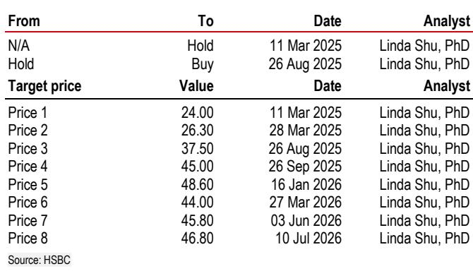
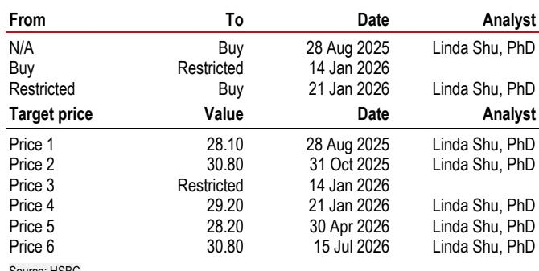
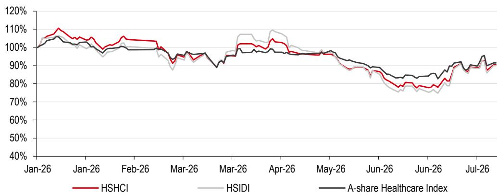

# HSBC：中国医疗健康非AI主题资金轮动

6月26日以来，中国A/H股医疗健康指数分别反弹11%和16%，同期跑赢恒生指数7个百分点、沪深300指数19个百分点。HSBC在最新一期行业更新中记录了这一轮上涨的触发因素：AI主题资金流出、科技与消费产品因上半年业绩预期而流入、以及资金向非AI板块轮动。报告基于过去两周在新加坡、香港和上海与超过30家机构客户的交流，发现读者正从一个月前的AI专家转向更广泛的行业配置，医疗健康成为这一轮资金迁移中讨论最集中的方向之一。

## 1. 资金轮动与CXO板块的持仓变化

HSBC观察到，本轮医疗健康板块的上涨并非由基本面单独驱动，而是资金结构变化的结果。AI产品平仓释放的资金，加上部分科技和消费产品因上半年业绩预期较好而进行的再配置，共同推动了对医疗健康板块的增持。其中，CXO板块成为北向资金最明显的受益者——二季度北向资金对CXO的持仓占比从一季度的7.03%升至9.93%，环比增加2.9个百分点，是医疗健康各子板块中相对少见获得显著增持的方向。相比之下，制药和医疗器械板块的北向持仓分别下降0.78和0.45个百分点。

> **KC评论：** 北向资金在CXO板块的持仓变化值得关注。二季度环比增加近3个百分点，而同期制药和器械板块都在减仓，说明外资在这一轮轮动中并非均匀配置医疗健康，而是集中选择了与全球创新链条关联更紧密的CXO赛道。

## 2. 全球读者对CDMO和生物科技的兴趣上升

报告指出，全球读者最关注的是CDMO和生物科技/制药两个子领域。药明康德因上半年业绩预期较高而被大量持有，药明生物和康龙化成则因2026-2028年增长加速和利润率扩张的前景更受偏好。在生物科技领域，信达生物和科伦博泰同时获得综合型和专业型读者的关注，其共同特点是国内增长扎实且全球故事可见。石药集团和翰森制药则因业务发展（BD）势头和估值分化而被广泛讨论。

HSBC认为，当AI主题波动时，中国医疗健康体系中具备全球增长故事的公司正在成为共识配置。这一判断与资金轮动的逻辑一致——读者寻找的不是防御性资产，而是有全球叙事支撑的进攻性板块。

## 3. 反弹持续性的核心争论与催化剂时间表

尽管板块已出现明显反弹，但HSBC的客户反馈显示，中国医疗健康仍处于低配状态。市场对反弹持续性的争论集中在三个维度：国内政策的不确定性，包括生物类似药集采、医疗器械集采和公立医院医疗服务价格调整；AI主题可能重新吸引资金，导致医疗健康板块资金外流；以及美国《生物安全法案》对跨境生物科技BD交易的潜在限制。

读者认为本轮反弹与价值发现相关，反映了上半年BD势头强劲但报价滞后的修复。市场预期反弹可能持续至7月底或9月初，即中期业绩披露前后。HSBC指出，中国生物科技的下一个催化剂将来自美国市场的商业化进展、ESMO数据以及Harmoni 3数据。从产品管线看，2026年计划提交NDA的产品包括科伦博泰的Trop 2 ADC、康诺亚的Claudin 18.2 ADC和康方生物的AK112；2027年进入III期的产品则包括翰森制药的B7H3和B7H4、贝达药业的CDK4以及信达生物的PD1/IL2。

## 4. 可复用的观察框架：从资金结构到催化剂映射

HSBC这份报告提供了一个可复用的分析框架：当市场主题切换时，先追踪资金流向的结构性变化，再判断哪些子板块和公司同时具备国内增长基础与全球叙事能力。北向资金在CXO板块的持仓变化是一个先行指标，而产品管线的商业化时间表则提供了后续验证节点。读者需要区分哪些公司的上涨来自资金轮动的短期推力，哪些来自基本面改善和全球BD进展的持续支撑。

HSBC维持对药明生物、康龙化成、康诺亚和信达生物的积极看法，认为中国CDMO和生物科技行业在全球扩张和临床数据读出的支持下，既有近期催化剂也有长期潜力。

For informational purposes only. Portions may be generated,translated,summarized,or edited with AI assistance based on source materials and may contain omissions or errors. Please verify independently. This is not investment,legal,tax,accounting,or other professional advice.

For informational purposes only. Portions may be generated,translated,summarized,or edited with AI assistance based on source materials and may contain omissions or errors. Please verify independently. This is not investment,legal,tax,accounting,or other professional advice.

