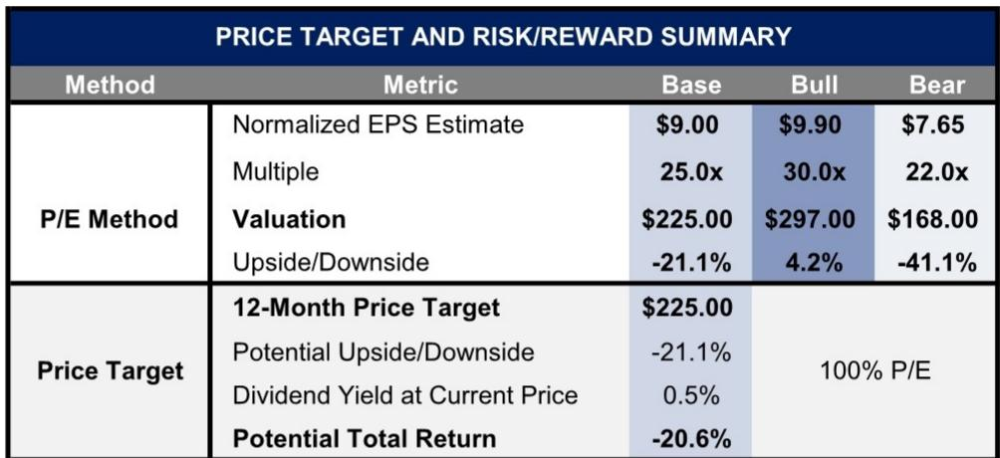
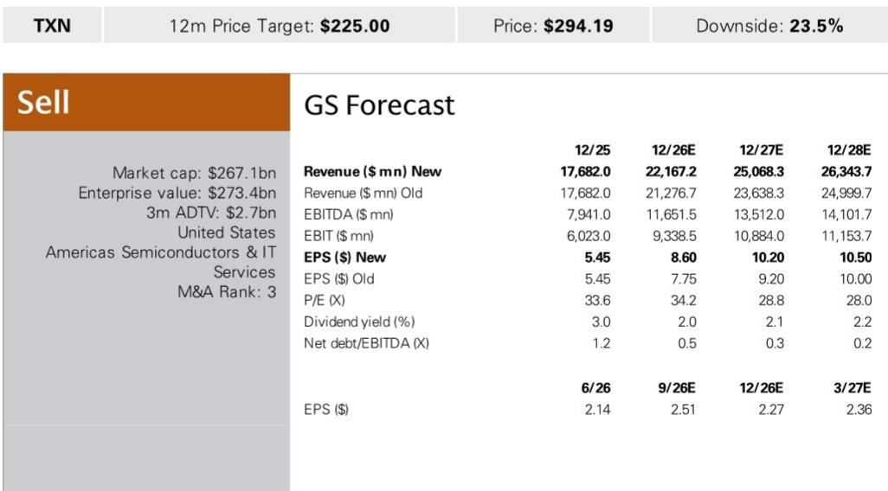
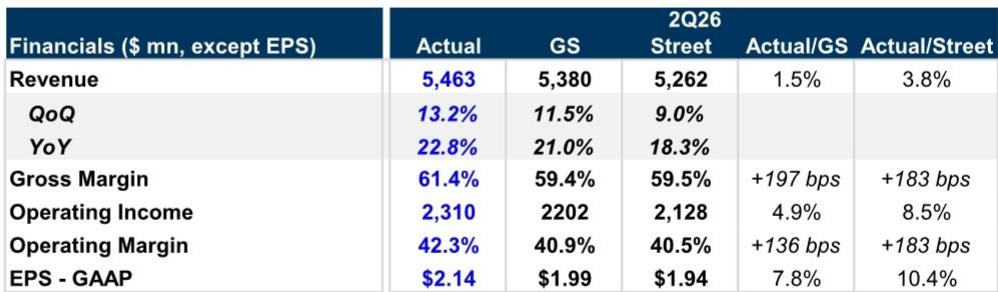

# GS：德州仪器业务与近期数据观察

德州仪器（TXN）2026年第二季度财报和第三季度指引均超出市场预期。GS在最新报告中指出，工业终端市场的强劲复苏以及汽车需求改善的初步迹象，为整个模拟芯片行业提供了积极的参照。第二季度营收54.6亿美元，高于GS预期的53.8亿美元和Visible Alpha一致预期的52.6亿美元；毛利率61.4%，显著高于GS预期的59.4%和一致预期的59.5%。每股收益2.14美元，同样超出GS预期的1.99美元和一致预期的1.94美元。

第三季度营收指引中值为59.0亿美元，高于GS预期的56.5亿美元和一致预期的56.3亿美元；每股收益指引中值2.40美元，同样高于GS预期的2.14美元和一致预期的2.18美元。这份报告的核心判断是：模拟芯片的周期性复苏正在加速，但不同公司的毛利率恢复节奏将出现分化。

## 1. 工业与汽车终端市场同时释放复苏信号

德州仪器第二季度工业收入环比增长约10%，超出GS预期。公司管理层在交流中表示，市场持续改善，需求正向汽车等领域扩散。汽车业务环比增长高个位数，个人电子同样高个位数增长，通信设备环比上升，数据中心收入环比增长20%。

这是本轮周期中首次出现工业与汽车两大终端市场同步改善。工业市场此前一直是模拟芯片需求仍在调整的板块，其环比增速超过10%表明去库存周期已基本结束。汽车业务的环比改善虽然仍处于早期阶段，但方向已明确。数据中心收入的高速增长则进一步强化了结构性需求的存在。

> **KC评论：** 工业与汽车同时改善是这份报告最值得关注的信号。过去几个季度市场一直关注工业需求恢复节奏，现在德州仪器的数据表明供应链的补库行为已经开始。读者可以对比其他模拟芯片公司的工业收入增速，判断这是行业性复苏还是个别公司的份额变化。

## 2. 库存天数下降13天，但毛利率恢复速度仍存观察点

德州仪器资产负债表上的库存环比减少约9000万美元至46亿美元，库存天数从209天降至196天。管理层表示将动态调整工厂负荷率以匹配客户需求。GS认为这一趋势对公司毛利率长期有利，但预计德州仪器的毛利率扩张速度将落后于同行。

第二季度毛利率61.4%，GS模型预计第三季度将升至约62.4%，环比改善约100个基点。但报告明确表示，同行（如微芯科技和恩智浦）在库存管理上更为主动，因此毛利率恢复速度可能更快，并伴随更大幅度的盈利上调。

GS将德州仪器2026至2028年每股收益预测平均上调9%，主要反映更高的营收和毛利率假设。但公司观点更新评级，核心逻辑正是毛利率扩张速度可能持续低于同行。

## 3. 模拟芯片板块的参照效应与公司间差异

GS预计这份财报将引发模拟芯片板块的积极反应，尤其是对汽车业务敞口较高的公司，包括恩智浦、安森美（公司观点）和亚德诺。报告认为德州仪器的业绩和指引为整个板块提供了需求改善的验证，但公司之间的毛利率路径将出现分化。

德州仪器当前库存天数仍高达196天，远高于历史正常水平。GS认为，在库存消化完成之前，公司的毛利率将持续承压。相比之下，微芯科技和恩智浦等同行在库存管理上更为审慎，因此毛利率恢复速度可能更快，盈利上调空间也更大。

这份报告提供了一个可复用的观察框架：在周期性复苏初期，营收增速和毛利率恢复速度是两个不同的变量。营收改善是行业性信号，但毛利率恢复速度取决于各公司的库存管理策略和产能利用率。德州仪器的高库存水平意味着其毛利率改善曲线可能更为平缓。

> **KC评论：** GS对德州仪器的报告观点评级并非看空模拟芯片复苏，而是认为同行在毛利率恢复上更具优势。读者在评估模拟芯片公司时，除了关注营收增速，更应关注库存天数和毛利率的环比变化幅度。德州仪器的库存天数从222天降至196天，但196天仍处于高位，这意味着毛利率改善空间有限。

## 4. 数据中心收入环比增长20%，结构性需求持续

德州仪器第二季度数据中心收入环比增长20%，延续了此前的高速增长态势。虽然数据中心在德州仪器整体营收中的占比仍低于工业和汽车，但其增速已显著高于其他终端市场。这一数据与GS对AI基础设施研究的判断一致：算力需求的扩张正在带动电源管理、信号链等模拟芯片的需求。

报告没有单独披露数据中心收入的相对金额，但20%的环比增速在所有终端市场中最高。结合此前几个季度的趋势，数据中心已成为模拟芯片行业最稳定的增长引擎之一。这一结构性需求不会因周期性波动而消失，而是会持续为相关公司提供增量。

基于25倍市盈率和9.00美元的常态化每股收益预测，报告认为节奏变化空间约21%。这一估值差异反映了市场对德州仪器毛利率恢复速度的预期与GS判断之间的分歧。

For informational purposes only. Portions may be generated,translated,summarized,or edited with AI assistance based on source materials and may contain omissions or errors. Please verify independently. This is not investment,legal,tax,accounting,or other professional advice.

For informational purposes only. Portions may be generated,translated,summarized,or edited with AI assistance based on source materials and may contain omissions or errors. Please verify independently. This is not investment,legal,tax,accounting,or other professional advice.

