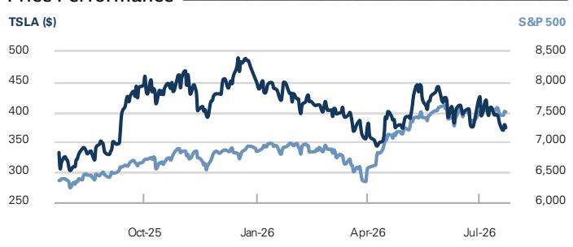

# Tesla Inc. (TSLA)

Business and technical progress in key markets, and costs of investments, remain in focus; 2Q wrap

TSLA 12m Price Target: \$360.00 Price: \$374.01 Downside: 3.7%

Key takeaways and implications

Tesla's 2Q non-GAAP EPS came in below both consensus estimates and our expectation driven by lower margins. This included from lower gross margins in the Automotive and Energy segments, as well as from higher opex. We think the lower 2Q profits were somewhat surprising to observers after the strong 2Q vehicle delivery report from early July. Specifically, 2Q revenue/gross margins/EBIT/non-GAAP EPS of \$28.2 bn/16.8%/\$398 mn/\$0.33 compared to company-compiled consensus at \$27.6 bn/19.5%/\$1,503 mn/\$0.55 and GS at \$28.5 bn/19.8%/\$1,805 mn/\$0.58.

We think commentary on Tesla's progress and outlook in key markets will likely be more of a focus for observers than the 2Q results, including those that are AI-related (e.g. FSD/robotaxis and Optimus), and in more traditional areas including EVs and energy. There were some signs of progress this quarter. For example: 1) Tesla commented on good commercial traction with FSD, especially in North America where management stated that attach rates are \~55% on new vehicle deliveries; 2) Tesla disclosed that it has had no material crash incidents in \~380K miles with its driverless robotaxis; 3) Tesla exited the quarter with its highest vehicle backlog in several years, and we think the Y L product cycle in western markets and FSD can be positive volume/margin drivers. However, Tesla also described Optimus as being a complex technical challenge with a likely quite flat and long initial ramp on the S-curve. In addition, the scale of Tesla's robotaxi fleet is still small relative to some competitors. Finally, on the cost to fund these investments, the company suggested capex could rise for another two to three years, and that its opex is also likely to increase.

We maintain our Neutral rating on the stock. We continue to believe that Tesla can benefit over time from its opportunities in

## NEUTRAL

Mark Delaney, CFA
+1(212)357-0535 | mark.delaney@gs.com
GS & Co. LLC

Will Bryant
+1(212)934-4705 | will.bryant@gs.com
GS & Co. LLC

Aman Gupta
+1(212)357-1549 | aman.s.gupta@gs.com
GS & Co. LLC

## Key Data

<table><tr><td colspan="2">Key Data</td></tr><tr><td></td><td>Market cap: $1.3tr</td></tr><tr><td></td><td>Enterprise value: $1.3tr</td></tr><tr><td></td><td>3m ADTV: $19.4bn</td></tr><tr><td></td><td>United States</td></tr><tr><td></td><td>Americas Autos &amp; Industrial Tech</td></tr><tr><td></td><td>M&amp;A Rank: 3</td></tr></table>

GS Forecast

<table><tr><td colspan="5">CS Forecast</td></tr><tr><td></td><td>12/25</td><td>12/26E</td><td>12/27E</td><td>12/28E</td></tr><tr><td>Revenue ($ mn) New</td><td>94,827.0</td><td>111,756.6</td><td>128,687.5</td><td>144,939.1</td></tr><tr><td>Revenue ($ mn) Old</td><td>94,827.0</td><td>112,367.6</td><td>127,030.5</td><td>139,995.9</td></tr><tr><td>EBITDA ($ mn)</td><td>14,596.0</td><td>15,928.2</td><td>24,825.2</td><td>31,054.2</td></tr><tr><td>EBIT ($ mn)</td><td>4,355.0</td><td>4,647.4</td><td>9,311.3</td><td>12,343.2</td></tr><tr><td>EPS ($) New</td><td>1.09</td><td>1.00</td><td>2.00</td><td>2.55</td></tr><tr><td>EPS ($) Old</td><td>1.09</td><td>1.65</td><td>2.35</td><td>2.75</td></tr><tr><td>P/E (X)</td><td>NM</td><td>NM</td><td>NM</td><td>146.6</td></tr><tr><td>Dividend yield (%)</td><td>0.0</td><td>0.0</td><td>0.0</td><td>0.0</td></tr><tr><td>Net debt/EBITDA (X)</td><td>(0.8)</td><td>(1.3)</td><td>(0.6)</td><td>(0.5)</td></tr><tr><td></td><td>6/26</td><td>9/26E</td><td>12/26E</td><td>3/27E</td></tr><tr><td>EPS ($)</td><td>0.05</td><td>0.31</td><td>0.43</td><td>0.24</td></tr></table>

GS Factor Profile

  
Source: Company data, GS estimates. See disclosures for details.

Tesla Inc. (TSLA)
Rating since Jun 25, 2023

Ratios & Valuation

<table><tr><td colspan="5">Ratios &amp; Valuation</td></tr><tr><td></td><td>12/25</td><td>12/26E</td><td>12/27E</td><td>12/28E</td></tr><tr><td>P/E (X)</td><td>NM</td><td>NM</td><td>NM</td><td>146.6</td></tr><tr><td>EV/EBITDA (X)</td><td>78.1</td><td>80.9</td><td>56.4</td><td>45.3</td></tr><tr><td>EV/sales (X)</td><td>12.0</td><td>11.5</td><td>10.9</td><td>9.7</td></tr><tr><td>FCF yield (%)</td><td>0.5</td><td>(0.5)</td><td>(0.5)</td><td>0.0</td></tr><tr><td>EV/DACF (X)</td><td>88.9</td><td>88.7</td><td>62.7</td><td>50.2</td></tr><tr><td>CROCI (%)</td><td>15.9</td><td>16.1</td><td>21.0</td><td>20.6</td></tr><tr><td>ROE (%)</td><td>5.0</td><td>4.4</td><td>8.3</td><td>9.3</td></tr><tr><td>Net debt/EBITDA (X)</td><td>(0.8)</td><td>(1.3)</td><td>(0.6)</td><td>(0.5)</td></tr><tr><td>Net debt/equity (%)</td><td>(13.5)</td><td>(23.0)</td><td>(13.3)</td><td>(12.0)</td></tr><tr><td>Interest cover (X)</td><td>12.9</td><td>12.7</td><td>23.3</td><td>30.9</td></tr><tr><td>Inventory days</td><td>57.3</td><td>56.2</td><td>61.0</td><td>60.8</td></tr><tr><td>Receivable days</td><td>17.3</td><td>15.6</td><td>15.2</td><td>15.1</td></tr><tr><td>Days payable outstanding</td><td>60.7</td><td>64.5</td><td>72.2</td><td>74.1</td></tr></table>

<table><tr><td colspan="5">Growth &amp; Margins (%)</td></tr><tr><td></td><td>12/25</td><td>12/26E</td><td>12/27E</td><td>12/28E</td></tr><tr><td>Total revenue growth</td><td>(2.9)</td><td>17.9</td><td>15.1</td><td>12.6</td></tr><tr><td>EBITDA growth</td><td>(15.6)</td><td>10.4</td><td>74.2</td><td>31.0</td></tr><tr><td>EPS growth</td><td>(46.5)</td><td>(8.0)</td><td>99.4</td><td>27.5</td></tr><tr><td>DPS growth</td><td>NM</td><td>NM</td><td>NM</td><td>NM</td></tr><tr><td>Gross margin</td><td>18.0</td><td>19.3</td><td>20.9</td><td>21.0</td></tr><tr><td>EBIT margin</td><td>4.6</td><td>4.2</td><td>7.2</td><td>8.5</td></tr></table>

Price Performance  
  
Source: FactSet. Price as of 22 Jul 2026 close.

Income Statement (\$ mn)

<table><tr><td colspan="5">Income Statement ($ mn)</td></tr><tr><td></td><td>12/25</td><td>12/26E</td><td>12/27E</td><td>12/28E</td></tr><tr><td>Total revenue</td><td>94,827.0</td><td>111,756.6</td><td>128,687.5</td><td>144,939.1</td></tr><tr><td>Cost of goods sold</td><td>(77,733.0)</td><td>(90,220.0)</td><td>(101,747.7)</td><td>(114,486.6)</td></tr><tr><td>SG&amp;A</td><td>(6,328.0)</td><td>(7,756.3)</td><td>(7,869.5)</td><td>(8,146.3)</td></tr><tr><td>R&amp;D</td><td>(6,411.0)</td><td>(9,132.9)</td><td>(9,759.0)</td><td>(9,963.0)</td></tr><tr><td>Other operating inc./(exp.)</td><td>-</td><td>-</td><td>-</td><td>-</td></tr><tr><td>EBITDA</td><td>10,503.0</td><td>11,593.2</td><td>20,193.9</td><td>26,456.0</td></tr><tr><td>Depreciation &amp; amortization</td><td>(6,148.0)</td><td>(6,945.8)</td><td>(10,882.6)</td><td>(14,112.8)</td></tr><tr><td>EBIT</td><td>4,355.0</td><td>4,647.4</td><td>9,311.3</td><td>12,343.2</td></tr><tr><td>Net interest inc./(exp.)</td><td>1,342.0</td><td>1,250.0</td><td>1,050.0</td><td>1,005.0</td></tr><tr><td>Income/(loss) from associates</td><td>-</td><td>-</td><td>-</td><td>-</td></tr><tr><td>Pre-tax profit</td><td>5,346.0</td><td>5,281.4</td><td>10,361.3</td><td>13,348.2</td></tr><tr><td>Provision for taxes</td><td>(1,439.0)</td><td>(1,416.1)</td><td>(2,175.9)</td><td>(2,803.1)</td></tr><tr><td>Minority interest</td><td>(61.0)</td><td>(62.0)</td><td>(70.0)</td><td>(88.0)</td></tr><tr><td>Preferred dividends</td><td>-</td><td>-</td><td>-</td><td>-</td></tr><tr><td>Net inc. (pre-exceptionals)</td><td>3,846.0</td><td>3,803.2</td><td>8,115.4</td><td>10,457.1</td></tr><tr><td>Net inc. (post-exceptionals)</td><td>3,794.0</td><td>3,803.2</td><td>8,115.4</td><td>10,457.1</td></tr><tr><td>EPS (basic, pre-except) ($)</td><td>1.19</td><td>1.09</td><td>2.15</td><td>2.75</td></tr><tr><td>EPS (diluted, pre-except) ($)</td><td>1.09</td><td>1.00</td><td>2.00</td><td>2.55</td></tr><tr><td>EPS (ex-ESO exp., dil.) ($)</td><td>--</td><td>--</td><td>--</td><td>--</td></tr><tr><td>DPS ($)</td><td>-</td><td>-</td><td>-</td><td>-</td></tr><tr><td>Div. payout ratio (%)</td><td>0.0</td><td>0.0</td><td>0.0</td><td>0.0</td></tr><tr><td>Wtd avg shares out. (basic) (mn)</td><td>3,224.8</td><td>3,500.6</td><td>3,780.7</td><td>3,800.7</td></tr><tr><td>Wtd avg shares out. (diluted) (mn)</td><td>3,526.3</td><td>3,789.9</td><td>4,055.7</td><td>4,097.6</td></tr></table>

<table><tr><td colspan="5">Balance Sheet ($ mn)</td></tr><tr><td></td><td>12/25</td><td>12/26E</td><td>12/27E</td><td>12/28E</td></tr><tr><td>Cash &amp; cash equivalents</td><td>17,950.0</td><td>29,265.6</td><td>21,912.6</td><td>22,340.8</td></tr><tr><td>Accounts receivable</td><td>4,576.0</td><td>4,965.3</td><td>5,731.9</td><td>6,299.1</td></tr><tr><td>Inventory</td><td>12,392.0</td><td>15,409.6</td><td>18,579.3</td><td>19,549.1</td></tr><tr><td>Other current assets</td><td>34,438.0</td><td>14,874.0</td><td>14,874.0</td><td>14,874.0</td></tr><tr><td>Total current assets</td><td>69,356.0</td><td>64,514.5</td><td>61,097.7</td><td>63,063.1</td></tr><tr><td>Net PP&amp;E</td><td>46,670.0</td><td>66,924.2</td><td>86,081.6</td><td>102,008.8</td></tr><tr><td>Net intangibles</td><td>381.0</td><td>328.0</td><td>288.0</td><td>248.0</td></tr><tr><td>Total investments</td><td>0.0</td><td>0.0</td><td>0.0</td><td>0.0</td></tr><tr><td>Other long-term assets</td><td>22,113.0</td><td>25,777.0</td><td>25,777.0</td><td>25,777.0</td></tr><tr><td>Total assets</td><td>137,806.0</td><td>156,818.8</td><td>172,519.3</td><td>190,371.9</td></tr><tr><td>Accounts payable</td><td>13,371.0</td><td>18,491.5</td><td>21,741.7</td><td>24,762.2</td></tr><tr><td>Short-term debt</td><td>-</td><td>-</td><td>-</td><td>-</td></tr><tr><td>Current lease liabilities</td><td>1,640.0</td><td>1,418.0</td><td>1,418.0</td><td>1,418.0</td></tr><tr><td>Other current liabilities</td><td>16,703.0</td><td>18,683.0</td><td>18,683.0</td><td>18,683.0</td></tr><tr><td>Total current liabilities</td><td>31,714.0</td><td>38,592.5</td><td>41,842.7</td><td>44,863.2</td></tr><tr><td>Long-term debt</td><td>6,736.0</td><td>7,924.0</td><td>7,924.0</td><td>7,924.0</td></tr><tr><td>Non-current lease liabilities</td><td>-</td><td>-</td><td>-</td><td>-</td></tr><tr><td>Other long-term liabilities</td><td>16,491.0</td><td>17,656.0</td><td>17,656.0</td><td>17,656.0</td></tr><tr><td>Total long-term liabilities</td><td>23,227.0</td><td>25,580.0</td><td>25,580.0</td><td>25,580.0</td></tr><tr><td>Total liabilities</td><td>54,941.0</td><td>64,172.5</td><td>67,422.7</td><td>70,443.2</td></tr><tr><td>Preferred shares</td><td>-</td><td>-</td><td>-</td><td>-</td></tr><tr><td>Total common equity</td><td>82,137.0</td><td>91,985.2</td><td>104,435.6</td><td>119,267.7</td></tr><tr><td>Minority interest</td><td>728.0</td><td>661.0</td><td>661.0</td><td>661.0</td></tr><tr><td>Total liabilities &amp; equity</td><td>137,806.0</td><td>156,818.8</td><td>172,519.3</td><td>190,371.9</td></tr><tr><td>BVPS ($)</td><td>23.29</td><td>24.27</td><td>25.75</td><td>29.11</td></tr></table>

<table><tr><td colspan="5">Cash Flow ($ mn)</td></tr><tr><td></td><td>12/25</td><td>12/26E</td><td>12/27E</td><td>12/28E</td></tr><tr><td>Net income</td><td>3,855.0</td><td>4,606.2</td><td>8,115.4</td><td>10,457.1</td></tr><tr><td>D&amp;A add-back</td><td>6,148.0</td><td>6,945.8</td><td>10,882.6</td><td>14,112.8</td></tr><tr><td>Minority interest add-back</td><td>-</td><td>-</td><td>-</td><td>-</td></tr><tr><td>Net (inc)/dec working capital</td><td>642.0</td><td>2,409.6</td><td>(686.1)</td><td>1,483.4</td></tr><tr><td>Others</td><td>4,102.0</td><td>4,168.0</td><td>4,335.0</td><td>4,375.0</td></tr><tr><td>Cash flow from operations</td><td>14,747.0</td><td>18,129.6</td><td>22,647.0</td><td>30,428.3</td></tr><tr><td>Capital expenditures</td><td>(8,527.0)</td><td>(25,282.0)</td><td>(30,000.0)</td><td>(30,000.0)</td></tr><tr><td>Acquisitions</td><td>(6,951.0)</td><td>17,338.0</td><td>-</td><td>-</td></tr><tr><td>Divestitures</td><td>-</td><td>-</td><td>-</td><td>-</td></tr><tr><td>Others</td><td>0.0</td><td>(7.0)</td><td>0.0</td><td>-</td></tr><tr><td>Cash flow from investing</td><td>(15,478.0)</td><td>(7,951.0)</td><td>(30,000.0)</td><td>(30,000.0)</td></tr><tr><td>Dividends paid</td><td>-</td><td>-</td><td>-</td><td>-</td></tr><tr><td>Share issuance/(repurchase)</td><td>-</td><td>-</td><td>-</td><td>-</td></tr><tr><td>Inc/(dec) in debt</td><td>40.0</td><td>757.0</td><td>-</td><td>-</td></tr><tr><td>Others</td><td>1,684.0</td><td>417.0</td><td>-</td><td>-</td></tr><tr><td>Cash flow from financing</td><td>1,620.0</td><td>1,137.0</td><td>0.0</td><td>0.0</td></tr><tr><td>Total cash flow</td><td>889.0</td><td>11,315.6</td><td>(7,353.0)</td><td>428.3</td></tr><tr><td>Free cash flow</td><td>6,116.0</td><td>(7,189.4)</td><td>(7,353.0)</td><td>428.3</td></tr><tr><td>Free cash flow per share (basic) ($)</td><td>1.90</td><td>(2.05)</td><td>(1.94)</td><td>0.11</td></tr></table>

Source: Company data, GS estimates.

several large markets, including autonomy, robotics, EVs and energy. However, the trajectory to that better profitability/FCF appears somewhat lower than we had previously expected over the near-to-medium term given headwinds to margins in 2Q and ongoing planned increases in investments in both opex and capex. In addition, while we expect improved growth from these areas to support an attractive long-term EPS CAGR, we also believe the magnitude and pace of that EPS improvement will be somewhat limited by competition (e.g. Tesla is facing several competitors in AVs, EVs, Energy and robotics) and by ongoing R&D/development needs on technology (for example with Optimus). Finally, we see valuation as full.

We lower our EPS estimates for 2026-2028 on lower EBIT margins, and adjust our 12-month price target to \$360 from \$390.

## Results

Tesla reported 2Q26 revenue of \$28,236 mn (up 26% qoq and up 26% yoy) which was 1% below GS at \$28,478 mn, 7% above the Street (FactSet) at \$26,423 mn, and 2% above company-compiled consensus at \$27,584 mn.

The total company gross margin (including SBC) was 16.8%, well below GS at 19.8%, company-compiled consensus at 19.5%, and the Street (FactSet) at 19.3%. The 1Q26 margin was 21.1%, and 2Q25 was 17.2%. By segment:

The automotive gross margin (including SBC, excluding regulatory credits) was 16.3%, well below both GS and the Street at 18.5%. Management cited costs of interest rate incentives (e.g. promotional APRs) and commodity costs as headwinds. The earnings deck cited lower vehicle ASPs (including due to mix) as a yoy headwind. Per the company, the non-GAAP auto gross margin would have been flattish sequentially when backing-out one-time benefits that were realized in 1Q.

The Energy segment gross margin of 20.4% was impacted by vendor cell related warranty costs of \~\$240 mn, and excluding this the margin would have been \~28% (similar to 1Q26 when excluding \~\$200 in one-time benefits from a tariff refund).

■ Services gross margin of 14.1% in 2Q was a record high.

EBIT (including SBC) of \~\$398 mn (1.4% of sales) was well below our forecast of \~\$1,805 mn (6.3% of sales) and company-compiled consensus of \$1,503 mn (5.4% of sales).

Company-reported non-GAAP diluted EPS (excluding SBC and non-cash mark to market adjustments) was \$0.33, \$0.25 below GS at \$0.58, \$0.20 below the Street at \$0.53 and \$0.22 below company-compiled consensus at \$0.55.

Cash, cash equivalents, and investments were down by \$1.2 bn qoq to \$43.5 bn, with FCF of -\$1,092 mn in 2Q.

## Product updates and roadmap

On automotive, the company highlighted its strong deliveries as being supported by record deliveries in several emerging markets like South Korea, Australia, Japan, and Colombia. Additionally, Tesla stated that the Semi truck is on track for start of production in 2026.

On FSD, Tesla FSD active subscribers grew to 1.5 mn (up 16% qoq and 56% yoy), and the company began v14 lite rollouts to U.S. and South Korean AI3/HW3 owners. Notably, FSD take-rates in North America were a record 55% in the quarter on new vehicle deliveries. Additionally, robotaxis are now running early versions of v15, which Tesla believes can enhance safety and performance.

On robotaxi, Tesla highlighted the start of production for its Cybercab purpose-built AV in 2Q, and expansions of unsupervised rides to Miami, Tampa, and Orlando in July. The deck indicates cumulative paid robotaxi miles approaching 2.5 mn (up from \~1.6-1.8 mn as of 1Q26). Per management, over 380k of these miles were fully unsupervised across its Texas and Florida operating areas (with the remainder being accounted for by vehicles with some form of supervision). Tesla expects to grow unsupervised robotaxi miles by double digits week on week (albeit off a low base). Going forward, Tesla reiterated its approach to scaling across cities (with limited fleet scaling in each city) and targeting increasingly faster times between city launches. Cybercab deployments will likely be limited, per management, as Cybercab needs to accumulate FSD miles given the new chassis relative to Model 3/Y.

On Optimus, Tesla commented that first-gen production lines are being installed for Optimus, with anticipated production in 2026. Management reiterated that production will follow an S-curve with the initial production being consistently low for a period of time. Tesla expects Optimus units to initially go to its academy for data collection and training, suggesting to us that it could take time before Optimus is deployed for useful work and/or external shipments in a material manner.

On battery efforts, the company noted progress on ramping vehicle pack capacity in Berlin, cathode production and lithium refining in Texas, and LFP cells for its energy storage products in Nevada. Additionally, Megapack 3 and Megablock remain on track for start of production in 2026.

On other efforts, Tesla noted that capacity build-out and ramps for multi-year initiatives in AI compute, solar, battery material, and semiconductor manufacturing are under way.

On financials, management expects opex and capex to grow as it works to scale its AI and energy efforts (e.g. Optimus, Semi, Cybercab, and solar). Tesla reiterated its expectation for capex to be >\$25 bn in 2026. Management also noted they would opportunistically secure debt facility agreements to borrow up to \$30 bn to support their capital deployment plans. Tesla also expects Energy margins to normalize in the low to mid 20% range longer-term, reflecting competition.

We detail results relative to GS and Street (FactSet) expectations on key financial metrics in the tables below.

Exhibit 1: TSLA variance summary
\$ mn, except for EPS and margins

<table><tr><td rowspan="2"></td><td colspan="4">2Q26</td><td colspan="3">Variance</td></tr><tr><td>Actual</td><td>GS</td><td>Street (FactSet)</td><td>Company complied consensus</td><td>vs. GS</td><td>vs. Street</td><td>vs. Company complied consensus</td></tr><tr><td>Model 3/Y</td><td>467,762</td><td></td><td></td><td></td><td></td><td></td><td></td></tr><tr><td>Other models (i.e. S/X/Cybertruck)</td><td>12,364</td><td></td><td></td><td></td><td></td><td></td><td></td></tr><tr><td>Vehicle deliveries</td><td>480,126</td><td></td><td></td><td></td><td></td><td></td><td></td></tr><tr><td>QoQ</td><td>34.1%</td><td></td><td></td><td></td><td></td><td></td><td></td></tr><tr><td>YoY</td><td>25.0%</td><td></td><td></td><td></td><td></td><td></td><td></td></tr><tr><td>Energy Deployments (GWh)</td><td>13.5</td><td></td><td></td><td></td><td></td><td></td><td></td></tr><tr><td>QoQ</td><td>53.4%</td><td></td><td></td><td></td><td></td><td></td><td></td></tr><tr><td>YoY</td><td>40.6%</td><td></td><td></td><td></td><td></td><td></td><td></td></tr><tr><td>Active FSD subscriptions (mns)</td><td>1.5</td><td></td><td></td><td></td><td></td><td></td><td></td></tr><tr><td>QoQ</td><td>15.6%</td><td></td><td></td><td></td><td></td><td></td><td></td></tr><tr><td>YoY</td><td>55.8%</td><td></td><td></td><td></td><td></td><td></td><td></td></tr><tr><td>Automotive ex. regulatory credits</td><td>20,370.0</td><td>20,249.7</td><td></td><td></td><td></td><td></td><td></td></tr><tr><td>Regulatory credits</td><td>146.0</td><td>390.0</td><td></td><td></td><td></td><td></td><td></td></tr><tr><td>Total Automotive</td><td>20,516.0</td><td>20,639.7</td><td></td><td>20,048.0</td><td>(0.6%)</td><td></td><td>2.3%</td></tr><tr><td>Energy generation &amp; storage</td><td>3,139.0</td><td>3,829.1</td><td></td><td>3,773.0</td><td>(18.0%)</td><td></td><td>(16.8%)</td></tr><tr><td>Service &amp; other</td><td>4,581.0</td><td>4,009.1</td><td></td><td>3,763.0</td><td>14.3%</td><td></td><td>21.7%</td></tr><tr><td>Total Revenue</td><td>28,236.0</td><td>28,477.9</td><td>26,423.0</td><td>27,584.0</td><td>(0.8%)</td><td>6.9%</td><td>2.4%</td></tr><tr><td>QoQ</td><td>26.
