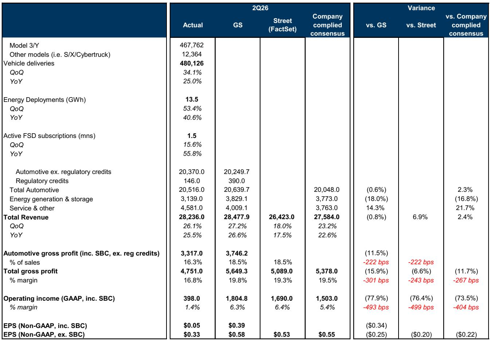
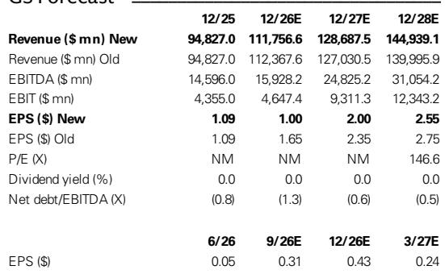
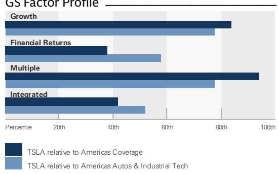

# 特斯拉第二季度财报：一家为尚未到来的未来大力投入的公司

特斯拉2026年第二季度财报发布后，市场反应超出预期。在7月初强劲的车辆交付报告之后，市场原本期待稳步进展。然而，公司报告的非GAAP每股收益为0.33美元，低于市场普遍预期的0.55美元和分析师预测的0.58美元。毛利率降至16.8%，较市场普遍预期的19.5%出现明显下降，且较第一季度的21.1%环比下滑。交付势头与盈利现实之间的差距，目前已成为特斯拉研究叙事中的核心张力。

毛利率压缩的原因并非单一因素，而是多重因素的叠加。汽车业务毛利率（不含监管积分）为16.3%，低于分析师和市场模型预期的18.5%。管理层将促销利率激励和商品价格带来的成本列为影响因素。财报还指出，由于产品组合变化导致的平均售价同比下降。能源业务板块毛利率受到不同冲击：约2.4亿美元的供应商相关保修成本将报告毛利率拉低至20.4%，而剔除该费用后，毛利率约为28%，与上一季度基本一致。

本季度的重要性不仅在于业绩不及预期的幅度，更在于它揭示了特斯拉的战略姿态。该公司同时在消化核心汽车业务的成本压力、扩大新兴的能源和AI业务，并为多年期计划增加资本支出。运营费用正在上升，管理层已表示运营支出和资本支出将继续增加。结果是，该公司今天正在减少利润，以建设可能数年后才能产生回报的能力。

对于观察者而言，问题不再是特斯拉在自动驾驶、机器人和能源领域是否具有长期选择权。问题是，当前的估值是否已经反映了这些未来价值——以及实现这些价值的路径是否比市场假设的更漫长、更昂贵。

## 第二季度业绩不及预期源于汽车和能源业务毛利率压缩，而非需求问题

特斯拉第二季度收入为282亿美元，超过公司汇总的市场普遍预期的276亿美元，这得益于韩国、澳大利亚、日本和哥伦比亚等多个新兴市场的创纪录交付量。需求端运行正常。问题在于成本和毛利率端。

公司整体毛利率为16.8%，比公司汇总的市场普遍预期低270个基点，比分析师预测低300个基点。汽车业务毛利率下降反映了在竞争日益激烈的环境中维持销量的成本。促销融资利率和商品成本上升直接降低了单车盈利能力。在非GAAP基础上，管理层表示，在调整第一季度实现的一次性收益后，汽车业务毛利率大致环比持平，这表明潜在趋势是在较低水平上企稳，而非暂时性下滑。

能源业务板块毛利率不及预期更具特殊性，但对该季度而言同样重要。与供应商电芯相关的2.4亿美元保修费用是一个独立事件，但它凸显了依赖第三方供应链的业务在规模化过程中的运营复杂性。剔除该费用后，能源业务毛利率约为28%，与第一季度（经关税退税收益调整后）相当。基础能源业务是健康的，但报告毛利率的波动性仍将是试图模拟正常化盈利能力的观察者面临的不确定性来源。

营业利润为3.98亿美元，占销售额的1.4%，而分析师预测为18亿美元，市场普遍预期为15亿美元。业绩不及预期的幅度令人瞩目：实际息税前利润约为市场预期的四分之一。自由现金流在本季度转为负值，为负11亿美元，现金及投资环比减少12亿美元至435亿美元。

业绩不及预期并非表明特斯拉的产品正在失去吸引力。它表明维持这种吸引力——以及为未来增长提供资金——的成本正在以快于收入的速度上升。

## 全自动驾驶和Robotaxi取得可衡量的进展，但商业化路径仍比乐观情景假设的更漫长

特斯拉的自动驾驶故事在第二季度在多个方面取得了进展。FSD活跃订阅用户达到150万，环比增长16%，同比增长56%。该公司开始向美国和韩国的AI3和HW3硬件车辆推送14 lite版本。最重要的是，北美新车交付的FSD选装率达到创纪录的55%，表明大多数新客户现在正在为该功能付费。

Robotaxi项目也取得了切实的里程碑。累计付费Robotaxi里程接近250万英里，高于第一季度的约160至180万英里。其中，超过38万英里是完全无人监督的，在德克萨斯州和佛罗里达州运营。管理层预计无人监督里程将以每周两位数的速度增长，尽管基数较低。该公司还在第二季度开始生产其专用Cybercab，并于7月将无人监督服务扩展到迈阿密、坦帕和奥兰多。

这些都是真实的成就。问题在于规模。特斯拉的Robotaxi车队相对于那些运营商业服务时间更长的竞争对手来说仍然很小。Cybercab虽然已投入生产，但初期部署将有限，因为它需要在一个不同于Model 3和Model Y的新底盘平台上积累FSD里程。该公司在每个城市部署有限车队的多城市启动战略是经过深思熟虑的，但这意味着Robotaxi运营的收入贡献在可预见的未来仍将微不足道。

紧张关系在于技术进展与商业重要性之间。FSD选装率很高，但每辆车的收入相对于开发和验证该技术的成本而言仍然较小。Robotaxi里程在增长，但基数如此之小，以至于即使快速的百分比增长也不会对财务产生重大影响。自动驾驶的方向性论点是正确的，但实现有意义的盈利的时间线正在延长，而非缩短。

## Optimus和能源面临漫长的爬坡周期，在产生回报之前将吸收资本

特斯拉的另外两个主要增长平台——Optimus和能源——面临类似的动态。两者都是拥有真实产品的真实业务，但都处于S曲线采用的早期阶段，在它们对盈利做出有意义的贡献之前，需要持续的投资。

关于Optimus，管理层确认第一代生产线正在安装，预计2026年投产。然而，评论明显有所保留。管理层将Optimus描述为一个复杂的技术挑战，并重申初始产量将在加速之前持续保持低位。最初的设备将进入特斯拉学院用于数据收集和训练，而非面向外部客户或生产性工作。这种表述表明，批量商业出货还需要数年时间，并且机器人业务在中期内将是一个现金消耗者，而非现金创造者。

能源业务板块呈现出更微妙的图景。基础业务强劲：剔除保修费用后，毛利率约为28%，公司继续扩大Megapack 3和Megablock的生产，两者均有望在2026年投产。然而，管理层预计能源业务毛利率长期将正常化至20%出头的水平，反映了竞争压力。该板块将会增长，但一些观察者可能期望的峰值毛利率不太可能持续。

Optimus和能源的共同点是，两者在达到规模之前都需要大量的前期资本和运营支出。特斯拉同时投资于AI计算、太阳能、电池材料和半导体制造。管理层预计2026年资本支出将超过250亿美元，并已表示资本支出可能在未来两到三年内继续上升。该公司还指出，它将适时签订债务融资协议，以借入高达300亿美元来支持其资本部署计划。

财务影响是明确的：特斯拉正在进入一个投资强度升高的时期，这将在短期内压缩自由现金流和资本回报率。分析师预测反映了这一点，预计2026年自由现金流为负72亿美元，2027年为负74亿美元，然后在2028年转为略微正值。该公司押注这些投资将在本十年后期创造盈利能力的阶跃变化，但实现这一结果的路径漫长且充满不确定性。

## 评估特斯拉当前估值下风险回报的决策框架

对于考虑以1.3万亿美元市值和尽管盈利预测下调但仍处于高位的远期市盈率来评估特斯拉的观察者而言，关键是将叙事与数字分开。以下框架将第二季度业绩和战略展望转化为结构化的决策过程。

首先，评估汽车业务的毛利率轨迹。核心问题是16.3%的汽车业务毛利率是底部还是通往更低水平的中间点。答案取决于电动汽车市场的竞争动态、通过激励措施维持销量的成本以及制造改进带来的成本降低速度。如果毛利率在当前水平附近企稳，2026年的盈利基础约为40亿美元的息税前利润，到2027年随着Model Y产品周期和FSD选装率提供支撑，将升至90亿美元。如果毛利率进一步恶化，盈利基础将受到侵蚀，估值将越来越依赖于未来的选择权。

其次，评估资本强度时间线。特斯拉关于资本支出可能在未来两到三年内继续上升的指引表明，自由现金流至少在2027年之前将保持负值或微不足道。该公司拥有435亿美元现金及投资的强劲资产负债表，但高达300亿美元的债务融资授权表明，管理层预计需要外部资金来维持投资计划。观察者应评估这些投入资本的回报是否会超过资本成本，以及时间跨度如何。

第三，权衡增长平台的概率加权价值。自动驾驶、机器人和能源各自都有潜力改变特斯拉的盈利能力，但它们也面临执行风险、竞争压力和监管不确定性。分析师预测每股收益从2026年的1.00美元增长到2028年的2.55美元，这意味着三年复合年增长率约为37%。这一增长率具有吸引力，但它依赖于所有三个平台同时成功规模化。其中任何一个平台的延迟或失望都将显著降低这一轨迹。

第四，将隐含估值与无风险利率和替代机会进行比较。以2028年约147倍的市盈率和45倍的企业价值/息税折旧摊销前利润来看，市场正在为长期论点的成功定价。分析师维持中性评级，反映了这样一种观点：长期机会是真实的，但近至中期的盈利轨迹低于此前预期，且当前估值已经包含了大部分上行空间。

该框架不会产生简单的观点或信号。它阐明了依赖关系。特斯拉的研究案例基于三个支柱：汽车业务毛利率企稳、自动驾驶和能源成功规模化，以及最终产生高于其成本回报的资本支出计划。第二季度业绩削弱了第一个支柱，并延长了第二个支柱的时间线。第三个支柱仍然完好但未经证实。对这三个支柱有高度信心的观察者会发现当前价格可以接受。那些看到其中任何一个支柱存在风险的观察者会发现安全边际不足。

*仅供参考。部分内容可能基于源材料通过AI辅助生成、翻译、总结或编辑，可能存在遗漏或错误。请独立核实。这不构成专业建议。*

仅供参考。部分内容可能基于源材料通过AI辅助生成、翻译、总结或编辑，可能存在遗漏或错误。请独立核实。这不构成专业建议。

