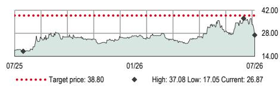
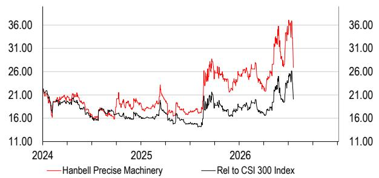
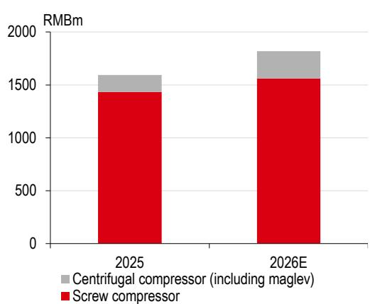
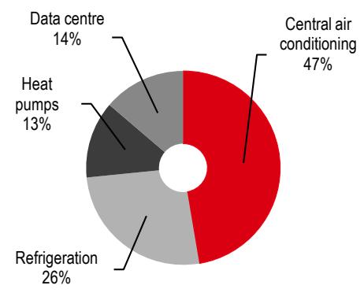
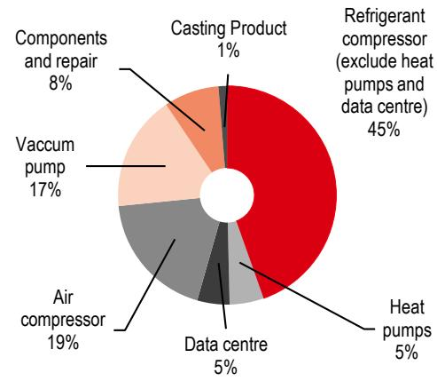
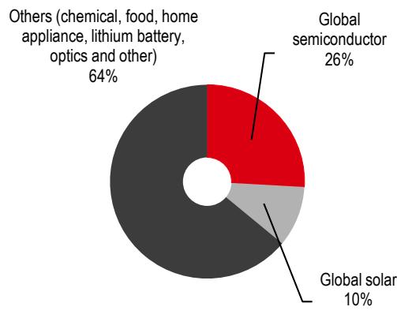

# 汉钟精机（002158 CH）

## 研究观点：关注可持续增长前景

- 2026年增长节奏可能不会很快，但我们认为2027年及2030年之后的增长前景可见度在提升

半导体业务将首先从低基数实现显著增长；AIDC和工业热泵业务将随后跟进

◆ 维持积极看法，目标价38.80元

**增长前景未受近期报价波动影响**：过去三个月，汉钟精机的报价呈现一定波动，与其他国内半导体设备公司表现一致。市场将汉钟精机视为半导体相关标的，我们认为主要原因是市场对AI发展驱动的国内半导体市场增长抱有较高预期，以及汉钟精机在半导体真空泵领域具有较大的市场份额提升潜力。我们预计汉钟精机的半导体真空泵收入将从2025年估计的1亿元增长至2026年的2.02亿元，考虑到该业务自2021年以来一直保持平稳，这一增长较为显著。我们预计该板块在2027年将增长更快，因为汉钟精机将完成更多下游客户的12英寸设备产品认证，包括存储芯片领域（详见第5-6页）。

**市场规模是关键**：我们看好汉钟精机的主要原因是其涉足多个市场规模较大的行业，这有望确保公司未来十年的持续增长。虽然美国AIDC制冷剂压缩机的供应短缺问题看起来不如其他一些设备严重，但我们最新预测的2028年全球数据中心磁悬浮压缩机市场规模为169亿元（第3-4页），这表明汉钟精机具有可观的增长潜力。我们认为下游AIDC散热解决方案提供商不会仅依赖丹佛斯供应磁悬浮压缩机，将会寻找第二或第三供应商。此外，虽然国内工业热泵市场在2026年上半年的增长慢于我们预期，但这并未改变我们的长期研究逻辑。目前，工业热泵需求实际上正在帮助汉钟精机缓解中央空调和制冷市场的增长放缓。2026年上半年，国内数据中心需求和工业热泵市场分别同比增长13.6%和15.5%。我们也关注欧洲工业热泵市场的潜力（第8-9页）。

**维持积极看法；2026-28年盈利预测及38.80元目标价不变**：我们未对2026-28年净利润预测及基于DCF的目标价（38.80元）做出调整。该报价对应2026年预期市盈率23.8倍和2027年预期市盈率17.6倍，而自2016年以来的历史平均市盈率为19倍。我们的目标价38.80元意味着较当前报价有44.4%的空间，因此我们维持积极看法。关键下行风险详见第11页。

## 披露与免责声明

本报告必须结合披露附录中的披露内容、分析师认证以及构成报告一部分的免责声明一起阅读。

## 机械设备

中国

## 维持积极看法

目标价（人民币） 前期目标价（人民币）

38.80 38.80

报价（人民币） 上行/下行空间

26.87 +44.4%

## 市场数据

<table><tr><td>市值（百万元人民币）</td><td>14368.0</td></tr><tr><td>市值（百万美元）</td><td>2120.2</td></tr><tr><td>3个月日均交易量（百万美元）</td><td>88.1</td></tr></table>

<table><tr><td>自由流通比例</td><td>39%</td></tr><tr><td>彭博代码</td><td>002158 CH</td></tr><tr><td>路透代码</td><td>002158.SZ</td></tr></table>

财务数据与比率（人民币）

<table><tr><td>年度截止</td><td>12/2025a</td><td>12/2026e</td><td>12/2027e</td><td>12/2028e</td></tr><tr><td>HSBC QH 每股收益</td><td>0.88</td><td>1.13</td><td>1.53</td><td>2.15</td></tr><tr><td>HSBC QH 每股收益（前期）</td><td>0.88</td><td>1.13</td><td>1.53</td><td>2.15</td></tr><tr><td>变化（%）</td><td>0.0</td><td>0.0</td><td>0.0</td><td>0.0</td></tr><tr><td>市场一致预期每股收益</td><td>1.13</td><td>1.11</td><td>1.36</td><td>1.64</td></tr><tr><td>市盈率（倍）</td><td>30.7</td><td>23.8</td><td>17.6</td><td>12.5</td></tr><tr><td>股息率（%）</td><td>1.7</td><td>2.2</td><td>2.9</td><td>4.1</td></tr><tr><td>企业价值/EBITDA（倍）</td><td>19.7</td><td>16.1</td><td>12.0</td><td>8.4</td></tr><tr><td>净资产回报表现（%）</td><td>10.9</td><td>13.2</td><td>16.4</td><td>20.5</td></tr></table>

52周报价（人民币）

来源：LSEG IBES，HSBC前海证券估计

王敦\*，CFA，CPA（注册编号S1700519060002）
分析师，A股工业与新能源研究
HSBC前海证券有限公司
dun.wang@hsbcqh.com.cn
+86 21 5066 2027

陈伟杰\*（注册编号S1700518100001）
主管，A股工业与新能源研究
HSBC前海证券有限公司
corey.chan@hsbcqh.com.cn
+86 21 5066 2001

\*受雇于HSBC证券（美国）公司的非美国关联机构，未根据FINRA规定注册/取得资格

新兴市场情绪调查第24期
点击查看

报告发行人：HSBC前海证券有限公司

查看HSBC前海证券：https://www.research.hsbc.com

## 财务与估值：汉钟精机

财务报表

<table><tr><td>年度截止</td><td>12/2025a</td><td>12/2026e</td><td>12/2027e</td><td>12/2028e</td></tr><tr><td colspan="5">利润表摘要（百万元人民币）</td></tr><tr><td>营业收入</td><td>2926.7</td><td>3428.9</td><td>4370.7</td><td>5586.8</td></tr><tr><td>EBITDA</td><td>670.5</td><td>770.6</td><td>1004.8</td><td>1379.4</td></tr><tr><td>折旧与摊销</td><td>-130.8</td><td>-100.3</td><td>-113.0</td><td>-124.6</td></tr><tr><td>营业利润/EBIT</td><td>539.7</td><td>670.3</td><td>891.8</td><td>1254.8</td></tr><tr><td>净利息</td><td>-19.9</td><td>-1.4</td><td>14.9</td><td>21.1</td></tr><tr><td>税前利润</td><td>519.8</td><td>668.9</td><td>906.7</td><td>1275.9</td></tr><tr><td>HSBC前海税前利润</td><td>519.8</td><td>668.9</td><td>906.7</td><td>1275.9</td></tr><tr><td>所得税</td><td>-50.0</td><td>-64.4</td><td>-87.2</td><td>-122.8</td></tr><tr><td>净利润</td><td>468.7</td><td>603.2</td><td>817.6</td><td>1150.5</td></tr><tr><td>HSBC前海净利润</td><td>468.7</td><td>603.2</td><td>817.6</td><td>1150.5</td></tr><tr><td colspan="5">现金流量表摘要（百万元人民币）</td></tr><tr><td>经营活动现金流</td><td>778.5</td><td>1390.4</td><td>915.3</td><td>1227.6</td></tr><tr><td>资本支出</td><td>-416.8</td><td>-292.0</td><td>-292.0</td><td>-292.0</td></tr><tr><td>投资活动现金流</td><td>-416.8</td><td>-292.0</td><td>-292.0</td><td>-292.0</td></tr><tr><td>股息</td><td>-240.6</td><td>-309.6</td><td>-419.7</td><td>-590.6</td></tr><tr><td>净债务变动</td><td>-341.2</td><td>-810.2</td><td>-313.7</td><td>-516.0</td></tr><tr><td>自由现金流（股权）</td><td>361.7</td><td>1098.4</td><td>623.3</td><td>935.6</td></tr><tr><td colspan="5">资产负债表摘要（百万元人民币）</td></tr><tr><td>无形资产</td><td>211.5</td><td>201.5</td><td>196.3</td><td>191.2</td></tr><tr><td>有形固定资产</td><td>1100.9</td><td>1293.4</td><td>1477.5</td><td>1650.2</td></tr><tr><td>流动资产</td><td>4207.3</td><td>4492.5</td><td>5115.7</td><td>6018.8</td></tr><tr><td>现金及其他</td><td>1823.5</td><td>2642.6</td><td>2956.3</td><td>3472.3</td></tr><tr><td>总资产</td><td>6252.0</td><td>6719.7</td><td>7521.9</td><td>8592.5</td></tr><tr><td>经营性负债</td><td>1175.4</td><td>1270.0</td><td>1562.4</td><td>1899.5</td></tr><tr><td>总债务</td><td>678.4</td><td>687.3</td><td>687.3</td><td>687.3</td></tr><tr><td>净债务</td><td>-1145.1</td><td>-1955.3</td><td>-2269.0</td><td>-2785.0</td></tr><tr><td>股东权益</td><td>4372.8</td><td>4735.4</td><td>5243.3</td><td>5974.1</td></tr><tr><td>投入资本</td><td>2520.8</td><td>2074.9</td><td>2270.9</td><td>2488.4</td></tr></table>

比率、增长与每股分析

积极看法

估值数据

<table><tr><td>年度截止</td><td>12/2025a</td><td>12/2026e</td><td>12/2027e</td><td>12/2028e</td></tr><tr><td>企业价值/销售收入</td><td>4.5</td><td>3.6</td><td>2.8</td><td>2.1</td></tr><tr><td>企业价值/EBITDA</td><td>19.7</td><td>16.1</td><td>12.0</td><td>8.4</td></tr><tr><td>企业价值/投入资本</td><td>5.2</td><td>6.0</td><td>5.3</td><td>4.7</td></tr><tr><td>市盈率*</td><td>30.7</td><td>23.8</td><td>17.6</td><td>12.5</td></tr><tr><td>市净率</td><td>3.3</td><td>3.0</td><td>2.7</td><td>2.4</td></tr><tr><td>自由现金流回报表现（%）</td><td>2.5</td><td>7.6</td><td>4.3</td><td>6.5</td></tr><tr><td>股息率（%）</td><td>1.7</td><td>2.2</td><td>2.9</td><td>4.1</td></tr></table>

\* 基于HSBC前海每股收益（摊薄）

ESG指标

<table><tr><td>环境指标</td><td>12/2025a</td></tr><tr><td>温室气体排放强度*</td><td>不适用</td></tr><tr><td>能源强度*</td><td>不适用</td></tr><tr><td>二氧化碳减排政策</td><td>有</td></tr><tr><td>社会指标</td><td>12/2025a</td></tr><tr><td>员工成本占收入比例</td><td>不适用</td></tr><tr><td>员工流动率（%）</td><td>不适用</td></tr><tr><td>多元化政策</td><td>有</td></tr></table>

来源：公司数据，HSBC前海证券

<table><tr><td>治理指标</td><td>12/2025a</td></tr><tr><td>董事会成员人数</td><td>9</td></tr><tr><td>董事会平均任期（年）</td><td>3.2</td></tr><tr><td>女性董事会成员比例（%）</td><td>11.1</td></tr><tr><td>董事会成员独立性（%）</td><td>33.3</td></tr></table>

\* 温室气体强度和能源强度分别以千克和千瓦时为单位，按千美元收入计量

发行人信息

<table><tr><td>报价（人民币）</td><td>26.87</td><td>自由流通比例</td><td>39%</td></tr><tr><td>目标价（人民币）</td><td>38.80</td><td>行业</td><td>机械设备</td></tr><tr><td>路透代码（股权）</td><td>002158.SZ</td><td>国家/地区</td><td>中国</td></tr><tr><td>彭博代码（股权）</td><td>002158 CH</td><td>分析师</td><td>王敦，CFA，CPA</td></tr><tr><td>市值（百万美元）</td><td>2120.2</td><td>联系方式</td><td>+86 21 5066 2027</td></tr></table>

<table><tr><td>年度截止</td><td>12/2025a</td><td>12/2026e</td><td>12/2027e</td><td>12/2028e</td></tr><tr><td colspan="5">同比变化率</td></tr><tr><td>营业收入</td><td>-20.3</td><td>17.2</td><td>27.5</td><td>27.8</td></tr><tr><td>EBITDA</td><td>-38.6</td><td>14.9</td><td>30.4</td><td>37.3</td></tr><tr><td>营业利润</td><td>-43.6</td><td>24.2</td><td>33.0</td><td>40.7</td></tr><tr><td>税前利润</td><td>-48.6</td><td>28.7</td><td>35.5</td><td>40.7</td></tr><tr><td>HSBC前海每股收益</td><td>-45.7</td><td>28.7</td><td>35.5</td><td>40.7</td></tr><tr><td colspan="5">比率（%）</td></tr><tr><td>营业收入/投入资本（倍）</td><td>1.2</td><td>1.5</td><td>2.0</td><td>2.3</td></tr><tr><td>投入资本回报率</td><td>20.6</td><td>26.6</td><td>37.3</td><td>47.9</td></tr><tr><td>净资产回报表现</td><td>10.9</td><td>13.2</td><td>16.4</td><td>20.5</td></tr><tr><td>总资产回报表现</td><td>7.6</td><td>9.3</td><td>11.5</td><td>14.3</td></tr><tr><td>EBITDA利润率</td><td>22.9</td><td>22.5</td><td>23.0</td><td>24.7</td></tr><tr><td>营业利润率</td><td>18.4</td><td>19.5</td><td>20.4</td><td>22.5</td></tr><tr><td>EBITDA/净利息（倍）</td><td>33.7</td><td>552.7</td><td></td><td></td></tr><tr><td>净债务/权益</td><td>-26.0</td><td>-41.1</td><td>-43.0</td><td>-46.4</td></tr><tr><td>净债务/EBITDA（倍）</td><td>-1.7</td><td>-2.5</td><td>-2.3</td><td>-2.0</td></tr><tr><td colspan="5">经营活动现金流/净债务</td></tr><tr><td colspan="5">每股数据（人民币）</td></tr><tr><td>每股收益（报告，摊薄）</td><td>0.88</td><td>1.13</td><td>1.53</td><td>2.15</td></tr><tr><td>HSBC前海每股收益（摊薄）</td><td>0.88</td><td>1.13</td><td>1.53</td><td>2.15</td></tr><tr><td>每股股息</td><td>0.45</td><td>0.58</td><td>0.78</td><td>1.10</td></tr><tr><td>每股账面价值</td><td>8.18</td><td>8.86</td><td>9.81</td><td>11.17</td></tr></table>

价格相对走势

来源：HSBC前海证券
注：报价截至2026年7月17日收盘

## 关于AIDC业务的深入分析

## 更好的还在后面

2026年，多家全球领先的HVAC企业（见图表1）表示，数据中心冷却已成为其增长的关键驱动力之一。其中一些HVAC企业，如特灵或开利，拥有内部压缩机制造能力，但也从外部采购某些类型的制冷剂压缩机。例如，丹佛斯一直是其中几家公司磁悬浮压缩机的热门选择（来源：丹佛斯官网）。我们认为，这为汉钟精机等专业压缩机制造商带来了机会，尤其是当下一代AIDC需要高性能压缩机（如磁悬浮压缩机或气体轴承制冷压缩机）时。

由于汉钟精机的大部分新产品（例如大容量磁悬浮压缩机）正在接受下游客户的认证和测试，我们相信汉钟精机的制冷剂板块在2027年可以实现快速增长。虽然我们预计汉钟精机的离心压缩机（包括磁悬浮压缩机）销售额在2026年上半年将同比显著增长（部分受数据中心驱动，部分受制冷或热泵需求驱动），但我们注意到基数仍然较低，因此2026年预期增长的相对值在一定程度上有限。我们估计，2025年离心压缩机约占其制冷剂板块总收入的10%，其余大部分为螺杆压缩机。

图表1. 全球领先的AIDC HVAC企业及其与汉钟精机的关系

<table><tr><td></td><td>近期数据中心相关订单</td><td>与汉钟精机的关系</td></tr><tr><td>特灵</td><td>2026年第一季度CHVAC订单/收入表现突出，分别增长约40%/高个位数。服务增长强劲，收入实现两位数增长。三年累计收入增长约50%（应用业务增长超过80%）</td><td>正在接洽，探讨汉钟精机能否为AIDC供应磁悬浮压缩机</td></tr><tr><td>开利</td><td>2026年第一季度全球CHVAC3订单增长35%，数据中心订单增长超过500%</td><td>汉钟精机一直在为空调供应压缩机；正在接洽，探讨能否为AIDC供应磁悬浮压缩机</td></tr><tr><td>约克（江森自控旗下）</td><td>2026财年第一季度新订单总额（含HVAC）同比增长39%，第二财季同比增长30%。在美洲，第二财季有机收入增长7%，主要受应用HVAC持续强劲和服务的稳健两位数增长推动</td><td>汉钟精机一直在为空调供应螺杆主机；正在接洽，探讨能否为AIDC供应磁悬浮压缩机</td></tr><tr><td>维谛</td><td>全球领先的液冷解决方案提供商，旗下也有生产冷水机组的子公司</td><td>正在测试和认证汉钟精机的压缩机</td></tr><tr><td>高力</td><td>其冷水机组产能已升级至千吨级，成功进入北美市场；与鸿海进行换股战略联盟后，在美国AIDC基础设施方面开展了深度合作</td><td>一旦高力获得美国AIDC的HVAC合同，汉钟精机将成为主要压缩机供应商</td></tr><tr><td>顿汉布什（冰轮环境旗下）</td><td>美国AIDC冷水机组需求上升，公司正在扩大产能</td><td>汉钟精机正在为美国AIDC的压缩机组供应螺杆主机</td></tr></table>

来源：公司数据，HSBC前海证券

## AIDC压缩机市场规模

正如我们在2025年11月26日发布的报告《汉钟精机（002158 CH）：积极看法：读者反馈》中所述，对于数据中心使用的制冷剂压缩机，我们估计螺杆压缩机成本约为每GW 6亿元，磁悬浮压缩机成本约为每GW 10-15亿元（来源：《2025年中国压缩机行业发展年鉴》）。该估计基于我们估算的总市场规模除以国内建设的数据中心数量。

我们可以使用另一种方法来交叉验证上述估计是否合理。根据压缩机制造商XecaTurbo官网（2026年7月3日）的数据，对于一个总功率需求为12.5MW、PUE为1.25的数据中心，冷却系统功率（主要是制冷剂压缩机）通常为2MW。因此，我们可以假设压缩机功率负载通常为数据中心总功率负载的20%。根据Tradeindia.com（一个压缩机交易平台）和Broad USA（一家美国HVAC服务供应商）的数据（2026年7月13日），大型工业冷水机组使用的磁悬浮（磁轴承）制冷剂压缩机的价格通常在每千瓦500至700美元之间。对于一个总功率为1GW的数据中心，需要200MW的压缩机；如果包括冗余备用压缩机，压缩机需求可能达到240MW。如果应用每千瓦500至700美元的价格区间，总价值范围为每GW数据中心总功率1.2亿至1.68亿美元。因此，这个价值估计与我们之前使用不同方法得出的估计相近。

根据麦肯锡（2026年2月24日）的数据，2028年全球新增数据中心装机量可能达到24.1GW。如果我们假设磁悬浮压缩机的渗透率为70%，每GW价值为10亿元，那么2028年全球数据中心磁悬浮压缩机市场规模可能达到169亿元。这是一个足够大且具有吸引力的市场。

## 并非完美，但对汉钟精机而言是不错的机会

与AIDC的许多其他组件（如燃气轮机、电容器、存储芯片或大型电力变压器）相比，制冷剂压缩机的供应短缺问题目前看起来并不那么严重，且可寻址市场规模并非最大。许多北美本地的AIDC散热解决方案提供商能够供应部分制冷剂压缩机（尽管并非全部，如磁悬浮压缩机或螺杆压缩机主机）。

产品差异化在该领域至关重要。压缩机是AIDC冷水机组引擎的核心，也是性能和效率的最大驱动因素之一。江森自控首席执行官在2026年5月6日的第二财季业绩电话会议上表示，约克专门为数据中心等需要高容量、高精度和高可靠性的应用设计其压缩机。他表示，虽然行业大部分依赖第三方压缩机平台，但约克设计并制造自己的特定应用压缩机架构。

我们估计，2028年全球数据中心磁悬浮压缩机的市场规模高达169亿元，这表明领先企业具有可观的增长潜力。我们认为汉钟精机将受益：

下游AIDC散热解决方案提供商不会仅依赖丹佛斯供应磁悬浮压缩机，将会寻找第二或第三供应商。这对汉钟精机来说是一个机会。

汉钟精机将继续向下游AIDC散热解决方案提供商供应螺杆压缩机主机。

图表2. 汉钟精机：按产品类型划分的制冷剂压缩机收入构成：离心式（含磁悬浮）占比较小

来源：公司数据，HSBC前海证券估计

图表3. 汉钟精机：按下游划分的制冷剂压缩机板块收入构成（2026年预计）

来源：公司数据，HSBC前海证券估计

## 重新审视半导体真空泵业务

## 收获的季节

过去三个月，汉钟精机的报价与国内半导体设备公司走势一致。虽然汉钟精机的半导体收入贡献仍然较小，但市场将其视为半导体相关标的。我们认为，这是因为其在半导体真空泵领域的领先地位和较大的市场份额提升潜力。

我们预计汉钟精机的半导体真空泵收入将从2025年估计的1亿元增长到2026年的2.02亿元，考虑到该业务自2021年以来一直保持平稳，这一增长较为显著。我们预计该板块在2027年将增长更快，因为其将完成更多下游客户的12英寸设备产品认证。我们认为快速增长主要受以下因素驱动：

- 下游国内设备需求强劲，受存储和逻辑芯片需求上升推动

- 进口替代趋势，例如在12英寸设备中市场份额的提升

- 来自中国大陆以外地区的需求，受全球半导体资本支出增加推动

许多国内半导体设备制造商正在推出炉管和CVD设备等产品，汉钟精机正在对12英寸工艺真空泵进行广泛验证，以配合其客户计划于今年晚些时候和明年进行的产能扩张计划。这些验证和销售通过国内半导体设备制造商进行，这些制造商将汉钟精机的泵与其系统捆绑在一起，用于刻蚀和沉积等工艺。汉钟精机在12英寸晶圆厂的严格工艺要求方面取得了重大突破，已在金属刻蚀、CVD和炉管工艺中部署。

我们认为汉钟精机的收入质量较高，因为我们估计用于清洗的泵的销售收入与用于刻蚀和沉积的泵的销售收入大致相当（这较难实现）。其销售的清洗真空泵数量多但单价较低，而刻蚀和沉积真空泵数量少但单价较高。

## 国内存储厂商资本支出上调

正如我们在2026年7月6日发布的报告《北方华创（002371 CH）：还有更多空间》中所讨论的，随着国内存储厂商资本支出上调，国内半导体资本支出预计将进一步增加，并使设备制造商受益。在存储领域，长鑫存储/长江存储的全球DRAM/NAND份额分别约为8%/13%，远低于中国约25%/30%的需求份额（来源：公司数据，TrendForce），这为国内替代留下了显著空间，而这两家公司潜在的IPO融资可能支持其在存储价格上行周期中进一步扩张。在逻辑领域，据报道中国计划在2030年前将先进产能扩大约50万片晶圆（路透社，2026年2月25日），以及2025年荷兰光刻机进口额达98亿美元（同比增长3%，但平均售价同比增长37%，根据中国海关总署统计），这表明先进代工厂的资本支出将有所提升。

虽然汉钟精机尚未确认直接向存储芯片制造商销售真空泵，但我们认为汉钟精机将通过国内半导体设备制造商受益于存储资本支出周期。我们估计，2025年其半导体真空泵收入的50-60%是通过国内设备供应商实现的。

汉钟精机的设备客户包括盛美上海（688082 CH）和中微公司（688012 CH）（来源：读者平台，2025年6月），这些是长鑫存储（688825 CH）等存储芯片制造商的设备供应商。

## 与国内外半导体制造商共同成长

我们估计，2025年汉钟精机半导体真空泵收入的50-60%通过国内设备供应商实现，其余收入来自下游终端客户或国际客户。在国内，我们认为汉钟精机有机会从北方华创、中微公司、拓荆科技、屹唐股份和迈为股份等领先半导体设备制造商，以及华虹半导体、青岛芯恩（一家中国大陆国有企业）和华润微电子等领先半导体制造商获得收入。

此外，我们注意到汉钟精机是台积电、日月光、联电等国际半导体制造商的供应商（来源：读者平台，2025年3月）。汉钟精机通过其台湾工厂向台湾地区的客户销售。汉钟精机一直在更换中国大陆和台湾地区众多8英寸晶圆厂中已服役超过十年的真空泵，涵盖离子注入、CVD和刻蚀等工艺。

## 从SKY科技获得的积极启示

汉钟精机在半导体真空泵领域的同行SKY科技（920186 CH，人民币81元，未评级）于2026年4月29日在北京证券交易所上市。虽然半导体真空泵市场仍由Edwards、Ebara和Kashiyama等外资品牌主导，但中国半导体行业真空泵的进口替代正在推进，SKY科技已成为国内领先的半导体真空泵供应商之一。

我们注意到，尽管SKY科技2025年半导体真空泵的收入规模大于汉钟精机，但汉钟精机在半导体生产的某些严格工艺方面取得了同样显著的进展，因为它已经产生了一些收入（来源：读者平台，2023年3月6日）。"严格制造工艺"通常指先进纳米级节点（如2nm或3nm）的制造工艺，需要对污染、工艺变异和良率进行极其严格的控制。

根据SKY科技的读者演示（2026年6月12日），该公司尚未完成先进制造节点中某些中间和苛刻工艺步骤的产品测试和验证。迄今为止，它已成功完成了先进制造中间和苛刻步骤涉及的28个工艺类别中14个的测试和验证。

图表4. 汉钟精机：真空泵收入构成及预测

来源：公司数据，HSBC前海证券估计

图表5. 汉钟精机：收入构成（2025年）

来源：公司数据，HSBC前海证券
图表6. 全球：按下游划分的真空泵市场构成（2024年）

来源：Precedence Research，SKY科技招股说明书，SEMI，CPIA，HSBC前海证券估计

图表7. 汉钟精机：按板块划分的毛利润构成及增长展望

来源：公司数据，HSBC前海证券估计

## 工业热泵业务最新展望

## 仍看好长期需求

我们承认，国内工业热泵市场在2026年上半年并未如我们预期的那样出现显著增长，但这并未改变我们的研究逻辑。在悲观情景下，如果2026-30年国内工业热泵需求仅实现10-20%的年复合增长率，工业热泵需求将有效帮助汉钟精机缓解中央空调或制冷市场的增长放缓。我们认为，碳减排的刚性需求迟早将推动工业热泵行业实现显著增长，其作用将远不止于缓解制冷剂压缩机的行业逆风。

根据产业媒体与咨询机构Wendomedia（2026年7月15日）的数据，2026年上半年国内中央空调销售额同比下降20.3%，此前2025年上半年同比下降20.5%；考虑到国内房地产相关数据，这并不令人意外。然而，安装离心压缩机和螺杆压缩机的冷水机组仅分别同比下降6.7%和9.6%。这是因为数据中心需求的强劲增长缓解了中央空调需求的下降。数据中心温控空调和工业热泵在2026年上半年分别实现了13.6%和15.5%的增长。

## 国内工业热泵需求尚未显著增长的原因

根据我们对国内工业热泵市场的研究，我们认为工业热泵是一个具有巨大潜力的广阔市场，甚至比我们之前估计的还要大。然而，由于多种原因，它尚未实现显著增长。在我们2025年11月26日发布的报告《汉钟精机（002158 CH）：读者反馈》中列出的障碍中，我们认为改造现有项目的难度是一个主要因素。对于汉钟精机供应的螺杆压缩机和离心压缩机类型，电力容量不足（变压器和变电站）是一个主要障碍，此外一些工厂没有为安装工业热泵预留足够的空间。因此，通常是新建工厂或下游工业公司的新资本支出才会选择安装工业热泵。

其结果是，工业热泵的应用短期内可能不会那么快，但在未来5到10年内应该会以更可持续的方式增长。

## 关于欧洲市场的额外研究

读者曾询问中国以外市场工业热泵的潜力，我们在2025年11月26日的报告《汉钟精机（002158 CH）：读者反馈》中对此给出了简要回答。

除了国内工业热泵的增长潜力外，我们认为欧洲也提供了巨大的机会。我们估计，未来25年欧洲大型热泵的年均新增装机量为5.6GW（包括3.6GW工业热泵和2GW区域住宅供暖/制冷）。以GW计的总市场潜力与中国相当。我们注意到，欧洲大型热泵系统的定价远高于中国，这可能会
