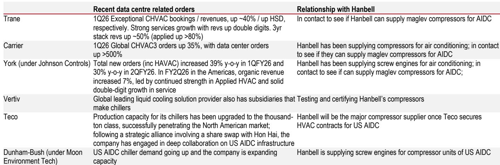
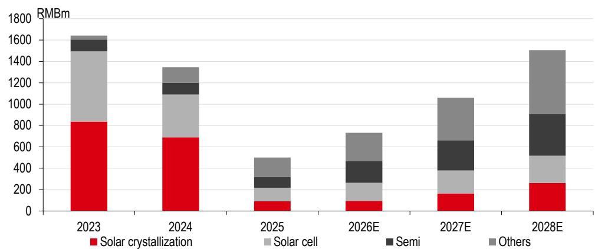
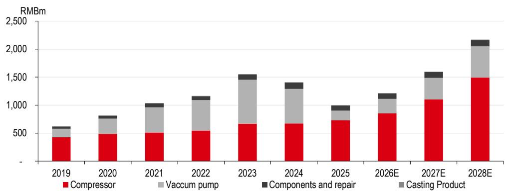

# Hanbell Is Not a Semiconductor Stock—It Is a Multi-Industry Compound Growth Machine That Markets Are Misreading

Hanbell Precise Machinery's share price has been volatile over the past three months, moving in sympathy with other China semiconductor equipment names. The market has labeled this company a semiconductor play, driven by expectations of domestic AI-related chip demand and the potential for market share gains in semiconductor vacuum pumps. But that framing is narrow and misleading. Hanbell's semiconductor vacuum pump revenue is projected to rise from an estimated RMB 100 million in 2025 to only RMB 202 million in 2026—significant growth off a low base, but still a small fraction of the company's overall revenue of nearly RMB 3 billion. The real research perspective is not about a single vertical. It is about a company that sits at the intersection of three large, structurally expanding markets: semiconductor manufacturing equipment, AI data center cooling infrastructure, and industrial heat pumps. Each of these markets is large enough to sustain consecutive growth for a decade. The market's mistake is to price Hanbell as a cyclical semiconductor supplier when its earnings trajectory is being reshaped by multiple secular tailwinds that are only beginning to inflect.

The timing matters because 2026 will not be a breakout year in aggregate terms. Revenue growth is forecast at 17.2% year-on-year, and net profit growth at 28.7%. Those are solid but not explosive numbers. The acceleration comes in 2027 and beyond, when semiconductor vacuum pump revenue doubles again from the 2026 base, refrigerant compressor sales to AI data centers begin registering meaningful volume, and industrial heat pump demand compounds across both China and Europe. The stock currently trades at 23.8x 2026 estimated earnings and 17.6x 2027 estimated earnings, compared with its historical average of 19x since 2016. That premium is justified not by near-term momentum but by the increasing visibility of a multi-year growth cascade that most market participants have not yet modeled correctly.

This article argues that Hanbell's value lies in its exposure to three large, addressable markets that are each at different stages of maturity. The semiconductor vacuum pump business is at an inflection point after years of stagnation. The AI data center compressor market is a high-growth opportunity where supply chain diversification is just beginning. The industrial heat pump market is a long-duration structural story that is currently masking weakness in traditional HVAC. Each of these segments is mutually exclusive in its demand drivers and collectively exhaustive in explaining Hanbell's growth trajectory through 2030. The strategic question for observers is not whether Hanbell will grow in 2026, but whether the market is correctly pricing the compounding effect of three independent growth engines that will each inflect at different times.

## Hanbell's Semiconductor Vacuum Pump Business Has Been Stagnant Since 2021—That Is About to Change, and the Inflection Point Is Larger Than the Revenue Numbers Suggest

The semiconductor vacuum pump segment has been flattish for Hanbell since 2021. That is not a sign of weakness in the product or the company. It reflects the reality that Chinese semiconductor equipment makers have been slow to penetrate the 12-inch wafer fabrication equipment supply chain, particularly for memory chips, where qualification cycles are long and customer switching costs are high. Hanbell's estimated 2025 revenue of RMB 100 million in this segment is negligible relative to the total addressable market. But the trajectory matters more than the base. The forecast for 2026 is RMB 202 million, representing a doubling. And the report explicitly states that growth will accelerate further in 2027 as Hanbell completes product certification for more downstream clients in 12-inch equipment, including memory chip manufacturers.

The so-what here is not the absolute revenue contribution in 2026, which will still be small relative to the company's total. The insight is that the semiconductor vacuum pump business has a long duration of growth ahead of it. Once certified for 12-inch memory chip equipment, Hanbell gains access to a recurring replacement market, because vacuum pumps are consumable components that require periodic servicing and replacement. The revenue model shifts from project-based to annuity-like. The market currently assigns a low probability to this outcome because the business has been flat for five years. The first sign of acceleration in 2026 will force a re-rating of the segment's terminal value.

## The Global Market for Magnetic Levitation Compressors in AI Data Centers Will Reach RMB 16.9 Billion by 2028, and Hanbell Is Positioned as a Second-Source Supplier to a Market That Needs Diversification

The AI data center cooling market is often discussed in terms of liquid cooling, immersion cooling, and chillers. What is less understood is that the compressor is the heart of the chiller system, and the specific type of compressor that next-generation AI data centers require—magnetic levitation compressors—is currently supplied by a very small number of players, with Danfoss being the dominant name. That concentration creates both a risk for data center operators and an opportunity for alternative suppliers.

Hanbell is currently in contact with Trane, Carrier, York, Vertiv, Teco, and Dunham-Bush for potential supply relationships. Some of these relationships are at the testing and certification stage. Others, such as the relationship with Teco, are more advanced: Hanbell will be the major compressor supplier once Teco secures HVAC contracts for US AI data centers. The key strategic point is that downstream heat solution providers do not want to rely on a single source for magnetic levitation compressors. They will actively seek second and third suppliers. Hanbell is one of the few credible alternatives.

The market sizing is instructive. Using a cross-checked methodology that combines power load assumptions with compressor pricing data, the report estimates that a 1 GW data center requires approximately 200-240 MW of compressor capacity. At USD 500-700 per kW, that translates to USD 120-168 million per GW. With global new data center installations projected at 24.1 GW in 2028 and assuming 70% penetration of magnetic levitation compressors, the global market reaches RMB 16.9 billion. That is a large enough market to support multiple players. Hanbell does not need to capture a majority share to generate significant revenue. Even a 10-15% share would represent a business of RMB 1.7-2.5 billion annually, which would be transformative for a company whose total revenue in 2025 was RMB 2.9 billion.

## Industrial Heat Pumps Are the Longest-Duration Growth Engine, but the Market Is Underestimating the European Opportunity Because Near-Term China Data Is Soft

The industrial heat pump market in China grew 15.5% year-on-year in the first half of 2026. That is below the report's earlier expectations, but it is still a healthy growth rate, especially in an environment where central air conditioning and refrigeration markets are weak. The strategic function of industrial heat pumps for Hanbell right now is not to drive explosive growth. It is to provide a revenue buffer that offsets cyclical weakness in traditional HVAC. That is valuable, but it is not the full story.

The longer-term opportunity lies in Europe. European industrial heat pump adoption is being driven by regulatory mandates to decarbonize industrial heating processes, rising natural gas prices, and the phase-out of fossil fuel boilers in commercial and industrial applications. Hanbell's technology in screw compressors and centrifugal compressors is directly applicable to industrial heat pump systems. The European market is less price-sensitive than China and has stricter performance and efficiency requirements, which favors established manufacturers with proven technology. The report does not provide a specific European market size estimate, but the implication is clear: the European industrial heat pump market is at an earlier stage of adoption than China, and Hanbell's entry into that market will extend the growth runway well beyond 2030.

The risk is that near-term China data will lead observers to underestimate the long-term compound growth rate. Industrial heat pumps are not a 2026 story. They are a 2028-2032 story. The growth in China is real but lumpy. The growth in Europe is nascent but structurally supported. Those who focus only on the first-half 2026 China number will miss the larger arc.

## A Decision Framework for Observers: Map Each Growth Engine to Its Inflection Point, and Do Not Weight Them Equally

The standard approach to valuing a multi-segment industrial company is to sum-of-the-parts each division and apply a blended multiple. That approach fails here because the three growth engines are at completely different stages of maturity and have different visibility profiles. A more useful framework is to map each segment to its expected inflection point and assess whether the current stock price embeds a reasonable probability for each.

Semiconductor vacuum pumps are the highest-conviction near-term inflection. The business has been flat for five years. The 2026 doubling is the first signal that the inflection is real. If certification for 12-inch memory chip equipment proceeds as expected, 2027 growth will accelerate further. This segment is the most binary but also the most overlooked. The current stock price likely embeds very low expectations for this business, given that the market treats Hanbell as a semiconductor play only in sentiment, not in earnings.

AI data center compressors are a medium-term opportunity with high visibility on demand but low visibility on market share. The total addressable market is large and growing, but Hanbell's revenue contribution in 2025 was negligible. The key milestones to watch are the certification outcomes with Trane, Carrier, and York. If even one of these relationships converts to a supply agreement in the next 12-18 months, the revenue trajectory for 2027-2028 will be materially higher than current estimates. The risk is that certification cycles are long and that Hanbell may not capture share as quickly as the market hopes.

Industrial heat pumps are the longest-duration opportunity with the lowest near-term earnings impact. The China business is growing but not accelerating. The European opportunity is real but unproven in terms of revenue contribution. This segment should be valued as a free option on long-term industrial decarbonization, not as a near-term earnings driver. The mistake would be to assume that because China growth slowed in the first half of 2026, the entire thesis is broken. It is not. The thesis is simply longer-dated.

The decision framework for observers is to ask whether the current valuation of 23.8x 2026 earnings and 17.6x 2027 earnings correctly prices the probability that all three engines inflect positively. If semiconductor vacuum pumps double in 2026 and then double again in 2027, if AI data center compressors begin contributing meaningfully in 2027, and if industrial heat pumps compound steadily through 2030, then the current multiple is not expensive—it is a discount to the intrinsic value of a company with three independent, large-market growth drivers. The downside risk is that certification timelines slip, that competition intensifies in data center compressors, or that industrial heat pump adoption in Europe is slower than expected. But those risks are already partially priced into a stock that trades at a modest premium to its historical average and has dropped in sympathy with the broader China semiconductor equipment selloff. The asymmetry favors the thesis.

*For informational purposes only. Portions may be generated, translated, summarized, or edited with AI assistance based on source materials and may contain omissions or errors. Please verify independently. This is not professional advice.*

For informational purposes only. Portions may be generated, translated, summarized, or edited with AI assistance based on source materials and may contain omissions or errors. Please verify independently. This is not professional advice.

