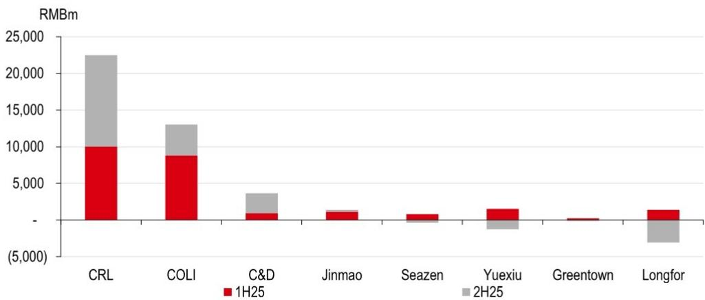
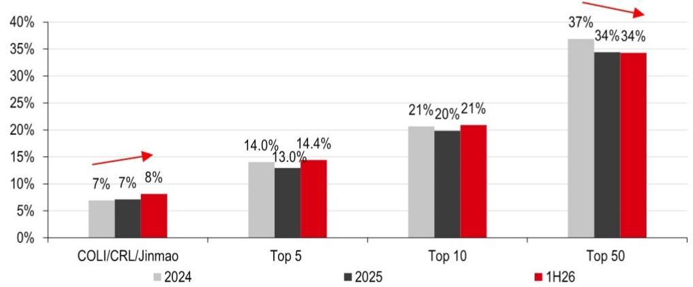
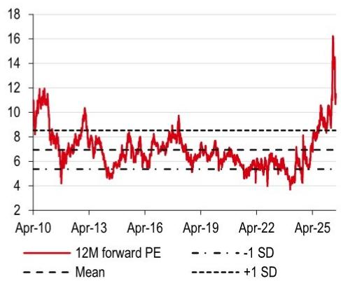
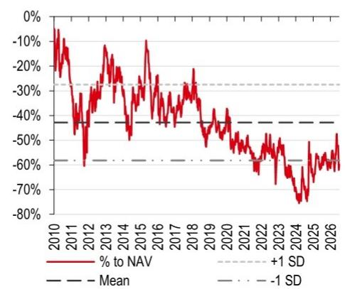
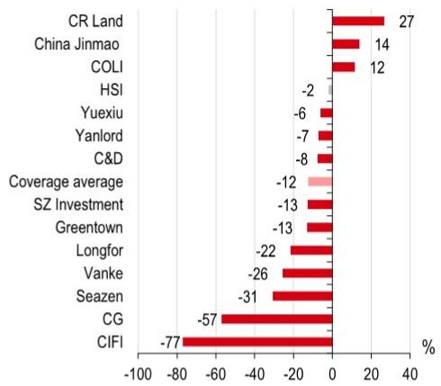
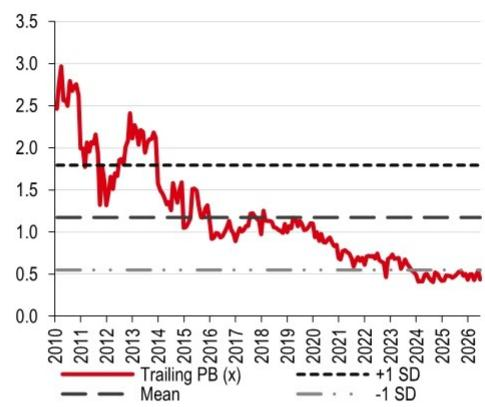
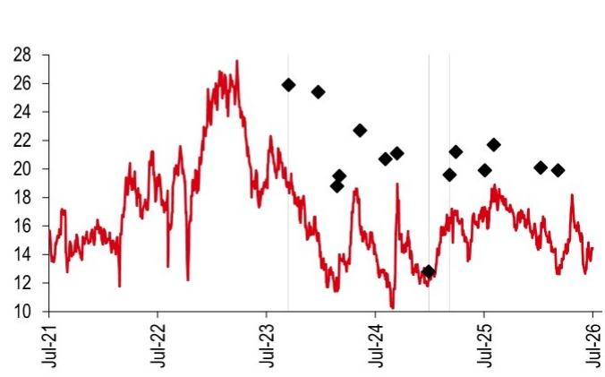
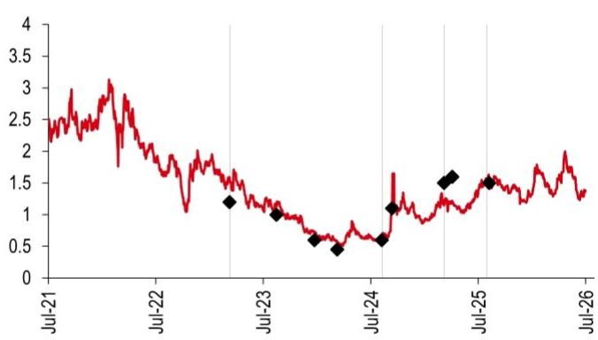

# 中国房地产市场观察

## 2026年上半年业绩前瞻：市场已消化部分预期，关注2027年行业修复

- 越秀地产的盈利预警未引起市场大幅波动，相关预期已被提前消化
- 市场呈现分化修复态势，行业集中度提升，为2027年行业整体业绩改善奠定基础
- 华润置地、建发国际等公司凭借更具韧性的盈利结构受到关注

**2026年上半年业绩前瞻。** 7月17日，越秀地产发布盈利预警，预计2026年上半年核心净利润同比下降约90-95%，主要由于合同销售确认收入减少、合营企业贡献减弱及利润率持续承压——这些因素在其他开发商中同样存在。其股价在7月20日上涨1.6%（同期恒生指数上涨2.4%），表明市场已提前消化相关影响。我们预计开发商在2026年上半年甚至全年将录得更多减值拨备及已售存货利润率下降，但考虑到房价跌幅收窄及去库存压力减轻，行业盈利修复的主题依然延续。

**市场呈现分化修复。** 初夏期间新房销售保持平稳，部分受东部多城市异常多雨季节影响。尽管如此，市场分化修复态势基本未受影响。在普通住宅市场，10个城市二手住宅交易量截至月中同比增长约7%（图3），显示二手房流动性改善。结合更高的可负担性，这有助于在跨境资本管控趋严及境内高收益替代选择有限的背景下，引导家庭储蓄回流住房市场，而无需大幅加杠杆。进入下半年，较低的基数效应为超预期表现留出空间。在高端市场，需求保持韧性，杭州2026年上半年录得创纪录的豪宅交易，近期推出的项目（图4）也印证了高端产品的需求。

## 市场份额持续向头部企业集中

2026年上半年，前十大开发商市场份额较2025年同比提升约1个百分点，而前五十大开发商份额基本持平（图5），显示行业持续整合及分化加剧。我们认为，具备更强产品能力和优质土地储备的开发商，在把握改善型需求方面更具优势。华润置地、中国海外发展及中国金茂在市场份额提升的同时，平均售价也显著上升，反映出高端项目占比提高。对于零售物业业主而言，尽管零售销售表现平稳，但所覆盖标的在全国零售销售中的总份额从2021年到2025年几乎弹性较高（图6）。虽然估值上行空间可能仍受市场情绪制约，但盈利可见性支撑了我们的积极看法。

## 关注标的

我们继续看好住宅开发商的超预期潜力，偏好华润置地和建发国际（均给予积极评价），因其在高端项目中的领先地位及更强的盈利可见性。我们预计两家公司2026年上半年业绩将更具韧性，尽管它们同样面临行业性挑战。

---

## 信息披露与免责声明

本报告必须结合披露附录中的信息披露及分析师认证，以及构成报告组成部分的免责声明一并阅读。

**股票研究**

**中国**

**郭敏华***
亚洲房地产及香港股票研究主管
香港上海HSBC银行有限公司
michellekwok@hsbc.com.hk
+852 2996 6918

**余兆钧***
亚洲房地产分析师
香港上海HSBC银行有限公司
oliver.y.o.x.yu@hsbc.com.hk
+852 2288 2050

**王逸凡*, CFA**
亚洲房地产分析师
香港上海HSBC银行有限公司
stephen.wang@hsbc.com.hk
+852 2284 1675

**Brian Yu***
亚洲房地产研究副总监
香港上海HSBC银行有限公司
brian.d.yu@hsbc.com.hk
+852 28227281

Charlotte Ye*
广州 副总监

*受雇于HSBC证券（美国）公司的非美国关联机构，未根据FINRA规定注册/取得资格

**新兴市场情绪调查第24版**
点击查看

报告发行人：香港上海HSBC银行有限公司

查看HSBC全球研究：https://www.research.hsbc.com

---

## 2026年上半年业绩预览

越秀地产7月17日的盈利预警反映了更广泛的趋势：多家开发商已预告净利润大幅下滑或可能出现净亏损，包括招商蛇口（001979 CH，未评级）和华发股份（600325 CH，未评级）。我们认为，市场已基本消化了2026年上半年及全年可能疲弱的业绩，关注点正转向2027年及以后更实质性的盈利修复，届时房价下跌的拖累将逐步减轻。我们预计大多数开发商将面临类似压力：

◆ 开发物业收入收缩：随着2023-25年合同销售下降，2026-28年收入确认可能大幅减少。
- 利润率压缩：持续的房价调整及库存去化将推动进一步减值拨备及已完工住宅销售利润率下降，对毛利率构成压力。
- 合营企业贡献减少：在行业持续调整背景下，合营项目的利润分成也可能减弱。

## 两家突出公司——华润置地和建发国际

在个股层面，部分开发商将引领本轮盈利修复周期——我们预计华润置地和建发国际的业绩将更具韧性。

**华润置地（积极评价）：** 开发物业挑战部分被投资物业实力抵消。2026年上半年租金收入同比增长13%（基于月度公告），有助于缓冲开发物业收入疲软。高购物中心利润率（2025年：77%）应进一步缓解开发物业利润率压力。此外，与成都万象城分拆相关的超过20亿元人民币重估收益（对比2025年上半年100亿元核心利润）预计将在2026年上半年确认，可缓解盈利压力。

**建发国际（积极评价）：** 受益于较年轻的土地储备。我们预计2026年上半年盈利将保持稳定或小幅下降，得益于相对年轻的土地储备带来的较低减值风险，以及完成住宅去库存的紧迫性较低。

另一方面，我们预计中国海外发展（积极评价）和中国金茂（中性）将面临更严峻的同比比较，因其2025年上半年业绩强于下半年。对于越秀地产（积极评价），我们认为当前2026年预测存在下行风险，因利润率持续承压。我们将在2026年上半年业绩后重新评估潜在减值风险，目前仍难以量化。尽管如此，考虑到2025年较低的盈利基数（2.6亿元人民币），我们仍认为2026年盈利有显著改善空间。

**图1：主要开发商2025年上半年/下半年净利润分布**

来源：公司数据，HSBC

**图2：开发商盈利概况**

| | 毛利率 | | | 核心盈利（百万元人民币） | | | 同比增长 | | | 对比市场一致预期 | | |
|---|---|---|---|---|---|---|---|---|---|---|---|---|
| | 2026e | 2027e | 2028e | 2026e | 2027e | 2028e | 2026e | 2027e | 2028e | 2026 | 2027 | 2028 |
| 华润置地 | 23% | 24% | 25% | 23,720 | 25,165 | 27,085 | 6% | 6% | 8% | -1% | 0% | 1% |
| 建发国际 | 15% | 15% | 16% | 4,443 | 4,767 | 5,192 | 23% | 7% | 9% | 22% | 19% | 19% |
| 中国海外发展 | 16% | 16% | 17% | 11,892 | 12,718 | 13,593 | -9% | 7% | 7% | -6% | -4% | -4% |
| 中国金茂 | 16% | 16% | 16% | 677 | 720 | 809 | -3% | 6% | 12% | -53% | -55% | -54% |
| 绿城中国 | 12% | 12% | 13% | 673 | 1,792 | 3,108 | n.m. | 166% | 73% | -9% | 36% | 79% |
| 越秀地产 | 10% | 11% | 12% | 1,041 | 1,637 | 2,776 | 301% | 57% | 70% | 134% | 124% | 151% |

来源：彭博，HSBC预测

**图3：6-7月二手住宅交易延续势头**

| 套数 | 上海 | 北京 | 深圳 | 成都 | 杭州 | 南京 | 佛山 | 苏州 | 东莞 | 厦门 | 平均 |
|---|---|---|---|---|---|---|---|---|---|---|---|
| 2026年6月 | 25,158 | 18,757 | 6,357 | 20,695 | 4,261 | 7,542 | 7,564 | 7,351 | 4,261 | 4,201 | |
| 2025年6月 | 20,774 | 16,838 | 5,494 | 19,214 | 4,174 | 7,459 | 6,595 | 5,757 | 4,174 | 3,537 | |
| 6月同比 | 21% | 11% | 16% | 8% | 2% | 1% | 15% | 28% | 2% | 19% | 14% |
| 2026年1-19日 | 14,459 | 8,576 | 3,695 | 11,948 | 2,250 | 3,907 | 5,655 | 4,079 | 2,250 | 2,496 | |
| 1-19日同比 | 25% | 4% | -1% | -1% | -7% | -8% | 24% | 20% | -7% | 7% | 7% |

来源：各市住建局，Wind，HSBC

**图4：6-7月重点城市高端项目销售情况良好**

| 项目 | 开发商 | 最新推盘日期 | 推盘套数 | 均价（元/平米） | 平均售价（元/平米） | 总价（百万元） | 去化率 |
|---|---|---|---|---|---|---|---|
| **上海** | | | | | | | |
| 陆家嘴太古源源邸 | 太古/陆家嘴 | 2026-06-12 | 72 | 113,000 | 191,800 | 24-190 | 97% |
| 保利·外滩曜 | 保利发展 | 2026-06-30 | 103 | 95,500 | 145,200 | 17-24 | 57% |
| 中海云锦华庭 | 中国海外发展 | 2026-07-09 | 44 | 148,503 | 232,600 | 50-154 | 70% |
| 嘉佰道·徐汇 | Cityscape Development | 2026-07-11 | 91 | 126,011 | 188,600 | 17-130 | 98% |
| **深圳** | | | | | | | |
| 中海安缇雅苑 | 中国海外发展 | 2026-06-30 | 72 | 77,400 | 185,800 | 40-107 | 100% |
| **北京** | | | | | | | |
| 保利熙瑞 | 保利发展 | 2026-06-27 | 157 | 78,400 | 125,000 | 15-41 | 69% |
| **杭州** | | | | | | | |
| 望天际 | 滨江/建发/金茂 | 2026-07-17 | 66 | 77,409 | 142,346 | 25-152 | 100% |

来源：CREIS，房天下，HSBC

**图5：部分优质开发商（华润置地、中国海外发展、中国金茂）市场份额从2025年至2026年上半年提升约1个百分点**

来源：CRIC，国家统计局，HSBC
注：按销售金额排名的前5/10/50大开发商

**图6：所覆盖零售物业业主市场份额自2021年几乎弹性较高**

| | 2021 | 2022 | 2023 | 2024 | 2025 |
|---|---|---|---|---|---|
| 华润置地 | 0.24% | 0.26% | 0.35% | 0.40% | 0.48% |
| 新城发展 | 0.12% | 0.13% | 0.16% | 0.19% | 0.19% |
| 龙湖集团 | 0.11% | 0.10% | 0.13% | 0.15% | 0.16% |
| 占全国零售销售总额 | 0.47% | 0.48% | 0.64% | 0.74% | 0.84% |

来源：Wind，公司数据，HSBC

---

## 估值图表

**图7：国企开发商远期市盈率（倍）**

注：中国海外发展、华润置地、万科、绿城中国、越秀地产、建发国际、龙湖集团的平均远期市盈率基于彭博一致预期。
来源：彭博，HSBC预测

**图8：国企开发商资产净值折让（%）**

来源：彭博，HSBC预测

**图9：2026年至今股价表现**

注：截至2026年7月20日。
来源：彭博，HSBC

**图10：国企开发商历史市净率（倍）**

注：中国海外发展、华润置地、万科、绿城中国、越秀地产、建发国际的平均历史市净率基于月度数据。
来源：彭博，HSBC

**图11：估值汇总**

| 公司 | 代码 | 评级 | 股价（港元） | 目标价（港元） | 市值（十亿美元） | 3个月日均交易额（百万美元） | 资产净值（港元/股） | （折让）/溢价（%） | 市盈率（倍） | | | 股息率（%）2026e | 市净率（倍）2025a | 净负债率（%） |
|---|---|---|---|---|---|---|---|---|---|---|---|---|---|---|
| | | | | | | | | 2025a | 2026e | 2027e | | | |
| **房地产开发商** | | | | | | | | | | | | | |
| 建发国际 | 1908 HK | 积极 | 14.45 | 19.90 | 4.3 | 14.8 | 42.4 | (66) | 7.1 | 6.3 | 5.9 | 7.9 | 0.6 | 25 |
| 中国海外发展 | 688 HK | 积极 | 13.66 | 16.50 | 19.1 | 64.6 | 25.7 | (47) | 9.9 | 10.9 | 10.2 | 3.5 | 0.3 | 33 |
| 华润置地 | 1109 HK | 积极 | 34.48 | 43.80 | 31.4 | 120.1 | 55.5 | (38) | 9.5 | 9.0 | 8.5 | 4.1 | 0.7 | 39 |
| 万科企业 | 2202 HK | 谨慎 | 2.44 | 2.50 | 5.2 | 8.4 | 5.9 | (59) | n.m. | n.m. | n.m. | - | 0.3 | 108 |
| 旭辉控股 | 884 HK | 中性 | 0.04 | 0.08 | 0.1 | 0.5 | 0.5 | (93) | n.m. | n.m. | n.m. | - | 0.0 | 81 |
| 碧桂园 | 2007 HK | 中性 | 0.18 | 0.30 | 1.1 | 10.4 | 1.9 | (91) | 1.3 | n.m. | n.m. | - | n.m. | n.m. |
| 中国金茂 | 817 HK | 中性 | 1.38 | 1.50 | 2.4 | 11.5 | 3.5 | (61) | 23.0 | 23.8 | 22.4 | 1.5 | 0.4 | 76 |
| 绿城中国 | 3900 HK | 中性 | 7.37 | 9.50 | 2.4 | 11.6 | 17.9 | (59) | n.m. | 24.1 | 9.0 | 1.9 | 0.5 | 65 |
| 龙湖集团 | 960 HK | 中性 | 6.71 | 8.60 | 6.1 | 20.8 | 25.4 | (74) | n.m. | 31.5 | 11.6 | 1.0 | 0.2 | 48 |
| 新城发展 | 1030 HK | 积极 | 1.42 | 3.00 | 1.3 | 5.4 | 7.4 | (81) | 22.8 | 6.5 | 4.7 | - | 0.2 | 59 |
| 深圳控股 | 604 HK | 中性 | 0.69 | 0.70 | 0.8 | 0.8 | 2.2 | (69) | 12.3 | 20.6 | 13.4 | - | 0.2 | 91 |
| 仁恒置地（新元） | YLLG SP | 中性 | 0.65 | 0.53 | 1.0 | 1.9 | 1.6 | (60) | n.m. | 17.4 | 16.3 | - | 0.2 | 34 |
| 越秀地产 | 123 HK | 积极 | 3.72 | 5.10 | 1.9 | 5.5 | 14.7 | (75) | 49.8 | 12.4 | 7.9 | 3.2 | 0.2 | 69 |
| 平均* | | | | | | | | (67) | 17.0 | 16.3 | 11.0 | 1.8 | 0.3 | 61 |
| **房地产经纪服务提供商** | | | | | | | | | | | | | |
| 贝壳（美元） | BEKE US | 积极 | 16.97 | 23.30 | 20.1 | 77.5 | n.a. | n.a. | 25.9 | 17.6 | 14.5 | 2.3 | 2.0 | 净现金 |
| **物业管理公司** | | | | | | | | | | | | | |
| 中海物业 | 2669 HK | 中性 | 3.60 | 4.30 | 1.5 | 4.5 | n.a. | n.a. | 6.5 | 6.1 | 5.7 | 5.3 | 1.5 | 净现金 |
| 华润万象生活 | 1209 HK | 中性 | 40.14 | 44.00 | 11.7 | 22.0 | n.a. | n.a. | 20.1 | 18.2 | 16.7 | 5.5 | 4.4 | 净现金 |
| 碧桂园服务 | 6098 HK | 中性 | 5.59 | 6.10 | 2.3 | 5.3 | n.a. | n.a. | 6.4 | 5.9 | 5.2 | 10.1 | 0.4 | 净现金 |
| 绿城服务 | 2869 HK | 积极 | 4.17 | 5.10 | 1.7 | 2.2 | n.a. | n.a. | 12.9 | 11.6 | 10.6 | 6.2 | 1.4 | 净现金 |
| 融创服务 | 1516 HK | 中性 | 0.86 | 0.90 | 0.3 | 0.9 | n.a. | n.a. | 6.4 | 4.0 | 3.8 | 1.5 | 0.4 | 净现金 |
| 平均 | | | | | | | | | 10.5 | 9.1 | 8.4 | 5.7 | 1.6 | |

注：截至2026年7月20日。NA – 不适用/不可用。NM – 无意义。
来源：彭博，HSBC预测

---

## 估值与风险

### 估值

| | 估值 | 风险 |
|---|---|---|
| **华润置地 1109 HK** | 当前价：34.48港元 | 下行风险 |
| **积极** | 目标价：43.80港元 | ◆ 销售势头未能维持 |
| | 上行空间：27.0% | ◆ 利润率低于预期 |
| | 方法：资产净值通过加总开发项目和投资项目的总资产价值，减去净债务计算，基于公司报告。目标折让的设定基于相对比较；具有相似运营/财务实力和执行记录的公司应被赋予相同的目标折让。 | ◆ 购物中心板块出现重大放缓 |
| | 假设：资产净值折让21%，设定为历史均值上方1个标准差，应用于每股资产净值估计55.50港元（均未变）。我们使用历史均值上方1个标准差的折让，以反映华润置地销售势头增强、经常性收入强劲及执行记录良好。 | ◆ 无法维持股息稳定 |
| | 未变的目标价43.80港元意味着较当前水平约27%的上行空间；因此我们维持积极评级，其利润率修复前景及在重点城市的布局，使公司有望在市场修复中率先受益。 | ◆ 宏观及房地产相关政策的不确定性 |
| | 郭敏华* | michellekwok@hsbc.com.hk | +852 2996 6918 | |
| **建发国际 1908 HK** | 当前价：14.45港元 | 下行风险 |
| **积极** | 目标价：19.90港元 | ◆ 土地收购放缓 |
| | 上行空间：37.7% | ◆ 销售急剧恶化 |
| | 方法：资产净值通过加总开发项目和投资项目的总资产价值，减去净债务计算，基于公司报告。目标折让的设定基于相对比较；具有相似运营/财务实力和执行记录的公司应被赋予相同的目标折让。 | ◆ 利润率大幅压缩 |
| | 假设：资产净值折让53%，设定为历史均值上方0.25个标准差，应用于每股资产净值估计42.40港元（均未变）。我们使用历史均值上方0.25个标准差的折让，以反映令人鼓舞的利润率修复趋势及年轻土地储备支撑的独特竞争优势。 | ◆ 以深度折让进行配股 |
| | 未变的目标价19.90港元意味着较当前水平约38%的上行空间；据此，我们维持积极评级。 | ◆ 合营项目风险 |
| | 王逸凡*, CFA | stephen.wang@hsbc.com.hk | +852 2284 1675 | |
| **越秀地产 123 HK** | 当前价：3.72港元 | 下行风险 |
| **积极** | 目标价：5.10港元 | ◆ 销售和土地收购慢于预期 |
| | 上行空间：37.1% | ◆ 城市更新项目开发和销售缓慢 |
| | 方法：资产净值通过加总开发项目和投资项目的总资产价值，减去净债务计算，基于公司报告。目标折让的设定基于相对比较；具有相似运营/财务实力和执行记录的公司应被赋予相同的目标折让。 | ◆ 项目进一步减值 |
| | 假设：资产净值折让65%，设定为历史均值下方0.75个标准差，应用于每股资产净值估计14.70港元（均未变）。我们使用历史均值下方0.75个标准差的折让，因其销售收缩、土地购买缓慢及存货减值的持续担忧。 | ◆ 宏观及政策不确定性 |
| | 未变的目标价5.10港元意味着约37%的上行空间。我们维持积极评级，预计其将从一线城市引领的修复中受益。 | |
| | 余兆钧* | oliver.y.o.x.yu@hsbc.com.hk | +852 2288 2050 | |

### 风险

| | 估值 | 风险 |
|---|---|---|
| **中国海外发展 688 HK** | 当前价：13.66港元 | 下行风险 |
| **积极** | 目标价：16.50港元 | ◆ 销售势头放缓 |
| | 上行空间：20.8% | ◆ 利润率低于预期 |
| | 方法：资产净值通过加总开发项目和投资项目的总资产价值，减去净债务计算，基于公司报告。目标折让的设定基于相对比较；具有相似运营/财务实力和执行记录的公司应被赋予相同的目标折让。 | ◆ 入账速度放缓 |
| | 假设：资产净值折让36%，设定为历史均值下方0.25个标准差，应用于每股资产净值估计25.70港元（均未变）。我们使用历史均值下方0.25个标准差的折让，以反映中国海外发展销售前景改善及行业风险偏好上升。 | ◆ 重大减值损失 |
| | 未变的目标价16.50港元意味着较当前股价约21%的上行空间；我们维持积极评级，预计其将从一线城市引领的行业修复中受益。 | ◆ 宏观及房地产相关政策的不确定性 |
| | 郭敏华* | michellekwok@hsbc.com.hk | +852 2996 6918 | |
| **中国金茂 817 HK** | 当前价：1.38港元 | 下行风险 |
| **中性** | 目标价：1.50港元 | ◆ 合同销售慢于预期 |
| | 上行空间：8.7% | ◆ 持续减值拨备 |
| | 方法：资产净值通过加总开发项目和投资项目的总资产价值，减去净债务计算，基于公司报告。目标折让的设定基于相对比较；具有相似运营/财务实力和执行记录的公司应被赋予相同的目标折让。 | ◆ 持续利润率压力 |
| | 假设：资产净值折让58%，设定为历史均值上方0.25个标准差，应用于每股资产净值估计3.50港元（均未变）。 | ◆ 入账速度放缓 |
| | 未变的目标价3.50港元意味着较当前股价约9%的上行空间；鉴于盈利前景的不确定性，我们维持中性评级。 | ◆ 宏观及政策不确定性 |
| | 郭敏华* | michellekwok@hsbc.com.hk | +852 2996 6918 | |

---

# 披露附录

## 分析师认证

主要负责本报告的下述分析师、经济学家或策略师，包括任何以报告个别章节作者身份出现的分析师，以及以分部加总估值法中被列为子公司覆盖分析师的分析师，兹证明其对相关证券或发行人的意见、其以作者身份出现的章节中表达的任何观点或预测，以及本报告中表达的任何其他观点或预测（包括研究报告封底表达的任何观点），均准确反映其个人观点，且其薪酬的任何部分过去、现在或将来均不直接或间接与本研究报告中的具体推荐或观点相关：郭敏华、余兆钧、王逸凡（CFA）及Brian Yu。

## 重要披露

### 股票：评级及财务分析基础

HSBC及其关联机构（包括本报告发行人，"HSBC"）认为，读者买卖股票的决定应取决于个人情况，如现有持仓、风险承受能力及其他考虑因素，且读者在做出投资决策时采用不同的方法和投资周期。评级不应孤立使用或依赖作为研究交流。不同证券公司使用多种评级术语及不同的评级体系来描述其推荐，因此读者应仔细阅读每份研究报告中使用的评级定义。此外，读者应仔细阅读整份研究报告，而非仅从评级推断其内容，因为研究报告包含分析师观点及评级基础的更完整信息。

**自2015年3月23日起，HSBC基于以下基础分配评级：**

目标价基于分析师对股票实际当前价值的评估，尽管我们预计市场需要6至12个月才能反映这一价值。当目标价高于当前股价20%以上时，股票将被归类为"积极"；当高于当前股价5%至20%时，股票可能被归类为"积极"或"中性"；当低于或高于当前股价5%以内时，股票将被归类为"中性"；当低于当前股价5%至20%时，股票可能被归类为"中性"或"谨慎"；当低于当前股价20%以上时，股票将被归类为"谨慎"。

我们的评级在发生"重大变化"（开始或恢复覆盖、目标价或预测变更）时重新校准至这些区间。

上行/下行空间是目标价与股价之间的百分比差异。

**在此日期之前，HSBC的评级结构基于以下基础：**

对于每只股票，我们设定一个必要回报率，该回报率由我们策略团队确定的该股票国内或（如适用）区域市场的股权成本计算得出。股票的目标价代表分析师预期该股票在我们的业绩周期内将达到的价值。业绩周期为12个月。当一只股票被归类为"增持"时，潜在回报（即当前股价与目标价之间的百分比差异，包括指示性预测股息回报表现）必须在未来12个月内超过必要回报率至少5个百分点（对于被归类为"波动性"的股票则为10个百分点）。当一只股票被归类为"减持"时，该股票预期在未来12个月内表现低于其必要回报率至少5个百分点（对于被归类为"波动性"的股票则为10个百分点）。介于这些区间之间的股票被归类为"中性"。

*如果股票的历史波动率超过40%，或上市时间不足12个月（除非处于波动率较低的行业或板块），或分析师预期显著波动，则该股票被归类为波动性。然而，我们认为非波动性的股票实际上也可能表现出此类特征。历史波动率定义为过去一个月每日365天移动平均波动率的平均值。为避免误导性的频繁评级变更，波动率必须在任一方向移动超过40%基准2.5个百分点，股票的状态才会改变。

**长期研究线索的评级分布**

| 截至2026年6月30日，HSBC发布的所有独立评级分布如下： |
|---|
| 积极 | 61% | （其中13%在过去12个月获得投资银行服务） |
| 中性 | 34% | （其中10%在过去12个月获得投资银行服务） |
| 谨慎 | 5% | （其中8%在过去12个月获得投资银行服务） |

为上述分布目的，在从旧评级模型向当前模型过渡期间使用以下映射结构：在旧模型下，增持=积极，中性=中性，减持=谨慎；在当前模型下，积极=积极，中性=中性，谨慎=谨慎。两种模型下的评级定义请参见上文"股票评级及财务分析基础"。

HSBC发布的非独立评级分布，请参见披露页面：http://www.hsbcnet.com/gbm/financial-regulation/investment-recommendations-disclosures。

### 长期研究线索的股价及评级变化

**建发国际（1908.HK）股价表现**
港元 对比 HSBC评级历史

来源：HSBC

**评级及目标价历史**

| 从 | 至 | 日期 | 分析师 |
|---|---|---|---|
| 无 | 积极 | 2023年10月3日 | 王逸凡，CFA |
| 积极 | 中性 | 2025年1月16日 | 王逸凡，CFA |
| 中性 | 积极 | 2025年3月27日 | 王逸凡，CFA |
| 目标价 | 价值 | 日期 | 分析师 |
| 价格1 | 25.90 | 2023年10月3日 | 王逸凡，CFA |
| 价格2 | 25.40 | 2024年1月11日 | 王逸凡，CFA |
| 价格3 | 18.80 | 2024年3月14日 | 王逸凡，CFA |
| 价格4 | 19.50 | 2024年3月22日 | 王逸凡，CFA |
| 价格5 | 22.70 | 2024年5月30日 | 王逸凡，CFA |
| 价格6 | 20.70 | 2024年8月23日 | 王逸凡，CFA |
| 价格7 | 21.10 | 2024年10月1日 | 王逸凡，CFA |
| 价格8 | 12.80 | 2025年1月16日 | 王逸凡，CFA |
| 价格9 | 19.60 | 2025年3月27日 | 王逸凡，CFA |
| 价格10 | 21.20 | 2025年4月17日 | 王逸凡，CFA |
| 价格11 | 19.90 | 2025年7月23日 | 王逸凡，CFA |
| 价格12 | 21.70 | 2025年8月22日 | 王逸凡，CFA |
| 价格13 | 20.10 | 2026年1月27日 | 王逸凡，CFA |
| 价格14 | 19.90 | 2026年3月26日 | 王逸凡，CFA |

**中国金茂（0817.HK）股价表现**
港元 对比 HSBC评级历史
来源：HSBC

**评级及目标价历史**

| 从 | 至 | 日期 | 分析师 |
|---|---|---|---|
| 中性 | 谨慎 | 2023年3月29日 | 郭敏华 |
| 谨慎 | 中性 | 2024年8月27日 | 郭敏华 |
| 中性 | 积极 | 2025年3月26日 | 郭敏华 |
| 积极 | 中性 | 2025年8月18日 | 郭敏华 |
| 目标价 | 价值 | 日期 | 分析师 |
| 价格1 | 1.20 | 2023年3月29日 | 郭敏华 |
| 价格2 | 1.00 | 2023年9月4日 | 郭敏华 |
| 价格3 | 0.60 | 2024年1月11日 | 郭敏华 |
| 价格4 | 0.45 | 2024年3月28日 | 郭敏华 |
| 价格5 | 0.60 | 2024年8月27日 | 郭敏华 |
| 价格6 | 1.10 | 2024年10月1日 | 郭敏华 |
| 价格7 | 1.50 | 2025年3月26日 | 郭敏华 |
| 价格8 | 1.60 | 2025年4月23日 | 郭敏华 |
| 价格9 | 1.50 | 2025年8月27日 | 郭敏华 |

来源：HSBC

**中国海外发展（0688.HK）股价
