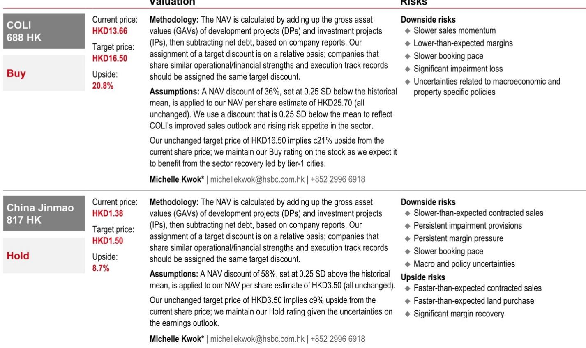
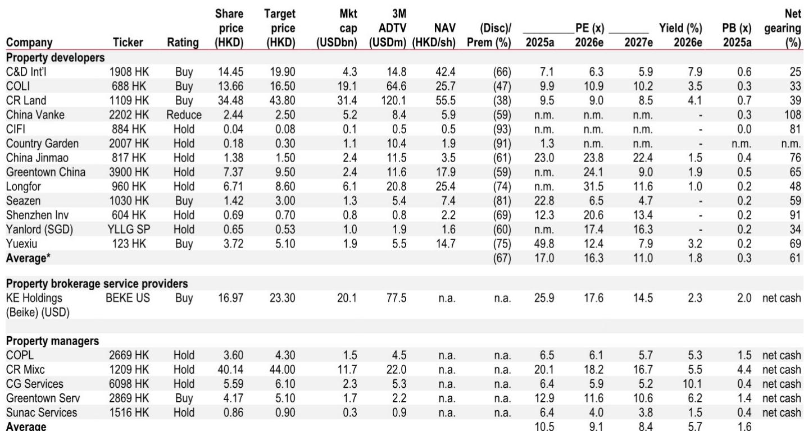

# 中国房地产市场观察：2026年业绩预期已反映，后续走势呈现分化格局

当越秀地产在7月17日发布盈利预警，预计2026年上半年核心净利润同比下降90-95%时，市场反应相对平稳。该公司股价在随后的交易日上涨1.6%。这一反应揭示了当前中国房地产板块的现状：业绩下滑的最坏情况已被市场消化，观察者的关注点已转向后续发展。问题已不再是2026年业绩是否会难看——这几乎是普遍现象。真正的讨论焦点在于复苏的形态和时机，以及这种复苏是足以带动整个板块，还是仅能惠及少数定位良好的公司。

现有证据明显指向后者。一种分化的复苏格局正在形成，大众市场交易呈现初步改善，而高端需求则表现强劲。市场份额正向排名前十的公司集中，而在这群体中，只有那些拥有优质土地储备、较新库存和多元化收入来源的公司，才有可能实现市场已为2027年定价的增长预期。市场共识实际上已跳过2026年，锚定在2027年。对于观察者而言，策略性问题在于哪些公司能够真正兑现这一预期。

## 市场已消化2026年疲软，当前交易基于2027年复苏预期，需谨慎验证

越秀的盈利预警并非孤立事件。包括招商蛇口和华发股份在内的多家公司，均预告上半年净利润大幅下滑或可能出现净亏损。整个板块呈现一致模式：随着2023-2025年销售下滑传导至收入确认，开发物业收入正在收缩；在房价持续调整和库存去化压力下，利润率受到压缩；合资企业的利润贡献也在减弱。然而，该板块的估值并未崩溃。相反，国有房企的前瞻市盈率保持相对稳定，表明市场已内化了这一业绩冲击。

市场实际上是在跳过2026年，为始于2027年的复苏定价。这是一个高度信心的押注，依赖于三个条件：房价跌幅收窄至不再产生新的减值准备；库存水平正常化，去化压力缓解；随着2024-2025年销售逐步确认，收入确认管道开始重新填充。报告中的盈利预测清晰地展示了这一逻辑。对于华润置地，核心收益预计在2026年和2027年均增长6%，毛利率从23%提升至24%。对于建发国际，2026年收益预计同比增长23%，随后在2027年增长7%。这些假设并非过于乐观，但也并非确定无疑，且它们依赖于各公司间差异显著的条件。

风险在于，市场已为复苏定价，但只有部分公司能够实现。整个板块的盈利分化极为显著。越秀地产预计2026年收益将从2025年极低的2.6亿元人民币基数反弹301%，但报告明确指出，鉴于持续的利润率压力，这些预测存在下行风险。绿城中国呈现类似模式，2026年收益从2025年的亏损转为正值，但仍低于市场共识。那些交易价格最接近2027年盈利预期的公司——华润置地和建发国际——拥有最清晰且最可防御的盈利路径。

## 分化复苏正在确认：大众市场二手房流动性改善，高端需求创纪录

分化复苏的叙事并非理论构建。它在中国主要城市的详细交易数据中清晰可见。在大众市场方面，6月份10个样本城市的二手房成交量同比增长14%，其中上海增长21%，苏州28%，深圳16%。截至7月19日的数据显示，这一趋势仍在持续，尽管雨季异常影响了新房市场活动，但同城二手房成交量平均同比增长7%。这之所以重要，是因为二手房流动性是新房市场的先行指标。当家庭能够出售现有住房时，他们便获得了购买新房所需的首付能力。二手房成交量的改善，加上多年价格调整后更合理的负担能力，为大众市场需求逐步复苏创造了条件。

高端市场则呈现截然不同的图景。上海、深圳、北京和杭州的豪宅项目，在单价从1700万元至超过1.9亿元的区间内，实现了70%至100%的去化率。在杭州，由滨江、建发和金茂联合体于7月17日推出的一个项目，以平均每平方米142,346元的价格全部售罄。在上海，陆家嘴太古源项目在2400万元至1.9亿元的价格区间内实现了97%的去化率。这些并非孤立数据点。它们代表了需求向品质、地段和产品差异化的结构性转变，这有利于拥有优质土地储备和成熟执行能力的公司。

政策环境强化了这一分化。随着跨境资本管控趋严，境内替代选择提供的回报有限，家庭储蓄正被引导至房地产市场，但具有选择性。富裕买家将购买力集中于最佳城市的最佳项目，而大众市场买家对价格更为敏感，且依赖于二手房流动性。对于公司而言，启示是明确的：复苏不会惠及所有参与者。它将惠及那些拥有最佳产品、最佳土地和较强大品牌的公司。

## 头部公司市场份额加速集中，但仅优质定位者掌握定价权

中国房地产板块的集中趋势并非新现象，但其特征正在变化。2026年上半年，前十名公司的市场份额同比上升约1个百分点，而前五十名公司的份额基本持平。这意味着增长并未向下扩散，而是集中在最顶端。然而，在这一群体内部，进一步的分化正在发生。华润置地、中海地产和金茂等公司不仅是在获取市场份额，而且是在实现平均售价提升的同时做到这一点，这反映了高端项目占比的提高。

这是一个关键区别。通过降价获取的市场份额不可持续，且会侵蚀利润率。通过产品优势和品牌实力获取的市场份额则能形成良性循环：更强的定价能力支持更好的土地获取，进而支持更好的产品，从而吸引更多高净值买家。报告中关于豪宅项目去化率的数据证实了这一动态正在实时运作。那些能够持续推出以溢价售罄项目的公司，将在下行周期结束后拥有比进入时更强的竞争地位。

对于零售地产房东而言，类似但不太明显的集中也在发生。报告所覆盖的零售地产房东在全国零售销售额中的合计市场份额，从2021年的0.47%几乎弹性较高至2025年的0.84%。华润置地同期份额从0.24%增长至0.48%。尽管零售销售增长仍然温和，但向高品质、管理良好的零售物业的结构性转变正惠及领先运营商。这为华润置地等将住宅开发与投资物业组合相结合的公司提供了额外的盈利缓冲。

## 区分哪些公司能实现2027年复苏的决策框架

对于观察者而言，挑战在于该板块已为复苏定价，但复苏将是不均匀的。需要一个严谨的框架来区分那些可能达到或超过2027年盈利预期的公司，以及那些将不及预期的公司。基于报告中的证据，四个标准尤为突出。

首先，土地储备的年限和质量。拥有较新土地储备的公司面临的减值风险较低，因为它们以更近期、更低的价格获取土地，且无需以低价抛售已完工住宅。建发国际是最清晰的例子，其相对较新的土地储备被报告引述为预期2026年上半年盈利稳定或温和下降而非大幅下滑的关键原因。相比之下，较旧的土地储备承载着历史成本，会压缩利润率并需要计提准备。

其次，收入多元化。拥有大量来自投资物业的经常性收入的公司，可以部分抵消开发业务中的利润率压力。华润置地2026年上半年租金收入同比增长13%，其购物中心77%的利润率为其开发业务利润率压缩提供了强大的缓冲。报告还指出，华润置地预计将确认与一项购物中心分拆相关的超过20亿元人民币的重估收益，进一步支撑盈利。

第三，高端市场敞口。那些将土地储备集中在最理想地段，并有成功交付豪宅项目记录的公司，最有可能抓住分化复苏中的高端部分。豪宅项目的去化率数据直接证明了这一点。华润置地、建发国际和中海地产是成功高端项目名单中反复出现的名字。

第四，相对于市场共识的盈利可见性。报告将市场共识预测与其自身预测进行了比较，揭示了显著的分化。华润置地和建发国际在2027年盈利预测上接近或高于市场共识，表明市场已认可其复苏轨迹。相比之下，中国金茂2027年盈利预测较市场共识有55%的折价，这要么意味着市场共识过于乐观，要么意味着市场看到了共识尚未完全捕捉的结构性风险。

应用这一框架，满足所有四个标准的公司是华润置地和建发国际。两者均拥有较新的土地储备、多元化的收入来源、高端市场敞口以及与市场共识一致或超越共识的盈利状况。它们并非对板块逆风免疫，但其结构性优势为它们实现市场已定价的2027年复苏提供了清晰路径。

## 盈利复苏将真实但狭窄，最大分化尚未到来

中国房地产板块正处于一个转折点。2026年盈利下滑已在很大程度上被市场消化，观察者正将目光投向2027年。这是正确的做法，但它需要对哪些公司能够真正实现复苏有细致的判断。分化复苏是真实的，但也是狭窄的。大众市场需求在二手房流动性和负担能力改善的支持下缓慢复苏，但真正的动力来自高端市场，那里的需求结构性强劲，供应受限。

集中趋势同样狭窄。市场份额增长集中在前十名公司，而在这群体中，只有那些拥有优质土地储备、多元化收入和经过验证的产品执行能力的公司才能掌握定价权。其余公司则在价格和利润率上竞争，在一个仍在消化过剩库存的板块中，这是一种失策的策略。

报告中的优选公司——华润置地和建发国际——反映了这一逻辑。两者都拥有实现市场已为2027年定价的盈利增长所需的结构性优势。对于其他公司而言，风险在于市场的复苏预期可能过于乐观，随着2027年的临近，预期与现实之间的差距可能扩大。未来六到十二个月将是检验期。关于豪宅销售、二手房成交量和市场份额趋势的数据，要么将确认狭窄的复苏，要么将揭示市场共识已超前。

*仅供参考。部分内容可能基于源材料通过AI辅助生成、翻译、总结或编辑，可能存在遗漏或错误。请独立核实。本文不构成专业建议。*

仅供参考。部分内容可能基于源材料通过AI辅助生成、翻译、总结或编辑，可能存在遗漏或错误。请独立核实。本文不构成专业建议。

