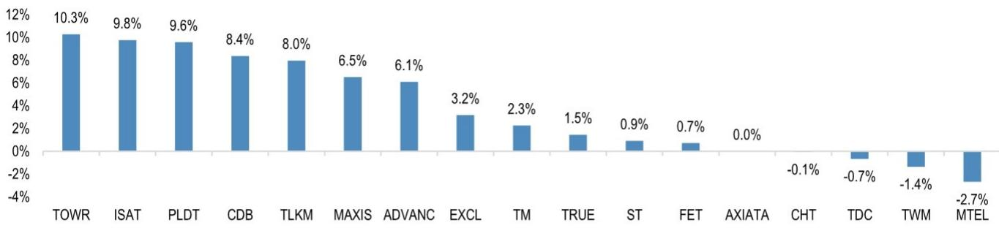
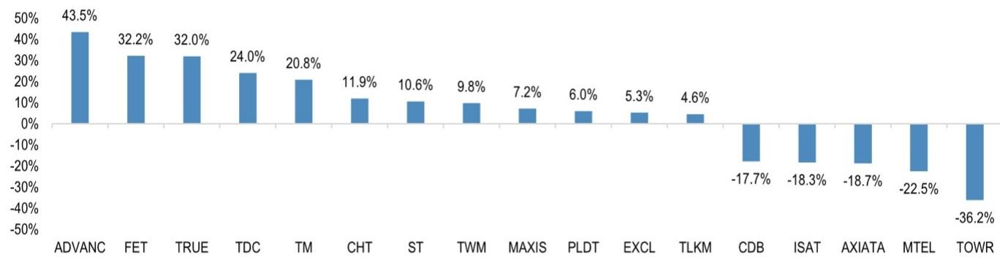
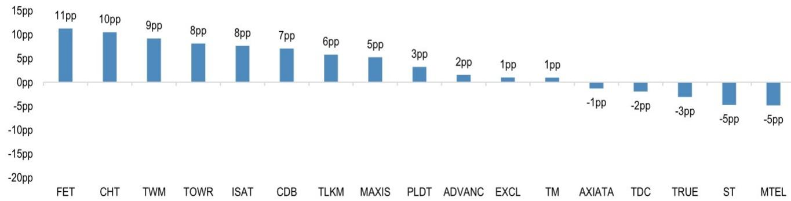
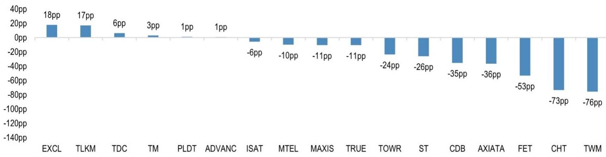

## ASEAN & Taiwan Telecom Companies

## Current AI token offerings are unlikely to drive earnings growth at telecom companies

ASEAN telecom companies have begun to offer AI tokens and models. In our view, current offerings are unlikely to drive sustained earnings growth, as any successful offering would likely be replicated by competitors. Hence, while some observers have drawn comparisons to Chinese telecom companies, we believe the current offerings are unlikely to be (and have not been) a significant factor for company valuations. Select telecom companies building their own AI infrastructure could see some benefit from rising token consumption if it helps generate incremental revenues from the AI infrastructure. Our preferred telecom companies are ST, ADVANC, TRUE, 4904, and ISAT.

- Most telecom companies have outperformed over the last month on rotation. Most notable are the Taiwanese telecom companies, led by FET, where earnings growth has driven the share price higher. FET's 1H26 mobile revenue and ICT revenues grew 6% and 33%, respectively, and its 1H26 NI growth rate of 17% is well above full-year guidance (3% growth). ISAT and TLKM share prices reacted positively to benign spectrum auctions, while ISAT has also reacted positively to the monetization of its fiber assets with cash proceeds of $650m. We believe this transaction is value-accretive for shareholders, as the fiber assets are monetized at an EV/EBITDA multiple of ~7x. We believe proceeds could be deployed to growth initiatives, such as AI and 5G networks, and cash distribution to shareholders.

- ASEAN telecom companies have begun to offer AI tokens. The tokens are being offered as a subscription plan bundling access to multiple models or as free access to select models as part of a telecom plan. For instance, Alisa AI, AIS's consumer AI service, bundles 10 AI models into a single subscription. Per AIS, AIS Alisa is offered to eligible AIS customers for Bt220/month, compared to a cumulative subscription price of Bt3.7k if a customer were to subscribe to each model individually (link). Examples of telecom companies bundling models into telecom plans are the free model access as part of subscription to telecom plans from StarHub and Telkom Indonesia.

- Current AI token offerings are unlikely to drive earnings growth. While some have drawn parallels to the Chinese telecom companies, we believe the telecom companies are unlikely to see sustained material benefit from the distribution of third-party models. Without exclusive partnerships, any successful initiative is likely to be replicated by competitors. Hence, the benefit will accrue to the consumer, rather than the telecom company. There could be a positive impact on the telecom industry if the AI models are offered only for higher price plans (in contrast, StarHub has launched the gigaFLEX+ youth plan with unlimited AI access from S$13.9/month), such that ARPU grows through upgrading. However, the impact on industry earnings will depend on the extent of upgrading and whether the incremental revenues are higher than the incremental costs of tokens.

- Rising token consumption could benefit select telecom companies with AI infrastructure. Chinese telecom companies reacted positively earlier in the year to the launch of their AI packages targeting SME/retail users. The plans integrated proprietary models with open-source models backed by self-owned and third-party compute resources (link). Telecom companies like ST and ISAT have been building their own AI infrastructure. Rising token consumption could drive incremental revenue for the telecom companies' AI infrastructure. ST has disclosed capex of up to S$600m to deploy 11MW of AI compute by FY27.

## ASEAN TMT

Ranjan Sharma, CFA AC (65) 6882-1303 ranjan.x.sharma@JPM.com JPM Securities Singapore Private Limited

Sigrid Qiu AC (65) 6882-1454 sigrid.qiu@JPM.com JPM Securities Singapore Private Limited

## Harsh Upadhyay

(91 22) 6157 3094  
harsh.x.upadhyay@jpmchase.com  
JPM India Private Limited, JPM Tower, Santacruz(E), Mumbai - 400098, SEBI Registration: INH000001873, (91-22) 6157-3000.

## Steven Suntoso

Steven Suntoso
(622-1) 5291 8090
steven.suntoso@JPM.com
PT JPM Sekuritas Indonesia

## Ankur Rudra, CFA

(65) 6801-3237  
ankur.rudra@JPM.com  
JPM Securities Singapore Private Limited

Yen Voo, CFA, CA  
(60-3) 2718 0914  
yen.voo@JPM.com  
JPM Securities (Malaysia) Sdn. Bhd. (18146-X)

## Jeanette Yutan

(63-2) 8878-1188  
jeanette.g.yutan@JPM.com  
JPM Securities Philippines, Inc.

## Kae Pornpunnarath, CFA

(66-2) 684-2679  
kae.pornpunnarath@JPM.com  
JPM Securities (Thailand) Limited

See page 6 for analyst certification and important disclosures, including non-US analyst disclosures.

Table 1: AI initiatives of global telecom companies

<table><tr><td colspan="2">Companies selling direct tokens</td><td></td></tr><tr><td>China Telecom</td><td>Offers customers token plans for individuals, families, developers and SMEs starting at Rmb9.9/month for 10mn tokens, rising to Rmb49.9 for 80mn. Developer and SME packages range Rmb39.9-299.9, with API-key access for agents and third-party applications. The platform includes China Telecom's Xingchen models and ecosystem models.</td><td>link</td></tr><tr><td>China Mobile</td><td>Pursuing a providence-led rollout, Shanghai Mobile offers a universal token service with 400k tokens for Rmb1, unified model-switching and payment through the mobile bill. Beijing Mobile offers 10mn tokens for a monthly package for Rmb24.99, while one package starts at Rmb5.99.</td><td>link</td></tr><tr><td>China Unicom</td><td>Consumer entry packages are reported at Rmb15 for 6mn tokens, with enterprise packages starting at Rmb198. Provincial programs include 6mn, 12mn and 18mn token tiers and 30mn token trial allowance for select Shanghai business customers.</td><td>link</td></tr><tr><td colspan="2">Multimodal aggregators</td><td></td></tr><tr><td>TRUE</td><td>Enterprise multimodal platform aggregating more than 50 AI models from over 10 providers. Packages begin at Bt399 per usage per month, with shared usage across image generation, web search, document processing, reasoning, research and video generation tools.</td><td>link</td></tr><tr><td>3HK</td><td>Eligible 5G mobile and broadband customers receive a promotional AI token allowance that is converted into BasicRouter credits. The credits can be used across select Alibaba Cloud and BytePlus text, image and video models.</td><td>link</td></tr><tr><td>Globe</td><td>AI Fiesta provides a unified interface for leading AI models, rather than requiring separate subscriptions. The underlying subscription offers 3mn shared tokens per month; standard models consume at 1x and premium 4x. Globe positions the service for students, creators, SMEs and entrepreneurs.</td><td>link</td></tr><tr><td>AIS</td><td>Preferential access to SparkChat combines models from providers including OpenAI, Anthropic, Google, Alibaba, DeepSeek, xAI, Mistral, Moonshot AI and BytePlus. Packages include refillable credits that can be used for text, image, video and music generation, with additional credit packs available when the included balance is exhausted.</td><td>link</td></tr><tr><td colspan="2">Bundled subscription providers</td><td></td></tr><tr><td>Airtel</td><td>Offered all mobile, Wi-Fi and DTH customers 12 months of Perplexity Pro free.</td><td>link</td></tr><tr><td>TLKM</td><td>Provides Perplexity Pro for three months on select prepaid packages.</td><td>link</td></tr><tr><td>Circles.Life</td><td>Mobile subscription beginning at approximately S$8/month, integrating models including GPT, Claude, Gemini, DeepSeek, Qwen and Perplexity/Sonar within one telecom plan.</td><td>link</td></tr><tr><td>StarHub</td><td>gigaFLEX+ includes a free gigaAI subscription with access to ChatGPT, Claude and Gemini in one interface, unlimited text usage and 300 image generations per month. Promotional pricing is S$13.90/month for the first year and S$19.90 thereafter.</td><td>link</td></tr><tr><td>SKT</td><td>SKT customers were offered one year of Perplexity Pro at no charge. The customer application period ended in October 2024, although the partnership subsequently supported SKT's broader AI-assistant strategy.</td><td>link</td></tr><tr><td>Deutsche Telekom</td><td>T Phone 3 and T Tablet 2 include an integrated Perplexity Assistant and 18 months of Perplexity Pro.</td><td>link</td></tr><tr><td>Free Mobile</td><td>Initially offered Free Mobile subscribers 12 months of Le Chat Pro free, followed by EUR17.99/month. Le Chat Pro remains available as a carrier-linked option for Free Mobile customers, with access to Mistral's frontier models.</td><td>link</td></tr><tr><td>O2 Telefonica</td><td>New O2 customers receive six months of ChatGPT Plus free; O2 Priority users had earlier received a three-month promotion. The subscription includes advanced GPT access, web search, file analysis and image processing.</td><td>link</td></tr><tr><td>Orange</td><td>Orange's Mistral partnership provides for Le Chat and Codestral integration into Orange offers, including a Le Chat option for French Mobile Pro customers. Orange Poland separately offered a six-month Le Chat Pro voucher for Orange Flex and Nju to eligible My Orange users; that claim campaign ran through 15 March 2026.</td><td>link</td></tr><tr><td>Verizon</td><td>Eligible Verizon mobile and home Internet customers can add Google AI Pro for $10/month, approximately half the standalone list price. The benefit supports family sharing and includes Gemini and Google's wider AI/storage package.</td><td>link</td></tr></table>

Source: Company data.

Figure 1: ASEAN & Taiwan telcos and towercos: Total shareholder return over the last month  
  
Source: JPM, Bloomberg Finance L.P. Data as of 21 July 2026.

Figure 2: ASEAN & Taiwan telcos and towercos: Total shareholder return over the last 12 months  
  
Source: JPM, Bloomberg Finance L.P. Data as of 21 July 2026.

Figure 3: ASEAN & Taiwan telcos and towercos: Relative total shareholder return vs. local indices over the last month  
  
Source: JPM, Bloomberg Finance L.P. Data as of 21 July 2026. Local indices used: SG - STI, TW - TWSE, PH - PCOMP, ID - JCI, MY - KLCI, VN - VNI, TH - SET.

Figure 4: ASEAN & Taiwan telcos and towercos: Relative total shareholder return vs. local indices over the last 12 months  
  
Source: JPM, Bloomberg Finance L.P. Data as of 21 July 2026. Local indices used: SG - STI, TW - TWSE, PH - PCOMP, ID - JCI, MY - KLCI, VN - VNI, TH - SET.

Figure 5: APAC telco and towerco comp sheet

<table><tr><td rowspan="2">Company</td><td rowspan="2">Ticker</td><td rowspan="2">Market cap (USD mn)</td><td rowspan="2">JPM Rating</td><td rowspan="2">JPM PT (LC)</td><td rowspan="2">Price (LC)</td><td rowspan="2">JPM PT to Price</td><td colspan="3">PE</td><td colspan="3">EV/EBITDA</td><td colspan="3">Dividend yield</td><td rowspan="2">EPS FY26-28 CAGR</td></tr><tr><td>26Y</td><td>27Y</td><td>28Y</td><td>26Y</td><td>27Y</td><td>28Y</td><td>26Y</td><td>27Y</td><td>28Y</td></tr><tr><td>Taiwan</td><td></td><td></td><td></td><td></td><td></td><td></td><td></td><td></td><td></td><td></td><td></td><td></td><td></td><td></td><td></td><td></td></tr><tr><td>Chunghwa Telecom Co Ltd</td><td>2412 TT EQUITY</td><td>33,081</td><td>N</td><td>147</td><td>139</td><td>5.8%</td><td>26.7</td><td>25.5</td><td>23.4</td><td>11.6</td><td>11.3</td><td>10.7</td><td>3.8%</td><td>4.0%</td><td>4.3%</td><td>6.7%</td></tr><tr><td>Taiwan Mobile Co Ltd</td><td>3045 TT EQUITY</td><td>12,886</td><td>N</td><td>120</td><td>112</td><td>7.1%</td><td>22.9</td><td>22.0</td><td>-</td><td>11.7</td><td>11.3</td><td>10.9</td><td>4.3%</td><td>4.5%</td><td>5.0%</td><td>-</td></tr><tr><td>Far EasTone Telecommunications</td><td>4904 TT EQUITY</td><td>11,483</td><td>OW</td><td>120</td><td>105</td><td>14.8%</td><td>25.0</td><td>23.1</td><td>21.2</td><td>10.5</td><td>10.3</td><td>9.9</td><td>4.0%</td><td>4.3%</td><td>4.6%</td><td>8.6%</td></tr><tr><td>Thailand</td><td></td><td></td><td></td><td></td><td></td><td></td><td></td><td></td><td></td><td></td><td></td><td></td><td></td><td></td><td></td><td></td></tr><tr><td>Advanced Info Service PCL</td><td>ADVANC TB EQUITY</td><td>34,039</td><td>OW</td><td>406</td><td>383</td><td>6.0%</td><td>22.1</td><td>20.6</td><td>19.6</td><td>10.2</td><td>9.9</td><td>9.5</td><td>4.3%</td><td>4.6%</td><td>4.9%</td><td>6.1%</td></tr><tr><td>True Corp PCL</td><td>TRUE TB EQUITY</td><td>14,585</td><td>OW</td><td>17</td><td>14</td><td>20.9%</td><td>19.4</td><td>17.2</td><td>16.0</td><td>8.0</td><td>7.8</td><td>7.6</td><td>3.6%</td><td>4.2%</td><td>4.3%</td><td>10.1%</td></tr><tr><td>Singapore</td><td></td><td></td><td></td><td></td><td></td><td></td><td>27Y</td><td>28Y</td><td>29Y</td><td>27Y</td><td>28Y</td><td>29Y</td><td>27Y</td><td>28Y</td><td>29Y</td><td></td></tr><tr><td>Singapore Telecommunications L</td><td>ST SP EQUITY</td><td>55,796</td><td>OW</td><td>5.20</td><td>4.40</td><td>18.2%</td><td>23.1</td><td>20.2</td><td>18.0</td><td>19.5</td><td>18.4</td><td>17.4</td><td>4.5%</td><td>4.8%</td><td>4.9%</td><td>13.3%</td></tr><tr><td>StarHub Ltd</td><td>STH SP EQUITY</td><td>1,365</td><td>NC</td><td>-</td><td>1.02</td><td>-</td><td>24.3</td><td>14.6</td><td>12.4</td><td>8.0</td><td>7.2</td><td>6.8</td><td>6.0%</td><td>6.1%</td><td>6.6%</td><td>39.7%</td></tr><tr><td>Philippines</td><td></td><td></td><td></td><td></td><td></td><td></td><td></td><td></td><td></td><td></td><td></td><td></td><td></td><td></td><td></td><td></td></tr><tr><td>PLDT Inc</td><td>TEL PM EQUITY</td><td>4,333</td><td>OW</td><td>1,945</td><td>1,258</td><td>54.6%</td><td>7.8</td><td>7.4</td><td>7.2</td><td>5.4</td><td>5.3</td><td>5.1</td><td>7.6%</td><td>7.7%</td><td>8.0%</td><td>3.8%</td></tr><tr><td>Indonesia</td><td></td><td></td><td></td><td></td><td></td><td></td><td></td><td></td><td></td><td></td><td></td><td></td><td></td><td></td><td></td><td></td></tr><tr><td>Telkom Indonesia Persero Tbk P</td><td>TLKM IJ EQUITY</td><td>15,170</td><td>N</td><td>2,800</td><td>2,710</td><td>3.3%</td><td>13.0</td><td>12.2</td><td>11.5</td><td>4.4</td><td>4.3</td><td>4.1</td><td>7.6%</td><td>7.8%</td><td>8.3%</td><td>6.1%</td></tr><tr><td>Indosat Tbk PT</td><td>ISAT IJ EQUITY</td><td>3,515</td><td>OW</td><td>3,000</td><td>1,910</td><td>57.1%</td><td>9.9</td><td>8.9</td><td>8.1</td><td>4.1</td><td>3.9</td><td>3.7</td><td>7.2%</td><td>7.6%</td><td>8.6%</td><td>10.2%</td></tr><tr><td>XLSMART Telecom Sejahtera Tbk</td><td>EXCL IJ EQUITY</td><td>2,624</td><td>UW</td><td>1,600</td><td>2,600</td><td>-38.5%</td><td>-</td><td>16.3</td><td>11.2</td><td>5.2</td><td>4.7</td><td>4.4</td><td>3.0%</td><td>3.6%</td><td>3.9%</td><td>-</td></tr><tr><td>Indonesia Towercos</td><td></td><td></td><td></td><td></td><td></td><td></td><td></td><td></td><td></td><td></td><td></td><td></td><td></td><td></td><td></td><td></td></tr><tr><td>Dayamitra Telekomunikasi PT</td><td>MTEL IJ EQUITY</td><td>2,139</td><td>OW</td><td>790</td><td>460</td><td>71.7%</td><td>17.2</td><td>16.0</td><td>14.8</td><td>7.1</td><td>6.9</td><td>6.7</td><td>5.0%</td><td>5.3%</td><td>5.8%</td><td>7.8%</td></tr><tr><td>Sarana Menara Nusantara Tbk PT</td><td>TOWR IJ EQUITY</td><td>1,618</td><td>OW</td><td>500</td><td>408</td><td>22.5%</td><td>6.0</td><td>5.7</td><td>5.4</td><td>6.8</td><td>6.5</td><td>6.1</td><td>4.9%</td><td>5.2%</td><td>5.4%</td><td>6.2%</td></tr><tr><td>India</td><td></td><td></td><td></td><td></td><td></td><td></td><td>27Y</td><td>28Y</td><td>29Y</td><td>27Y</td><td>28Y</td><td>29Y</td><td>27Y</td><td>28Y</td><td>29Y</td><td></td></tr><tr><td>Bharti Airtel Ltd</td><td>BHARTI IN EQUITY</td><td>126,100</td><td>OW</td><td>2,250.00</td><td>1,940</td><td>16.0%</td><td>30.7</td><td>23.7</td><td>19.7</td><td>10.4</td><td>9.2</td><td>8.3</td><td>1.7%</td><td>2.2%</td><td>2.8%</td><td>24.7%</td></tr><tr><td>Vodafone Idea Ltd</td><td>IDEA IN EQUITY</td><td>15,305</td><td>UW</td><td>9.00</td><td>13.51</td><td>-33.4%</td><td>-</td><td>-</td><td>-</td><td>15.2</td><td>12.9</td><td>11.4</td><td>0.0%</td><td>0.0%</td><td>0.0%</td><td>-16.5%</td></tr><tr><td>Indus Towers Ltd</td><td>INDUSTOW IN EQUITY</td><td>10,948</td><td>N</td><td>390.00</td><td>402</td><td>-3.0%</td><td>14.0</td><td>12.8</td><td>11.9</td><td>6.5</td><td>6.1</td><td>5.7</td><td>4.3%</td><td>4.9%</td><td>5.7%</td><td>8.5%</td></tr><tr><td>Bharti Hexacom Ltd</td><td>BHARTIHE IN EQUITY</td><td>8,542</td><td>OW</td><td>1,880.00</td><td>1,617</td><td>16.3%</td><td>32.5</td><td>25.1</td><td>20.5</td><td>15.3</td><td>12.9</td><td>11.4</td><td>1.3%</td><td>1.6%</td><td>2.1%</td><td>25.9%</td></tr><tr><td>China/HK</td><td></td><td></td><td></td><td></td><td></td><td></td><td></td><td></td><td></td><td></td><td></td><td></td><td></td><td></td><td></td><td></td></tr><tr><td>China Mobile Ltd</td><td>941 HK EQUITY</td><td>225,775</td><td>OW</td><td>100</td><td>81</td><td>23.8%</td><td>11.2</td><td>10.8</td><td>10.5</td><td>3.8</td><td>3.7</td><td>3.7</td><td>5.9%</td><td>6.1%</td><td>6.4%</td><td>3.1%</td></tr><tr><td>China Telecom Corp Ltd</td><td>728 HK EQUITY</td><td>77,955</td><td>OW</td><td>6</td><td>5</td><td>27.1%</td><td>11.9</td><td>11.2</td><td>10.3</td><td>3.6</td><td>3.5</td><td>3.4</td><td>5.3%</td><td>5.9%</td><td>6.4%</td><td>7.6%</td></tr><tr><td>China Unicom Hong Kong Ltd</td><td>762 HK EQUITY</td><td>25,560</td><td>OW</td><td>9</td><td>7</td><td>37.6%</td><td>8.8</td><td>8.4</td><td>7.8</td><td>1.5</td><td>0.8</td><td>1.5</td><td>6.3%</td><td>6.7%</td><td>7.3%</td><td>6.2%</td></tr><tr><td>Korea</td><td></td><td></td><td></td><td></td><td></td><td></td><td></td><td></td><td></td><td></td><td></td><td></td><td></td><td></td><td></td><td></td></tr><tr><td>SK Telecom Co Ltd</td><td>017670 KS EQUITY</td><td>12,396</td><td>OW</td><td>110,000</td><td>86,300</td><td>27.5%</td><td>15.2</td><td>14.0</td><td>12.8</td><td>4.9</td><td>4.8</td><td>4.8</td><td>3.9%</td><td>4.1%</td><td>4.2%</td><td>9.0%</td></tr><tr><td>KT Corp</td><td>030200 KS EQUITY</td><td>9,161</td><td>OW</td><td>75,000</td><td>53,100</td><td>41.2%</td><td>9.1</td><td>8.4</td><td>7.8</td><td>3.8</td><td>3.8</td><td>3.7</td><td>4.6%</td><td>4.9%</td><td>5.2%</td><td>8.0%</td></tr><tr><td>Malaysia</td><td></td><td></td><td></td><td></td><td></td><td></td><td></td><td></td><td></td><td></td><td></td><td></td><td></td><td></td><td></td><td></td></tr><tr><td>CELCOMDIGI BHD</td><td>CDB MK EQUITY</td><td>8,466</td><td>UW</td><td>2.80</td><td>2.98</td><td>-6.0%</td><td>20.5</td><td>18.4</td><td>16.7</td><td>8.3</td><td>8.0</td><td>7.8</td><td>4.9%</td><td>5.3%</td><td>5.8%</td><td>10.9%</td></tr><tr><td>Telekom Malaysia Bhd</td><td>T MK EQUITY</td><td>7,164</td><td>UW</td><td>4.50</td><td>7.69</td><td>-41.5%</td><td>17.0</td><td>15.4</td><td>14.6</td><td>6.8</td><td>6.3</td><td>6.1</td><td>4.4%</td><td>4.9%</td><td>5.2%</td><td>8.2%</td></tr><tr><td>Maxis Bhd</td><td>MAXIS MK EQUITY</td><td>6,926</td><td>N</td><td>3.65</td><td>3.60</td><td>1.4%</td><td>17.7</td><td>17.1</td><td>16.1</td><td>8.5</td><td>8.3</td><td>8.2</td><td>4.9%</td><td>5.0%</td><td>5.1%</td><td>4.8%</td></tr><tr><td>Axiata Group Bhd</td><td>AXIATA MK EQUITY</td><td>4,496</td><td>UW</td><td>2</td><td>2</td><td>-25.7%</td><td>20.6</td><td>16.3</td><td>13.0</td><td>6.2</td><td>5.9</td><td>5.8</td><td>5.1%</td><td>5.5%</td><td>6.0%</td><td>26.0%</td></tr><tr><td>TIME dotCom Bhd</td><td>TDC MK EQUITY</td><td>2,700</td><td>OW</td><td>7</td><td>6</td><td>21.9%</td><td>21.4</td><td>20.0</td><td>18.7</td><td>12.8</td><td>11.9</td><td>11.2</td><td>6.7%</td><td>6.8%</td><td>5.7%</td><td>6.9%</td></tr><tr><td>Australia</td><td></td><td></td><td></td><td></td><td></td><td></td><td></td><td></td><td></td><td></td><td></td><td></td><td></td><td></td><td></td><td></td></tr><tr><td>Telstra Group Ltd</td><td>TLS AU EQUITY</td><td>39,221</td><td>N</td><td>5.45</td><td>5.07</td><td>7.5%</td><td>24.4</td><td>23.1</td><td>21.7</td><td>8.4</td><td>8.1</td><td>7.8</td><td>4.1%</td><td>4.3%</td><td>4.6%</td><td>6.1%</td></tr><tr><td>TPG Telecom Ltd</td><td>TPG AU EQUITY</td><td>4,849</td><td>N</td><td>3.70</td><td>3.58</td><td>3.4%</td><td>67.8</td><td>43.5</td><td>27.3</td><td>6.4</td><td>6.1</td><td>5.9</td><td>5.3%</td><td>5.6%</td><td>6.0%</td><td>57.5%</td></tr></table>

Source: JPM, Bloomberg Finance L.P. Data as of 21 July 2026.

Companies Discussed in This Report (all prices in this report as of market close on 21 July 2026, unless otherwise indicated) Advanced Info Services(ADVANC.BK/Bt384.00/OW), Far EasTone Telecom(4904.TW/NT\$102.00/OW), Indosat Tbk PT(ISAT.JK/Rp1,945/OW), Singapore Telecom(STEL.SI/S\$4.42/OW), True Corporation PCL(TRUE
