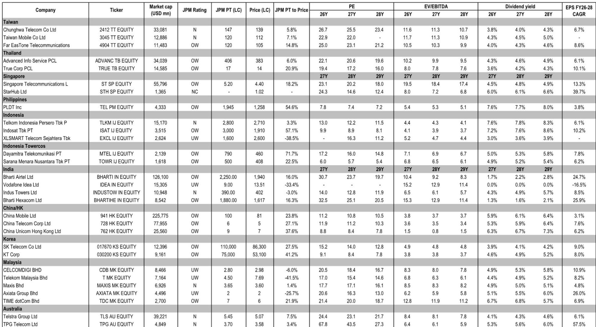
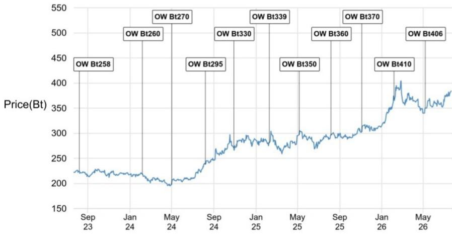
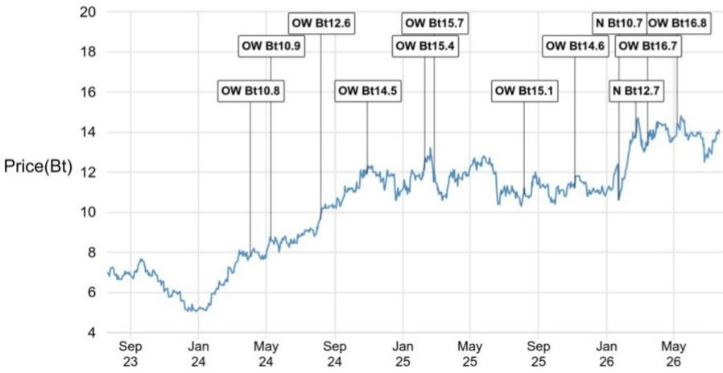

# JPM：AI技术与行业应用观察

东南亚电信运营商正在推出AI代币和模型服务，但JPM的一份最新研报认为，这些业务不太可能成为持续的盈利增长来源。报告的核心判断基于一个简单逻辑：任何成功的AI代币产品都会被竞争对手迅速复制，最终收益流向消费者而非运营商。这一结论与部分读者将东南亚电信商与中国同行类比的观点形成直接对比。

报告覆盖了东盟及台湾地区的主要电信公司，时间节点截至2026年7月21日。过去一个月，多数电信商因资金轮动而跑赢大盘，其中台湾远传电信（FET）表现最为突出——其2026年上半年移动业务收入同比增长6%，ICT业务收入增长33%，净利润增速达17%，远超全年3%的增长指引。印尼Indosat（ISAT）和Telkom Indonesia（TLKM）则因频谱拍卖结果温和而获得市场正面反应，ISAT还通过光纤资产货币化获得6.5亿美元现金，该交易以约7倍EV/EBITDA估值完成。

## 1. AI代币产品以订阅捆绑和免费接入两种模式为主

报告详细梳理了当前东南亚电信商的AI代币产品形态。一类是聚合多个模型的订阅服务，例如泰国AIS推出的Alisa AI，以每月220泰铢的价格捆绑10个AI模型，而单独订阅这些模型的总成本约为3700泰铢。另一类是将AI模型免费打包进电信套餐，新加坡StarHub和Telkom Indonesia均采用此模式。StarHub的gigaFLEX+青年套餐从每月13.9新加坡元起，提供无限AI访问权限。

> **KC评论：** 报告中的定价对比值得注意——AIS的捆绑定价仅为单独订阅成本的6%，这种激进折扣策略本身就暗示运营商并未将AI代币视为独立利润中心，而是作为维持用户粘性的工具。

## 2. 缺乏排他性合作意味着任何成功模式都会被复制

报告认为，东南亚电信商与AI模型提供商之间没有排他性合作，这是其与部分中国电信运营商的关键区别。中国电信、中国移动和中国联通推出的AI代币套餐整合了自有模型与开源模型，并依托自建和第三方算力资源。而东南亚电信商目前更多扮演分销渠道角色，例如泰国TRUE的聚合平台接入超过10家提供商的50多个AI模型，菲律宾Globe的AI Fiesta服务同样提供统一接口而非排他性模型。

报告进一步指出，即使AI代币仅面向高价位套餐推出，其对行业盈利的影响仍取决于用户升级比例以及增量收入能否覆盖代币的增量成本。以StarHub为例，其低价青年套餐的定价策略使得ARPU提升空间有限。

## 3. 自建AI基础设施的运营商可能从代币消费增长中获益

报告区分了两类运营商：单纯分销第三方模型的运营商，以及正在建设自有AI基础设施的运营商。新加坡电信（ST）和印尼Indosat属于后者。ST已披露到2027财年投入最高6亿新加坡元部署11MW AI算力的资本开支计划。报告认为，如果AI代币消费量增长，这类运营商可能通过AI基础设施获得增量收入。

这一判断与报告对近期报价表现的分析一致。过去一个月，台湾电信商整体跑赢，其中FET的报价上涨主要由盈利增长驱动，而非AI概念。印尼ISAT和TLKM的正面反应则来自频谱拍卖和资产交易等基本面因素。

## 4. 报告偏好的运营商集中在具备差异化优势的标的

JPM在研报中列出的首选标的包括新加坡电信（ST）、泰国Advanced Info Service（ADVANC）、泰国True Corp（TRUE）、台湾远传电信（4904）和印尼Indosat（ISAT）。这些公司的共同特征并非AI代币业务，而是在各自市场拥有更强的竞争地位、更清晰的资本配置方向或正在建设的AI基础设施。

报告提供的估值数据显示，截至2026年7月，这些公司的市盈率在9.9倍至23.1倍之间，EV/EBITDA在4.1倍至19.5倍之间，股息回报表现在3.6%至7.2%之间。其中ISAT的市盈率最低（9.9倍），而新加坡电信的EV/EBITDA最高（19.5倍），反映了市场对其区域资产和AI基础设施研究的溢价定价。

For informational purposes only. Portions may be generated,translated,summarized,or edited with AI assistance based on source materials and may contain omissions or errors. Please verify independently. This is not investment,legal,tax,accounting,or other professional advice.

For informational purposes only. Portions may be generated,translated,summarized,or edited with AI assistance based on source materials and may contain omissions or errors. Please verify independently. This is not investment,legal,tax,accounting,or other professional advice.

