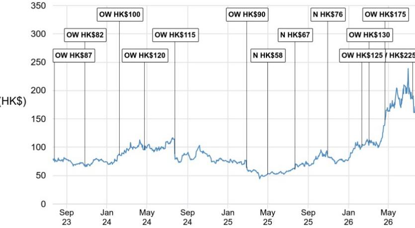

# ASMPT 新任CEO释放信号：聚焦先进封装，核心增长方向明确

ASMPT有限公司宣布，拥有SkyWater Technology和英特尔深厚背景、在晶圆代工与先进封装运营方面经验丰富的Bassel Haddad先生将于8月出任CEO。这并非一次常规的交接，而是公司战略意图的明确信号：将资源集中于其最具盈利能力和竞争壁垒的业务线——先进封装设备，特别是热压键合（TCB）技术。这一调整恰逢全球半导体行业大规模投入异构集成领域，而ASMPT正是这一建设进程中的关键供应商。

公司报价已对此有所反映，从2026年2月的约100港元升至7月中旬的188港元以上，某全球研究机构报告上调了公司评级。市场预期与新任CEO的背景高度契合。但对于观察者而言，关键问题不在于ASMPT是否是一家优秀公司，而在于当前的市场定价是否充分反映了先进封装领域的机遇规模，以及主流市场复苏和技术转型中的风险是否被低估。

答案需要从三个层面剖析：领导层变动及其战略含义、推动TCB需求的具体因素、以及评估ASMPT至2027年盈利轨迹的整体框架。

## 新任CEO的行业背景印证ASMPT从传统业务转型

Haddad先生的任命不仅是管理层更替，更是对过去几个季度已在进行中的战略调整的确认。前任CEO Robin Ng先生已宣布退休，公司此前已逐步将重心从SMT（表面贴装技术）组装设备等协同效应较低的业务转移。新任CEO带来了在美国晶圆代工厂运营先进封装业务的直接经验，以及在英特尔多年的领导经历——英特尔是EMIB（嵌入式多芯片互连桥）技术最积极的采用者之一。

观察者应将此次任命视为公司承诺将资本、研发和管理资源集中于利润率最高、增长最快的业务板块。报告明确指出，预计未来几个季度公司将公布SMT战略退出选项的更新。剥离SMT业务不仅能简化公司结构，还能释放资金用于TCB和光子学领域的再投资，而ASMPT在这些领域拥有技术优势。逻辑清晰：在资本密集、设备交付周期和客户关系需要多年建立的行业中，专注本身就是竞争优势。Haddad先生的背景表明，他将加速而非放缓这一转型。

## 热压键合是核心引擎，多重需求驱动因素同步汇聚

研究逻辑的核心在于TCB技术，该技术用于先进封装中的芯片垂直堆叠。报告识别出三个短期内汇聚的不同需求驱动因素。首先，台积电和OSAT的CoWoS（晶圆上芯片基板）建设持续强劲，受超大规模数据中心对AI加速器需求的推动。其次，HBM（高带宽存储器）生产正为HBM4扩产，ASMPT的无助焊剂TCB技术在韩国存储器制造商SK海力士和美光拥有30%至35%的份额，并有望在三星电子取得突破。第三，在逻辑芯片方面，一家全球IDM（普遍认为是英特尔）正在为TCB设备下单，以支持其Clearwater Forest和Diamond Rapids数据中心CPU，随着EMIB-T应用范围的扩大，还有进一步增长空间。

这些驱动因素各自都具有重要意义。它们共同创造了一个多年需求周期，对单一客户或终端市场的依赖度较低。报告指出，HBM4E可能维持12hi（12层堆叠）作为主流配置，这减缓了向更高堆叠层数的迁移，但使TCB在更长时间内保持相关性。这是一个微妙但重要的观点：较慢的堆叠迁移意味着当前一代TCB设备将拥有更长的使用寿命，降低了可能干扰收入的技术突然过时的风险。

除TCB外，报告还指出了新兴催化剂：长电科技和盛合晶微在中国新增的先进封装产能、汽车和工业领域在智能手机需求疲软背景下的复苏、以及用于可插拔收发器的光子学领域的强劲增长，伴随共封装光学（CPO）应用带来的可观市场空间。这些是可能为基础情景增加上行空间的次级机会，但对于核心论点而言并非必需。

## 观察者的决策框架：上行空间实现的三个条件

要将报告分析转化为可用的观察框架，需考虑三个必须满足的条件，以使上行空间得以实现。

首先，TCB订单量必须以复合增长率持续增长，以支撑当前的市场定价。报告的基础情景假设2027和2028年CoWoS和HBM建设更强劲、OSAT用于2.5D封装的产能增加、以及HBM堆叠迁移延迟。如果这些假设中任何一项过于乐观——例如，AI资本支出增长放缓，或竞争对手开发出具有竞争力的无助焊剂TCB解决方案——收入轨迹将减弱。

其次，SMT剥离必须以合理估值执行，并将收益有效重新配置。时机不当的出售或未能再投资于先进封装，可能稀释战略收益。报告预计未来几个季度将有更新，观察者应密切关注管理层在此方面的表述。

第三，主流半导体复苏必须如期实现。报告承认一个关键下行风险：2026年宏观环境可能走弱，影响汽车、工业和AI电源管理领域主流复苏的可持续性。虽然TCB业务因服务于拥有专用预算的AI和存储器客户而具有一定隔离性，但广泛的经济放缓仍可能影响整体市场情绪，并降低市场愿意给予的估值倍数。

然而，上行情景同样具体。报告识别出一个潜在催化剂：竞争对手在HBM4E无助焊剂TCB技术上的追赶失败。如果ASMPT的技术领先优势扩大，其市场份额可能超过当前30%至35%的估计，定价能力也将提升。这是一个二元结果，观察者应通过客户认证公告和技术路线图进行跟踪。

## 市场定价要求较高，但市场规模可支撑

以30倍远期盈利计算，ASMPT并不便宜。但这一倍数与其10年平均值一致，且适用于一家收入结构正向高利润率先进封装业务发生结构性转变的公司。对于一个拥有多个近期催化剂和明确战略方向的公司而言，这一估值是合理的。

关键风险在于市场可能已提前反映了成功的SMT退出和顺利的TCB增长。订单公告或执行方面的任何失望都可能导致估值倍数压缩。但对于相信AI驱动的先进封装需求仍处于早期阶段的观察者而言，ASMPT提供了对这一主题的纯粹敞口，且背后是明确与该战略保持一致的管理团队。

新任CEO的任命是最后一块拼图，表明ASMPT不再是一家试图服务所有领域的多元化设备供应商。它正在成为一家专注的先进封装领域的重要参与者，市场正开始据此对其进行定价。

*仅供参考。部分内容可能基于源材料通过AI辅助生成、翻译、总结或编辑，可能存在遗漏或错误。请独立核实。本文不构成专业建议。*

仅供参考。部分内容可能基于源材料通过AI辅助生成、翻译、总结或编辑，可能存在遗漏或错误。请独立核实。本文不构成专业建议。

