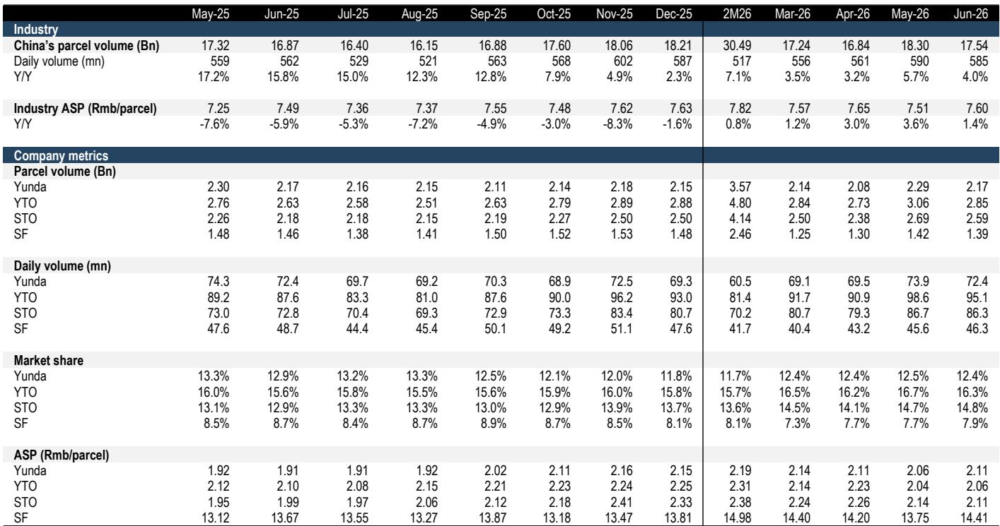
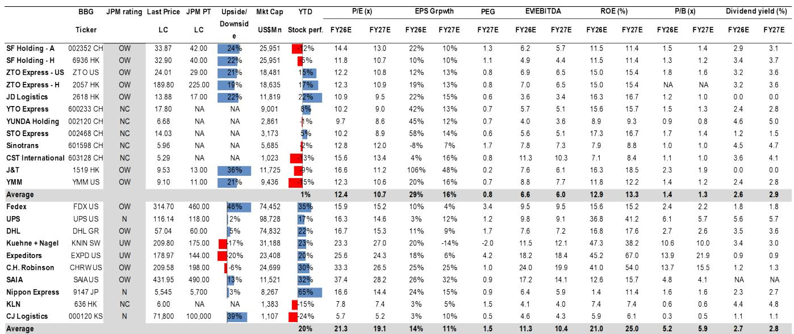
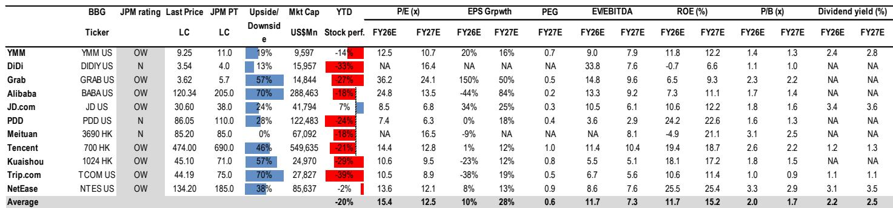

# China Logistics Has Reached an Inflection Point: The Shift from Volume to Value Is Now Delivering Tangible Profit Growth

The China logistics sector has entered a new phase that few observers have fully priced in. In June 2026, industry revenue grew 7.7% year-over-year to RMB 136 billion, while parcel volume rose only 3.8%—a gap that signals the structural shift away from "volume at any cost" is no longer aspirational but operational. Average selling price recovered to RMB 7.77, up 3.8% year-over-year, marking the second consecutive month of pricing improvement. This is not a cyclical blip. It is the result of deliberate anti-involution measures that have restored pricing discipline across the sector, combined with technology-driven cost reduction that is now flowing directly to the bottom line.

The profit alerts from the three A-share Tongda players make the magnitude of this inflection unmistakable. YTO's implied second-quarter 2026 net profit surged 92% year-over-year. STO's jumped 152%. Yunda's rose 136%. These are not marginal improvements. They represent a step-change in earnings momentum that has been building for quarters but is only now becoming visible in reported numbers. The sector is not simply recovering from a low base; it is restructuring its economics.

Yet the market has responded unevenly. While every major China logistics stock outperformed the Hang Seng Index and the Hang Seng China Enterprises Index in June, year-to-date dispersion remains extreme. Full Truck Alliance, the worst performer year-to-date through May, rallied 19% in June alone. The leaders—ZTO and JD Logistics—held steady, while laggards caught up. This convergence suggests the market is beginning to recognize that the sector's fundamentals have shifted, but the pecking order for the next three to six months has already reshuffled. The companies best positioned to monetize this new environment are not necessarily the same ones that led the last cycle.

## The Sector's Pricing Recovery Is Structural, Not Tactical, and It Is Reshaping Competitive Dynamics

The June express delivery data provides the clearest evidence yet that pricing discipline has become embedded in industry behavior. Industry ASP of RMB 7.77 represents a 3.8% year-over-year increase, and this is not a one-off driven by mix shift. The three largest Tongda players—YTO, STO, and Yunda—all reported ASPs within a narrow band of RMB 2.06 to RMB 2.11, suggesting that price competition has stabilized at a rational level rather than collapsing into a race to the bottom. Anti-involution policies, which have been in place for over a year, are now producing consistent results because the industry has internalized the lesson that volume growth without margin is value-destructive.

The implications for competitive positioning are significant. Scale leaders are extending their advantage not through predatory pricing but through superior execution. STO delivered the fastest volume growth in June at 19% year-over-year, gaining 1.8 percentage points of market share to reach 14.8%. YTO's volume grew 9%, adding 0.7 percentage points to reach 16.3% market share. Yunda, by contrast, deliberately sacrificed volume growth—flat year-over-year—to focus on higher-quality flows, and its market share slipped 0.5 percentage points to 12.4%. This divergence is not a sign of weakness; it reflects a strategic choice. Yunda is prioritizing margin over market share, and its 136% profit growth in the second quarter validates that decision.

The key insight for observers is that the sector is no longer a homogeneous commodity business where all players rise and fall together. Differentiation is accelerating. Companies that can combine scale with technology-driven cost efficiency and pricing discipline will capture disproportionate value. Those that try to compete purely on volume will find themselves squeezed between rational pricing at the top and margin pressure from below.

## Tongda Profit Alerts Reveal a Sector-Wide Earnings Inflection, with Technology Upgrades as the Common Accelerator

The profit alerts from YTO, STO, and Yunda are not just about pricing recovery; they reflect a deeper transformation in operating models. All three companies explicitly cited technology upgrades as a key driver of margin expansion. YTO highlighted AI-led transformation across the logistics value chain, improving efficiency in trunk transportation, sorting, and last-mile fulfillment. STO pointed to ongoing digital transformation and improved dual-network coordination. Yunda emphasized AI and digital tools deployed across the full parcel chain, supporting lean management and operational efficiency.

This is not cost-cutting in the traditional sense. It is structural cost reduction that compounds over time. When a company deploys AI to optimize sorting routes or reduce empty truck miles, the savings are not one-time; they become embedded in the cost base and widen the moat against competitors who lack similar capabilities. The implied second-quarter net profit growth rates—92% for YTO, 152% for STO, 136% for Yunda—are so large that they cannot be explained by pricing alone. Technology-driven efficiency gains are amplifying the impact of revenue recovery.

The second-quarter numbers also underscore that the earnings inflection is broad-based. YTO's implied net profit of RMB 1.87 billion in the second quarter represents a near-doubling year-over-year. STO's RMB 546 million is more than 2.5 times the prior-year level. Yunda's RMB 491 million is more than double. These are not isolated outliers. They are consistent across the peer group, which suggests a systemic improvement in industry profitability rather than company-specific factors. The anti-involution framework has created the conditions for margin repair, and technology investments are providing the leverage.

## The New Pecking Order Favors Platform Models and Scalable Networks Over Traditional Asset-Heavy Operators

The most significant shift in the sector's leadership is the emergence of Full Truck Alliance and J&T Express as top picks, displacing some of the traditional leaders. This reordering reflects a fundamental change in what drives value in China logistics. YMM's restructuring is showing visible progress: second-quarter transaction commission revenue is poised to grow approximately 33% year-over-year, even as headline revenue declines 4% due to the wind-down of freight brokerage and credit solutions. Fulfilled orders are expected to grow 11% to 14% year-over-year, supported by easing oil prices. The platform model, which monetizes transactions rather than owning assets, is proving more resilient and scalable in the current environment.

J&T's trajectory is even more striking. Group-level parcel volume surged 24% year-over-year in the second quarter to 9.18 billion, with daily volume exceeding 100 million for the first time. Non-IFRS net profit is expected to grow more than 50% year-over-year, with potential upside to the full-year guidance of USD 700 million. J&T's platform model—serving multiple e-commerce ecosystems rather than being tied to a single parent—gives it structural advantages in capturing demand across the fragmented Chinese e-commerce landscape. Its accelerating New Markets expansion adds a growth vector that pure domestic players cannot replicate.

ZTO remains the sector's most consistent compounder, with volume and profit growth outpacing the industry. Second-quarter operating profit is expected to rise 30% to 40% year-over-year, supported by market share gains and strength in reverse logistics. JD Logistics continues to demonstrate top-line resilience, with revenue growth of 20% to 25% year-over-year, even if non-IFRS net profit is temporarily capped by one-off items. SF's quality-focused strategy is supporting ASP recovery—up 5.1% year-over-year to RMB 14.1—but earnings remain muted on a high base. The divergence among these names is not random; it reflects different exposure to the structural trends reshaping the sector.

## A Decision Framework for Navigating the Next Phase: Prioritize Margin Visibility Over Volume Growth

The data from June and the second-quarter previews offer a clear framework for positioning. The sector has moved from a phase where volume growth was the primary driver of returns to one where margin delivery and earnings quality determine relative performance. This shift has three concrete implications for how observers should evaluate logistics companies.

First, pricing power matters more than market share gains. Yunda's deliberate decision to sacrifice volume for margin is the right strategy in this environment. Companies that can maintain or improve ASP while growing profits will be rewarded. Those that chase volume at the expense of pricing will face margin compression as the industry's rational pricing environment makes it harder to pass on costs.

Second, technology-driven cost efficiency is becoming a competitive necessity, not a differentiator. The Tongda players are all investing in AI and digital tools, and the gap between those who execute well and those who lag will widen. Companies that can demonstrate measurable improvements in cost per parcel through technology will have more room to invest in service quality and network expansion without sacrificing margins.

Third, platform models and scalable networks offer better risk-reward than asset-heavy operators in the current cycle. YMM and J&T are benefiting from structural tailwinds that traditional express delivery companies do not have: YMM from the platform's ability to monetize transaction growth without proportional cost increases, and J&T from its multi-e-commerce exposure and international expansion. These advantages are not fully reflected in current valuations, which still discount the sector's improving fundamentals.

The June rally was broad-based, but the next leg of performance will be selective. Companies that combine pricing discipline, technology-driven efficiency, and scalable business models will stand out. Those that rely on volume growth alone will lag. The sector has reached an inflection point, and the winners are already separating from the rest.

*For informational purposes only. Portions may be generated, translated, summarized, or edited with AI assistance based on source materials and may contain omissions or errors. Please verify independently. This is not investment, legal, tax, accounting, or other professional advice.*

For informational purposes only. Portions may be generated, translated, summarized, or edited with AI assistance based on source materials and may contain omissions or errors. Please verify independently. This is not investment, legal, tax, accounting, or other professional advice.

