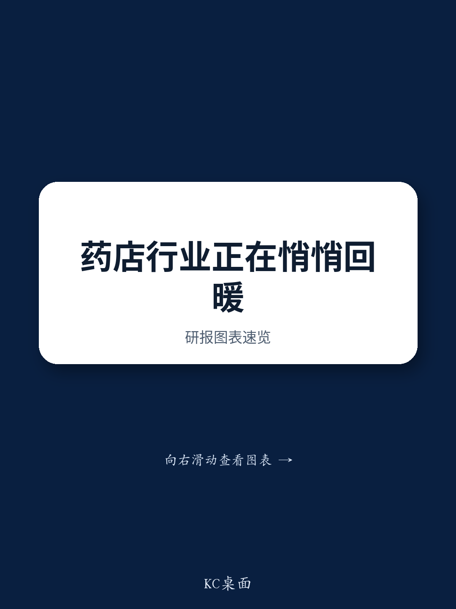

# 中国连锁药房已过关键节点：整合带来的客流增长已在同店数据中显现

三家头部上市连锁药房——益丰、老百姓、大参林——均报告2026年第二季度同店增长明显提速，从前两个季度的低个位数增长升至约5-6%。这并非季节性波动或基数效应。各公司管理层均将改善归因于客流量上升，而非客单价扩大——客单价整体保持平稳。驱动因素是结构性的：行业加速出清开始将客流从关闭的独立药房重新分配给存续门店，头部连锁是主要受益者。门店数量在疫情期间接近70万家峰值，预计未来三到五年将收缩约三分之一，稳定在40万至50万家之间。与此同时，医保监管压力对中小连锁的挤压更为显著，将此前被视为风险的因素转化为规模玩家的持久竞争优势。最严重的干扰——飞行检查、非理性价格竞争、高疫情基数——正在消退。留下的是一种结构性的有利格局，其中三种相互强化的推动力——整合驱动的市场份额增长、加盟主导的轻资产扩张模式、以及品类结构改善带来的利润率韧性——正在经营数据中显现。

这不是一个复苏故事。这是一个重新定价的故事。过去两年主导读者对中国药房板块认知的风险叙事——线上价格趋同、院内价格对标、监管飞行检查——已从基本面担忧转变为情绪性压制。基本面已经转向。

## 同店增长重新加速，因为门店关闭终于将客流集中到存续门店

第二季度最具体的信号是三家连锁客流驱动复苏的一致性。益丰报告同店增长约6%，季度内月度走势——4月7%，5月5%，6月6%——表明改善并非单月异常。老百姓录得5-6%增长，大参林报告环比加速。每家连锁都明确将客流列为驱动因素，而非定价或客单价。这一点很重要，因为客流增长反映了市场结构的真实变化，而非暂时的促销拉动。

机制很简单。中国药房市场在疫情期间变得严重过剩，约70万家门店服务于一个每店约2000人的市场，已低于可持续盈利的密度阈值。目前正在进行的收缩预计将在三到五年内减少20万至30万家门店，将每店服务人口提升至约3000人。在每年净关闭3万至5万家门店的情景下，仅客流重新分配就应为最能捕捉这一机会的存续门店每年带来约5%的同店增长。

老百姓的评论尤其具有启发性。该连锁强调，其目前约1.5万家门店的经营质量比一两年前同等门店数量时显著更高，因为它在2024年第四季度停止了高速扩张，转而专注于现有门店的生产力。这不是一家等待市场自我修复的公司。它已经重新定位其基础，以捕捉整合红利。

## 加盟主导的轻资产模式已成为捕捉碎片化尾部市场的主要载体，条款已显著转向有利于买方

整合故事不仅限于自然客流增长。头部连锁也在利用加盟作为收购渠道，而机会空间已变得异常有吸引力。中型和小型连锁的收购倍数已压缩至0.3-0.5倍市销率，反映出买方市场——竞标者更少，卖家陷入困境。加盟结构已经反转：根据老百姓和大参林，目前约70-80%的新加盟签约是现有门店的转换，而两年前约70%是新店自建。这意味着药房经营者越来越多地寻求在大型连锁的供应链、品牌和运营基础设施下寻求庇护，而非试图独立竞争。

战略意义重大。头部连锁现在可以在不投入自建扩张时代所需的重资本的情况下扩大其覆盖范围和收入基础。大参林的直营式加盟模式——具有统一管理、约90%商品控制、超过30个仓库、覆盖20多个省份——被渠道专家视为三者中最成熟的。这一模式赋予加盟方对产品组合、定价和合规的有意义控制，这在医保监管收紧的背景下日益重要。

然而，加盟价值主张的一个方面值得谨慎。原本被广泛预期将成为大型连锁利润率提升杠杆的OEM和自有品牌产品，可能面临政策阻力。头部连锁的OEM产品纳入医保目录的比例目前仅为30-40%，随着目录剔除保健滋补类SKU，这一比例预计将进一步下降。OEM接受度也具有高度区域性——大参林在广东和广西较强，而益丰和老百姓在江苏、湖南和湖北较强。自有品牌机会是真实的，但比市场叙事所暗示的更为受限。

## 非药品类扩张是应对报销结构侵蚀的共同对冲手段，但仍处于早期阶段，需要耐心资本

第三种结构性推动力是通过品类结构改善实现利润率韧性，在这方面各连锁采取了不同策略。老百姓在三者中似乎拥有最成熟的非药品类线，今年以来已在功能食品、个人护理和家居生活类别中引入了超过250个非药品类SKU。管理层报告称，保健食品和日用品类表现良好，而个人护理和营养补充品类面临更广泛宏观环境带来的消费降级压力。

大参林采取了不同方法，进一步推进服务导向的非药品类形式。该连锁已在数百家改造门店中引入了营养师咨询、健康检测、中医理疗、物理治疗和AI诊断。早期数据令人鼓舞：通过AI检测或营养师管理的客户表现出更高的粘性、更强的支付意愿以及显著更高的年消费额。这些服务导向的形式创造了小型连锁或线上平台难以复制的差异化，因为它们依赖于物理邻近性、信任和持续的人际互动。

然而，非药品类扩张仍处于早期阶段。药房内的健康站形式——包括专注于睡眠、体重管理和糖尿病的单病种中心——在投资回报基础上仍处于亏损状态。这些形式的结构性优势，包括社区邻近性、高质量体验的较低价格点以及社区参与，为它们与现有健康中心竞争提供了可信的路径。但这条路径需要耐心资本和愿意在初始亏损期进行投入的意愿。对于评估这些连锁的观察者来说，关键问题不是非药品类战略是否有效，而是管理团队是否有纪律以不破坏近期回报的节奏进行规模化。

## 评估三家连锁的决策框架：客流捕捉、加盟经济与品类结构

报告的数据允许在三个维度上进行结构化比较：客流捕捉能力、加盟模式成熟度和非药品类准备度。

在客流捕捉方面，三家连锁都受益于相同的宏观趋势，但现有门店基础的质量很重要。老百姓有意放缓扩张并专注于门店层面生产力，表明其客流捕捉可能更持久，因为它没有在仍在吸收整合收益的基础上叠加新店。益丰季度内的月度增长模式令人鼓舞，但需要监测其持续性。

在加盟经济方面，大参林的整合模式提供了对加盟商行为和产品组合的较强控制，这在监管合规日益严格的环境中很有价值。全行业70-80%的现有门店转换为加盟的比率证实，加盟渠道不仅是增长载体，也是整合机制。收购倍数压缩至0.3-0.5倍销售额为加盟方创造了有利的风险回报，前提是整合成本保持可控。

在非药品类组合方面，老百姓拥有最广泛的产品组合，但大参林的服务导向方法如果健康站形式能够实现盈亏平衡，可能产生更高的客户生命周期价值。非药品类是三种推动力中最不确定的，因为它取决于消费者将可自由支配的健康支出从传统渠道转向药房形式。关于粘性和支付意愿的早期数据是积极的，但投资回报计算尚未在规模上得到验证。

贯穿所有三个维度的共同主线是，竞争动态已从在位者防御颠覆的市场转变为它们正在吸收较小玩家、捕捉客流并通过规模、监管和服务差异化构建护城河的市场。2023年至2026年初主导该板块的风险叙事——线上价格趋同、院内价格对标、飞行检查——并未消失，但已主要成为情绪因素而非基本面因素。基本面现在由整合驱动，数据支持以下观点：头部连锁处于有利位置，能够以比过去三年任何时候都更低的执行风险提供更高质量的增长。

*仅供参考。部分内容可能基于源材料通过AI辅助生成、翻译、总结或编辑，可能存在遗漏或错误。请独立核实。本文不构成专业建议。*

仅供参考。部分内容可能基于源材料通过AI辅助生成、翻译、总结或编辑，可能存在遗漏或错误。请独立核实。本文不构成专业建议。

