# 市场观察笔记

## 日本量化策略

## 日经指数回升——是否意味着调整告一段落？AI半导体板块距离重新领跑仍有距离

## 市场情绪不应过度悲观

日经平均指数今日（7月21日）显著回升至66,000点。上周后半段，市场持续呈现调整态势，尤其在AI半导体相关板块，读者情绪趋于谨慎。然而，近期的回调并未伴随盈利预期的下修，而更多受到AI相关叙事变化以及趋势交易者仓位调整的影响。

鉴于日本市场情绪已回落至接近零的水平，且东证指数的预期每股收益并未出现明显下滑，悲观情绪进一步蔓延需要新的触发因素。与此同时，韩国市场情绪仍在持续走弱。日本市场中，以存储半导体为主的个股仍易受全球AI相关叙事影响。尽管日本个股的盈利动能保持稳健，但现阶段市场回升的持续性在很大程度上仍取决于外部环境。

## 趋势跟踪策略的止损抛售是否会扩散？

上周，趋势跟踪策略触发了日经期货的止损卖盘，通过期货市场加剧了贝塔抛售压力。然而，随着AI半导体相关个股的反弹，日经225期货今日回升至66,000点水平。趋势跟踪策略的止损抛售似乎暂时停止。如果指数再次跌破64,600点，趋势跟踪策略的仓位调整仍存在重启风险。不过，我们认为自5月以来趋势跟踪策略建立的多头仓位已有相当部分被平仓。

就KOSPI 200期货而言，当指数跌破1,100点时触发了止损卖盘，但我们认为自3月以来积累的多头仓位已基本被平仓。除非出现额外的冲击导致日经平均指数或KOSPI 200再次大幅下跌，否则以趋势跟踪策略为首的期货抛售压力正在度过最严峻的阶段。

## 全球量化与衍生品策略

Masanari Takada AC (81-3) 6736-8636 masanari.takada@JPM.com JPM Securities Japan Co., Ltd.

Tony SK Lee  
(852) 2800-8857  
tony.sk.lee@JPM.com  
JPM Securities (Asia Pacific) Limited/ JPM Broking (Hong Kong) Limited

Robert Smith, PhD  
(61-2) 9003-8808  
robert.z.smith@JPM.com  
JPM Securities Australia Limited

Khuram Chaudhry
(44-20) 7134-6297
khuram.chaudhry@JPM.com
JPM Securities plc

Dubravko Lakos-Bujas
(1-212) 622-3601
dubravko.lakos-bujas@JPM.com
JPM Securities LLC

图1：日本市场情绪与预期每股收益变化率——市场情绪持续谨慎，但盈利预期保持稳定  
  
来源：Bloomberg Finance L.P., JPM Global Markets Strategy

图2：日本市场情绪与韩国市场情绪——亚洲交易时段半导体板块是否存在持续波动？  
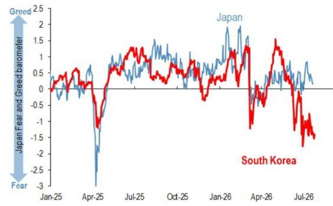  
来源：Bloomberg Finance L.P., JPM Global Markets Strategy

图3：趋势跟踪策略的日经期货仓位——在短暂触及64,000区间后，日经指数自行反弹并回升至66,000水平  
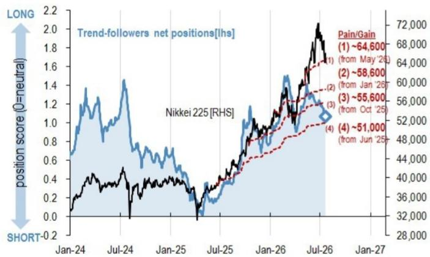  
来源：Bloomberg Finance L.P., JPM Global Markets Strategy

图4：趋势跟踪策略的KOSPI 200期货仓位——关注能否回升至1,100点，趋势跟踪策略的强制平仓是否会暂歇？  
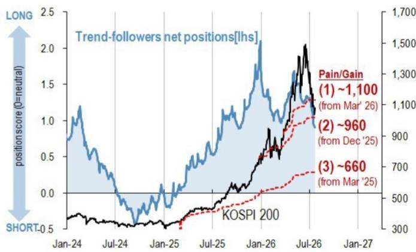  
来源：Bloomberg Finance L.P., JPM Global Markets Strategy

## 高贝塔/高动量个股的回补压力仍然有限

尽管如此，期货并非7月抛售的主要驱动因素。在现货市场，高贝塔/高动量个股的下跌尤为显著，特别是半导体和AI基础设施相关板块。观察日本和韩国市场中高动量/高贝塔与低动量/低贝塔策略的多空表现，目前正出现潜在的触底迹象。另一方面，高动量/高贝塔策略相对于市场的超额收益回升较为缓慢。这表明，虽然低贝塔/低动量一侧的空头回补接近完成，但主动回补被抛售的高贝塔/高动量个股的动向尚未形成势头。市场似乎已开始预期抛售（AI相关）暂歇，但在全球主要AI相关公司关键财报公布前，仍处于观望状态，尚难转向积极立场。

图5：日本与韩国市场——高动量/高贝塔 vs. 低动量/低贝塔多空表现

样本范围包括东证500指数和KOSPI 200指数。每月末，按股价回报（12个月 vs. 1个月）和贝塔值选取前30%和后30%的个股。

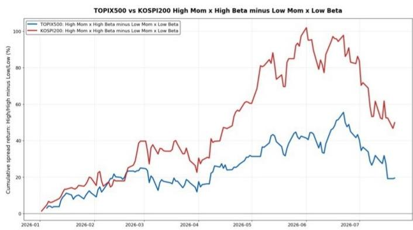  
来源：Bloomberg Finance L.P., JPM Global Markets Strategy  
图6：日本与韩国市场——高动量/高贝塔 vs. 市场超额收益

样本范围包括东证500指数和KOSPI 200指数。每月末，按股价回报（12个月 vs. 1个月）和贝塔值选取前30%和后30%的个股。超额收益为相对于各市场指数的表现。

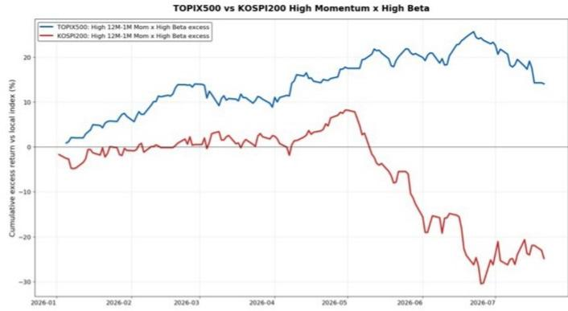  
来源：Bloomberg Finance L.P., JPM Global Markets Strategy

因此，当前关注点在于6月遭受显著回调的"旧赢家"（定义为截至6月底的高贝塔/高动量个股）的修复程度。观察7月累计超额收益，无论是整体"旧赢家"还是"6月受创的旧赢家"（即6月回撤扩大、动量崩溃的旧赢家），均已从7月17日左右的低点反弹。然而，"6月受创的旧赢家"仍落后于整体"旧赢家"，因此尚不能断定6月被大幅抛售的个股群体已重新获得领跑地位。虽然技术性反弹明显，但市场要回到调整前的买入兴趣水平，似乎仍有距离。

图7：开始失去动能的高动量/高贝塔个股群体的表现细节 - 1/1

样本使用东证500指数。截至6月底，提取股价回报最高（12个月-1个月基准）且贝塔值较高的个股。使用同时满足两个标准的前30%个股的交集。我们将该群体定义为"旧赢家"，并进一步将该群体中从6月峰值到6月30日回撤最大的前50%个股定义为"6月受创的旧赢家"。

东证500 2026年7月：旧赢家反转  
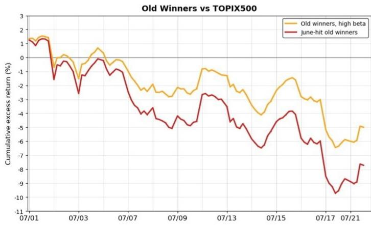  
来源：Bloomberg Finance L.P., JPM Global Markets Strategy

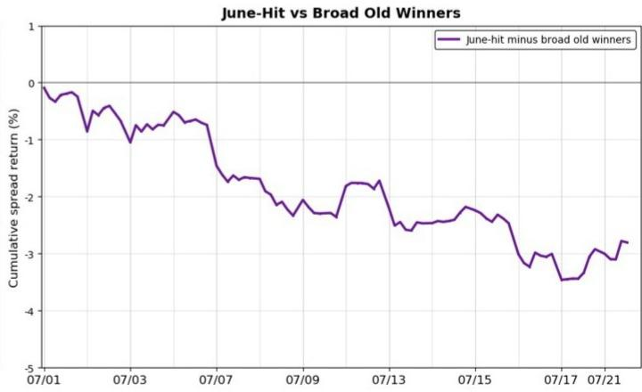

这一6月受创的个股群体（=回撤最大的前50%）与6月回撤较小的个股（=后50%，6月韧性较强）相比仍然偏弱。特别是"高芯片敏感度"个股，即对AI高度敏感（具有高SOX贝塔值）的群体，持续显著落后于低敏感度群体。尽管市场有触底迹象，但尚难断言与半导体和AI关联紧密的个股已恢复其市场驱动角色。6月受挫的"旧赢家"的修复似乎已经开始，但可能仍距离确认底部一步之遥。

## 图8：开始失去动能的高动量/高贝塔个股群体的表现细节 - 2/2

左图显示整体"旧赢家"的表现，分为两组：6月价格跌幅最大的前一半（"6月受创"）和跌幅最小的后一半（"6月韧性较强"）。右图进一步将"6月受创"组按残差SOX贝塔值（即调整东证贝塔后的SOX敏感度）分为高、低两类。"高芯片敏感度"个股被视为与半导体和AI关联紧密的"6月受创"个股。

东证500 2026年7月：旧赢家内部的变化  
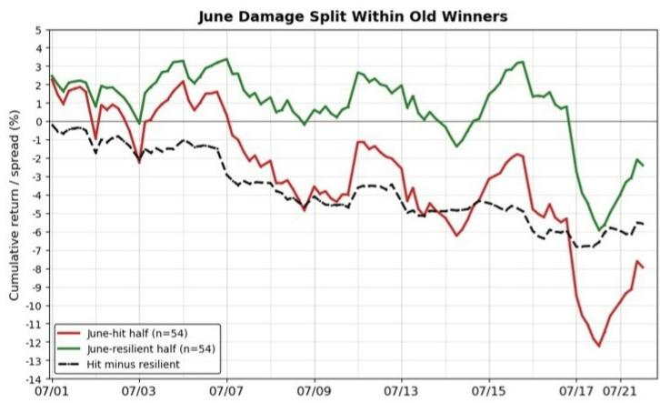

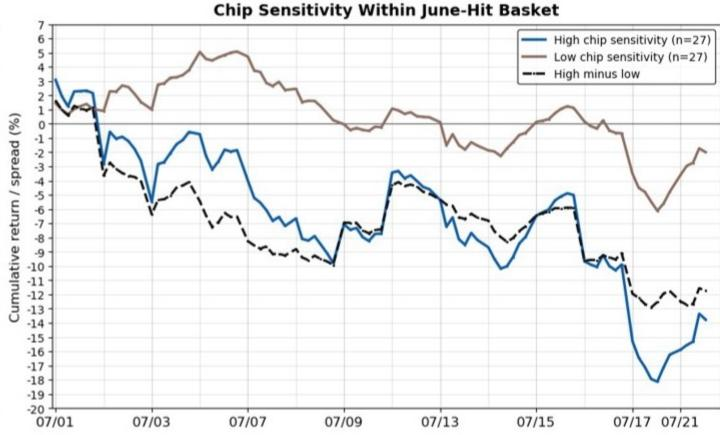  
来源：Bloomberg Finance L.P., JPM Global Markets Strategy

## 扩大AI半导体板块的选股范围

关于前述对半导体和AI趋势高度敏感的"6月受创"个股群体，我们认为其弱势正在逐步消化。然而，目前仍缺乏足够证据确认强劲反转。截至7月21日，股价高于前一日收盘价的个股比例显著上升，表明短期买入已不再局限于少数个股。另一方面，过去五个交易日跑赢东证500指数的个股占比仍然较低，且每日相对于市场的超额表现广度仍然有限。目前，主要变化在于下行担忧的消退，要过渡到全面的超额表现阶段，似乎还需要更多时日。

抛售压力也有所改善。创盘中新低的个股比例在7月中旬急剧上升后已有所下降，表明创出新低的个股数量减少。然而，支撑整个组合回升的个股数量仍然有限。观察等权重组合的累计回报，Ibiden（4062.JT）、Kioxia（285A.JT）和安川电机（6506.JT）等关键个股仍在拖累指数。尽管抛售压力正逐步见顶，但引领反弹的个股群体仍然较小。要使高贝塔/高动量个股重回舞台中央，未来超卖个股中需要出现读者兴趣的明显扩散。

图9：AI敏感个股群体的表现细节 - 1/2

分析聚焦于东证500指数中具有高残差SOX贝塔值的个股群体（见图8）。即自6月以来经历显著回撤、对AI高度敏感的高贝塔/高动量个股组合。反弹广度按1小时图计算，代表样本中股价高于前一日收盘价的个股百分比。数值超过50%表示超过一半的个股较前一日反弹。5日广度代表样本中过去五个交易日回报跑赢东证500指数的个股百分比。数值超过50%表示组合整体广泛跑赢东证指数。

东证500 2026年7月：反弹广度  
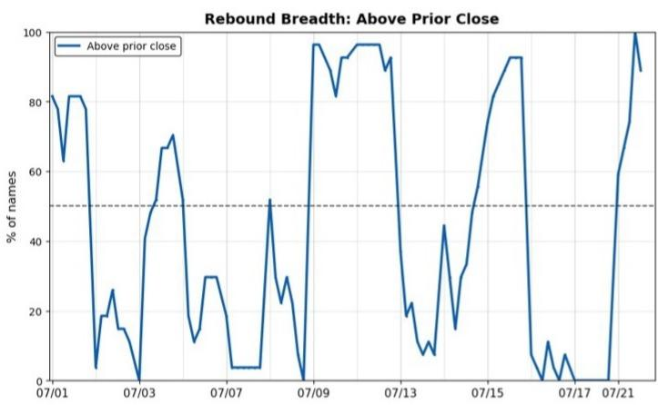  
来源：Bloomberg Finance L.P., JPM Global Markets Strategy

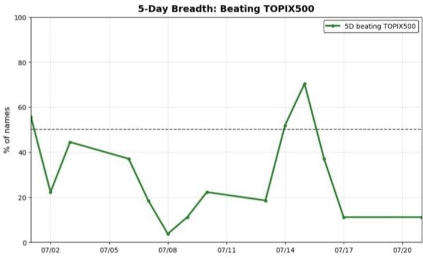  
图10：AI高敏感度个股群体的表现细节 - 2/2

分析聚焦于东证500指数中具有高残差SOX贝塔值的个股群体（见图8）。即自6月以来经历显著回撤、对AI高度敏感的高贝塔/高动量个股组合。抛售压力代表目标个股中在日本和中国市场创出新低价格的个股百分比。数值较低表明抛售压力可能正在缓解。前3/后3个股贡献分别代表等权重计算下，对目标组合累计回报贡献最大的前三只和贡献最小的后三只个股。

东证500 2026年7月：抛售压力与个股影响  
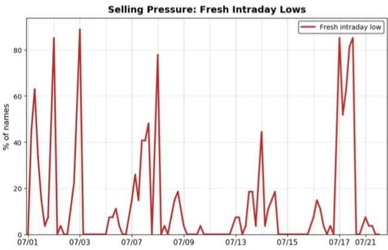  
来源：Bloomberg Finance L.P., JPM Global Markets Strategy

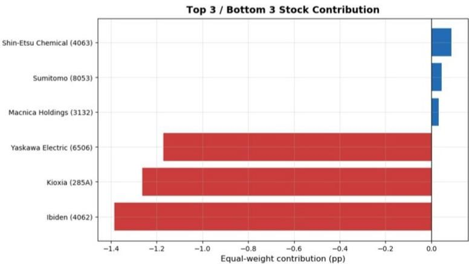

分析师认证：本报告封面标注"AC"的研究分析师证明（或，若多位研究分析师主要负责本报告，封面或文档内标注"AC"的研究分析师分别就其在本研究中覆盖的每个证券或发行人证明）：(1) 本报告中表达的所有观点准确反映了研究分析师对任何及所有相关证券或发行人的个人观点；(2) 研究分析师的任何薪酬部分未曾、不会、也非直接或间接与本报告中研究分析师表达的具体建议或观点相关。对于封面列出的所有韩国研究分析师（如适用），他们亦根据KOFIA要求证明，研究分析师的分析是善意作出的，且观点反映了研究分析师本人的意见，未受不当影响或干预。

除非另有说明，本报告中列出的所有作者均为制作独立研究的研究分析师。在欧洲，行业专家（销售与交易）可能作为联系人出现在本报告中，但并非报告作者或研究部门成员。

## 重要披露

公司特定披露：JPM寻求并确实与其研究报告所覆盖的公司开展业务。因此，读者应注意，该公司可能存在影响本报告客观性的利益冲突。读者应将本报告视为其做出决策的单一因素。重要披露，包括价格图表和信用意见历史表（如适用），可在综合报告和所有JPM覆盖的公司以及某些未覆盖公司的页面获取，请访问https://www.jpmm.com/research/disclosures，致电1-800-477-0406，或发送邮件至research.disclosure.inquiries@JPM.com。

## 股票研究评级、指定及分析师覆盖范围说明：

JPM使用以下评级体系：超配（在本报告所示目标价期间内，我们预期该股票将跑赢研究分析师或其团队覆盖范围内股票的平均总回报）；中性（在本报告所示目标价期间内，我们预期该股票将与研究分析师或其团队覆盖范围内股票的平均总回报表现一致）；低配（在本报告所示目标价期间内，我们预期该股票将跑输研究分析师或其团队覆盖范围内股票的平均总回报）。NR为未评级。在此情况下，JPM已移除该股票的评级及（如适用）目标价，原因包括缺乏充分的基本面依据，或出于法律、监管或政策原因。之前的评级及（如适用）目标价不应再被依赖。NR指定并非推荐或评级。部分覆盖股票有评级但无目标价；在此情况下，我们预期该股票将在相关区域期间内跑赢/表现一致/跑输研究分析师或其团队覆盖范围内股票的平均总回报。在我们的亚洲（除澳大利亚和印度）及英国中小盘股票研究中，每只股票的预期总回报与基准国家市场指数的预期总回报进行比较，而非与研究分析师的覆盖范围比较。若本报告重要披露部分未显示，认证研究分析师的覆盖范围可在JPM研究网站https://www.JPMmarkets.com上找到。

JPM股票研究评级分布，截至2026年7月4日

<table><tr><td></td><td>超配（买入）</td><td>中性（持有）</td><td>低配（卖出）</td></tr><tr><td>JPM全球股票研究覆盖*</td><td>53%</td><td>36%</td><td>12%</td></tr><tr><td>投行客户**</td><td>83%</td><td>80%</td><td>73%</td></tr><tr><td>JPMS股票研究覆盖*</td><td>51%</td><td>37%</td><td>12%</td></tr><tr><td>投行客户**</td><td>95%</td><td>92%</td><td>87%</td></tr></table>

\*请注意，由于四舍五入，百分比可能不总和为100%。

\*\*指JPM在过去12个月内提供过投资银行服务的各"买入"、"持有"和"卖出"类别中标的公司的百分比。

就FINRA评级分布规则而言，我们的超配评级属于报告评级类别；中性评级属于持有评级类别；低配评级属于报告评级类别。请注意，标注NR的股票未包含在上述表格中。此信息截至最近一个日历季度末。

股票估值与风险：有关覆盖公司或目标价的估值方法和风险，请参阅最新的公司特定研究报告，访问http://www.JPMmarkets.com，联系首席分析师或您的JPM代表，或发送邮件至research.disclosure.inquiries@JPM.com。有关专有模型的重要信息，请参阅公司特定研究报告中的财务摘要和公司概览表，可在我们的客户网站http://www.JPMmarkets.com的公司页面下载。本报告亦阐述了所使用的重要基础假设。

## 研究交流历史：

过去12个月内JPM研究交流的历史可在http://www.JPMmarkets.com的研究与评论页面获取，您也可按分析师姓名、行业或金融工具进行搜索。

分析师薪酬：负责编制本报告的研究分析师的薪酬基于多种因素，包括研究和建议的质量与准确性、客户反馈、竞争因素以及公司整体收入。

非美国分析师的注册：除非另有说明，本报告封面列出的非美国分析师是非美国JPM证券有限责任公司关联公司的员工，可能未在FINRA规则下注册为研究分析师，可能不是JPM证券有限责任公司的关联人士，且可能不受FINRA规则2241或2242关于与覆盖公司沟通、公开露面以及交易研究分析师账户持有证券的限制。

## 其他披露

JPM是JPM Chase & Co.及其全球子公司和关联公司投资银行业务的营销名称。

英国MIFID FICC研究分拆豁免：英国客户应参阅英国MIFID研究分拆豁免，了解JPM实施FICC研究豁免的详情以及相关FICC研究分类的指引。

除非相关法律特别允许，所有提供给客户的研究材料均同时在我们的客户网站JPM Markets上提供。并非所有研究内容都会重新分发、通过电子邮件发送或提供给第三方聚合商。如需获取特定股票的所有研究材料，请联系您的销售代表。

本研究材料中对中国的任何长格式名称指中国大陆；香港特别行政区（中国）；台湾（中国）；澳门特别行政区（中国）。

JPM可能不时撰写关于受美国、欧盟、英国或其他相关司法管辖区政府当局实施或管理的经济或金融制裁所针对的发行人或证券（受制裁证券）的文章。本报告中的任何内容均无意被解读为鼓励、促进、推动或以其他方式批准对受制裁证券的购买或交易。客户在做出决策时应了解自身的法律和合规义务。

本研究报告中讨论的任何数字或加密资产均受快速变化的监管环境影响。有关加密资产（包括比特币和以太坊）的相关监管建议，请参阅https://www.JPM.com/disclosures/cryptoasset-disclosure。

本研究报告的作者可能未获许可在您的司法管辖区开展受监管活动，若未获许可，则不会声称能够这样做。

交易所交易基金（ETF）：JPM证券有限责任公司（"JPMS"）作为几乎所有美国上市ETF的授权参与者。若本报告中提及任何ETF，JPMS可能因分销这些ETF份额而赚取佣金和基于交易的补偿，并可能因执行其他交易相关服务（如向ETF份额卖空者提供证券借贷）而赚取费用。JPMS也可能为ETF本身提供服务，包括担任ETF的经纪商或交易商。此外，JPMS的关联公司可能为ETF提供服务，包括信托、托管、管理、借贷、指数计算和/或维护及其他服务。

期权和期货相关研究：若本文所含信息涉及期权或期货相关研究，此类信息仅提供给已收到适当期权或期货风险披露文件的人士。请联系您的JPM代表或访问https://www.theocc.com/components/docs/riskstoc.pdf获取期权清算公司的标准化期权的特征与风险副本，或访问https://www.finra.org/sites/default/files/2020-08/Security\_Futures\_Risk\_Disclosure\_Statement\_2020.pdf获取证券期货风险披露声明副本。

银行间同业拆借利率（IBOR）及其他基准利率的变更：某些利率基准正在或可能在未来受到持续的国际、国内及其他监管指导、改革和改革建议的影响。更多信息，请参阅：https://www.JPM.com/global/disclosures/interbank\_offered\_rates

信用评级通知：若本材料包含信用评级，由日本信用评级机构有限公司（JCR）和评级与投资信息公司（R&I）提供的信用评级是根据日本金融工具与交易法注册的信用评级机构（注册信用评级机构）提供的信用评级。对于由JCR和R&I以外的信用评级机构提供且未注明此类信用评级由注册信用评级机构提供的信用评级，这意味着此类信用评级为非注册评级（由未根据日本金融工具与交易法注册的信用评级机构提供的信用评级）。在非注册评级中，对于由标普全球评级（S&P）、穆迪读者服务公司（Moody's）或惠誉评级（Fitch）提供的信用评级，在基于此类非注册评级做出决策前，请仔细阅读我们已单独发送或将要发送的相应信用评级机构的"非注册评级说明函"。

私人银行客户：若您作为JPM Chase & Co.及其子公司（"JPM私人银行"）私人银行业务的客户接收研究，研究由JPM私人银行提供，而非JPM的任何其他部门，包括但不限于JPM企业与投资银行及其全球研究部门。

负责制作和分发研究的法律实体：在Reg AC研究分析师姓名下方标识的法律实体是负责制作本研究的法律实体。若多位Reg AC研究分析师共同撰写本材料且其姓名下方标识了不同的法律实体，这些法律实体共同负责制作本研究。若分析师姓名下列出多个法律实体，除非另有说明，第一个法律实体负责制作。来自不同JPM关联公司的研究分析师可能对本材料的制作有所贡献，但可能未获许可在您的司法管辖区开展受监管活动（且不会声称能够这样做）。除非下文法律实体披露中另有说明，本材料由负责制作的法律实体分发，或者若分析师姓名下列出多个法律实体，第一个法律实体将负责分发。如有任何疑问，请联系您所在司法管辖区的相关研究分析师或分发本研究材料的实体。

## 法律实体披露及国家/地区特定披露：

阿根廷：JPM Chase Bank N.A Sucursal Buenos Aires受阿根廷共和国中央银行（BCRA）和阿根廷国家证券委员会（CNV）监管。

澳大利亚：JPM Securities Australia Limited（"JPMSAL"）（ABN 61 003 245 234/AFS牌照号：238066）受澳大利亚证券与投资委员会监管，是ASX Limited的市场参与者、ASX Clear Pty Limited的清算与结算参与者以及ASX Clear（Futures）Pty Limited的清算参与者。本材料由JPMSAL或其代表在澳大利亚向"批发客户"（定义见2001年公司法第761G条）发行和分发。所有金融产品的清单可在https://www.jpmm.com/research/disclosures找到。JPM寻求覆盖与国内外读者基础相关的所有全球行业分类标准（GICS）行业以及各种市值规模的公司。如适用，在对标的公司进行公开尽职调查过程中，研究分析师团队可能通过公司拜访、与公司代表讨论、管理层演示等公司接触方式进行此类尽职调查。JPMSAL发布的研究已按照JPM澳大利亚的研究独立性政策编制，该政策可在以下链接找到：JPM Australia - Research Independence Policy。

巴西：Banco JPM S.A.受巴西证券委员会（CVM）和巴西中央银行监管。JPM监察员：0800-7700847 / 0800-7700810（听障人士）/ ouvidoria.jp.morgan@jpmchase.com。

加拿大：JPM Securities Canada Inc.是一家注册投资交易商，受加拿大投资监管组织和安大略省证券委员会监管，是加拿大交易所的参与会员。本材料由JPM Securities Canada Inc.或其代表在加拿大分发。

智利：Inversiones JPM Limitada是一家在智利注册的未受监管实体。

中国：JPM Securities (China) Company Limited已获中国证监会批准开展证券投资咨询业务。

哥伦比亚：Banco JPM Colombia S.A.受哥伦比亚金融监管局（SFC）监管。本材料中对哥伦比亚境外实体提供的产品或服务的任何引用仅为描述性目的。此类引用不构成也不应被解释为在哥伦比亚领土内的促销活动或金融产品或服务的提供，定义见适用的哥伦比亚法规。

迪拜国际金融中心（DIFC）：JPM Chase Bank, N.A., Dubai Branch受迪拜金融服务局（DFSA）监管，注册地址为Dubai International Financial Centre - The Gate, West Wing, Level 3 and 9 PO Box 506551, Dubai, UAE。本材料由JPM Chase Bank, N.A., Dubai Branch向根据DFSA规则被视为专业客户或市场对手方的人士分发。

欧洲经济区（EEA）：除非另有说明，研究由JPM SE（"JPM SE"）在EEA分发，JPM SE是一家由联邦金融监管局（BaFin）授权、由BaFin、德国中央银行（Deutsche Bundesbank）和欧洲中央银行（ECB）共同监管的信贷机构。JPM SE总部位于法兰克福，注册地址为TaunusTurm, Taunustor 1, Frankfurt am Main, 60310, Germany。本材料在EEA向根据MiFID II第4条第1款第10项及附件II及其在各自母国的实施被视为专业读者（或同等）的人士（"EEA专业读者"）分发。非EEA专业读者不得依据或依赖本材料。本材料相关的任何投资或投资活动仅面向EEA相关人士，且仅与EEA相关人士进行。

香港：JPM Securities (Asia Pacific) Limited（CE编号AAJ321）受香港金融管理局和香港证券及期货事务监察委员会监管，JPM Broking (Hong Kong) Limited（CE编号AAB027）受香港证券及期货事务监察委员会监管。JPM Chase Bank, N.A., Hong Kong Branch（CE编号AAL996）受香港金融管理局和证券及期货事务监察委员会监管，根据美国法律组建，责任有限。若本材料的分发在香港属于受监管活动，则本材料由JPM Securities (Asia Pacific) Limited和/或JPM Broking (Hong Kong) Limited在香港分发。

印度：JPM India Private Limited（公司识别号 - U67120MH1992FTC068724），注册地址为JPM Tower, Off. C.S.T. Road, Kalina, Santacruz - East, Mumbai – 400098，在印度证券交易委员会（SEBI）注册为"研究分析师"，注册号INH000001873。JPM India Private Limited亦在SEBI注册为印度国家证券交易所和孟买证券交易所会员（SEBI注册号 – INZ000239730）以及商人银行（SEBI注册号 - MB/INM000002970）。电话：91-22-6157 3000，传真：91-22-6157 3990，网站：http://www.jpmipl.com。JPM Chase Bank, N.A. - Mumbai Branch获印度储备银行（RBI）许可（牌照号53/牌照号BY.4/94；SEBI - IN/CUS/014/ CDSL : IN-DP-CDSL-444-2008/ IN-DP-NSDL-285-2008/ INBI00000984/ INE231311239）作为印度境内持牌商业银行，这是其主要牌照，允许其在印度开展银行业务及其他印度银行分行允许开展的活动。对于非本地研究材料，本材料不由JPM India Private Limited在印度分发。合规官：Ashutosh Sharma；ashutosh.j.sharma@jpmchase.com；+912261575002。投诉官：Ramprasadh K，jpmipl.research.feedback@JPM.com；+912261573000。SEBI授予的注册和NISM的认证绝不保证中介机构的业绩或向读者提供任何回报保证。请访问条款和条件及最重要条款和条件（MITC）。年度合规审计报告可在http://www.jpmipl.com/#research获取。

印度尼西亚：PT JPM Sekuritas Indonesia是印度尼西亚证券交易所会员，受金融服务管理局（OJK）注册和监管。

韩国：JPM Securities (Far East) Limited, Seoul Branch是韩国交易所（KRX）会员。JPM Chase Bank, N.A., Seoul Branch在韩国注册为外国银行分行（JPM Chase Bank, N.A.）。两个实体均受金融服务委员会（FSC）和金融监督院（FSS）监管。对于非宏观研究材料，本材料由JPM Securities (Far East) Limited, Seoul Branch在韩国分发。

日本：JPM Securities Japan Co., Ltd.和JPM Chase Bank, N.A., Tokyo Branch受日本金融厅监管。

马来西亚：本材料由JPM Securities (Malaysia) Sdn Bhd（18146-X）在马来西亚发行和分发，该公司是马来西亚交易所的参与组织，持有马来西亚证券委员会颁发的资本市场服务牌照。

墨西哥：JPM Casa de Bolsa, S.A. de C.V., JPM Grupo Financiero是墨西哥证券交易所（Bolsa Mexicana de Valores）和机构证券交易所（Bolsa Institucional de Valores）的会员，获授权由国家银行和证券委员会（Comisión Nacional Bancaria y de Valores）作为经纪交易商运营。

新西兰：本材料由JPMSAL在新西兰仅向"批发客户"（定义见2013年金融市场行为法）发行和分发。JPMSAL根据2008年金融服务提供商（注册和争议解决）法注册为金融服务提供商。

菲律宾：JPM Securities Philippines Inc.是菲律宾证券交易所的交易参与者，是菲律宾证券清算公司和证券读者保护基金的会员。受证券交易委员会监管。

新加坡：本材料由JPM Securities Singapore Private Limited（JPMSS）[MDDI (P) 057/08/2025及公司注册号：199405335R]和/或JPM Chase Bank, N.A., Singapore branch（JPMCB Singapore）在新加坡发行和分发，两者均为新加坡交易所证券交易有限公司会员，受新加坡金融管理局监管。本材料仅向认可读者、专家读者和机构读者（定义见证券与期货法第289章第4A条）在新加坡发行和分发。本材料无意向任何零售读者或不属于"认可读者"、"专家读者"或"机构读者"类别的任何其他读者发行或分发。新加坡的接收者应就本材料引起或与之相关的任何事宜联系JPMSS或JPMCB Singapore。

南非：JPM Equities South Africa Proprietary Limited和JPM Chase Bank, N.A., Johannesburg Branch是约翰内斯堡证券交易所会员，受金融服务行为监管局（FSCA）监管。

台湾：JPM Securities (Taiwan) Limited是台湾证券交易所的参与者（公司型），受台湾证券期货局监管。与股票证券相关的材料由JPM Securities (Taiwan) Limited在台湾发行和分发，受牌照范围及台湾适用法律法规的限制。若JPM Securities (Taiwan) Limited制作关于未在台湾证券交易所或台北交易所上市的证券（"非台湾上市证券"）的研究材料，这些材料不构成适用台湾法规下的证券建议，且为免疑义，JPM Securities (Taiwan) Limited不就非台湾上市证券担任经纪商。根据证券商受托买卖有价证券推介客户买卖有价证券作业规范（经修订或补充）第7-1条第2款和/或其他适用法律法规，请注意，本材料的接收者不得从事与本材料相关的可能产生利益冲突的任何活动，除非本材料"重要披露"中另有说明。

泰国：本材料由JPM Securities (Thailand) Ltd.在泰国发行和分发，该公司是泰国证券交易所会员，受财政部和证券交易委员会监管。注册地址为548 One City Center Building, 50th Floor, Ploenchit Road, Lymphini, Pathum Wan, Bangkok 10330。

英国：研究由JPM Securities plc（"JPMS plc"）在英国制作，JPMS plc是伦敦证券交易所会员，由审慎监管局授权，受金融行为监管局和审慎监管局监管；或由JPM Markets Limited（"JPMML Ltd"）制作，JPMML Ltd由金融行为监管局授权和监管。除非另有说明，本材料由JPMS plc在英国分发，且仅面向：(a) 具有投资相关事务专业经验的人士，属于2005年金融服务与市场法（金融促销）令第19(5)条范围；(b) 该法令第49条所述人士（高净值公司、非法人协会或合伙企业、高价值信托的受托人等）；或(c) 可合法接收此通讯的任何其他人士；所有此类人士称为"英国相关人士"。非英国相关人士不得依据或依赖本材料。本材料相关的任何投资或投资活动仅面向英国相关人士，且仅与英国相关人士进行。JPM EMEA关于预防和避免研究制作利益冲突的政策说明可在以下链接找到：JPM EMEA - Research Independence Policy。

美国：JPM Securities LLC（"JPMS"）是NYSE、FINRA、SIPC和NFA的会员。JPM Chase Bank, N.A.是FDIC的会员。非美国关联公司发布的材料由JPMS在美国分发，JPMS对其内容承担责任。

一般信息：更多信息可应要求提供。本材料中的信息来自被认为可靠的来源。尽管已采取一切合理谨慎措施确风险自担材料中陈述的事实准确，且其中包含的预测、意见和预期公平合理，但JPM Chase & Co.或其关联公司和/或子公司（统称"JPM"）不对所提供材料的完整性或准确性作出任何陈述或保证，但有关JPM和研究分析师与作为材料主题的发行人相关的披露除外。因此，不应依赖本材料所含信息的准确性、公平性或完整性。由于计算、调整、翻译成不同语言和/或当地监管限制（如适用），本材料中可能存在某些数据差异和/或内容限制。这些差异不应影响对材料中可能讨论的标的公司的整体分析、观点和/或建议。人工智能工具可能已用于本材料的准备，包括协助数据分析、模式识别和研究材料的内容起草。JPM不对因使用本材料或其内容而产生的任何损失承担任何责任，且JPM或其各自的董事、高级职员或员工均不对本材料的内容负责，但相关司法管辖区的监管机构或该监管制度可能施加的责任和义务除外。本材料中包含的意见、预测或预测仅代表JPM截至材料日期的当前意见或判断，因此可能随时更改，恕不另行通知。可能根据公司特定发展或公告、市场状况或任何其他公开信息对公司/行业进行定期更新。无法保证未来结果或事件与任何此类意见、预测或预测一致，这些仅代表一种可能的结果。此外，此类意见、预测或预测受某些未经验证的风险、不确定性和假设的影响，未来实际结果或事件可能存在重大差异。本材料中提及的任何投资的价值或收入可能波动和/或受汇率变化影响。除非另有说明，所有定价均为所讨论证券的市场收盘价指示性价格。过往表现并不预示未来结果。因此，读者可能收回少于最初投资的金额。本材料不构成购买或出售任何金融工具的要约或招揽。本文中的意见和建议未考虑个别客户的情况、目标或需求，不构成对特定客户推荐特定证券、金融工具或策略的建议。本材料可能包含关于结构性证券、期权、期货和其他衍生品的观点。这些是复杂工具，可能涉及高风险，仅适合能够理解并承担相关风险的成熟读者。本材料的接收者必须就本文提及的任何证券或金融工具自行做出独立决定，并应寻求其认为必要的独立财务、法律、税务或其他顾问的建议。JPM可能基于研究分析师的观点和研究进行自营交易，也可能以与本材料所持观点不一致的方式为其自身账户或客户账户进行交易，且JPM无义务确保此类其他通讯被本材料的任何接收者知晓。JPM内部的其他人员，包括策略师、销售人员和其他研究分析师，可能持有与本材料所持观点不一致的观点。未参与本材料编制的JPM员工可能持有本材料中提及的证券（或此类证券的衍生品）并可能以与本材料讨论的方式不同的方式进行交易。本材料在任何司法管辖区均不构成对任何发行人、其产品或服务或其证券的广告或营销。

保密与安全通知：此传输可能包含根据适用法律享有特权、保密、法律特权且/或免于披露的信息。若您非预期接收者，特此通知，披露、复制、分发或使用本文所含信息（包括依赖该信息）均被严格禁止。尽管此传输及其任何附件被认为不含任何可能影响接收和打开它的任何计算机系统的病毒或其他缺陷，但接收者有责任确保其无病毒，JPM Chase & Co.及其子公司和关联公司（如适用）不对因使用而产生的任何损失或损害承担责任。若您错误收到此传输，请立即联系发件人并销毁材料的全部内容，无论是电子版还是纸质版。此消息受电子监控：https://www.JPM.com/disclosures/email

MSCI：本文中的某些信息（"信息"）经MSCI Inc.、其关联公司和信息提供商（"MSCI"）许可复制 ©2026。未经适当许可，不得复制或传播该信息。MSCI不对信息作出任何明示或暗示的保证（包括适销性或适用性），并在法律允许的范围内免除所有责任。任何信息均不构成建议，除非是MSCI
