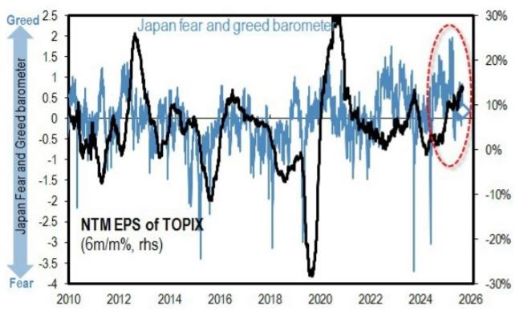

# 日经指数的反弹是技术性停顿，而非AI半导体趋势的转变

日经225指数在上周跌入64000点区间后，于7月21日迅速回升至66000点，这引发了市场对日本股票最坏时期已经过去的预期。但更仔细地审视内部结构会发现，市场只是停止了下跌，而非找到了新的上涨动力。此次反弹是由商品交易顾问（CTA）的被迫平仓行为衰竭以及AI相关负面叙事的暂时缓解所驱动，而非基于基本面的重新定价或读者对半导体引领增长故事信心的恢复。日本股票市场情绪已降至接近零的水平，尽管TOPIX的盈利预期尚未崩溃，但复苏仍然完全取决于外部条件——特别是全球AI相关叙事的走向以及主要AI公司即将公布的财报结果。在这些催化剂出现之前，市场处于观望的等待模式，而非新的上升趋势。

7月份的下跌并未伴随每股盈利预测的下调。这是当前回调与真正熊市之间最关键的结构性差异。当盈利保持稳定而价格下跌时，这种调整是由仓位、情绪和叙事变化驱动的——所有这些都是可逆的。报告数据显示，日本股票市场情绪已降至接近零，从历史来看，在没有新的负面催化剂的情况下，悲观情绪很难进一步蔓延。然而，同样的数据显示，韩国股票市场情绪仍在显著恶化，而日本存储半导体股票仍然对主要在日本境外设定的全球AI叙事高度敏感。因此，此次反弹是国内情绪被洗出的结果，而非半导体周期基本面的改善。

## CTA止损卖盘已基本出清，消除了期货市场最直接的下行压力

7月下跌最直接的驱动因素是CTA的被迫平仓。当日经225指数跌破关键技术位时，CTA触发了日经期货的止损卖盘，这反过来又放大了现货市场中贝塔驱动的卖压。报告证实，CTA自5月以来积累的多头头寸已基本平仓。同样，对于KOSPI 200期货，自3月以来建立的多头头寸也已大部分清算。这意味着机械性、非自主性的卖压来源已度过其最严重的阶段。除非出现额外的外部冲击，将日经指数推回64600点以下或KOSPI 200指数推回1100点以下，否则CTA驱动的新一轮卖盘风险现已显著降低。对于机构读者而言，这是最具可操作性的近期信号：期货市场不再是系统性下行压力的来源，这为任何战术性多头仓位消除了一个重要的阻力。

## 现货股票市场显示广度有所恢复，但高贝塔AI股票的领涨地位尚未回归

虽然期货市场已经企稳，但现货股票市场讲述了一个更微妙的故事。7月份的下跌在高贝塔和高动量股票中最为严重，特别是那些半导体和AI基础设施板块的股票。报告对这一群体进行了细致的分解，区分了“旧赢家”（截至6月底动量最高、贝塔最高的股票）以及其中的“6月受创旧赢家”（该群体中在6月经历最大回撤的一半）。7月的累计超额回报显示，“旧赢家”已从7月17日左右的低点反弹，但“6月受创”子群体继续落后于“旧赢家”中更具韧性的另一半。这是一个关键的区别：反弹集中在受损较轻的股票，而非那些超卖最严重的股票。那些被最积极抛售的股票并未引领复苏。

进一步按“芯片敏感度”（残差SOX贝塔）进行分解，揭示了最深层的结构性弱点。在“6月受创”群体中，对费城半导体指数（SOX）高度敏感的股票继续显著落后于芯片敏感度低的股票。报告发现，尽管有迹象表明市场已触底，但仍难以断言与半导体和AI关联紧密的股票已恢复其市场驱动者的角色。要实现持续的复苏，那些受打击最严重的股票——高贝塔的半导体股票——必须重新确立领导地位。但它们尚未做到这一点。这不是向新板块的轮动；而是对旧板块清算的暂停。

## 反弹由卖盘衰竭驱动，而非对超卖领跌股的主动买入

报告提供了关于高AI敏感度篮子内复苏性质的详细指标。截至7月21日，交易价格高于前一日收盘价的股票比例（反弹广度）显著上升，表明短期买入不再局限于少数几只股票。这是一个积极信号：卖压不再是无差别的。然而，在过去五天内表现优于TOPIX 500指数的股票比例（5日广度）仍然较低。这意味着，尽管股票在日度基础上出现反弹，但它们并未相对于更广泛的市场维持超额表现。主要的变化是下行担忧的消退，而非新的看涨催化剂的出现。

卖压数据强化了这一解读。创下盘中新低的股票比例在7月中旬急剧上升，但此后有所下降，表明强制清算阶段正在结束。然而，等权重篮子的累计回报显示，少数几只关键股票——Ibiden、Kioxia和安川电机——继续对指数构成沉重拖累。复苏是狭窄的。报告认为，要使高贝塔和高动量股票重返中心舞台，超卖股票中必须出现读者兴趣的明显扩大。这种扩大尚未发生。市场已从“恐慌性抛售”转向“等待方向”，但尚未转向“信念性买入”。

## 决策框架：如何区分日本AI股票的技术性反弹与可持续复苏

对于投资组合经理而言，当前环境需要一个能够区分噪音和信号的框架。以下三个条件源自报告的分析，可作为判断反弹何时变得持久的检查清单。

首先，监控“6月受创旧赢家”相对于更广泛的“旧赢家”篮子的表现。只要受损最严重的股票继续落后，复苏就是死猫反弹，而非趋势转变。持续的收敛——即6月受创群体开始匹配或超越韧性群体的表现——将表明强制卖家已被完全吸收，新的买家正在最 distressed 的水平介入。

其次，追踪高芯片敏感度篮子内的超额表现广度。报告的5日广度指标是一个强大的过滤器：如果AI敏感股票在五日滚动窗口内表现优于TOPIX 500的比例升至50%以上，这将表明复苏正在扩大到少数大盘股之外。在此之前，市场仍处于“空头回补”阶段，而非“新多头建仓”阶段。

第三，关注来自日本以外的催化剂。报告明确指出，反弹的可持续性“在当前阶段高度依赖于外部条件”。最明显的催化剂是主要全球AI公司即将公布的财报。如果这些报告证实了支撑半导体周期的需求叙事，那么导致下跌的叙事转变将被逆转，高贝塔股票将有基本面的理由进行重新定价。如果财报令人失望，当前的技术性反弹很可能会失败，市场将再次测试6月的低点。

这个框架允许读者基于证据而非希望采取行动。当前数据仅部分满足第一个条件——“旧赢家”已经反弹，但“6月受创”群体尚未赶上。第二个条件未满足。第三个条件悬而未决。因此，正确的战略姿态是承认最严重的机械性卖盘已经结束，但在广度数据和外部催化剂确认复苏具有持续性之前，推迟对高贝塔AI股票的任何激进重新入场。

*仅供参考。部分内容可能基于源材料通过AI辅助生成、翻译、总结或编辑，可能存在遗漏或错误。请独立核实。这不是投资、法律、税务、会计或其他专业建议。*

仅供参考。部分内容可能基于源材料通过AI辅助生成、翻译、总结或编辑，可能存在遗漏或错误。请独立核实。这不是投资、法律、税务、会计或其他专业建议。

