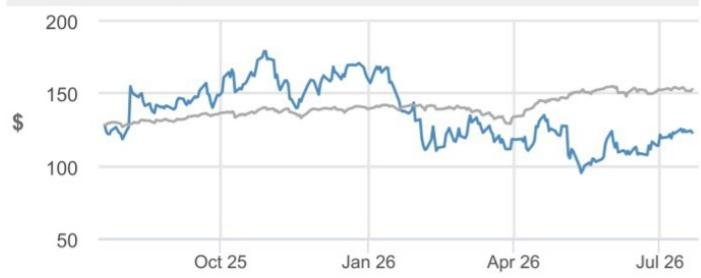
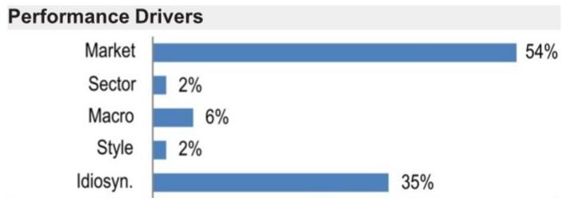

## Shopify

展望第二季度业绩指引存在上行空间；关注增长方向、毛利率、代币成本及AI领导力；维持增持评级并加入分析师关注名单

我们对Shopify持积极看法，预计在8月5日（周三）公布的第二季度业绩中，其指引存在上行空间。Shopify股价较5月低点上涨29%（同期标普500指数上涨1%），读者对GMV/收入增长轨迹、毛利率及代币影响，以及Shopify更广泛的AI策略的情绪正在改善。我们预计，在中小企业群体、企业客户、地域市场及新兴渠道（POS、B2B）的强劲表现支持下，GMV将实现稳健增长。尽管国际增长和企业客户量增长可能波动较大，但我们认为Shopify第二季度的收入增长指引可能偏保守。Chase卡数据显示，第二季度美国无卡支付增长同比增长11%，较第一季度的同比增长10%有所加速，不过市场对近期地缘政治活动相关的宏观不确定性仍存担忧。我们认为宏观敞口有限，约16%的GMV为跨境交易，其中约50%涉及美国进出境。我们预计2026年GMV同比增长29%（固定汇率增长28%），收入增长30%（固定汇率增长29%）。毛利率继续面临商家解决方案组合变化、AI/大语言模型成本及增长举措带来的压力。我们估计，AI/大语言模型成本可能在2026年对订阅业务和总毛利率分别造成约160个基点和约40个基点的同比压力，但Shopify可通过模型组合和更深入的商家变现来缓解增量压力。Shopify正在各费用项目上实现杠杆效应，同时将年度自由现金流利润率维持在百分之十几的水平。我们预计2026年毛利润美元额同比增长28%，自由现金流利润率为18.0%（同比提升60个基点）。第三方数据表明第二季度GMV存在上行空间，但外汇利好因素（第二季度预计约50个基点的利好，而第一季度约为200个基点）及同比基数效应在年内将变得不那么有利。我们认为，读者普遍预期第二季度GMV增长31%-32%，第三季度增长28%-30%；第二季度收入增长31%-32%，第三季度增长28%-30%（即高20%区间的指引）；第二季度毛利润美元额增长28%-30%，第三季度增长27%-29%（即高20%区间的指引）。

除基本面外，市场也在讨论Meta的Business Agent及Meta Business Agent平台是否可能带来显著的竞争风险。然而，我们的调研显示，鉴于成本结构（相对于Shopify）不太有利、当前对广告和电商工具的依赖，以及管理店铺的复杂性，商家可能对让Meta、谷歌和亚马逊等大型平台完全管理店铺持犹豫态度。读者还担忧潜在的行业整合以及Shop Pay规模和增长前景面临的竞争影响，但我们认为Shopify的商家和消费者采用率、数据护城河及网络优势可能难以被复制。关于代理型电商，Editions活动发布了150多项覆盖电商全栈的产品更新，重点聚焦代理型功能，这应有助于提升商家获取量。我们仍认为Shopify是AI受益者，其在电商平台的代理型机会各层面——流量渠道、平台内及基础设施——均有所布局，这得益于Shopify基于20多年电商数据构建的数据栈、需求转化飞轮、AI商家解决方案、UCP领导力以及降低商家生态系统复杂性的能力。我们重申增持评级，并设定2027年12月目标价为155美元，基于约19倍2028年预计毛利润103亿美元，该估值也得到我们DCF模型的支持。

数据来源：Style Exposure – JPM全球市场策略；其他表格均为公司数据和JPM估计。分析师认证及重要披露请参见第10页。

## 增持

SHOP, SHOP US
价格（2026年7月21日）：123.03美元
▲ 目标价（2027年12月）：155.00美元
此前（2026年12月）：150.00美元

## 互联网 - 大盘 / 中盘及小盘

Bryan M. Smilek AC
(1-212) 622-8886
bryan.smilek@JPM.com

Doug Anmuth  
(1-212) 622-6571  
douglas.anmuth@JPM.com

Andrew Watts (1-212) 622-9400 andrew.watts@JPM.com JPM Securities LLC

## 季度预测（财年截至12月）调整后每股收益（美元）

<table><tr><td colspan="4">调整后每股收益（美元）</td></tr><tr><td></td><td>2025A</td><td>2026E</td><td>2027E</td></tr><tr><td>第一季度</td><td>0.26</td><td>0.36A</td><td></td></tr><tr><td>第二季度</td><td>0.35</td><td>0.41</td><td></td></tr><tr><td>第三季度</td><td>0.34</td><td>0.46</td><td></td></tr><tr><td>第四季度</td><td>0.48</td><td>0.65</td><td></td></tr><tr><td>全年</td><td>1.43</td><td>1.88</td><td>2.33</td></tr></table>

## 风格暴露

<table><tr><td rowspan="2">量化因子</td><td rowspan="2">当前%排名</td><td colspan="4">历史%排名（1=最高）</td></tr><tr><td>6个月</td><td>1年</td><td>3年</td><td>5年</td></tr><tr><td>价值</td><td>85</td><td>89</td><td>86</td><td>86</td><td>86</td></tr><tr><td>成长</td><td>14</td><td>24</td><td>23</td><td>82</td><td>4</td></tr><tr><td>动量</td><td>68</td><td>34</td><td>24</td><td>2</td><td>24</td></tr><tr><td>质量</td><td>26</td><td>34</td><td>17</td><td>64</td><td>8</td></tr><tr><td>低波动</td><td>55</td><td>59</td><td>64</td><td>84</td><td>67</td></tr></table>

价格表现  

— SHOP价格（美元） — 标普500指数（重新基准）

<table><tr><td></td><td>年初至今</td><td>1个月</td><td>3个月</td><td>12个月</td></tr><tr><td>相对</td><td>-23.6%</td><td>13.0%</td><td>-6.2%</td><td>-4.2%</td></tr><tr><td>相对</td><td>-33.3%</td><td>12.9%</td><td>-12.5%</td><td>-23.3%</td></tr></table>

<table><tr><td colspan="2">公司数据</td></tr><tr><td>流通股数（百万）</td><td>1,303</td></tr><tr><td>52周价格区间（美元）</td><td>182.19-94.00</td></tr><tr><td>市值（百万美元）</td><td>160,352.10</td></tr><tr><td>汇率</td><td>1.00</td></tr><tr><td>自由流通比例（%）</td><td>99.6%</td></tr><tr><td>3个月日均成交量（百万股）</td><td>10.04</td></tr><tr><td>3个月日均成交额（百万美元）</td><td>1,130.9</td></tr><tr><td>波动率（90天）</td><td>59</td></tr><tr><td>指数</td><td>标普500</td></tr><tr><td>彭博分析师评级（买入 | 持有 | 卖出）</td><td>-</td></tr></table>

关键指标（财年截至12月）

<table><tr><td>百万美元</td><td>FY25A</td><td>FY26E</td><td>FY27E</td></tr><tr><td colspan="4">财务估计</td></tr><tr><td>收入</td><td>11,556</td><td>14,964</td><td>18,431</td></tr><tr><td>调整后EBIT</td><td>1,978</td><td>2,754</td><td>3,546</td></tr><tr><td>调整后EBITDA</td><td>2,009</td><td>2,789</td><td>3,585</td></tr><tr><td>调整后净利润</td><td>1,864</td><td>2,469</td><td>3,088</td></tr><tr><td>调整后每股收益</td><td>1.43</td><td>1.88</td><td>2.33</td></tr><tr><td>彭博每股收益</td><td>-</td><td>-</td><td>-</td></tr><tr><td>经营活动现金流</td><td>2,033</td><td>2,718</td><td>3,364</td></tr><tr><td>FCFF</td><td>2,292</td><td>2,909</td><td>3,560</td></tr><tr><td colspan="4">利润率与增长</td></tr><tr><td>收入同比增长（%）</td><td>30.1%</td><td>29.5%</td><td>23.2%</td></tr><tr><td>EBIT利润率</td><td>17.1%</td><td>18.4%</td><td>19.2%</td></tr><tr><td>EBIT同比增长（%）</td><td>33.0%</td><td>39.3%</td><td>28.7%</td></tr><tr><td>EBITDA利润率</td><td>17.4%</td><td>18.6%</td><td>19.4%</td></tr><tr><td>EBITDA同比增长（%）</td><td>31.9%</td><td>38.8%</td><td>28.5%</td></tr><tr><td>净利润率</td><td>16.1%</td><td>16.5%</td><td>16.8%</td></tr><tr><td>调整后每股收益增长</td><td>13.7%</td><td>31.5%</td><td>24.2%</td></tr><tr><td colspan="4">比率</td></tr><tr><td>调整后税率</td><td>13.8%</td><td>16.5%</td><td>17.2%</td></tr><tr><td>利息覆盖倍数</td><td>-</td><td>-</td><td>-</td></tr><tr><td>净债务/权益</td><td>-</td><td>-</td><td>-</td></tr><tr><td>净债务/EBITDA</td><td>-</td><td>-</td><td>-</td></tr><tr><td>ROE</td><td>14.9%</td><td>18.3%</td><td>20.9%</td></tr><tr><td colspan="4">估值</td></tr><tr><td>FCFF回报表现</td><td>1.4%</td><td>1.8%</td><td>2.2%</td></tr><tr><td>股息率</td><td>-</td><td>-</td><td>-</td></tr><tr><td>EV/收入</td><td>13.7</td><td>10.5</td><td>8.4</td></tr><tr><td>EV/EBITDA</td><td>79.0</td><td>56.4</td><td>43.1</td></tr><tr><td>调整后市盈率</td><td>86.1</td><td>65.5</td><td>52.7</td></tr></table>

## 投资主题总结与估值

## 投资主题

Shopify是一家领先的商业赋能与基础设施平台，为超过175个国家的200多万商家提供建立、扩展和管理业务的工具。Shopify作为跨渠道、垂直领域和地域的统一商业操作系统，在商家旅程的每一步提供支持。我们认为，Shopify有能力实现25%以上的GMV和收入增长，其支撑因素包括：1）电商的长期结构性转变及产品优化；2）核心中小企业商家采用率提升，以及向企业级市场的拓展；3）Shop Pay、线下和B2B等增长渠道；4）国际扩张；5）支付渗透率加深；以及6）在Plus采用率提升带动下，MRR持续强劲增长。我们预计，在GMV和收入增长以及持续的成本纪律/效率提升支持下，营业利润率和自由现金流利润率将实现稳健扩张。

## 估值

我们设定2027年12月目标价为155美元（此前2026年12月目标价为150美元），基于约19倍2028年预计毛利润103亿美元。我们的DCF模型进一步支持155美元的隐含估值，该模型采用约15%的加权平均资本成本和+15%的终值增长率。

<table><tr><td>因子</td><td>6个月相关性</td><td>1年相关性</td></tr><tr><td>市场：MSCI美国</td><td>0.59</td><td>0.73</td></tr><tr><td>行业：科技</td><td>0.11</td><td>0.19</td></tr><tr><td>子行业：软件与服务</td><td>0.30</td><td>0.13</td></tr><tr><td colspan="3">宏观：</td></tr><tr><td>美国10年期国债回报表现</td><td>-0.22</td><td>-0.23</td></tr><tr><td>美元</td><td>0.21</td><td>0.22</td></tr><tr><td>原油</td><td>-0.25</td><td>-0.17</td></tr><tr><td colspan="3">量化风格：</td></tr><tr><td>成长</td><td>0.44</td><td>0.32</td></tr><tr><td>价值</td><td>-0.30</td><td>-0.26</td></tr><tr><td>低波动</td><td>-0.31</td><td>-0.19</td></tr></table>

我们预计2025-2028年三年复合年增长率分别为：GMV增长24%，收入增长25%，毛利润增长23%，营业利润增长35%，自由现金流增长27%。Shopify保持了“40法则”的财务特征（收入增长率+自由现金流利润率），我们认为这在大型科技同行面临利润率、资本支出和自由现金流压力之际属于同类最佳。鉴于Shopify卓越的增长前景、长期领导地位及差异化的AI领导力，我们将其作为成长型标的加入JPM分析师关注名单。请参阅下方详细的业绩预览表及图1，了解我们对于市场普遍预期与JPMe/共识及管理层指引的看法。

表1：SHOP 2026年第二季度业绩预览

<table><tr><td colspan="2">SHOP（增持，目标价155美元）</td></tr><tr><td>电话会议详情</td><td>2026年8月5日（周三）美国东部时间上午8:30。电话会议：shopify.com/investors</td></tr><tr><td>读者情绪</td><td>正在改善，但仍存在分歧。第三方数据表明第二季度GMV存在上行空间，我们认为读者仍在讨论企业客户量增长的时间点与贡献，以及国际增长的可持续性，尤其是在外汇利好因素（第二季度预计约50个基点的利好，而第一季度约为200个基点）及同比基数效应在年内变得不那么有利的情况下。我们的交流显示读者情绪正在改善，尤其是美国支出趋势和宏观环境表现出韧性。然而，市场对毛利润美元额增长的幅度存在担忧，特别是Sidekick的采用推高了代币成本。我们认为，读者普遍预期第二季度GMV增长31%-32%，第三季度增长28%-30%；第二季度收入增长31%-32%，第三季度增长28%-30%（即高20%区间的指引）；第二季度毛利润美元额增长28%-30%，第三季度增长27%-29%（即高20%区间的指引）。</td></tr><tr><td>我们的观点</td><td>仍为首选标的。我们预计，在中小企业群体、企业客户、地域市场及新兴渠道（POS、B2B）的强劲表现支持下，GMV将实现稳健增长。尽管国际增长和企业客户量增长可能波动较大，但我们认为Shopify第二季度的收入增长指引可能偏保守。Chase卡数据显示，第二季度美国无卡支付增长同比增长11%，较第一季度的同比增长10%有所加速，不过市场对近期地缘政治活动相关的宏观不确定性仍存担忧。我们认为宏观敞口有限，约16%的GMV为跨境交易，其中约50%涉及美国进出境。我们预计2026年GMV同比增长29%（固定汇率增长28%），收入增长30%（固定汇率增长29%）。第二季度毛利润美元额增长预计将放缓至20%中段（第一季度为32%），毛利率继续面临商家解决方案组合变化、AI/大语言模型成本及增长举措带来的压力。我们估计，AI/大语言模型成本可能在2026年对订阅业务和总毛利率分别造成约160个基点和约40个基点的同比压力，但Shopify可通过模型组合和更深入的商家变现来缓解增量压力。Shopify正在各费用项目上实现杠杆效应，同时将年度自由现金流利润率维持在百分之十几的水平。我们预计2026年毛利润美元额同比增长28%，自由现金流利润率为18.0%（同比提升60个基点）。我们预计Shopify将利用其约15亿美元授权的股份回购计划进行资本回报。</td></tr><tr><td>关键议题</td><td>代理型电商。Shopify基于20多年电商数据构建的数据栈、需求转化飞轮、AI商家解决方案、UCP领导力以及降低商家生态系统复杂性的能力，应使其成为代理型电商领域的领导者。宏观环境。Shopify对不利宏观环境的敞口总体有限，跨境贸易仅占第一季度GMV的约16%，且我们认为在去年关税环境较高时期，增长主要由量驱动。企业客户。需求依然强劲，GMV超过1亿美元的商家数量在过去两年增长了约2倍，收入贡献相应提升了约200个基点以上。虽然Shopify正在赢得企业客户，但我们认为企业商家完全规模化整合的时间线仍大致保持在约18个月。国际市场。欧洲第二季度GMV增长加速至同比增长48%（固定汇率增长35%），高于第一季度的45%，但同比基数效应在2026年将变得更具挑战性。在Shopify Payments于2025年在15个欧洲市场和墨西哥推出后，我们预计产品将继续扩展。渠道。线下GMV增长在第一季度加速至33%（第四季度为29%），B2B GMV同比增长80%，Shop App GMV同比增长70%。Shopify Payments在第一季度处理了670亿美元的GMV（同比增长41%），Shop Pay GMV同比增长59%至350亿美元。Shopify新的合作伙伴收益模式应能激励代理机构入驻并扩展商家。MRR。我们预计第二季度MRR同比增长18%（第一季度为16%），2026年全年增长15%，我们注意到第一季度是Shopify面临3个月试用期推广带来的MRR同比增长压力的最后一个季度。我们估计Plus价格上涨可能在2027年带来约9000万美元以上的年度订阅解决方案收入增量，或约50个基点的年化增长。毛利润。订阅业务利润率受益于规模效应和效率提升，但部分被AI成本增加所抵消。毛利率受到向低利润率商家解决方案组合变化的压力。Sidekick。采用率依然强劲，第一季度周活跃店铺数同比增长4倍。我们的调研显示Sidekick获得积极反馈，前端能力仍有提升空间。</td></tr></table>

来源：JPM估计、公司数据及彭博金融信息。

图1：SHOP – JPMe与指引、共识及买方预期的对比 单位：百万美元，每股数据除外

<table><tr><td></td><td>管理层指引</td><td>共识</td><td>JPMe</td><td>JPMe vs 共识</td><td>买方预期</td></tr><tr><td colspan="6">GMV</td></tr><tr><td>2026年第二季度E</td><td></td><td>112,033</td><td>113,310</td><td>1.1%</td><td>1150亿-1160亿美元</td></tr><tr><td>2026年第三季度E</td><td></td><td>115,962</td><td>116,857</td><td>0.8%</td><td>1180亿-1200亿美元</td></tr><tr><td>2026年E</td><td></td><td>483,255</td><td>489,426</td><td>1.3%</td><td></td></tr><tr><td colspan="6">GMV增长</td></tr><tr><td>2026年第二季度E</td><td></td><td>28%</td><td>29%</td><td>145个基点</td><td>+31%-32%</td></tr><tr><td>2026年第三季度E</td><td></td><td>26%</td><td>27%</td><td>97个基点</td><td>+28%-30%</td></tr><tr><td>2026年E</td><td></td><td>28%</td><td>29%</td><td>163个基点</td><td></td></tr><tr><td colspan="6">收入</td></tr><tr><td>2026年第二季度E</td><td></td><td>3,449</td><td>3,471</td><td>0.6%</td><td>35.1亿-35.4亿美元</td></tr><tr><td>2026年第三季度E</td><td></td><td>3,603</td><td>3,609</td><td>0.2%</td><td>36.4亿-37.0亿美元</td></tr><tr><td>2026年E</td><td></td><td>14,825</td><td>14,964</td><td>0.9%</td><td></td></tr><tr><td colspan="6">收入增长</td></tr><tr><td>2026年第二季度E</td><td>高20%区间</td><td>29%</td><td>30%</td><td>83个基点</td><td>+31%-32%</td></tr><tr><td>2026年第三季度E</td><td></td><td>27%</td><td>27%</td><td>21个基点</td><td>+28%-30%</td></tr><tr><td>2026年E</td><td></td><td>28%</td><td>29%</td><td>120个基点</td><td></td></tr><tr><td colspan="6">毛利润美元额增长</td></tr><tr><td>2026年第二季度E</td><td>20%中段</td><td>26%</td><td>26%</td><td>6个基点</td><td>+28%-30%</td></tr><tr><td>2026年第三季度E</td><td></td><td>24%</td><td>25%</td><td>100个基点</td><td>+27%-29%</td></tr><tr><td>2026年E</td><td></td><td>27%</td><td>28%</td><td>88个基点</td><td></td></tr><tr><td colspan="6">自由现金流利润率</td></tr><tr><td>2026年第二季度E</td><td>百分之十几</td><td>16%</td><td>16%</td><td>34个基点</td><td>16%-17%</td></tr><tr><td>2026年第三季度E</td><td></td><td>18%</td><td>18%</td><td>50个基点</td><td>18%-19%</td></tr><tr><td>2026年E</td><td></td><td>17%</td><td>18%</td><td>52个基点</td><td></td></tr></table>

来源：公司报告、JPM估计及彭博金融信息。买方情绪基于JPM交流及行业调研。

# JPM Chase卡数据

图2：Chase卡数据显示第二季度无卡支付支出增长加速至+11%

<table><tr><td></td><td>2025年第一季度</td><td>2025年第二季度</td><td>2025年第三季度</td><td>2025年第四季度</td><td>2026年1月</td><td>2026年2月</td><td>2026年3月</td><td>2026年第一季度</td><td>2026年4月</td><td>2026年5月</td><td>2026年6月</td><td>2026年第二季度</td></tr><tr><td>总支出</td><td>4%</td><td>4%</td><td>6%</td><td>5%</td><td>5%</td><td>6%</td><td>7%</td><td>6%</td><td>7%</td><td>7%</td><td>7%</td><td>7%</td></tr><tr><td>旅游和娱乐总计</td><td>2%</td><td>2%</td><td>5%</td><td>3%</td><td>7%</td><td>7%</td><td>6%</td><td>6%</td><td>8%</td><td>5%</td><td>7%</td><td>6%</td></tr><tr><td>总计（不含加油站）</td><td>5%</td><td>5%</td><td>6%</td><td>5%</td><td>6%</td><td>7%</td><td>7%</td><td>6%</td><td>6%</td><td>6%</td><td>6%</td><td>6%</td></tr><tr><td>无卡支付</td><td>10%</td><td>10%</td><td>11%</td><td>8%</td><td>10%</td><td>10%</td><td>10%</td><td>10%</td><td>10%</td><td>10%</td><td>11%</td><td>11%</td></tr><tr><td>有卡支付</td><td>(2%)</td><td>(1%)</td><td>1%</td><td>1%</td><td>(0%)</td><td>1%</td><td>3%</td><td>1%</td><td>3%</td><td>3%</td><td>2%</td><td>3%</td></tr><tr><td>可自由支配</td><td>4%</td><td>4%</td><td>7%</td><td>5%</td><td>7%</td><td>8%</td><td>8%</td><td>7%</td><td>7%</td><td>7%</td><td>7%</td><td>7%</td></tr><tr><td>可自由支配，无卡支付</td><td>8%</td><td>8%</td><td>10%</td><td>8%</td><td>10%</td><td>11%</td><td>11%</td><td>10%</td><td>11%</td><td>11%</td><td>12%</td><td>12%</td></tr><tr><td>非可自由支配</td><td>5%</td><td>3%</td><td>4%</td><td>3%</td><td>3%</td><td>3%</td><td>6%</td><td>4%</td><td>6%</td><td>7%</td><td>6%</td><td>7%</td></tr><tr><td>非可自由支配，无卡支付</td><td>18%</td><td>15%</td><td>13%</td><td>9%</td><td>10%</td><td>9%</td><td>8%</td><td>9%</td><td>9%</td><td>8%</td><td>7%</td><td>8%</td></tr><tr><td>航空公司</td><td>(5%)</td><td>(9%)</td><td>(2%)</td><td>(5%)</td><td>2%</td><td>3%</td><td>8%</td><td>4%</td><td>3%</td><td>8%</td><td>9%</td><td>6%</td></tr><tr><td>企业对企业</td><td>1%</td><td>1%</td><td>1%</td><td>1%</td><td>8%</td><td>7%</td><td>3%</td><td>6%</td><td>2%</td><td>3%</td><td>8%</td><td>3%</td></tr><tr><td>医疗保健与药房</td><td>9%</td><td>7%</td><td>7%</td><td>6%</td><td>7%</td><td>8%</td><td>8%</td><td>7%</td><td>8%</td><td>7%</td><td>7%</td><td>8%</td></tr><tr><td>住宿</td><td>(1%)</td><td>(2%)</td><td>1%</td><td>1%</td><td>3%</td><td>3%</td><td>2%</td><td>3%</td><td>5%</td><td>0%</td><td>3%</td><td>2%</td></tr><tr><td>餐厅</td><td>3%</td><td>4%</td><td>6%</td><td>4%</td><td>5%</td><td>7%</td><td>6%</td><td>6%</td><td>5%</td><td>4%</td><td>3%</td><td>4%</td></tr><tr><td>超市</td><td>3%</td><td>3%</td><td>4%</td><td>2%</td><td>0%</td><td>1%</td><td>0%</td><td>0%</td><td>0%</td><td>1%</td><td>(0%)</td><td>1%</td></tr><tr><td>批发俱乐部与折扣店</td><td>6%</td><td>6%</td><td>6%</td><td>5%</td><td>5%</td><td>7%</td><td>9%</td><td>7%</td><td>5%</td><td>5%</td><td>2%</td><td>5%</td></tr></table>

来源：JPM Chase Bank, NA, JPMC Index File 1.0，选取的Chase信用卡和借记卡交易数据。

## 人口普查局商业申请数据

图3：第二季度企业成立数量同比增长15%，略低于第一季度的18%，但相对水平更高 单位：千，经季节性调整

<table><tr><td></td><td>2025年1月</td><td>2025年2月</td><td>2025年3月</td><td>2025年第一季度</td><td>2025年4月</td><td>2025年5月</td><td>2025年6月</td><td>2025年第二季度</td><td>2025年第三季度</td><td>2025年第四季度</td><td>2026年1月</td><td>2026年2月</td><td>2026年3月</td><td>2026年第一季度</td><td>2026年4月</td><td>2026年5月</td><td>2026年6月</td><td>2026年第二季度</td></tr><tr><td>申请数量</td><td>386</td><td>433</td><td>461</td><td>1,279</td><td>456</td><td>449</td><td>460</td><td>1,364</td><td>1,464</td><td>1,532</td><td>526</td><td>496</td><td>494</td><td>1,516</td><td>507</td><td>525</td><td>531</td><td>1,564</td></tr><tr><td>同比增长</td><td>-14%</td><td>-3%</td><td>7%</td><td>-3%</td><td>6%</td><td>5%</td><td>5%</td><td>5%</td><td>14%</td><td>15%</td><td>36%</td><td>15%</td><td>7%</td><td>18%</td><td>11%</td><td>17%</td><td>16%</td><td>15%</td></tr></table>

来源：美国商务部、JPM。

## Shopify网站流量数据

图4：Shopify.com SimilarWeb全球趋势——第二季度网站访问量和独立访客同比增长强劲，7月同比增速持续

<table><tr><td></td><td>2024年第二季度</td><td>2024年第三季度</td><td>2024年第四季度</td><td>2025年1月</td><td>2025年2月</td><td>2025年3月</td><td>2025年第一季度</td><td>2025年4月</td><td>2025年5月</td><td>2025年6月</td><td>2025年第二季度</
