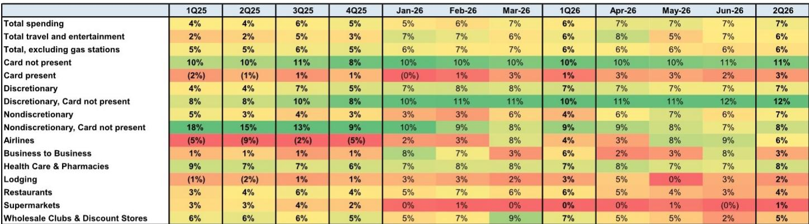
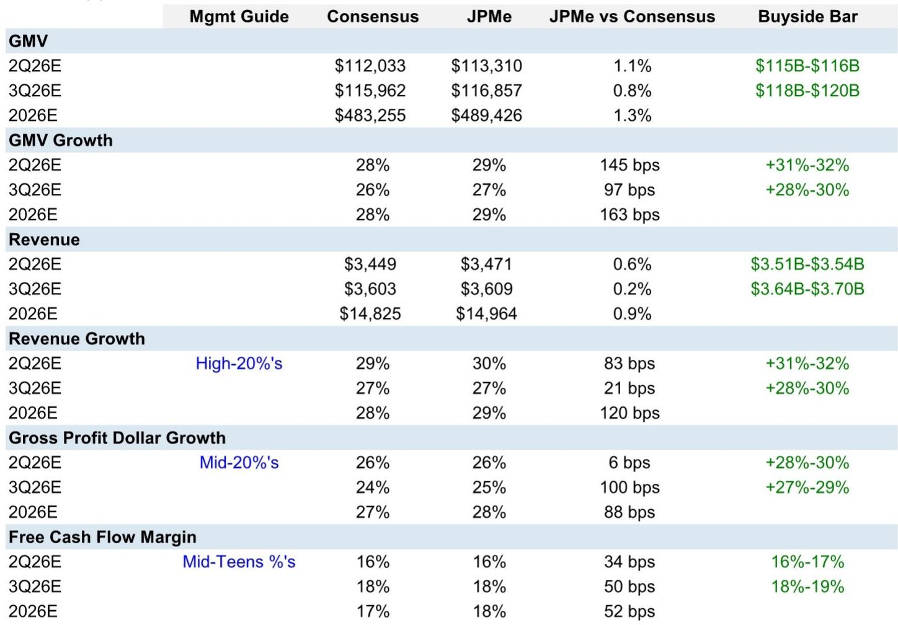
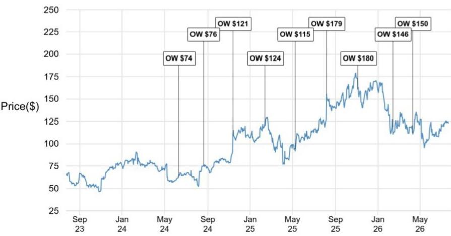

# JPM：Shopify二季度业绩前瞻与AI竞争格局分析

Shopify将在8月5日发布二季度业绩。JPM在最新报告中维持超配评级，同时将其加入分析师焦点名单作为成长型标的。报告的核心判断是：尽管市场对宏观不确定性和AI竞争存在担忧，但Shopify的GMV增长动能、商户生态粘性和AI布局的差异化，使其在电商基础设施领域仍处于有利位置。这份报告提供了三个值得关注的观察维度。

## 1. 二季度GMV增长有望超出管理层指引

JPM预计Shopify二季度GMV同比增长29%，高于彭博一致预期的28%，也高于管理层给出的高20%区间指引。报告引用JPM自有Chase Card数据，显示二季度美国Card Not Present支出同比增长11%，较一季度的10%有所加速。这一外部数据为GMV增长提供了独立验证。

报告同时指出，读者普遍预期二季度GMV增速在31%-32%之间，三季度在28%-30%之间。这意味着市场对增长节奏的预期高于公司官方指引，而JPM认为管理层的保守姿态可能为后续业绩超预期留出空间。值得注意的是，汇率因素正在减弱——二季度预计仅贡献约50个基点的顺风，远低于一季度的约200个基点，这将对下半年同比增速形成自然压制。

> **KC评论：** 读者需要关注的是，GMV增长的质量比总量更重要。报告提到企业级商户数量在过去两年弹性较高，收入贡献提升约200个基点，这说明Shopify的增长正在从中小商户向大型企业迁移，这种结构性变化对毛利率和客户生命周期价值的影响，可能比单季增速本身更具长期意义。

## 2. 毛利率面临AI成本与产品结构双重不确定性

报告对毛利率的判断值得仔细拆解。JPM估算，AI/大语言模型相关成本将在2026年对订阅解决方案毛利率造成约160个基点的同比影响，对整体毛利率造成约40个基点的影响。这一不确定性主要来自Sidekick等AI产品的Token消耗成本。

但报告同时指出，Shopify可以通过模型组合优化和更深度的商户变现来对冲部分成本不确定性。此外，订阅解决方案本身受益于规模效应和效率提升，部分抵消了AI成本的影响。更大的毛利率不确定性来自产品结构变化——低毛利率的商户解决方案（如支付处理）占比持续上升，这一趋势是结构性而非周期性的。

报告预计二季度毛利润美元增速将节奏变化至中20%区间，低于一季度的32%。全年来看，JPM预计2026年毛利润美元增长28%，自由现金流利润率18.0%，同比提升约60个基点。这意味着尽管毛利率承压，但费用端杠杆和运营效率仍在改善。

## 3. 平台型AI竞争的实际威胁可能被高估

市场对Meta、Google和Amazon等平台推出AI商务代理的竞争担忧，是压制Shopify估值的重要因素之一。但JPM的渠道调研给出了不同结论：商户对让大型平台完全管理店铺持谨慎态度，原因包括成本结构不如Shopify有利、对广告和电商工具的依赖，以及管理店铺的复杂性。

报告认为，Shopify在AI领域的优势来自三个层面：20年积累的商务数据、需求转化飞轮，以及跨流量渠道、平台内和基础设施的完整AI产品矩阵。在最近的Editions大会上，Shopify发布了150多项产品更新，重点围绕代理式商务，这应有助于提升商户获取量。

Shop Pay的规模效应和网络优势也被视为难以复制的竞争壁垒。Shop Pay在一季度处理了350亿美元GMV，同比增长59%。报告认为，商户和消费者的双向采用、数据护城河和网络效应，使得竞争对手在短期内难以复制这一生态。

> **KC评论：** 关于AI竞争，报告提供了一个容易被忽略的视角：商户对平台型AI的犹豫，不是因为技术不够好，而是因为成本结构和控制权问题。这提醒我们，在评估电商平台的AI竞争时，不能只看技术能力，还要看商户的迁移成本和平台的宏观环境模型。Shopify的核心护城河可能不是AI本身，而是它作为中立基础设施的定位——它不与商户争夺流量或数据所有权。

## 一个可复用的观察框架

从这份报告可以提炼出一个评估电商平台的框架：增长质量（GMV增速与商户结构）、利润结构（毛利率趋势与费用杠杆）、竞争壁垒（数据网络效应与AI差异化）。这三个维度相互关联——企业级商户的获取会拉低短期毛利率但提升长期客户价值，AI投入会压制当前利润率但可能巩固竞争地位。读者需要在这三个维度之间找到动态平衡点，而不是孤立地看任何一个单一指标。

For informational purposes only. Portions may be generated,translated,summarized,or edited with AI assistance based on source materials and may contain omissions or errors. Please verify independently. This is not investment,legal,tax,accounting,or other professional advice.

For informational purposes only. Portions may be generated,translated,summarized,or edited with AI assistance based on source materials and may contain omissions or errors. Please verify independently. This is not investment,legal,tax,accounting,or other professional advice.

