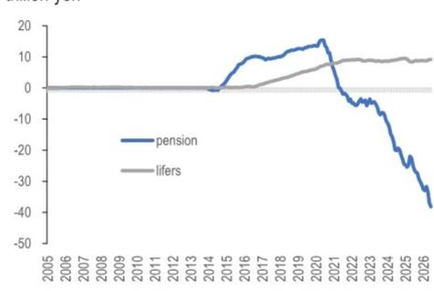
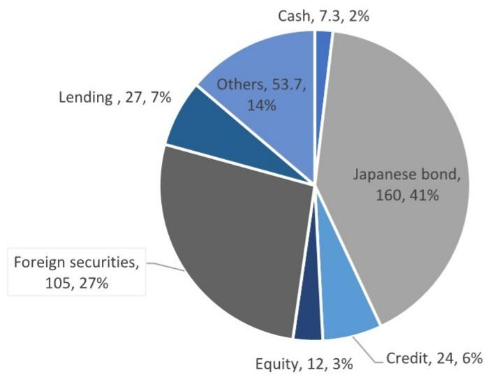

# 关于GPIF的观察

## 日本外汇相关话题

关于GPIF的三个关键问题

Extel - 2026

全球固定收益研究调查

点击投票

投票开放时间：7月6日至7月24日

- GPIF资金流动的潜在市场影响：即使在现有框架内，将国内债券和日本股票配置调整至目标区间上限（均调整至31%），可能产生约33.8万亿日元的本币买入/外币卖出——这意味着美元/日元汇率可能面临约15日元的下行空间，不过资金流动预计会比集中干预更为渐进和分散。

- 组合调整的时间线：在现有组合区间内的调整可能随时发生，而正式的基础组合修订更可能在2027年3月财年末进行——尽管任何周期中期的调整都将是史无前例的，这使得时间线和流程具有高度不确定性；需要关注的关键资金数据包括GPIF季度报告（8月7日、11月6日）和月度资金流动数据（8月10日），如果实际流出显著超出预估，可能预示着结构性组合调整。

- 其他日本读者的潜在跟进：其他大型机构读者——特别是寿险公司，持有约100万亿日元的外国证券，对冲比率约40%——短期内出现有意义的资金回流可能性不大，因为回报表现上升、外汇对冲成本高企以及日元偏弱的普遍预期，继续激励着维持海外资产配置，而GPIF带来的日本国债稳定所改善的市场情绪被认为不足以触发立即行动。

自包括高市首相、片山财务大臣和上野厚生劳动大臣在内的政府官员提及GPIF可能增加对国内资产配置以来，市场关注点一直集中在潜在市场影响、组合调整的时间线以及对其他日本投资资金流的潜在溢出效应。

## 1. GPIF资金流动的潜在市场影响

本币买入和外币卖出，以及因GPIF配置调整而产生的本币计价债券购买，即使在现有框架内也可能达到有意义的规模——无需任何结构性变化。例如，将国内债券配置（截至2026年3月底为26.91%）提高至目标区间上限（25%±6%，即31%），将产生约12.3万亿日元的本币买入/外币卖出——规模大致相当于财务省在4月至5月的干预。同样，将日本股票配置（截至2026年3月底为23.81%）提高至31%，意味着约21.6万亿日元的本币买入/外币卖出。合计来看，即使没有任何制度性改革，这也相当于约33.8万亿日元的本币买入。以4月至5月的干预为基准——12万亿日元的本币买入推动美元/日元汇率下行约5日元——简单推算表明33.8万亿日元可能推动美元/日元下行约15日元，不过资金流动可能比集中干预更为渐进和分散。

## 2. 组合调整的时间线

最直接的步骤是在现有基础组合内利用现有区间，这可以随时实施。然而，对基础组合本身的任何修订更可能在2027年3月财年末进行。值得强调的是，对基础组合进行周期中期调整完全没有先例——常被引用的2014年10月调整并非真正的周期中期调整，而是比原定2015年3月审查提前了五个月宣布。因此，任何潜在修订的时间线、流程和更广泛的机制仍然高度不确定且难以预测。

在监测实际资金流动方面，GPIF季度业绩报告将是需要关注的关键指标。该报告通常在每季度结束后两个月的第一个星期五发布；按照这一时间表，下一次发布预计在8月7日，涵盖2026年4月至6月数据，随后是11月6日，涵盖2026年7月至9月数据。

另一个实际资金流动的衡量指标是月度资金流动数据，预计于8月10日发布。根据我们的估算，7月的再平衡资金流动应反映约0.6万亿日元的外国股票流入和约0.3万亿日元的外国债券流入。如果实际数据与这些估算相比出现显著的流出偏离，可能预示着基础组合本身的调整。需要注意的是，这些估算可能会进行修订，并将在7月底更新。

图1：截至7月21日的7月再平衡资金流动估算（万亿日元）

| 日期 | 国内债券 | 国内股票 | 外国股票 | 外国债券 | 总计 | 平均 |
|------|----------|----------|----------|----------|------|------|
| 2026/3/31 | 80.7 | 71.4 | 74.4 | 73.4 | 299.9 | 75.0 |
| 2026/4/30 | 80.2 | 76.1 | 80.9 | 73.2 | 310.3 | 77.6 |
| 2026/5/29 | 77.1 | 82.4 | 83.0 | 79.3 | 321.8 | 80.5 |
| 2026/6/30 | 80.5 | 81.3 | 81.5 | 81.6 | 324.9 | 81.2 |
| 2026/7/21 | 81.1 | 81.6 | 80.3 | 80.6 | 323.6 | 80.9 |

资金流动

| 国内债券 | 国内股票 | 外国股票 | 外国债券 |
|----------|----------|----------|----------|
| -0.2 | -0.7 | 0.6 | 0.3 |

假设每月各资产再平衡至25%。估算基于GPIF截至7月21日发布的基准指数。

## 3. 其他日本读者的潜在跟进

尽管资金回流在日本是一个长期话题，但在GPIF调整之后，其他大型机构读者迅速跟进的可能性似乎不大。历史模式表明，在2014年至2020年间，当国内回报表现受到压制时，寿险公司与GPIF同步增加了外国债券和股票持有量。然而，此后这种相关性被打破，因为寿险公司因外汇对冲成本上升而大幅减少了外国债券配置（图2、图3）。

寿险公司当前的投资计划继续反映出对积极积累日本国债的有限兴趣，尤其是在回报表现上升的环境中。此外，日元偏弱的普遍预期为寿险公司维持海外资产配置提供了激励。尽管日本国债市场的价格稳定——在GPIF支持之下——可能改善对国内债券的市场情绪，但考虑到当前的外汇前景以及GPIF支持的临时性质，我们预计短期内不会出现显著的跟进。日本寿险公司目前持有约100万亿日元的外国证券（股票和债券合计），外汇对冲比率约为40%。

图2：外国债券累计资金流动（万亿日元）

2014年前无养老金基金数据
来源：JPM，财务省

图3：外国股票累计资金流动（万亿日元）

2014年前无养老金基金数据
来源：JPM，财务省

图4：寿险公司30%的证券资产为外国证券，约100万亿日元（万亿日元，%）

截至2026年1月
来源：JPM，日本寿险协会

图5：日本养老金基金外国资产累计资金流动（万亿日元）

来源：JPM，财务省
