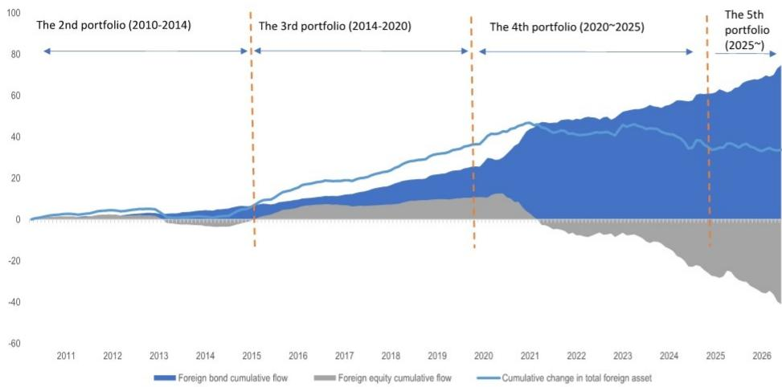
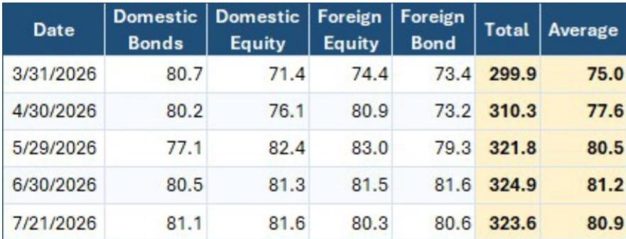
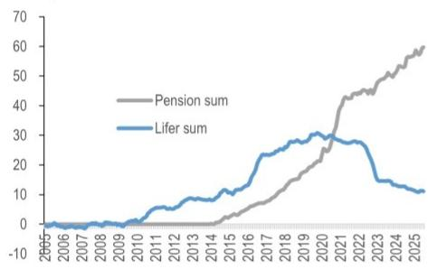

# GPIF资金回流或推动美元/日元汇率变动约15日元，但更值得关注的是其他日本机构读者的动向

日本政府养老金投资基金（GPIF）可能向国内资产进行重新配置，这将产生约33.8万亿日元的日元买盘，基于4-5月干预基准，足以推动美元/日元汇率下行约15日元。自日本高级官员开始表达希望增加国内投资的意愿以来，这一数字便引起了市场关注。然而，对于汇率和固定收益读者而言，更具深远意义的洞察并不在于GPIF能力的简单计算，而在于那些将阻止其他日本大型机构读者效仿的结构性约束。真正的市场影响将由GPIF的独特使命与日本寿险公司及其他实钱管理人所遵循的截然不同的激励机制之间的相互作用所决定。

三个因素将决定这一政策方向所带来的任何日元强势的时间线、幅度和持久性：GPIF在其现有投资组合框架内行动的速度、中期基本组合调整的前所未有性，以及日本寿险公司（持有约100万亿日元外国证券，对冲比率仅40%）维持其当前外国资产敞口而非回流的可能性。这些因素中的每一个都对读者在未来几个季度如何布局美元/日元、日本国债和日本股票具有不同的含义。

## 仅现有投资组合区间就允许相当于多轮外汇干预的资金流动

日元买盘最直接的来源并不需要对GPIF的基本组合结构进行任何调整。截至2026年3月底，GPIF的国内债券配置为26.91%，国内股票配置为23.81%。两者均处于各自25%±6%的目标区间内，意味着各自的上限为31%。当前配置与上限之间的差距代表国内债券约12.3万亿日元和国内股票约21.6万亿日元的潜在日元买盘，合计33.8万亿日元。

为便于理解这一数字：日本财务省在今年4-5月的干预涉及约12万亿日元的日元买盘，推动美元/日元汇率变动约5日元。简单的线性推算表明，33.8万亿日元可能意味着15日元的变动。关键注意事项在于，干预资金集中且具有针对性，旨在最大化信号效应。相比之下，GPIF的再平衡将是逐步且分散执行的，从而减弱每单位资金流动的价格影响。因此，读者应将15日元的估计视为方向性指引的上限，而非近期预测。关键的战略含义是，即使没有任何正式的政策变化，GPIF也有能力成为日元和国内资产的持续性、结构性买家——而这种能力已经嵌入现有框架之中。

## 中期基本组合调整将是前所未有的，时间线成为主要不确定性

利用现有区间与调整基本组合之间的区别不仅仅是程序性的——它对市场参与者具有根本不同的含义。利用现有区间可以随时进行，无需正式公告。下一份GPIF季度业绩报告（涵盖4-6月期间，将于8月7日发布）以及月度资金流动数据（将于8月10日发布）将是判断此类转变是否正在进行的第一批实时指标。我们的估计表明，7月的再平衡资金流动应显示约0.6万亿日元流入外国股票，0.3万亿日元流入外国债券。这些类别中出现任何实质性的资金外流偏差，都将表明在现有区间内采取了操作行动。

对基本组合本身的调整则完全是另一回事。此类变化最可能的时间线是2027年3月财年末，届时将进行标准的三年期审查。认为可能进行中期调整的市场参与者应注意，经常被引用的2014年10月先例并非真正的中期调整——它只是将原定于2015年3月审查的公告提前了五个月。从未发生过真正的中期基本组合调整。这一历史事实引入了二元不确定性：要么政府迫使GPIF进行前所未有的中期调整，大幅压缩时间线；要么该过程遵循标准审查周期，将任何结构性转变推迟到2027年。在这两种情景下，美元/日元可能结果的离散度异常之大，读者应为两种路径做好准备。

## 日本寿险公司在结构上缺乏效仿GPIF的动力，限制了二阶资金流动

关于GPIF叙事最常见的问题是，其他日本机构读者是否会加入回流交易。基于当前激励机制，答案在短期内几乎肯定是否定的。日本寿险公司目前持有约100万亿日元的外国证券，外汇对冲比率仅为40%。这意味着其中约60万亿日元的敞口未对冲，如果寿险公司进行回流，这代表了日元买盘的巨大潜在来源。但触发此类转变的条件目前并不存在。

2014年至2020年间，寿险公司与GPIF同步增加了外国债券和股票持仓，原因是国内回报表现低迷，使得外国资产成为相对少见有意义的利差来源。随着外汇对冲成本大幅上升，这种相关性被打破，使得对冲后的外国债券净回报相对于风险而言缺乏吸引力。寿险公司当前的投资计划继续反映出对积极积累日本国债的有限兴趣，尤其是在日本回报表现上升而非下降的环境中。对日元弱势的普遍看法进一步激励维持未对冲的外国资产敞口，因为日元的任何贬值都会增加这些持仓的本币价值。

其含义是，GPIF推动的日本国债市场稳定，虽然可能改善对国内债券的情绪，但只是一种一次性的支持机制，而非寿险公司对日本与外国资产相对吸引力发生结构性转变。要实现有意义的后续效应，寿险公司需要看到外汇对冲成本持续下降、日元实质性升值改变当前的弱势观点，或者日本与外国债券之间的回报表现差显著收窄。这些条件都不太可能仅凭GPIF的行动而出现。因此，读者应将GPIF的故事视为一个独立的资金流动事件，而非广泛回流周期的开始。

## 读者的决策框架：三种情景，三种不同的布局策略

这三个因素——GPIF的现有区间能力、基本组合调整的时间线不确定性，以及寿险公司跟进可能性低——的相互作用，创造了一套清晰的情景，读者可据此构建其布局。

**情景一：仅利用区间，无基本组合调整。** 这是最可能的近期结果。GPIF逐步将国内配置向现有区间的上限移动，在较长时间内产生33.8万亿日元的渐进式日元买盘。美元/日元的影响是方向性的，但速度温和，可能在12-18个月内变动5-10日元。日本国债回报表现因GPIF买入而边际小幅下降，但由于缺乏更广泛的国内需求转变，影响有限。日本股票受益于国内配置增加，但GPIF的外国股票流出对全球股票市场构成温和阻力。最优布局是逐步、结构性地做多日元，偏好日本股票而非外国股票。

**情景二：2027年3月审查时进行基本组合调整。** 这一情景压缩了时间线并放大了幅度。正式调整以提高国内债券和股票目标，可能会将配置积极推向新的上限，加速33.8万亿日元资金流入更短的时间窗口。美元/日元的影响可能接近15日元的上限，随着GPIF成为更坚定的国内买家，日本国债回报表现将面临更显著的下行压力。寿险公司基本保持观望，但日元升值本身开始侵蚀未对冲外国敞口的理由，可能触发边际对冲调整。读者应为日元走强和日本国债回报表现下降布局，战术性做空美元/日元，做多日本国债期货。

**情景三：未来12个月内进行中期调整。** 这是低概率、高影响的尾部事件。前所未有的中期调整将表明，对GPIF的政治压力比市场当前定价的更为强烈。即时反应将是日元急剧上涨，因为市场会提前反应预期资金流动。日本国债回报表现将突然下降，日本股票将因国内需求乐观情绪而上涨。风险在于市场可能过度反应实际资金流动，因为中期调整缺乏快速执行大规模重新配置的程序性基础设施。读者应将此情景视为波动事件而非趋势转变，利用初始飙升作为减少日元多头而非增加的机会。

所有三种情景的共同点是，寿险公司的行为仍然是关键的摇摆因素，但不太可能发生摇摆。即使在最激进的GPIF重新配置情景下，寿险公司维持外国敞口的结构性激励——国内回报表现上升、高外汇对冲成本以及持续的日元弱势倾向——将阻止它们成为外国资产的有意义卖家。GPIF的故事是强有力的，但它并非更广泛的日本回流周期的代表。将两者混为一谈的读者将高估任何出现的日元强势的持久性。

仅供参考。部分内容可能基于源材料通过AI辅助生成、翻译、总结或编辑，可能存在遗漏或错误。请独立核实。本文不构成专业建议。

