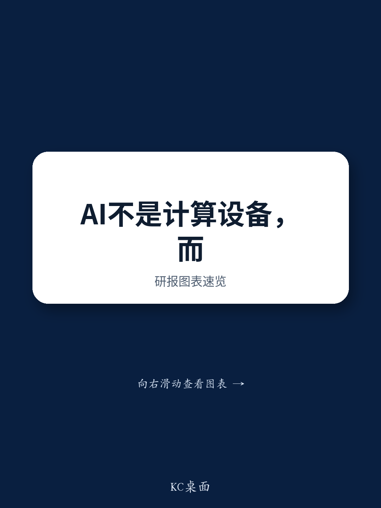

# AI's Next Bottleneck Is Not Computation—It Is Data Movement, and the Semiconductor Industry Is Reorganizing Around This Truth

The semiconductor industry has spent decades optimizing how fast chips can compute. Transistor counts have doubled, clock speeds have risen, and architectures have become more specialized. Yet the most critical constraint for AI systems today is no longer how fast a GPU can multiply matrices. It is how fast data can move between GPUs, between GPU and memory, and between racks in a data center. A leading academic researcher in advanced packaging, Professor Fumihiro Inoue from Yokohama National University, has articulated a fundamental shift: AI is transforming from a "computation device" into a "communication system." This is not a subtle refinement. It redefines where value is created, which technologies matter, and which companies will dominate the next phase of the industry.

The implications are immediate and concrete. GPU computation performance has risen steadily each year, but data movement between components has become the bottleneck. Co-packaged optics, hybrid bonding, and chiplet architectures are not incremental improvements to existing packaging methods. They represent a structural rethinking of how systems are built. The dominant pairing in cloud AI today—NVIDIA for design and TSMC for production and mounting—has succeeded because it solved the integration challenge at scale. But the next set of problems involves interconnections and power at a level that will force a new division of labor across the entire semiconductor value chain.

This article draws on a detailed seminar presentation by Professor Inoue, combined with analysis from a global research report, to explain why the back-end process is no longer a passive assembly step but the primary source of added value. It then translates these technical developments into a decision framework for business leaders, researchers, and strategists who need to understand where the industry is heading and how to position themselves.

## The Dominant Cloud AI Duopoly Is Powerful but Vulnerable to a New Class of Interconnection Constraints

NVIDIA and TSMC have built what appears to be an unassailable position in cloud AI. NVIDIA provides the platform through its CUDA software ecosystem, and TSMC provides the advanced process technology and packaging capacity that makes AI GPU production possible. Observers and customers have confidence in this combination. But the next hurdle for this duopoly is not a competitor offering a better GPU. It is the physical limit of copper interconnections.

Copper has been the workhorse of chip-to-chip communication for decades. As data rates increase, copper interconnections consume more power and generate more heat. The SerDes components that convert parallel to serial communication and back, along with I/O and re-timer circuits, account for the bulk of power usage in a data center. Co-packaged optics changes this equation by moving the I/O function closer to the chip and replacing electrical signaling over copper with optical signaling. The real significance of co-packaged optics is not that it replaces copper with light. It is that it reduces the power consumed by connecting to the outside world. As Professor Inoue stated, the key question is "the extent to which it is possible to lower power usage for connecting to the outside" rather than "how quickly it is possible to carry out calculations."

TSMC's COUPE technology, which connects electronic integrated circuits and photonic integrated circuits using SolC bonding, demonstrates the potential. Results announced at the ECTC event in 2025 showed low impedance in the chip-chip interface, bond density of at least 16 times, and an 85 percent reduction in stray capacity. This format raises speed by 170 percent or more at the same power consumption and can reduce power usage by 40 percent. These are not marginal gains. They change the economics of data center design.

NVIDIA and TSMC are leaders in co-packaged optics, but the technology is not proprietary to them. Broadcom, Marvell, and Ayar Labs are developing competing approaches for what the report calls the "I/O-driven era." The duopoly's strength lies in its ability to integrate design, production, and mounting. But if interconnection technology becomes the primary differentiator, the advantage could shift toward companies that specialize in optical components and system-level integration rather than GPU design alone.

## Co-Packaged Optics Is Not a Future Research Theme—It Is Approaching Volume Production, and Japanese Companies Risk Being Left Behind

Japanese companies possess world-class materials and parts for semiconductor packaging. They have core technologies in areas such as glass substrates, temporary adhesives, and plating solutions. Yet they are systematically weak in systems integration and mounting capabilities that are premised on co-packaged optics. There is an absence of simultaneous optimized design of light, electricity, and heat. More fundamentally, Japanese companies have approached co-packaged optics as a future technology and a research theme, divorcing design, mounting, and business perspectives from the initial stage of research.

Globally, co-packaged optics is on the cusp of volume production. The industry is advancing in what the report terms "architecture x package" building. This means that companies are not developing packaging technology in isolation. They are designing the architecture of the system and the package simultaneously, with the understanding that the two are inseparable. Japanese companies, by contrast, have maintained a siloed approach where materials suppliers develop components, research institutes explore academic questions, and system integrators work independently.

The gap is not in technological capability. It is in the concept of "how to integrate and report perspectives." Resonac has taken a step in the right direction by launching the US-JOINT consortium of 10 Japanese and US companies in Silicon Valley, with a framework to advance back-end process technologies in the United States. The JOINT3 consortium, with 27 companies, aims to build a panel-level organic interposer prototype line. These initiatives show that Japanese companies recognize the need to move from "selling standalone materials" to "offering process plus evaluation plus design." But the timeline is tight. Co-packaged optics is moving from research to volume production now, not in five years.

## Edge AI Is Not a Smaller Version of Cloud AI—It Requires a Fundamentally Different Packaging Architecture

The AI semiconductor market was valued at approximately USD 236 billion in 2025, with cloud AI accounting for roughly USD 160 billion and edge AI about USD 80 billion. According to a VLSI forecast, this should expand to USD 371 billion in 2028, with cloud AI at USD 250 billion and edge AI at USD 120 billion. These numbers suggest that edge AI is growing faster than cloud AI, but the strategic importance of edge AI is not captured by market size alone.

Cloud AI faces fundamental limitations. Power and environmental constraints accompany the explosive increase in computation volume. Information security and data sovereignty concerns make it impossible to handle everything in the cloud. Personalization, real-time features, ultra-low latency, and constant inference requests require local processing. Edge AI is not a substitute for cloud AI. It is a core technology that has necessarily emerged from the limits of cloud AI.

The packaging implications are profound. HBM is a technology that speeds up AI by providing high-bandwidth memory close to the compute unit. But HBM is not suited for edge AI from the perspective of power consumption, package costs, and volume scale. The main presence in edge AI is likely to be DDR combined with 3D layering. Qualcomm's HBC Gen1, used in its AI250 AI-inference chip for data centers, places a multilayer structure on a 2D organic substrate without using TSMC's CoWoS. It realizes 133 TB per second effective memory bandwidth per card without using memory devices that support the bandwidth available from HBM. This represents 18 times the value of the previous generation's LPDDR5.

The implication for packaging companies and materials suppliers is clear. The dominant packaging architecture for cloud AI—silicon interposers such as CoWoS—may not be the right solution for edge AI. Edge AI requires lower power, lower cost, and different form factors. This opens opportunities for organic interposers, glass-core substrates, and panel-level packaging that are not viable in the cloud AI context. Companies that focus exclusively on the cloud AI packaging market risk missing the growth in edge AI.

## The Silicon Interposer Is Not Indispensable—Its Value Is Being Redefined by Advances in Substrate Technology

Advanced packages that include HBM currently rely heavily on a silicon interposer. CoWoS is the most prominent example. But finer processing for substrate RDL and glass-core substrate mounting technology are advancing rapidly. Silicon interposers face structural redundancy, scalability, and cost risks. The technology advancement pace on the substrate side may dilute the value of the interposer.

If organic RDL interposers are integrated into glass-core substrates, the usage frequency and market scale of carrier glass, temporary adhesives, through-mold vias, and mega-pillar formation materials could decline. The report anticipates this could occur from 2030 as a timeline. This is not a distant possibility. It is a foreseeable disruption that materials manufacturers need to prepare for now.

The response from materials manufacturers should be to strengthen proposal capabilities from "selling standalone materials" to "offering process plus evaluation plus design." Since this requires more than domestic capabilities, it is essential to build back-end process co-creation sites abroad, particularly in the United States. Resonac's US-JOINT and JOINT3 consortia are examples of this approach, but they are early-stage efforts. The industry needs more such initiatives, and they need to move faster.

## A Decision Framework for Business Leaders: Three Questions to Determine Your Position in the Post-CoWoS Era

The developments described above create a strategic challenge for every company in the semiconductor packaging value chain. The following framework helps decision-makers assess their position and identify the most important actions.

**Question one: What is your role in the interconnection value chain?** The shift from computation-centric to communication-centric systems means that value is migrating from the chip itself to the connections between chips. If your company is a materials supplier, the question is whether you are selling a component or a solution. If you are a packaging house, the question is whether you can integrate optical, electrical, and thermal design simultaneously. If you are a system integrator, the question is whether you have the capability to design architecture and package together.

**Question two: Are you prepared for the edge AI packaging transition?** The cloud AI packaging market is large and growing, but it is also dominated by TSMC and a few other players. The edge AI packaging market is more fragmented and has different technical requirements. Companies that can offer low-power, low-cost, high-volume packaging solutions for edge AI will capture disproportionate value. This may require investing in organic interposers, glass-core substrates, and panel-level packaging rather than silicon interposers.

**Question three: Do you have a credible plan for international co-creation?** The era of standalone materials suppliers is ending. The complexity of co-packaged optics, hybrid bonding, and chiplet integration requires close collaboration between materials, equipment, design, and mounting companies across borders. Japanese companies in particular need to build co-creation sites abroad, especially in the United States, where the leading system integrators and cloud AI companies are based. Without such sites, Japanese companies will be relegated to supplying components rather than participating in system-level value creation.

## Hybrid Bonding Redefines the Boundary Between Front-End and Back-End Processes

Hybrid bonding is often described as a next-generation bonding technology that replaces micro-bumps. This framing understates its significance. Current micro-bumps, with a pitch of up to 40 microns, create an I/O boundary between chips. Design fundamentally takes place at the chip unit, and interconnections temporarily stop at the chip boundary. In hybrid bonding, which operates at the 100-nanometer level, the back-end-of-line links chips directly. Interconnections extend beyond the boundary, and this supports design division at the interconnection layer unit rather than the chip unit.

Hybrid bonding is not just a bonding technology. It is a technology that redefines system setup across the BEOL, effectively bringing the back-end process outside the traditional chip boundary. This has profound implications for how chips are designed, who designs them, and where value is captured. It blurs the line between front-end and back-end processes and creates new opportunities for companies that can integrate design and packaging at a finer granularity.

The implications for China are particularly noteworthy. Huawei has proposed the Tau Scaling Law at ISCAS 2026, a new scaling strategy beyond Moore's Law. Process migration confronts physical limits and increased costs. For China, which faces access restrictions to EUV lithography equipment, a new strategy for improving performance is necessary. Huawei proposes shrinking the signal transmission time rather than focusing on the number of transistors. This is a CMOS 2.0-type concept that aims to comprehensively optimize devices, circuits, chips, and systems to reduce overall system delay.

China can develop design, production, mounting, and AI systems in a vertically integrated manner led by the government. It can optimize performance for the overall ecosystem rather than achieving the top level worldwide for individual technologies. Huawei's announcement shows that China has started to genuinely seek verification of this direction. The challenge for incumbent leaders is that the current industry structure, with separate specialists in design, production, EDA, equipment, and mounting, makes it difficult to achieve the simultaneous optimization that CMOS 2.0 requires.

## Japan's Back-End Process R&D Is Misaligned with the Edge AI Trend

Japanese companies have a competitive technology in MAS-CBA, an approach that separately manufactures NAND CMOS circuit and memory cell wafers and directly bonds them with copper. This technology significantly raises I/O speed, reduces electrical resistance, boosts writing speed, and achieves low latency and power consumption. It is a genuine competitive advantage.

Yet Japan's current back-end process R&D activity is overly skewed toward Scale-out, which involves planar rollout, large substrates, and co-packaged optics. The functions and composition required by edge AI depend more on Scale-up, which involves higher integration and front-end process merger. Panel-level packaging is an excessive boom in Japan and cannot handle the edge AI trend. The country has world-class materials and parts but is weak in the systems thinking required to integrate them into competitive products.

The key technologies for next-generation packaging are hybrid bonding and fine-pitch substrates, including glass core, bridges, and advanced RDL on substrate. System mounting that does not rely on an interposer will be important. This means creating post-CoWoS architectures that can deliver the performance, power, and cost characteristics required by edge AI. Japanese companies have the components but lack the architectural vision and the mounting capabilities to execute it.

The challenge is not technological. It is organizational and strategic. Japanese companies need to shift from a component-centric mindset to a system-centric mindset. They need to build co-creation sites abroad, invest in Scale-up technologies, and develop the capability to design and mount systems that integrate light, electricity, and heat simultaneously. The window for action is narrow. Co-packaged optics is approaching volume production, edge AI is growing rapidly, and the silicon interposer is being challenged by substrate technology. The companies that act now will define the next decade of the semiconductor industry. Those that wait will be left supplying components to the system integrators that have seized the architectural high ground.

*For informational purposes only. Portions may be generated, translated, summarized, or edited with AI assistance based on source materials and may contain omissions or errors. Please verify independently. This is not professional advice.*

For informational purposes only. Portions may be generated, translated, summarized, or edited with AI assistance based on source materials and may contain omissions or errors. Please verify independently. This is not professional advice.

