# 市场观察

## 零售活动雷达

7月22日 – 动能趋缓，大型科技公司财报

## 零售交易活动概览

- 上周零售资金流处于中等水平（35.3%分位），与前一周基本持平。ETF资金流入继续减弱（从18%分位降至4%分位），但个股活动增强（从51%分位升至71.8%分位）部分抵消了这一影响。零售参与度的放缓与近期市场对动能调整的担忧相一致。该因子在过去一个月中出现了明显回调（在标普500市值加权五分位中，多空基准下跌14%）。由于拥挤程度处于极端水平，回调尤为剧烈，图2显示因子闪崩的概率较高（参见年中展望）。与此动态一致，当前回调过程中出现了多次高幅度负面尾部事件，包括上周四的一个-6西格玛日，以及回调期间18天内出现的7次极端负面西格玛观测值（-3西格玛或更差）（见图3）。

- 在ETF中，弱势仍然广泛。行业ETF资金流尤其疲软，图2，科技ETF资金流入转为负值，图4。本周卖出最多的ETF是SOXL（-1.6z）和SMH（-1.6z）。金融ETF的资金流在上周财报季后的异常激增后回落至持平，而加密ETF资金流入较强（例如，BITO：3.0z）。在个股方面，通信和科技板块推动了买入，SPCX、NVDA、GOOGL/GOOG、TSLA和NU是前五大个股。第二季度财报季继续，首批Mag-7公司于周三公布财报，见零售活动活跃的个股故事：

- 本周和下周大型科技公司财报有何预期？根据我们的财报记分卡，“AI资本支出超级周期仍是大型科技公司财报前的核心主题，市场偏向乐观。在整个板块中，关键变量是AI变现和回报，读者正在寻找云、广告和企业领域改善的变现情况，此外还有代币定价动态、前沿模型竞争以及更波动的宏观环境，其中韧性支出可能推动业绩指引上调，即使消费者情绪偏软和新的军事活动可能抑制部分第三季度展望。”

- 零售读者在周三财报公布前买入了GOOGL（1.9z）和TSLA（0.4z）。GOOGL，图15，在周三公告后下跌约4%。除了对2027年资本支出指引的炒作（市场预期2500亿美元，JPMe预期2900亿美元），关键指标是谷歌云的增长，该指标超出预期（报告增长82%，买方预期同比增长70-75%，市场预期64%）。今年的资本支出指引上调至1950-2050亿美元（此前为1800-1900亿美元），图17。TSLA周三公布的财报不及预期，尽管电动汽车销售带来强劲收入增长，但受较低价格和监管信用影响。公告后该股在盘后交易中小幅下跌。

- 台积电第二季度财报好于预期，得益于强劲的运营杠杆（推动利润率首次超过60%），同时

## 股票策略与量化研究

Arun Jain AC
(1-212) 622-9454
arun.p.jain@JPM.com
JPM Securities LLC

Shizuka Suga, CFA AC
(1-212) 622-2134
shizuka.suga@JPM.com
JPM Securities LLC

Ana Pous Avila
(1-212) 622-0496
ana.pousavila@JPM.com
JPM Securities LLC

William Matheson
(1-212) 622-9538
william.matheson@jpmchase.com
JPM Securities LLC

Khuram Chaudhry
(44-20) 7134-6297
khuram.chaudhry@JPM.com
JPM Securities plc

Bhupinder Singh AC
(1-212) 622-9812
bhupinder.singh@JPM.com
JPM Securities LLC

(1-212) 622-3601
dubravko.lakos-bujas@JPM.com
JPM Securities LLC

## 往期内容：

7/15 - 资金流降温下的交易财报
7/8 - 动能降温中的逢低买入
7/1 - 相同策略，逢低买入
6/24 - 记住回调，MU表现良好
6/17 - 科技热潮蔓延至通信
6/10 - 回调中的科技卖出，世界杯
6/3 - MEME财报，IPO交易
5/27 - 主题组合：AI、存储、太空、量子
5/13 - 软件与半导体持仓
5/6 - 存储与AI，追赶交易
4/29 - 财报高峰，Mag-7高峰
4/22 - 走向MEME复兴？
4/15 - 回归均值
4/8 - 尽管停火，并未买入
4/1 - 防御模式
3/25 - 反弹卖出
3/18 - 从FOMO到FOHO：担忧油价上涨
3/11 - 买入石油，卖出能源
3/4 - 谨慎乐观

收入和毛利率均处于指引区间上限。积极惊喜来自2026年收入指引上调、资本支出上调以及强劲的AI需求评论。该股公告后面临一些压力，随后回升（链接）。

- SMCI吸引了适度的零售兴趣（周三-0.6z，图21），该股周三上涨约23%，此前这家服务器制造商发布了初步季度业绩，显示毛利率和订单方面出现积极惊喜（链接）。

## 本周零售交易活动数据：7月16日至7月22日

- 本周零售资金流为57亿美元，低于12个月均值68亿美元/周。零售读者继续偏好ETF（+39亿美元）而非个股（+18亿美元）。

- 除大盘股ETF（+14亿美元）外，零售ETF买入受到权益风格股息（+2.2亿美元）、权益风格看涨/看跌期权写入（+2.2亿美元）、固定收益-多板块（+1.82亿美元）以及国际权益EAFE（大盘）（+1.52亿美元）的影响。

- 本周，与前几周一致，零售读者继续买入AI数据中心和电气化（JPAMAIDE）、前30大AI/数据中心受益股、Mag 7、成长股，以及AI软件/产品/变现和OBBBA即时费用化受益股，见图4。

- Mag 7本周活动：零售读者买入NVDA（+4.12亿美元）、TSLA（+3.19亿美元）、MSFT（+2.02亿美元）、AMZN（+1.77亿美元）和META（+2100万美元），卖出AAPL（-1.14亿美元）。

- 除Mag 7外，零售读者偏好通信（+5.35亿美元）和科技（+4.09亿美元），净卖出工业（-2.31亿美元）和可选消费（-2.26亿美元）。

- 上周前五大零售个股：SPCX（+5.14亿美元）、NVDA（+4.12亿美元）、GOOGL/GOOG（+3.28亿美元）、TSLA（+3.19亿美元）和NU（+3.08亿美元）。后五大零售个股：AAPL（-1.14亿美元）、AAL（-1.07亿美元）、SNDK（-4400万美元）、PYPL（-4300万美元）和CBRS（-4200万美元）。

- 在期权方面，零售份额处于高位，图41。交易最活跃的期权名称与前几周一致：TSLA、MU、NVDA、AMZN、META、SNDK、AAPL、AMD、GOOGL/GOOG和MSFT。关于最活跃的Delta和Gamma买入/卖出名称，见期权零售活动。另见按板块划分的零售读者期权活动。

- 期货活动（非零售）：过去一周，期货交易者净卖出约41亿美元，主要由NQ净卖出（约83亿美元）驱动，部分被ES净买入（约23亿美元）和RTY净买入（约19亿美元）抵消。

2/25 - 平衡乐观
2/18 - AI软件平均成本买入
2/11 - 围绕错位的持仓
2/4 - 情绪软化，软件与半导体
1/28 - 财报、国际权益、贵金属
1/21 - 波动冲击下保持冷静
1/14 - 一月效应？
1/7 - 十二月热潮与一月良好开局
12/10 - 2025零售热潮
12/3 - 零售AI交易
11/26 - 每周亮点
11/19 - 2025零售热潮：AI逢低买入
11/12 - 黄金到硅：AI淘金热重启
11/5 - 跳过回调，财报选股
10/29 - 达到财报高峰、AI、FOMC
10/22 - 卖出GLD，转向新MEME和财报
10/15 - 围绕关税、AI和财报交易
10/8 - 暑假后回归
10/1 - 回归股票、主题ETF、GLD热潮
9/24 - 贵金属、周期股和国内
9/17 - FOMC、OPEN和GRAB的羊群效应

我们感谢JPM India Private Limited的G. K. Kiruthik Srinivaas和Aditya Mulye对本报告的重要贡献。

图1：动能拥挤度  
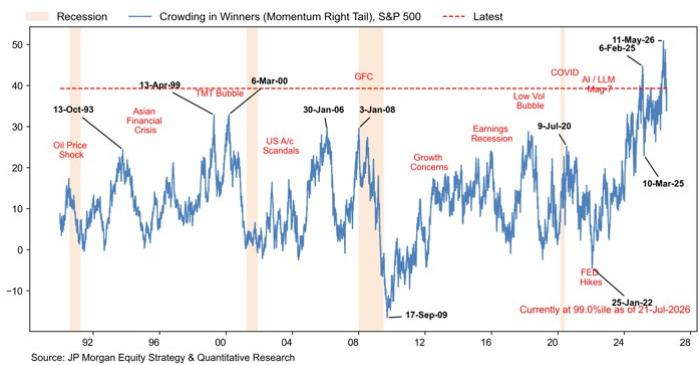  
来源：JPM股票策略与量化研究

图2：动能回调 vs 2025年2-3月  
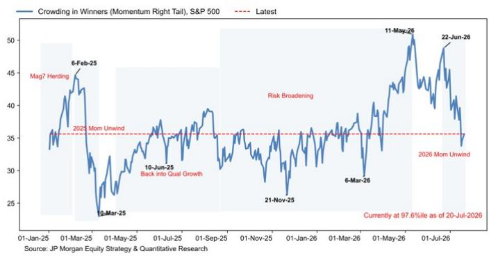  
来源：JPM股票策略与量化研究

图3：动能中频繁的负面高西格玛事件  
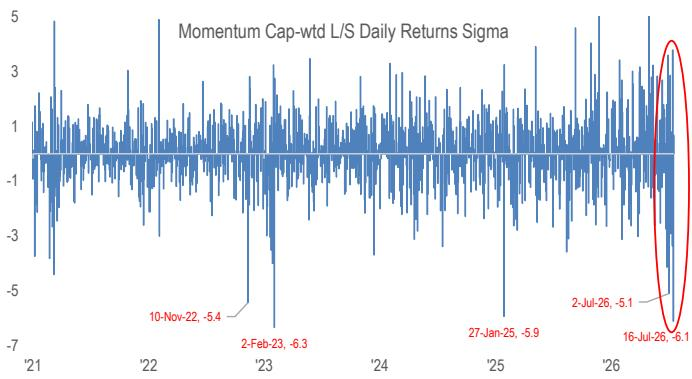  
来源：JPM股票策略与量化研究

图4：截至7月22日科技ETF零售失衡转为负值  
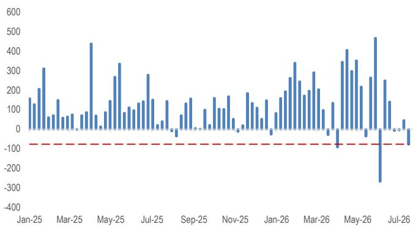  
来源：JPM股票策略与量化研究

图5：截至7月22日零售读者每日个股和ETF购买额（百万美元）  
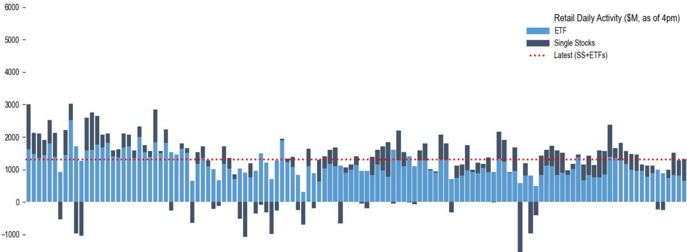  
2000 - 1月22日 1月29日 2月5日 2月12日 2月20日 2月27日 3月6日 3月13日 3月20日 3月27日 4月6日 4月13日 4月20日 4月27日 5月4日 5月11日 5月18日 5月26日 6月2日 6月9日 6月16日 6月24日 7月1日 7月9日 7月16日

来源：JPM股票策略与量化研究

## 零售现金活动 – 概览

图6：按主题划分的零售个股活动

<table><tr><td colspan="2">主题篮子</td><td colspan="3">零售成交额变化（十亿美元）</td></tr><tr><td>篮子</td><td>指数</td><td>一周前</td><td>一个月前</td><td>年初至今</td></tr><tr><td>AI/数据中心/电气化</td><td>JPAMAIDE</td><td>1.32</td><td>7.14</td><td>44.72</td></tr><tr><td>标普500前30大AI/数据中心受益股</td><td>JPRAID30</td><td>1.28</td><td>6.92</td><td>43.67</td></tr><tr><td>Magnificent 7</td><td>Mag7</td><td>1.09</td><td>4.97</td><td>35.32</td></tr><tr><td>成长</td><td>JPAMGROW</td><td>1.02</td><td>5.92</td><td>42.31</td></tr><tr><td>AI软件/产品/变现</td><td>JPAMAISO</td><td>0.90</td><td>3.73</td><td>27.33</td></tr><tr><td>OBBBA即时费用化受益股</td><td>JPGTIEXB</td><td>0.88</td><td>4.14</td><td>21.25</td></tr><tr><td>低端消费敏感</td><td>JPRLOWCO</td><td>-0.03</td><td>-0.15</td><td>-1.50</td></tr><tr><td>美国通胀</td><td>JPAMINFL</td><td>-0.05</td><td>-0.16</td><td>-2.03</td></tr><tr><td>通胀表现不佳者</td><td>JPAMINUP</td><td>-0.05</td><td>0.10</td><td>1.09</td></tr><tr><td>通胀表现优异者</td><td>JPAMINOP</td><td>-0.15</td><td>-0.54</td><td>-3.60</td></tr><tr><td>特朗普放松监管议程</td><td>JPRGDREG</td><td>-0.28</td><td>-0.40</td><td>-4.48</td></tr><tr><td>工资敏感</td><td>JPAMWAGG</td><td>-0.47</td><td>0.55</td><td>3.97</td></tr></table>

图7：Mag 7 + PLTR零售累计购买额（十亿美元）  
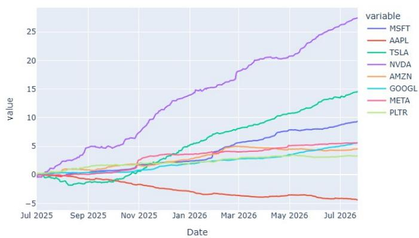

来源：JPM股票策略与量化研究。有关上述篮子的详细信息，请参见报告、报告和报告。注：JPM不提供对上述篮子的研究覆盖，读者不应期望持续的分析或额外的相关报告。

来源：JPM股票策略与量化研究  
图8：按板块划分的零售个股活动（十亿美元）
活动由科技和可选消费主导  
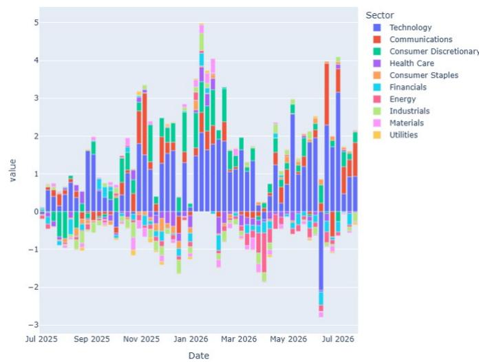  
来源：JPM股票策略与量化研究

图9：按主题划分的零售ETF活动
按主题汇总的ETF买入/卖出，单位十亿美元  
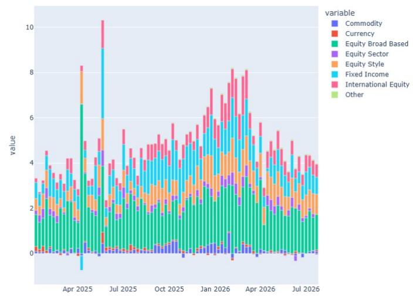  
来源：JPM股票策略与量化研究

## 零售活动活跃的个股故事

## 对冲基金 vs. 零售：高做空比例的MEME股

- KOPN（上周买入60万美元，0.4z，图12）：该公司最近在美国政府的工业基础分析与维持（IBAS）计划下，在其彩色MicroLED开发项目中达到了三个关键里程碑。自2026年5月以来，零售资金流增加，净购买总额达1400万美元，同时做空比例约为流通股的16%，同期上升6%。

- ONDS（上周买入1.342亿美元，4.3z，图13）：该公司从澳大利亚国防部获得了一份价值690万美元的DTIM Operator订单，推动股价上涨11.5%。自2026年1月以来，该股一直受到零售读者的关注，净流入总额达6亿美元，做空比例约为流通股的42%，同期上升20%。

- WYFI（上周买入120万美元，0.4z，图14）：该公司报告了其跨数据中心网络解决方案的初步研发测试结果，表明结果成功。自2026年5月下旬以来，零售读者购买了2000万美元，做空比例约为流通股的50%，同期上升15%。

## 财报故事

有关本财报季的更多详细信息，请参见大型科技公司与AI硬件。

- GOOGL（7月22日买入7470万美元，1.9z，图15）：谷歌今天下午公布财报，盘后下跌约4%。除了对2027年资本支出指引的炒作（市场预期2500亿美元，JPMe预期2900亿美元），关键指标是谷歌云的增长，该指标超出预期（报告增长82%，买方预期同比增长70-75%，市场预期64%）。今年的资本支出指引上调至1950-2050亿美元（此前为1800-1900亿美元）。

- TSLA（7月22日买入1.01亿美元，0.4z，图17）：特斯拉今天下午公布的财报不及预期，尽管电动汽车销售带来强劲收入增长，但受较低价格和监管信用影响。公告后该股在盘后交易中小幅下跌。

- SCHW（7月21日买入130万美元，0.5z，图19）：嘉信理财报告了稳健的第二季度业绩并上调了全年指引，得益于更好的营收和稳定的费用管理。尽管股价反应平淡表明近期预期更高，我们的分析师强调了支持下半年进一步增长的有利因素（链接）。

- SMCI（7月21日买入80万美元，0.1z，图21）：超微电脑发布了初步业绩，将其收入指引修订至此前区间的低端，但毛利率（指引上调7-9%）和订单方面出现积极惊喜。自公告以来该股上涨23%（链接）。

- 台积电：台积电第二季度财报好于预期，得益于强劲的运营杠杆（推动利润率首次超过60%），而收入和毛利率均处于指引区间上限。积极惊喜来自2026年收入指引上调（同比增长超过40%）和资本支出上调（2026年600-640亿美元，2027/28年也有显著上调），以及强劲的AI需求评论，表明AI需求趋势可能持续强劲至2029-30年。该股公告后面临一些压力，但此后已回升（链接）。

- UNH（7月16日卖出1170万美元，-0.5z，图23）：联合健康业绩超预期，指引大幅上调。所有四个业务线均超出预期。股价反应平淡（链接）。

- GE（7月16日买入440万美元，0.8z，图25）：市场对第二季度业绩的预期高于往常，GE Aerospace的股价尽管业绩良好且指引上调，但仍表现不佳。读者的关键问题是高利润的CES服务销售轨迹，近几个季度的超常增长引发了关于不可避免的减速形态和股价影响的讨论。利润率和现金流也是关注焦点（链接）。

- NFLX（7月16日买入2230万美元，0.3z，图27）：奈飞股价在财报后下跌约9%，市场担忧参与度、变现和内容支出回报。尽管如此，强劲的收入和利润增长仍在持续（链接）。

- ABT（7月16日卖出710万美元，-1.3z，图29）：雅培实验室报告的第二季度业绩好于预期，营收和利润均超预期，并上调了后者指引。该股在业绩超预期后上涨11%（链接）。

## 宏观与基本面故事

- 半导体股上周上涨约7%（标普500约为1%），此前自6月下旬高点以来下跌约20%。该板块的持仓状况有所改善，进入财报季时板块的战术性设置看起来更健康。在基本面方面，该板块预计将交出又一个稳健的季度业绩、建设性的第三季度评论以及更高的2027年预期，延续近期积极的盈利修正节奏。此外，我们的分析师认为，硅供应与需求之间的缺口可能在2027年变得更加严重，紧张状况应会延续到2028年（参见预览）。话虽如此，展望更远，我们认为该板块的波动可能持续，因为对国内外即将到来的竞争性AI权益供应、远期资本支出曲线的斜率、债务市场吸收这些资金的能力，以及潜在突破性效率和与AI基础设施市场供需平衡相关的终端利润率等更广泛问题的担忧仍然存在（参见报告）。零售活动在Sandisk（SNDK，上周卖出1.13亿美元，-1.1z，图31）上相对较高，而英伟达（NVDA，上周买入4.328亿美元，-0.2z，图33）在过去一周较为温和。

- SPCX（上周买入4.045亿美元，0.1z，图35）：SpaceX股价上周下跌5%，目前交易价格略低于其IPO水平。该公司将其星舰火箭的下一次飞行测试重新安排到明天（7月23日），此前上周（7月16日）遇到了一些发动机问题。虽然这将是第13次星舰发射，但这是V3配置的第二次发射，未来几年应会将Starlink和最终AI卫星部署到轨道，以及将宇航员送上月球（链接）。

## MEME战场：零售买入 vs. 对冲基金做空

在本节中，我们标记了一些在社交媒体上被广泛提及且零售买入量高、对冲基金做空量高的个股。这些股票在活动增加时可能会经历意外资金流。

## 社交媒体筛选与零售活动

图10：社交媒体上最受关注的股票  
基于本周社交媒体热度的前20名（社交兴趣），按市值调整

<table><tr><td>代码</td><td>名称</td><td>市值（十亿美元）</td><td>社交兴趣评分</td><td>中位做空比例（%流通股）</td><td>极端失衡1D Z</td><td>失衡日期</td></tr><tr><td>TE</td><td>T1 Energy Inc</td><td>1.7</td><td>35.0</td><td>21.3%</td><td>5.4</td><td>7月20日</td></tr><tr><td>SPXC</td><td>SPX Technologies Inc</td><td>10.9</td><td>32.8</td><td>2.1%</td><td>-1.7</td><td>7月20日</td></tr><tr><td>RKLB</td><td>Rocket Lab Corp</td><td>43.2</td><td>32.1</td><td>7.4%</td><td>1.2</td><td>7月16日</td></tr><tr><td>IBM</td><td>International Business Machines Corp</td><td>197.8</td><td>32.1</td><td>3.7%</td><td>-7.1</td><td>7月15日</td></tr><tr><td>NBIS</td><td>Nebius Group NV</td><td>55.1</td><td>31.2</td><td>30.3%</td><td>0.9</td><td>7月20日</td></tr><tr><td>MU</td><td>Micron Technology Inc</td><td>1096.4</td><td>30.9</td><td>2.7%</td><td>-3.0</td><td>7月16日</td></tr><tr><td>PCB</td><td>PCB Bancorp</td><td>0.4</td><td>29.4</td><td>1.8%</td><td>3.4</td><td>7月16日</td></tr><tr><td>ASTS</td><td>AST SpaceMobile Inc</td><td>24.6</td><td>29.2</td><td>37.6%</td><td>2.1</td><td>7月16日</td></tr><tr><td>SNDK</td><td>Sandisk Corp</td><td>235.4</td><td>28.3</td><td>4.9%</td><td>-2.1</td><td>7月17日</td></tr><tr><td>NFLX</td><td>Netflix Inc</td><td>285.9</td><td>28.2</td><td>2.5%</td><td>-1.9</td><td>7月17日</td></tr><tr><td>SBET</td><td>SHARPLINK INC</td><td>1.3</td><td>27.8</td><td>16.4%</td><td>0.2</td><td>7月17日</td></tr><tr><td>STX</td><td>Seagate Technology Holdings PLC</td><td>200.0</td><td>27.7</td><td>2.9%</td><td>4.8</td><td>7月17日</td></tr><tr><td>AMZN</td><td>Amazon.com Inc</td><td>2662.9</td><td>27.4</td><td>1.0%</td><td>1.4</td><td>7月16日</td></tr><tr><td>AMC</td><td>AMC Entertainment Holdings Inc</td><td>2.0</td><td>27.3</td><td>5.8%</td><td>-2.8</td><td>7月20日</td></tr><tr><td>MSTR</td><td>Strategy Inc</td><td>35.7</td><td>27.0</td><td>12.8%</td><td>-0.6</td><td>7月20日</td></tr><tr><td>AMD</td><td>Advanced Micro Devices Inc</td><td>887.7</td><td>25.9</td><td>2.6%</td><td>1.3</td><td>7月21日</td></tr><tr><td>CORZ</td><td>Core Scientific Inc</td><td>7.6</td><td>25.7</td><td>23.3%</td><td>1.2</td><td>7月21日</td></tr><tr><td>MSFT</td><td>Microsoft Corp</td><td>2954.7</td><td>25.5</td><td>1.2%</td><td>-0.2</td><td>7月16日</td></tr><tr><td>ASML</td><td>ASML Holding NV</td><td>699.3</td><td>25.3</td><td>0.3%</td><td>1.2</td><td>7月21日</td></tr><tr><td>HUT</td><td>Hut 8 Corp</td><td>13.4</td><td>25.0</td><td>12.4%</td><td>0.9</td><td>7月17日</td></tr></table>

来源：JPM股票策略与量化研究，S3 Partners

图11：MEME股中挤压风险增加：高做空比例个股中的零售买入  
正斜率 = 相反持仓（做空挤压或零售损失风险加剧）；负斜率 = 相似持仓（挤压风险消散）  
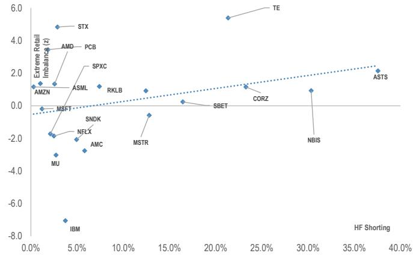  
来源：JPM股票策略与量化研究，S3 Partners

图12：KOPN零售活动  
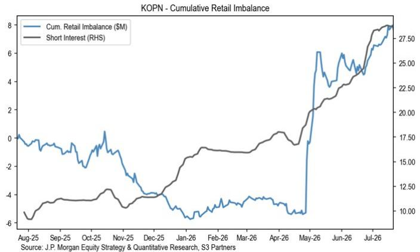  
来源：JPM股票策略与量化研究，S3 Partners

图13：ONDS零售活动  
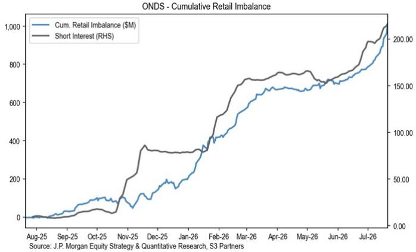  
来源：JPM股票策略与量化研究，S3 Partners

图14：WYFI零售活动  
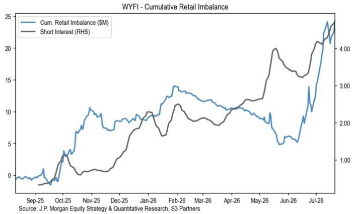  
来源：JPM股票策略与量化研究，S3 Partners

## 宏观与基本面故事

图17：TSLA零售失衡  
图15：GOOGL零售失衡
截至7月21日  
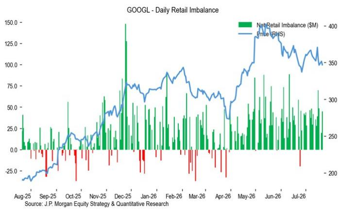  
来源：JPM股票策略与量化研究，S3 Partners

图16：GOOGL累计零售失衡
截至7月21日  
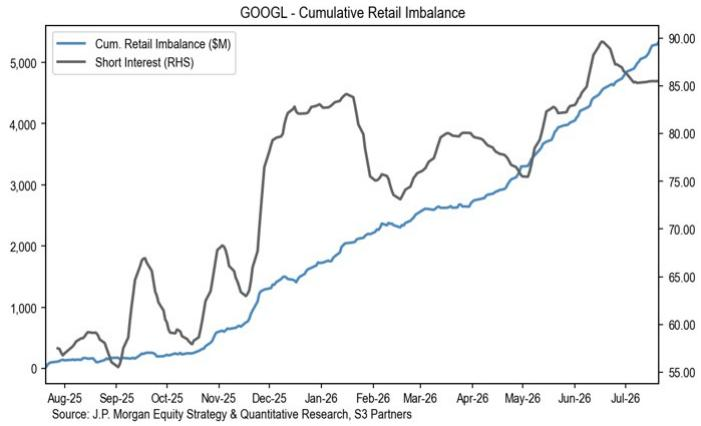  
来源：JPM股票策略与量化研究，S3 Partners

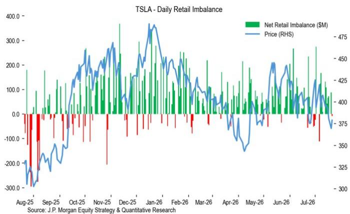  
来源：JPM股票策略与量化研究，S3 Partners

图18：TSLA累计零售失衡
截至7月21日  
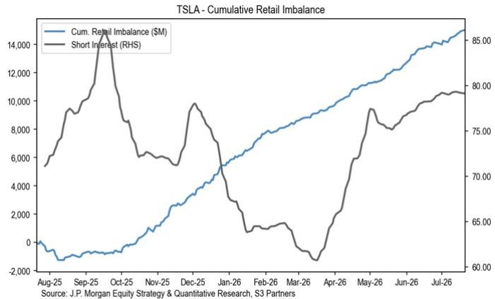  
来源：JPM股票策略与量化研究，S3 Partners

图19：SCHW零售失衡
截至7月21日  
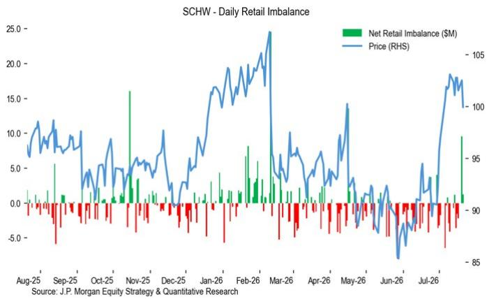  
来源：JPM股票策略与量化研究，S3 Partners

图20：SCHW累计零售失衡
截至7月21日  
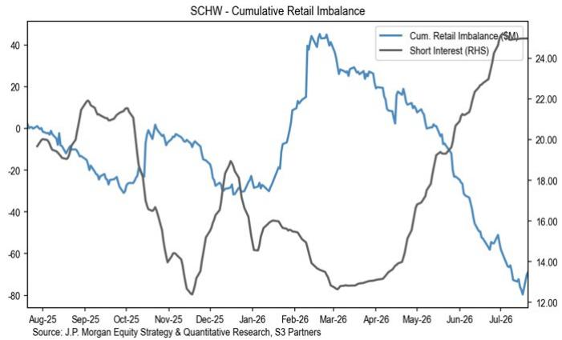  
来源：JPM股票策略与量化研究，S3 Partners

图21：SMCI零售失衡
截至7月22日  
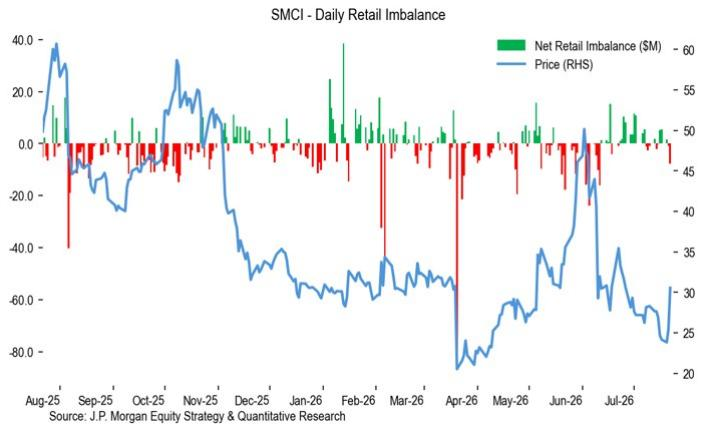  
来源：JPM股票策略与量化研究，S3 Partners

图22：SMCI累计零售失衡
截至7月22日  
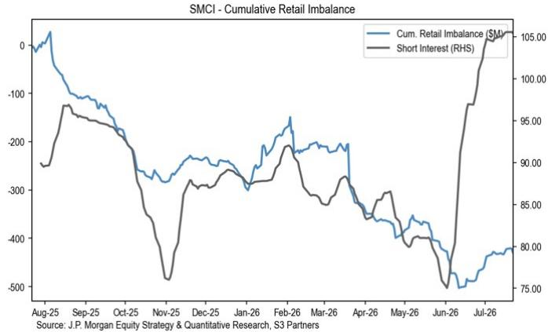  
来源：JPM股票策略与量化研究，S3 Partners

图23：UNH零售失衡  
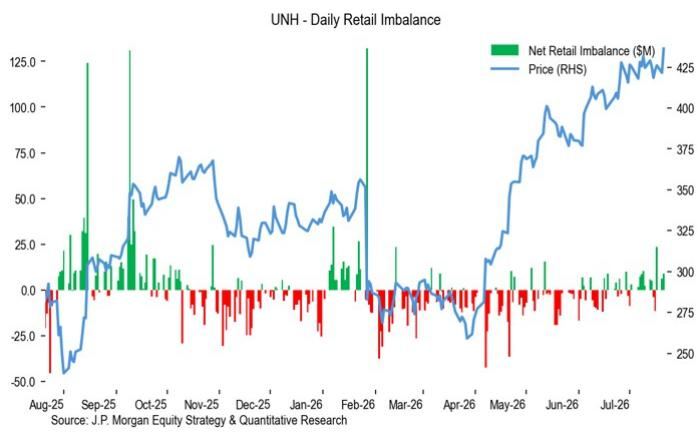  
来源：JPM股票策略与量化研究，S3 Partners

图24：UNH累计零售失衡
截至7月21日  
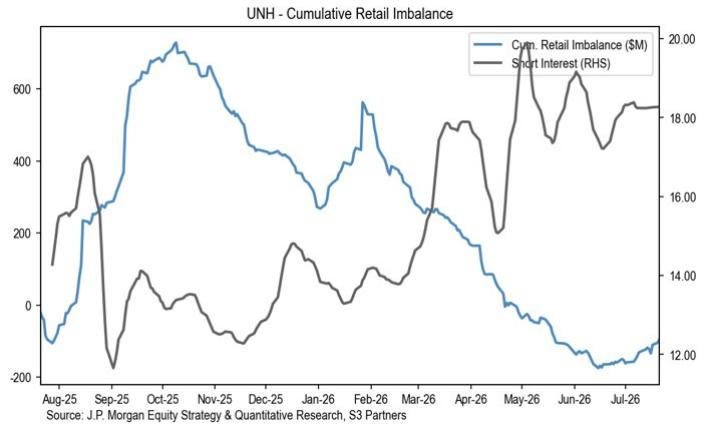  
来源：JPM股票策略与量化研究，S3 Partners

图25：GE零售失衡
截至7月21日  
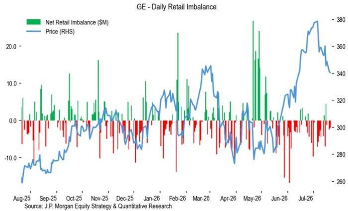  
来源：JPM股票策略与量化研究，S3 Partners

图26：GE累计零售失衡
截至7月21日  
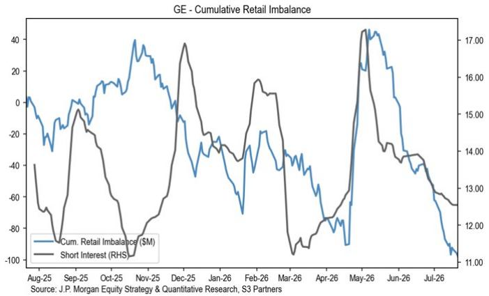  
来源：JPM股票策略与量化研究，S3 Partners

图27：NFLX零售失衡  
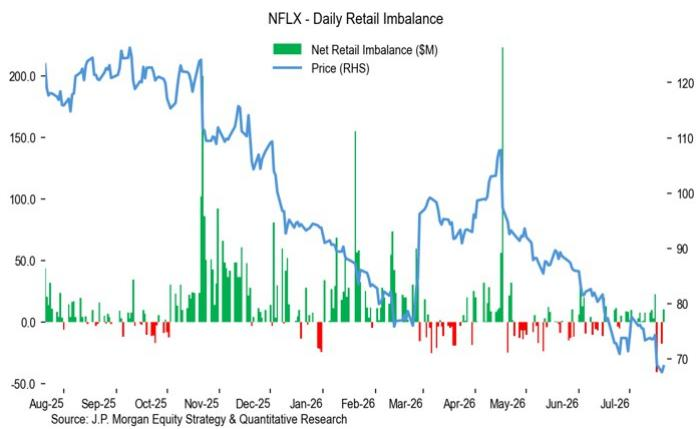  
来源：JPM股票策略与量化研究，S3 Partners

图28：NFLX累计零售失衡
截至7月21日  
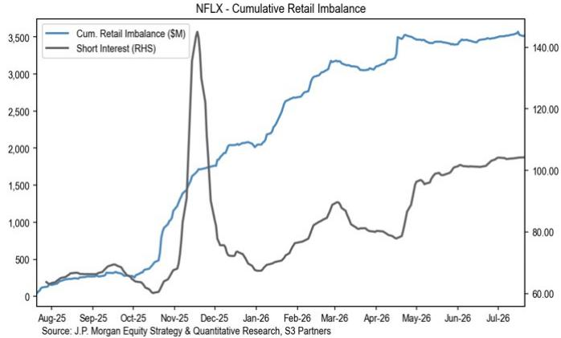  
来源：JPM股票策略与量化研究，S3 Partners

图29：ABT零售失衡  
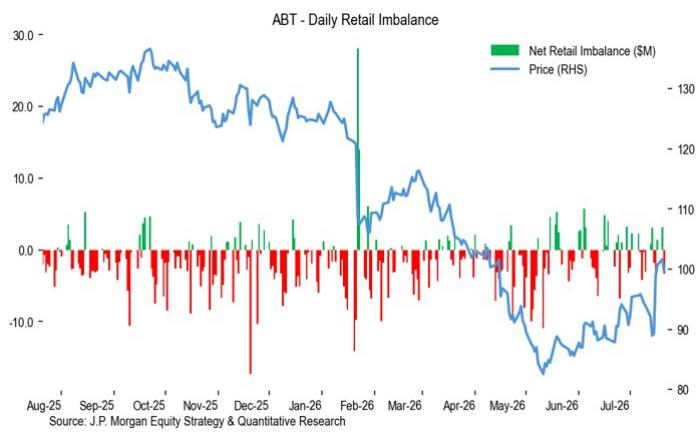  
来源：JPM股票策略与量化研究，S3 Partners

图30：ABT累计零售失衡
截至7月21日  
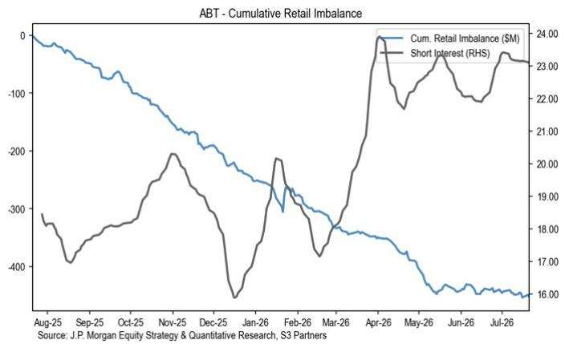  
来源：JPM股票策略与量化研究，S3 Partners

图31：SNDK零售失衡
截至7月21日  
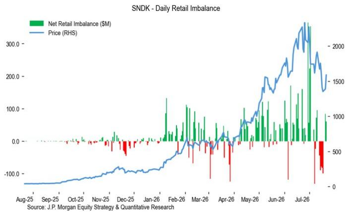  
来源：JPM股票策略与量化研究，S3 Partners

图32：SNDK累计零售失衡
截至7月21日  
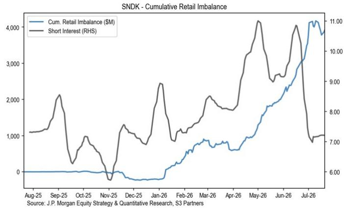  
来源：JPM股票策略与量化研究，S3 Partners

图33：NVDA零售失衡  
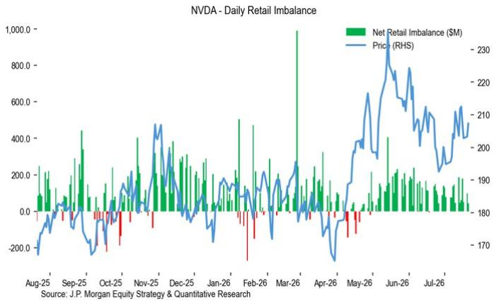  
来源：JPM股票策略与量化研究，S3 Partners

图34：NVDA累计零售失衡
截至7月21日  
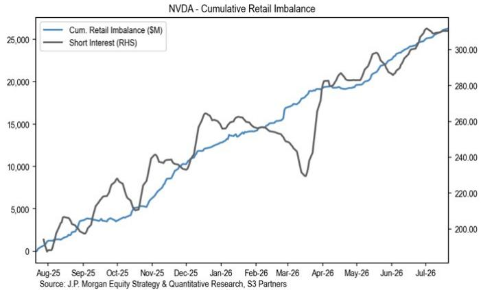  
来源：JPM股票策略与量化研究，S3 Partners

图35：SPCX零售失衡
截至7月21日  
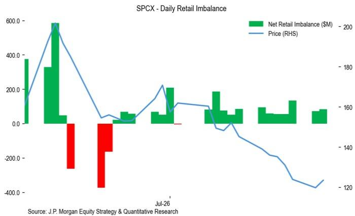  
来源：JPM股票策略与量化研究，S3 Partners

图36：SPCX累计零售失衡
截至7月21日  
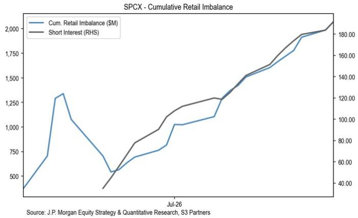  
来源：JPM股票策略与量化研究，S3 Partners

## 期权零售活动

图37：Delta买入最多的前40只权益（百万美元）  
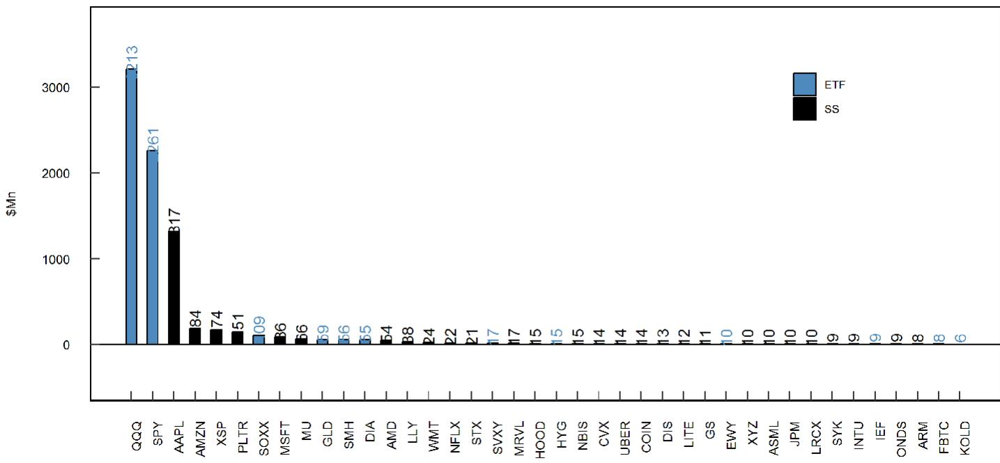

来源：JPM股票策略与量化研究  
图38：Delta卖出最多的前40只权益（百万美元）  
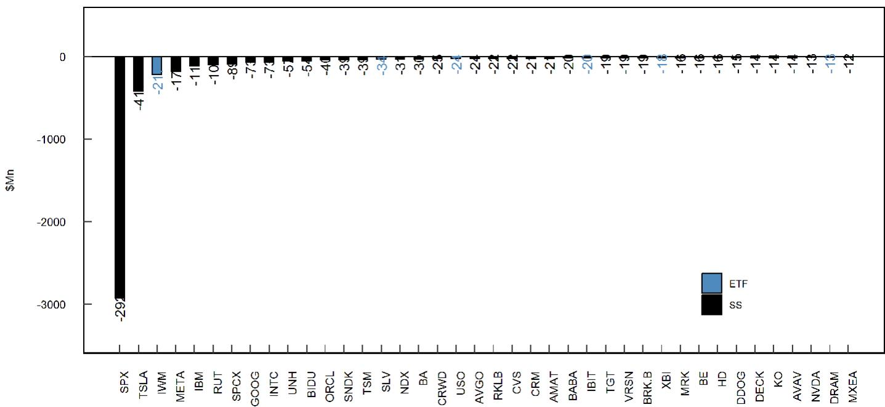

图39：Gamma买入最多的前40只权益（百万美元）  
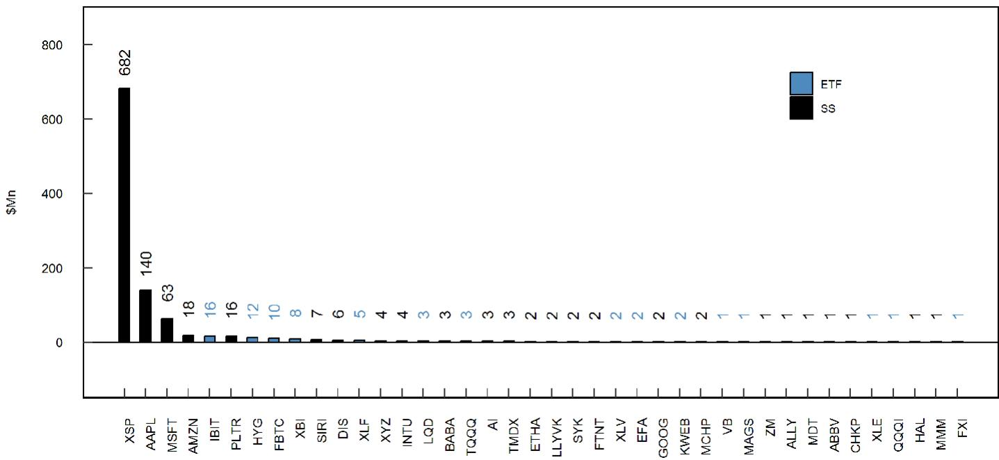

来源：JPM股票策略与量化研究  
图40：Gamma卖出最多的前40只权益（百万美元）  
![](images/0218b812130
