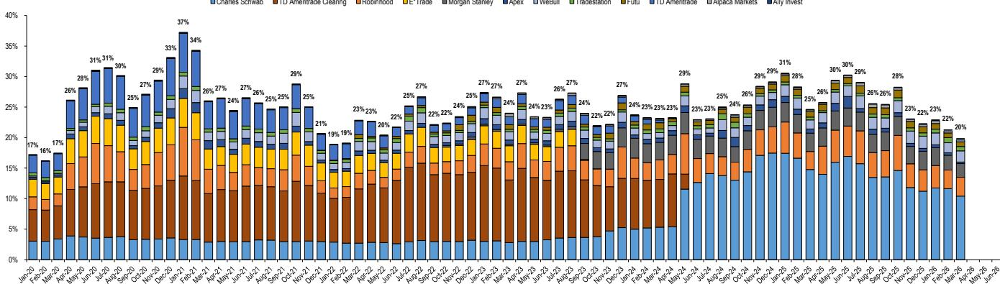
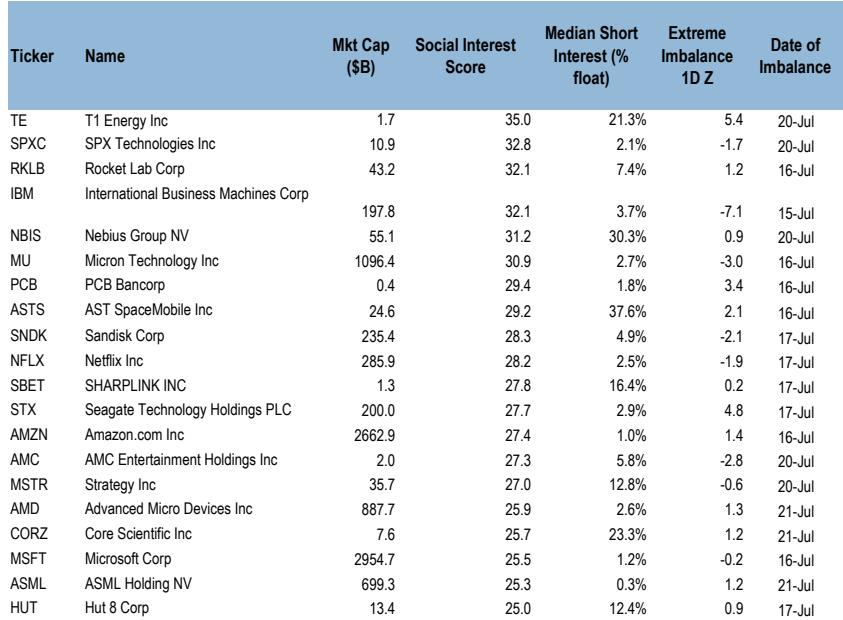
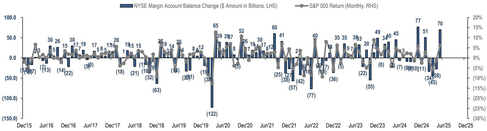

# JPM：零售行业数据与主题变化观察

7月16日至22日这一周，美国散户资金净流入57亿美元，低于12周均值68亿美元。整体参与度处于近一年第35百分位，与上周基本持平。但结构变化值得关注：ETF资金流入降至第4百分位，而公司交易活跃度升至第72百分位。这份JPM零售雷达周报的核心观察是，散户行为正在从被动配置转向主动交易，背后是动量因子极端拥挤后的剧烈回撤。

动量因子在过去一个月内回撤约14%，以标普500市值加权五分组的多空口径计算。回撤过程中出现了多次高幅度负向尾部事件，包括一次负6西格玛的交易日，以及18个交易日内7次负3西格玛或更差的观测值。报告指出，这种极端尾部事件的频率，与因子拥挤度处于历史高位有关。图2将本轮回撤与2025年2月至3月的动量回撤做了对比，显示当前回撤的幅度和速度均更为显著。

> **KC评论：** 动量因子的极端回撤并非孤立现象。报告中的图3展示了负向高西格玛事件的密集程度，这通常意味着市场定价机制在短期内失效，而非基本面驱动。对于关注量化策略或因子研究的读者，这是一个需要重新审视不确定性敞口的信号。

## 1. 科技ETF流入转负，半导体ETF遭集中卖出

ETF资金流出的广度在扩大。行业ETF资金尤其疲软，科技ETF流入已转为负值。本周卖出最多的ETF是SOXL（三倍做多半导体）和SMH（半导体ETF），两者均录得负1.6西格玛的异常流出。资金ETF在经历上周财报季后的资金涌入后，本周流入回落至持平。加密货币ETF则表现较强，BITO录得3.0西格玛的正向流入。

公司层面，通讯服务和科技板块主导了观点偏积极方向。前五大观点偏积极标的为SPCX（SpaceX相关）、NVDA、GOOGL/GOOG、TSLA和NU。Mag7内部出现分化：散户净观点偏积极NVDA 4.12亿美元、TSLA 3.19亿美元、MSFT 2.02亿美元、AMZN 1.77亿美元、META 0.21亿美元，但净观点偏谨慎AAPL 1.14亿美元。

## 2. 超大规模企业财报季：AI资本开支仍是核心变量

本周三，首批Mag7公司公布财报。报告引用了JPM盈利记分卡的观点：AI资本开支超级周期仍是超大规模企业财报季的主导主题，且偏向于上行。关键变量包括AI货币化和回报率，读者关注云、广告和企业端的货币化改善，以及代币定价动态、前沿模型竞争和更波动的宏观环境。

GOOGL财报后下跌约4%。市场关注的焦点并非2027年资本开支指引的传闻（市场预期2500亿美元，JPM预期2900亿美元），而是谷歌云业务的实际增长：同比增长82%，高于买方预期的70-75%和卖方预期的64%。2026年资本开支指引上调至1950-2050亿美元，此前为1800-1900亿美元。TSLA财报不及预期，尽管电动车销售收入强劲增长，但受到降价和监管积分的影响，盘后交易小幅下跌。

## 3. 半导体板块：短期技术面改善，但中期波动不确定性仍在

半导体板块在经历6月底高点以来约20%的下跌后，本周反弹约7%，跑赢标普500约1%的涨幅。报告认为，该板块的持仓状况已有所改善，技术面在财报季前显得更为健康。基本面方面，该板块预计将交出又一个稳健的季度，三季度展望积极，2027年预期上调。

但报告也提示了中期不确定性：波动可能持续，原因包括对国内外AI公司新增供应的担忧、远期资本开支曲线的斜率、债务市场吸收这些融资的能力，以及潜在的效率突破。更根本的问题是，AI基础设施市场的供需平衡将决定终端利润率的水平。散户对半导体公司的交易相对活跃：SNDK被净观点偏谨慎1.13亿美元，NVDA的观点偏积极则较为温和，为4.33亿美元。

## 4. 高做空比例公司：零售与对冲产品的博弈持续

报告持续跟踪社交媒体热度高、散户观点偏积极多且对冲产品做空比例高的公司。本周值得关注的案例包括：KOPN在美国政府IBAS计划下实现MicroLED开发里程碑，散户净观点偏积极1400万美元，做空比例约16%；ONDS获得澳大利亚国防部690万美元订单，散户净流入6亿美元，做空比例约42%；WYFI报告跨数据中心网络解决方案的初步测试结果，散户净观点偏积极2000万美元，做空比例约50%。

这些公司的共同特征是，散户资金流入与做空比例同步上升，形成潜在的轧空条件。但报告并未给出方向性判断，仅提示在活动增加的情况下可能出现意外资金流。

> **KC评论：** 高做空比例与散户观点偏积极并存，本质上是两股力量对定价权的争夺。报告中的图10至图14展示了这些公司的持仓变化和做空比例趋势，但读者需要区分基本面改善驱动的观点偏积极和纯粹的情绪博弈。后者在动量因子回撤的环境中，不确定性更为集中。

## 5. 期权市场：散户参与度处于高位

报告显示，散户在期权市场的参与度处于历史高位。本周交易最活跃的期权标的与过去几周一致：TSLA、MU、NVDA、AMZN、META、SNDK、AAPL、AMD、GOOGL/GOOG和MSFT。这些标的的集中度表明，散户的期权交易策略仍以科技和成长股为核心。

期货市场方面，非零售交易者本周净卖出约41亿美元，主要由纳斯达克100指数期货的83亿美元净卖出驱动，部分被标普500指数期货的23亿美元净买入和罗素2000指数期货的19亿美元净买入所抵消。期货与期权市场的资金流向差异，反映了不同读者群体对市场方向的判断分歧。

For informational purposes only. Portions may be generated,translated,summarized,or edited with AI assistance based on source materials and may contain omissions or errors. Please verify independently. This is not investment,legal,tax,accounting,or other professional advice.

For informational purposes only. Portions may be generated,translated,summarized,or edited with AI assistance based on source materials and may contain omissions or errors. Please verify independently. This is not investment,legal,tax,accounting,or other professional advice.

