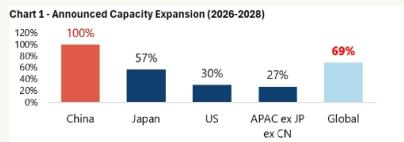
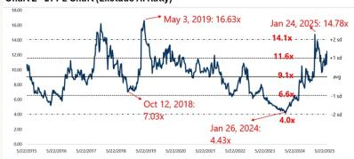
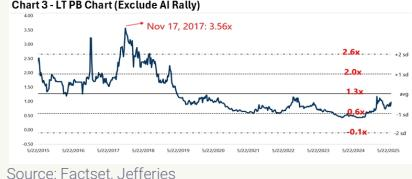
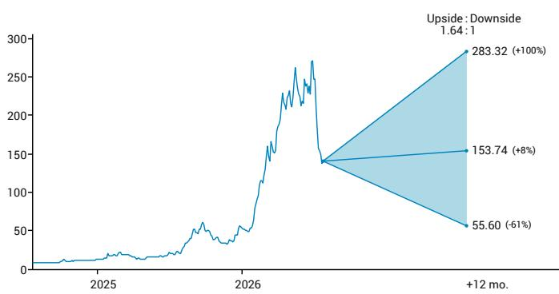

# 中国光纤供应增长将快速消除短缺；下调至持有

长飞光纤光缆（YOFC）过去12个月因AI驱动光纤及光模块需求增长，报价上涨约14倍。我们估算其光纤平均售价在2026年将增长203%至146元/芯公里，较2018年峰值高出约18%。其预制棒+光纤毛利率预计在2026年升至86%（2025年为48%）。但我们估算全球产能到2028年将扩大69%（中国产能弹性较高），且可能还有更多产能释放。因此，2026年平均售价可能成为峰值。我们的分部估值法显示上行空间有限。下调至持有。

AI和地缘因素推动了光纤需求。光纤是一种大宗商品。2025年，中国占全球预制棒产量/产能的56%/68%。全球需求因以下因素而启动：1）主要在美国的AI数据中心需求，以及2）无人机在相关地区的使用（可能在2027年减少）。2025年下半年，美国AI供应链面临显著的光纤短缺，因为西方光纤行业产能过去6年停滞不前，但美国不愿从中国采购。随着需求持续增长，我们认为美国企业将别无选择，只能开始从中国采购。长飞是全球最大的光纤制造商，产能份额为17%。我们的行业调研显示，谷歌已认证长飞的光纤，但采购可能并非直接进行。

平均售价和毛利率将飙升，但供应将在2027/28年显著增加，尤其是在中国。截至2024年，数据通信占光纤需求的10%（电信占80%）。我们估算数据通信在2026年将占需求的43%，2027年升至55%，意味着同比增长131%/65%。中国的供应过剩曾使长飞的光纤平均售价在2020年降至31元/芯公里。我们估算其逐步恢复至2025年的44元。我们的行业调研显示，2026年第二季度平均售价已升至100元以上，一些新的以数据中心为中心的光纤产品（如G657A1/A2）即使在长期协议中也可能超过150元/芯公里。由于单位生产成本没有实质性变化，我们估算长飞预制棒+光纤板块的毛利率将从2025年的48%升至2026年的86%。包括低利润率的线缆产品，长飞光纤业务的综合毛利率预计将从2025年的31%升至53%。鉴于高经营杠杆，我们预测今年每股收益同比增长10倍至11.44元，意味着当前2026年预期市盈率约为11倍。

显著的行业产能扩张可能使2026/27年利润成为周期性峰值。根据已公布的扩张计划和12-18个月的建设时间，我们估算全球产能从现在到2028年将增加69%，中国产能弹性较高。长飞是相对少见未讨论任何扩张计划的主要参与者。尽管我们认为这是一个审慎的决定，但长飞可能因此面临市场份额流失的风险。强劲需求也吸引了并购。领益智造（002600 CH，持有）宣布收购财务困难的预制棒+光纤制造商富通。我们估算全球产能将在2027/28年覆盖87%/85%的需求，表明平均售价可能在2026年见顶。我们的新目标价基于平均分部估值法，光纤业务以3.5倍市净率（2018年峰值）和14.1倍2027年预期市盈率（截至2025年中期高于长期均值2个标准差）的平均值估值，仅意味着9%的上行空间。下调至持有。

<table><tr><td>财年（12月）</td><td>2025A</td><td>2026E</td><td>2027E</td><td>2028E</td></tr><tr><td>收入（百万元）</td><td>14,252.0</td><td>27,944.0</td><td>29,353.0</td><td>26,283.0</td></tr><tr><td>毛利率（%）</td><td>30.7</td><td>52.6</td><td>54.2</td><td>50.5</td></tr><tr><td>净利润</td><td>814.0</td><td>8,702.0</td><td>9,052.0</td><td>6,948.0</td></tr><tr><td>一致预期每股收益</td><td>1.14</td><td>7.46</td><td>10.75</td><td>13.36</td></tr></table>

请参阅本报告第11-16页的分析师认证、重要披露信息以及非美国分析师身份信息。\* JEF香港有限公司

评级 | 目标价 | 预测调整

<table><tr><td>评级</td><td>↓持有（买入）</td></tr><tr><td>价格</td><td>142.00港元^</td></tr><tr><td>目标价 | 距目标价幅度</td><td>↑153.74港元（10.73港元）| +8%</td></tr><tr><td>52周高低</td><td>305.00港元 - 19.42港元</td></tr><tr><td>流通股比例（%）| 日均成交额（百万美元）</td><td>47.8% | 554.12</td></tr><tr><td>市值</td><td>1176亿港元 | 150亿美元</td></tr><tr><td>代码</td><td>6869 HK</td></tr></table>

^除非另有说明，为前一交易日收盘价。

<table><tr><td>财年（12月）</td><td colspan="3">较JEF预测变动</td><td colspan="2">JEF vs 一致预期</td></tr><tr><td></td><td>2026</td><td colspan="2">2027</td><td>2026</td><td>2027</td></tr><tr><td>收入</td><td>+98%</td><td colspan="2">不适用</td><td>+12%</td><td>-7%</td></tr><tr><td>每股收益</td><td>+838%</td><td colspan="2">不适用</td><td>+53%</td><td>+11%</td></tr><tr><td>2026（人民币）</td><td>Q1</td><td>Q2</td><td>Q3</td><td>Q4</td><td>全年</td></tr><tr><td>每股收益</td><td>--</td><td>--</td><td>--</td><td>--</td><td>↑11.44</td></tr><tr><td>前值</td><td></td><td></td><td></td><td></td><td>1.22</td></tr></table>

  
来源：公司数据，JEF

图2 - 长期市盈率图（剔除AI行情）  
  
来源：Factset，JEF

图3 - 长期市净率图（剔除AI行情）  
  
来源：Factset，JEF  
Edison Lee, CFA \* | 股票分析师
852 3743 8009 | edison.lee@JEF.com

Annie Ping, CFA, FRM \* | 股票助理 +852 3767 1273 | annie.ping@JEF.com

+852 3743 8750 | nick.cheng@JEF.com

Jacky He \* | 股票分析师
+852 3743 8084 | jacky.he@JEF.com

Matt Ma \* | 股票分析师
852 3767 1109 | matt.ma@JEF.com

## 长期观点：长飞光纤光缆

## 投资主题

- 中国电信/中国联通的省级招标价格约为80元/芯公里，反映了其按市场价支付的意愿。中国移动的招标结果应很快公布。
- 中国的5G资本支出在2021年达到峰值，下一个电信投资周期仍较遥远。未来的6G部署可能利用现有光纤网络，限制了电信资本支出对光纤的增量需求。
- AI需求正在推动短期价格上涨，但激进的行业产能扩张（尤其是在中国）可能限制上行空间，并最终在2027-28年之后对定价构成影响。
- 管理层在拓展出口销售和向光模块及有源光缆多元化方面做得不错。但其光模块业务是一家A股上市公司，读者可以单独参与。

风险/回报 - 12个月展望  

## 基准情景，

## 153.74港元，+8%

• 到2027年中国拥有420万个5G基站。

- 所有光纤光缆平均售价在2026年增长90%，但2028年后因产能扩张消除短缺而下降。
• 预制棒+光纤综合毛利率从2025年的47.5%升至2027年的85.5%，随后在2030年降至69.4%。
- 2026-2030年出口销售占总收入超过50%。
- 目标价153.74港元基于分部估值法，光纤业务目标价基于14.1倍27年预期市盈率和3.56倍28年预期市净率的平均值，加上EverProX每股9.52港元，多元化业务每股3.17港元。目标价隐含11.2倍/14.5倍2027年/2028年预期市盈率。

## 上行情景，283.32港元，+100%

• 我们预期相同的5G基站和骨干传输建设。

- 所有光纤光缆平均售价在2026年增长94%，但2028年后因产能扩张消除短缺而下降。
• 预制棒+光纤综合毛利率从2025年的47.5%升至2027年的89.9%，随后在2030年降至83.0%。
- 目标价283.32港元基于分部估值法，光纤业务目标价基于15.0倍27年预期市盈率和5.00倍28年预期市净率的平均值，加上EverProX每股19.02港元，多元化业务每股3.17港元。目标价隐含13.5倍/16.0倍2027年/2028年预期市盈率。

## 下行情景，55.6港元，-61%

• 我们预期相同的5G基站和骨干传输建设。

- 所有光纤光缆平均售价在2026年增长58%，但2027年后因产能扩张消除短缺而下降。
• 预制棒+光纤综合毛利率从2025年的47.5%升至2026年的77.9%，随后在2030年降至54.2%。
- 目标价55.60港元基于分部估值法，光纤业务目标价基于14.1倍27年预期市盈率和3.56倍28年预期市净率的平均值，加上EverProX每股8.15港元，多元化业务每股3.17港元。目标价隐含10.3倍2027年预期市盈率。

## 可持续发展事项

## 关键议题：

1）应对气候变化，加强环境合规，构建可持续供应链。2）推动下一代光通信技术创新，同时保持产品质量和数据安全。

## 关键ESG目标：

1）到2028年将温室气体排放强度降低50%（以2021年为基准），到2055年实现碳中和。2）保持废水、废气和废物排放100%合规，同时提高能源效率和可再生能源使用。3）加强信息安全、业务连续性和全球合规管理，同时实现100%供应商企业社会责任和诚信承诺覆盖。

## 对管理层的关键问题：

1）长飞建立了怎样的合规体系以满足海外国家的监管要求？2）长飞在脱碳目标方面进展如何？3）长飞在其AI-2030战略下的关键研发重点是什么，这些将如何支持长期增长和竞争力？

## 催化剂

## 正面：

- 碳化硅、有源光缆、光模块、海底电缆和电信工程收入增长高于预期。
- 国内云服务提供商光纤招标价格可行。
• 光纤价格增长高于预期。

## 负面：

- 更多光纤产能扩张公告。
- 产能扩张快于预期。
- 新电信招标价格低于预期。

表1 - 已公布的产能扩张（2026-2028年）

<table><tr><td>参与者</td><td>产能变动（吨）</td></tr><tr><td>中国</td><td>14,700</td></tr><tr><td>富通（被领益智造收购）</td><td>500</td></tr><tr><td>中天科技</td><td>850</td></tr><tr><td>烽火通信</td><td>1,200</td></tr><tr><td>亨通光电</td><td>1,500</td></tr><tr><td>永鼎股份</td><td>600</td></tr><tr><td>通鼎互联</td><td>1,250</td></tr><tr><td>杭州电缆</td><td>1,200</td></tr><tr><td>远东电缆</td><td>1,800</td></tr><tr><td>青海中利</td><td>300</td></tr><tr><td>SDGI</td><td>300</td></tr><tr><td>大族激光*</td><td>2,000</td></tr><tr><td>合盛硅业*</td><td>3,200</td></tr><tr><td>日本</td><td>3,200</td></tr><tr><td>藤仓</td><td>1,300</td></tr><tr><td>古河</td><td>1,900</td></tr><tr><td>美国</td><td>1,500</td></tr><tr><td>康宁</td><td>1,500</td></tr><tr><td>全球总计</td><td>19,400</td></tr></table>

来源：公司数据，JEF \*新进入者

表2 - 长飞估值表（@142.00港元）

<table><tr><td>12月31日，百万元人民币</td><td>2024A</td><td>2025A</td><td>2026E</td><td>2027E</td><td>2028E</td><td>2029E</td><td>2030E</td><td>2031E</td><td>2032E</td></tr><tr><td>收入</td><td>12,197</td><td>14,252</td><td>27,944</td><td>29,353</td><td>26,283</td><td>22,904</td><td>20,429</td><td>19,780</td><td>19,248</td></tr><tr><td>同比</td><td>-9%</td><td>17%</td><td>96%</td><td>5%</td><td>-10%</td><td>-13%</td><td>-11%</td><td>-3%</td><td>-3%</td></tr><tr><td>vs 一致预期</td><td></td><td></td><td>12.0%</td><td>-7.0%</td><td>-31.3%</td><td></td><td></td><td></td><td></td></tr><tr><td>调整后EBITDA</td><td>1,726</td><td>2,717</td><td>12,123</td><td>13,054</td><td>10,388</td><td>7,755</td><td>5,639</td><td>4,656</td><td>3,688</td></tr><tr><td>同比</td><td>3%</td><td>57%</td><td>346%</td><td>8%</td><td>-20%</td><td>-25%</td><td>-27%</td><td>-17%</td><td>-21%</td></tr><tr><td>vs 一致预期</td><td></td><td></td><td>41.7%</td><td>5.0%</td><td>-27.3%</td><td></td><td></td><td></td><td></td></tr><tr><td>净利润（归母）</td><td>676</td><td>814</td><td>8,702</td><td>9,052</td><td>6,948</td><td>4,710</td><td>2,912</td><td>2,150</td><td>1,408</td></tr><tr><td>同比</td><td>-48%</td><td>20%</td><td>969%</td><td>4%</td><td>-23%</td><td>-32%</td><td>-38%</td><td>-26%</td><td>-35%</td></tr><tr><td>vs 一致预期</td><td></td><td></td><td>41.2%</td><td>2.0%</td><td>-37.0%</td><td></td><td></td><td></td><td></td></tr><tr><td>每股收益（人民币）</td><td>0.89</td><td>1.07</td><td>11.44</td><td>11.90</td><td>9.14</td><td>6.19</td><td>3.83</td><td>2.83</td><td>1.85</td></tr><tr><td>同比</td><td>-48%</td><td>20%</td><td>969%</td><td>4%</td><td>-23%</td><td>-32%</td><td>-38%</td><td>-26%</td><td>-35%</td></tr><tr><td>vs 一致预期</td><td></td><td></td><td>53.4%</td><td>10.7%</td><td>-31.6%</td><td></td><td></td><td></td><td></td></tr><tr><td>EV/EBITDA 倍</td><td>60.4</td><td>38.4</td><td>8.6</td><td>8.0</td><td>10.0</td><td>13.4</td><td>18.5</td><td>22.4</td><td>28.3</td></tr><tr><td>市盈率 倍</td><td>137.1</td><td>114.6</td><td>10.7</td><td>10.3</td><td>13.4</td><td>19.8</td><td>32.0</td><td>43.4</td><td>66.2</td></tr><tr><td>调整后市盈率 倍</td><td>135.1</td><td>112.9</td><td>10.6</td><td>10.1</td><td>13.2</td><td>19.5</td><td>31.5</td><td>42.7</td><td>65.2</td></tr><tr><td>市净率 倍</td><td>8.0</td><td>6.8</td><td>4.7</td><td>3.6</td><td>3.1</td><td>2.8</td><td>2.6</td><td>2.5</td><td>2.5</td></tr><tr><td>自由现金流回报表现（对市值）</td><td>0.4%</td><td>2.1%</td><td>3.0%</td><td>9.1%</td><td>8.7%</td><td>6.3%</td><td>4.7%</td><td>3.2%</td><td>7.5%</td></tr><tr><td>股息回报表现</td><td>0.2%</td><td>0.2%</td><td>2.8%</td><td>2.9%</td><td>2.2%</td><td>1.5%</td><td>0.9%</td><td>0.7%</td><td>0.5%</td></tr><tr><td>EV/IC</td><td>5.5</td><td>5.5</td><td>4.4</td><td>4.2</td><td>4.3</td><td>4.4</td><td>4.6</td><td>4.8</td><td>7.4</td></tr><tr><td>ROAE</td><td>4.5%</td><td>4.9%</td><td>42.0%</td><td>33.8%</td><td>21.6%</td><td>13.0%</td><td>7.5%</td><td>5.3%</td><td>3.4%</td></tr><tr><td>ROIC</td><td>5.1%</td><td>6.9%</td><td>45.9%</td><td>43.2%</td><td>35.3%</td><td>26.6%</td><td>18.9%</td><td>15.7%</td><td>14.3%</td></tr></table>

来源：公司，Factset，JEF

<table><tr><td colspan="2">市净率</td></tr><tr><td colspan="2">光纤 - 总计</td></tr><tr><td>28E 市净率 倍</td><td>3.56倍</td></tr><tr><td>光纤账面价值（百万元人民币）</td><td>29,061</td></tr><tr><td>光纤股权价值</td><td>103,456</td></tr><tr><td>光纤目标价</td><td>124.96</td></tr><tr><td colspan="2">市盈率</td></tr><tr><td colspan="2">光纤 - 总计</td></tr><tr><td>27E 市盈率 倍</td><td>14.1倍</td></tr><tr><td>光纤每股收益</td><td>9.37</td></tr><tr><td>光纤目标价</td><td>132</td></tr><tr><td>光纤目标价</td><td>132.13</td></tr><tr><td colspan="2">光纤</td></tr><tr><td>光纤平均目标价（人民币）</td><td>121.78</td></tr><tr><td colspan="2">EverproX（300548 CH）</td></tr><tr><td>长飞在EverproX的持股</td><td>19.03%</td></tr><tr><td>控股公司折价</td><td>19.03%</td></tr><tr><td>每股股权价值（人民币）</td><td>8.22</td></tr><tr><td colspan="2">多元化业务</td></tr><tr><td>每股股权价值（人民币）</td><td>2.74</td></tr><tr><td>SOTP目标价（人民币）</td><td>132.73</td></tr><tr><td>SOTP目标价（港元）</td><td>153.74</td></tr><tr><td>上行（下行）空间</td><td>8.3%</td></tr></table>

来源：公司，JEF

<table><tr><td></td><td>2026E</td><td>2027E</td><td>2028E</td><td>2029E</td><td>2030E</td><td>2031E</td><td>2032E</td></tr><tr><td colspan="8">利润表假设</td></tr><tr><td colspan="8">产能</td></tr><tr><td>预制棒（吨）</td><td>4,000</td><td>4,000</td><td>4,000</td><td>4,000</td><td>4,000</td><td>4,000</td><td>4,000</td></tr><tr><td>前值</td><td>4,000</td><td>4,000</td><td>4,000</td><td>4,000</td><td>4,000</td><td>4,000</td><td>4,000</td></tr><tr><td>光纤（百万芯公里）</td><td>81</td><td>81</td><td>81</td><td>81</td><td>81</td><td>81</td><td>81</td></tr><tr><td>前值</td><td>81</td><td>81</td><td>81</td><td>81</td><td>81</td><td>81</td><td>81</td></tr><tr><td>光缆（百万芯公里）</td><td>23</td><td>23</td><td>23</td><td>23</td><td>23</td><td>23</td><td>23</td></tr><tr><td>前值</td><td>23</td><td>23</td><td>23</td><td>23</td><td>23</td><td>23</td><td>23</td></tr><tr><td colspan="8">产能利用率</td></tr><tr><td>光纤预制棒</td><td>96%</td><td>99%</td><td>95%</td><td>95%</td><td>95%</td><td>95%</td><td>95%</td></tr><tr><td>前值</td><td>95%</td><td>95%</td><td>95%</td><td>95%</td><td>95%</td><td>95%</td><td>95%</td></tr><tr><td>光纤</td><td>95%</td><td>95%</td><td>95%</td><td>95%</td><td>95%</td><td>95%</td><td>95%</td></tr><tr><td>前值</td><td>95%</td><td>95%</td><td>95%</td><td>95%</td><td>95%</td><td>95%</td><td>95%</td></tr><tr><td>光缆</td><td>99%</td><td>99%</td><td>99%</td><td>99%</td><td>99%</td><td>99%</td><td>99%</td></tr><tr><td>前值</td><td>99%</td><td>99%</td><td>99%</td><td>99%</td><td>99%</td><td>99%</td><td>99%</td></tr><tr><td colspan="8">销量（百万芯公里）</td></tr><tr><td>光纤预制棒</td><td>23.7</td><td>24.5</td><td>22.1</td><td>22.1</td><td>22.1</td><td>22.1</td><td>22.1</td></tr><tr><td>前值</td><td>41.9</td><td>42.8</td><td>44.2</td><td>42.4</td><td>40.7</td><td>39.5</td><td>40.7</td></tr><tr><td>光纤 - 自产</td><td>70.0</td><td>72.0</td><td>72.0</td><td>72.0</td><td>72.0</td><td>72.0</td><td>72.0</td></tr><tr><td>前值</td><td>39.0</td><td>40.0</td><td>40.0</td><td>43.0</td><td>46.0</td><td>48.0</td><td>46.0</td></tr><tr><td>光纤 - 转售</td><td>0.0</td><td>0.0</td><td>0.0</td><td>0.0</td><td>0.0</td><td>0.0</td><td>0.0</td></tr><tr><td>前值</td><td>0.0</td><td>0.0</td><td>0.0</td><td>0.0</td><td>0.0</td><td>0.0</td><td>0.0</td></tr><tr><td>光纤 - 总计</td><td>70.0</td><td>72.0</td><td>72.0</td><td>72.0</td><td>72.0</td><td>72.0</td><td>72.0</td></tr><tr><td>前值</td><td>39.0</td><td>40.0</td><td>40.0</td><td>43.0</td><td>46.0</td><td>48.0</td><td>46.0</td></tr><tr><td>光缆 - 自产</td><td>22.8</td><td>22.8</td><td>22.8</td><td>22.8</td><td>22.8</td><td>22.8</td><td>22.8</td></tr><tr><td>前值</td><td>22.8</td><td>22.8</td><td>22.8</td><td>22.8</td><td>22.8</td><td>22.8</td><td>22.8</td></tr><tr><td>光缆 - 转售</td><td>39.2</td><td>37.2</td><td>37.2</td><td>37.2</td><td>37.2</td><td>37.2</td><td>37.2</td></tr><tr><td>前值</td><td>47.2</td><td>48.2</td><td>48.2</td><td>50.2</td><td>52.2</td><td>57.2</td><td>55.2</td></tr><tr><td>光缆 - 总计</td><td>62.0</td><td>60.0</td><td>60.0</td><td>60.0</td><td>60.0</td><td>60.0</td><td>60.0</td></tr><tr><td>前值</td><td>70.0</td><td>71.0</td><td>71.0</td><td>73.0</td><td>75.0</td><td>80.0</td><td>78.0</td></tr><tr><td colspan="8">国内平均售价</td></tr><tr><td>光纤预制棒（元/芯公里；1吨=30,000芯公里）</td><td>89.3</td><td>91.5</td><td>77.6</td><td>65.3</td><td>52.7</td><td>51.5</td><td>51.5</td></tr><tr><td>前值</td><td>42.0</td><td>43.3</td><td>44.7</td><td>46.7</td><td>48.9</td><td>50.2</td><td>49.6</td></tr><tr><td>光纤（元/芯公里）</td><td>104.9</td><td>107.4</td><td>91.2</td><td>76.7</td><td>61.9</td><td>60.5</td><td>60.5</td></tr><tr><td>前值</td><td>49.3</td><td>50.9</td><td>52.5</td><td>54.8</td><td>57.4</td><td>59.0</td><td>58.2</td></tr><tr><td>光缆（元/芯公里）</td><td>128.7</td><td>131.4</td><td>109.0</td><td>88.3</td><td>71.7</td><td>70.0</td><td>70.0</td></tr><tr><td>前值</td><td>73.1</td><td>74.0</td><td>75.0</td><td>76.7</td><td>79.5</td><td>81.2</td><td>80.3</td></tr><tr><td colspan="8">出口平均售价</td></tr><tr><td>光纤预制棒（元/公斤）</td><td>2,678.0</td><td>2,743.6</td><td>2,329.4</td><td>1,958.0</td><td>1,580.0</td><td>1,544.7</td><td>1,544.7</td></tr><tr><td>前值</td><td>1,260.3</td><td>1,299.0</td><td>1,340.5</td><td>1,399.9</td><td>1,466.3</td><td>1,507.1</td><td>1,486.9</td></tr><tr><td>光纤（元/芯公里）</td><td>160.0</td><td>150.0</td><td>120.0</td><td>95.0</td><td>75.0</td><td>65.0</td><td>55.0</td></tr><tr><td>前值</td><td>40.0</td><td>41.0</td><td>41.0</td><td>41.0</td><td>43.0</td><td>45.0</td><td>47.0</td></tr><tr><td>光缆（元/芯公里）</td><td>135.4</td><td>142.1</td><td>116.0</td><td>95.0</td><td>80.0</td><td>80.0</td><td>80.0</td></tr><tr><td>前值</td><td>73.0</td><td>74.0</td><td>75.0</td><td>77.0</td><td>80.0</td><td>82.0</td><td>81.0</td></tr><tr><td colspan="8">单位销售
