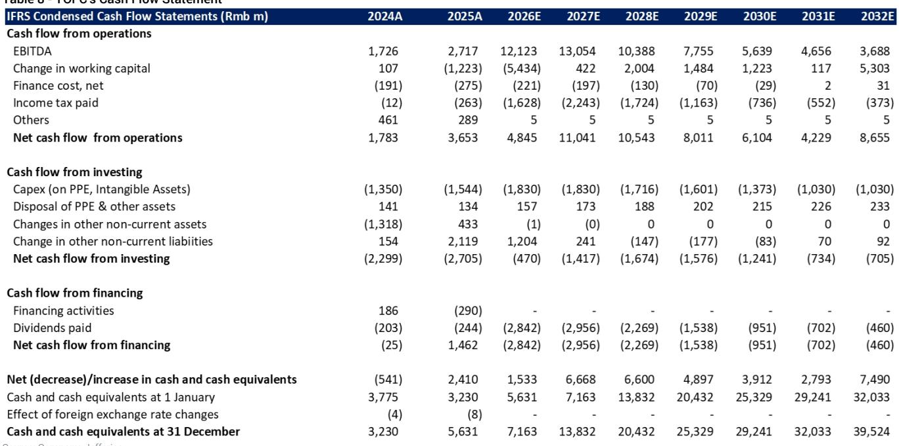
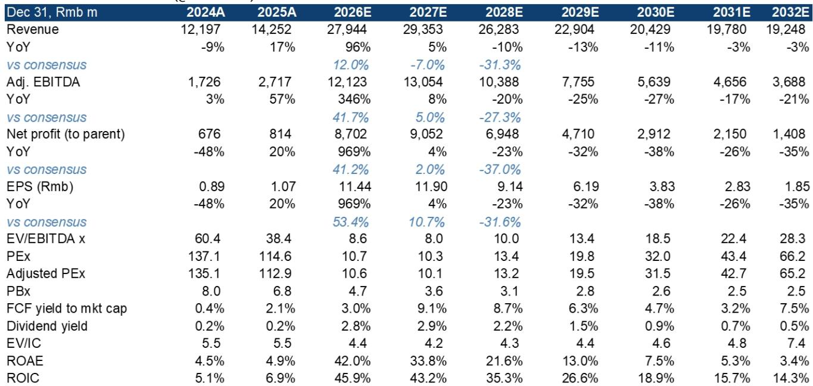
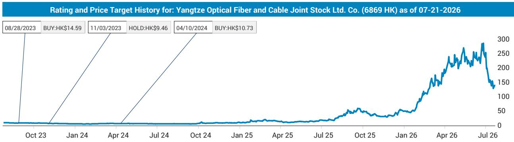

# 光纤超周期将在2026年见顶，而非2028年——产能纪律而非需求将决定赢家

全球最大的光纤制造商在12个月内上涨约14倍。这一上涨并非毫无根据。结构性需求转变——AI数据中心和无人机作战——将光纤从大宗商品的沉睡中拉出，进入由短缺驱动的定价上升期。到2026年，光纤平均售价预计将达到每纤芯公里146元人民币，较2025年水平增长203%，比2018年的前一个周期峰值高出18%。预制棒和光纤合计毛利率预计将从2025年的48%升至2026年的86%。每股收益预计将同比增长10倍，达到11.44元人民币。

但这并非结构性增长故事的开始，而是周期性高峰。推动价格上涨的相同力量——中国供应集中、美国不愿从中国采购，以及数据中心需求的突然激增——正在引发全行业产能扩张，将在24个月内消除短缺。根据已公布的扩张计划，到2028年全球预制棒产能将增长69%，其中中国产能将翻番。占据全球产能17%的领先制造商是相对少见尚未宣布扩张的主要参与者。这一纪律将保护其资产负债表，但可能会使其失去市场份额。该股目前交易于2026年预估收益的11倍，分部加总估值仅暗示9%的上行空间。研究案例已从“关注短缺”转向“关注并监测供应响应”。

将此事视为结构性AI基础设施故事的观察者，有可能将24个月的价格飙升误认为是永久性的利润率转变。关键问题不在于2026年价格能涨多高，而在于2027年和2028年产能将以多快的速度到来——以及哪些参与者有战略清晰度来管理即将到来的下行周期。

## AI与军事冲突创造了西方产能无法满足的需求激增

光纤是一种大宗商品。直到2024年，数据中心仅占全球光纤需求的10%，电信占80%。这一比例即将逆转。到2026年，数据中心需求预计将占光纤总消费量的43%，到2027年升至55%。这意味着2026年同比增长131%，2027年增长65%。催化剂并非投机性的。美国超大规模企业正在以行业前所未有的规模建设AI数据中心集群，需要互联和内部连接光纤。

与此同时，乌克兰和中东的军事冲突通过无人机操作创造了平行的需求渠道，无人机依赖光纤进行实时数据传输。如果地缘政治条件发生变化，这一需求可能在2027年下降，但目前它为一个已经紧张的市场增加了一个非可自由支配的层面。

供应方面是紧张局势变得尖锐的地方。西方光纤产能已停滞六年。美国买家在2025年下半年面临严重短缺，由于地缘政治和贸易限制，不愿从中国制造商采购。但需求增长快于政治约束所能应对的速度。行业调查表明，一家美国超大规模企业已认证了最大中国光纤制造商的产品，即使采购并非直接进行。其含义很明确：美国AI供应链将需要从中国采购，因为没有其他地区能在所需时间框架内填补缺口。这不是一个选择，而是由产能数据驱动的结构性必然。

## 价格上涨是真实的，但它是24个月的窗口，而非新的平台期

要理解为何此周期不同于以往的光纤繁荣，必须审视价格变动的幅度。2020年，中国供应过剩将光纤平均售价推低至每纤芯公里31元人民币。到2025年，价格已逐步回升至44元人民币。行业调查现在表明，2026年第二季度平均售价已超过100元人民币，而新的数据中心中心光纤产品如G657A1和G657A2即使在长期协议中也能获得每纤芯公里150元人民币以上的价格。

单位生产成本没有实质性变化。因此，预制棒和光纤合计毛利率预计将从2025年的48%升至2026年的86%。即使计入利润率较低的电缆产品，光纤业务的综合毛利率预计也将从31%升至53%。运营杠杆放大了这一效应：固定成本分摊到更高的收入基础上，每股收益预计将从2025年的1.14元人民币跃升至2026年的11.44元人民币——增长10倍。

这些数字并非夸大。它们反映了一个大宗商品行业在供应无法在数月内响应时的真实短缺。但它们也包含了自身逆转的种子。目前超过100元人民币的平均售价已经高于新产能的重置成本。每个光纤制造商和每个新进入者都能看到同样的数据。响应已经在进行中。

## 已宣布的产能扩张将在2028年前将短缺转为过剩

该报告识别出2026-2028年期间宣布的19,400吨新预制棒产能。仅中国就占其中的14,700吨，有效地使该国当前产能翻番。名单包括老牌企业——中天科技、烽火通信、亨通光电、长飞光纤、通鼎互联——以及两家新进入者：一家激光设备制造商和一家硅材料公司，各增加数千吨。日本的两家主要光纤制造商合计增加3,200吨，康宁在美国增加1,500吨。

关键细节在于时间安排。预制棒产能需要12至18个月才能建成。2025年和2026年初宣布的产能将在2027年和2028年上线。到2027年，全球产能预计将覆盖87%的需求；到2028年，覆盖85%。这并非过剩，但已足够接近以消除生产商今天享有的定价权。当大宗商品行业的产能利用率降至90%以下时，定价纪律通常会崩溃。

全球最大的光纤制造商尚未宣布任何扩张计划。一方面，这是一个有纪律的决定，保护了投入资本回报率，并避免了建设三年后将利用率不足的产能的风险。另一方面，这意味着随着竞争对手增加产能，该公司将失去市场份额。在大宗商品周期中，短缺期间失去的市场份额在过剩期间很难夺回，因为在紧张时期被迫认证替代供应商的客户很少会完全回归。

这种动态造成了战略紧张。有纪律的参与者保存资本并避免了下行周期的最坏情况。但它也放弃了当需求在更高基础上稳定时作为现有供应商的上行空间。此周期的赢家不会是最大化2026年利润的公司，而是能够在从短缺到过剩的过渡中管理好资产负债表和客户关系的公司。

## 决策框架：如何为光纤周期定位

对于评估该行业敞口的观察者和策略师，以下框架捕捉了周期的三个阶段以及每个阶段的适当姿态。

第一阶段，即将结束，是发现阶段。市场认识到AI需求将导致光纤消费的结构性增长，但供应受限。正确的回应是关注最大、最高效且对平均售价提升敞口最大的生产商。该阶段推动了14倍的上涨。

第二阶段，即当前时期，是收益峰值阶段。平均售价处于或接近周期高点，利润率迅速扩大，收益激增。诱惑是将这些收益永久化。正确的回应是认识到峰值收益是持有周期性大宗商品股票最危险的时期，因为市场开始贴现不可避免的正常化。该报告的分部加总估值仅暗示当前水平有9%的上行空间，评级已从关注下调至关注。这不是对公司的看空判断，而是对风险回报已发生转变的认知。

第三阶段，将于2026年末或2027年初开始，是正常化阶段。新产能将上线，平均售价将开始下降，利润率将压缩。正确的回应是转向成本结构最低、资产负债表较强、收入来源最多元化的生产商。领先的中国光纤制造商拥有这些属性，但其拒绝扩张产能意味着它将在此周期后以较小的市场份额出现。这种权衡是否积极取决于下行周期的速度。平均售价的逐步下降奖励有纪律的参与者。急剧崩溃惩罚所有人，但过度杠杆化的扩张者受害最深。

该报告的财务预测说明了周期的形态。收入在2027年达到294亿元人民币的峰值，然后下降到2028年的263亿元人民币和2029年的229亿元人民币。净利润在2027年达到91亿元人民币的峰值，然后下降到2028年的69亿元人民币和2029年的47亿元人民币。预计2026年达到42%的股本回报率，到2027年降至34%，2028年降至22%。这些不是结构性增长公司的迹象，而是经典周期峰值的轮廓。

## 将区分赢家与输家的一个战略变量

在由真实需求冲击驱动的大宗商品周期中，传统观点认为产能扩张是相对少见理性的回应。本报告的数据表明相反。扩张最激进的参与者并非成本最低的老牌企业，而是二线中国生产商和来自不相关行业的新进入者的混合体。两家日本老牌企业正在增加产能，但步伐审慎。美国老牌企业正在增加产能，但基数非常低。全球领导者则没有增加任何产能。

这种分化创造了一个自然实验。如果需求激增是结构性的并持续到2028年之后，有纪律的参与者将永久失去市场份额。如果需求激增是周期性的并在AI建设高峰后回归趋势，有纪律的参与者将避免最严重的资本破坏。该报告的预测表明后一种情况更可能发生。2030年的收入预计将比2027年峰值低27%。2030年的净利润预计将比2027年峰值低68%。这不是软着陆，而是周期性下行。

战略含义是，观察者不应将产能扩张与竞争实力混淆。在大宗商品行业中，需求激增期间的最佳策略通常是最大化现有资产的现金生成并将资本返还给股东，而不是在周期峰值回报率下进行再投资。领先光纤制造商拒绝扩张可能被证明是整个周期中最具价值增值的决定——但前提是公司有纪律将意外收益返还给股东，而不是将其部署到低回报的多元化中。

*仅供参考。部分内容可能基于源材料通过AI辅助生成、翻译、总结或编辑，可能包含遗漏或错误。请独立核实。这不构成专业建议。*

仅供参考。部分内容可能基于源材料通过AI辅助生成、翻译、总结或编辑，可能包含遗漏或错误。请独立核实。这不构成专业建议。

